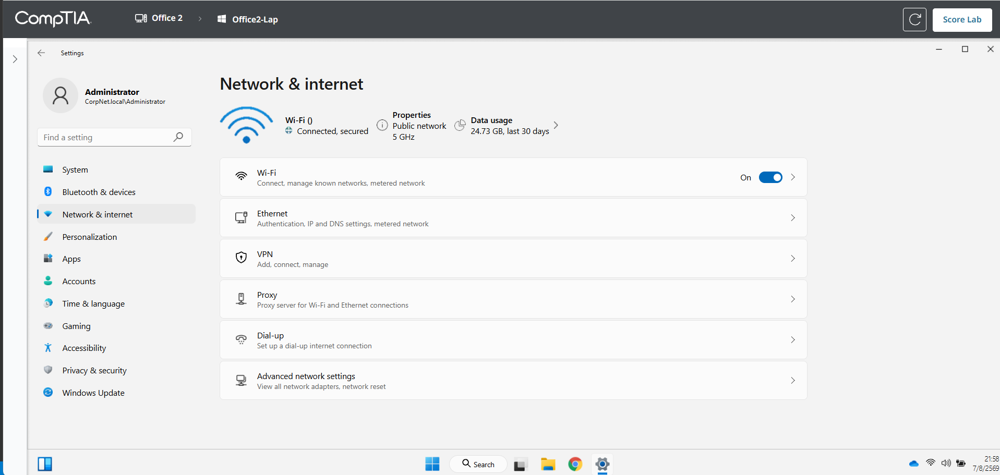
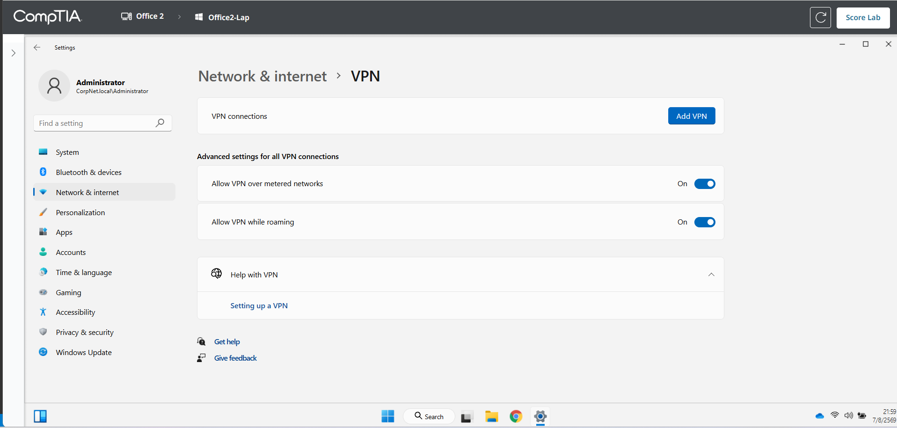
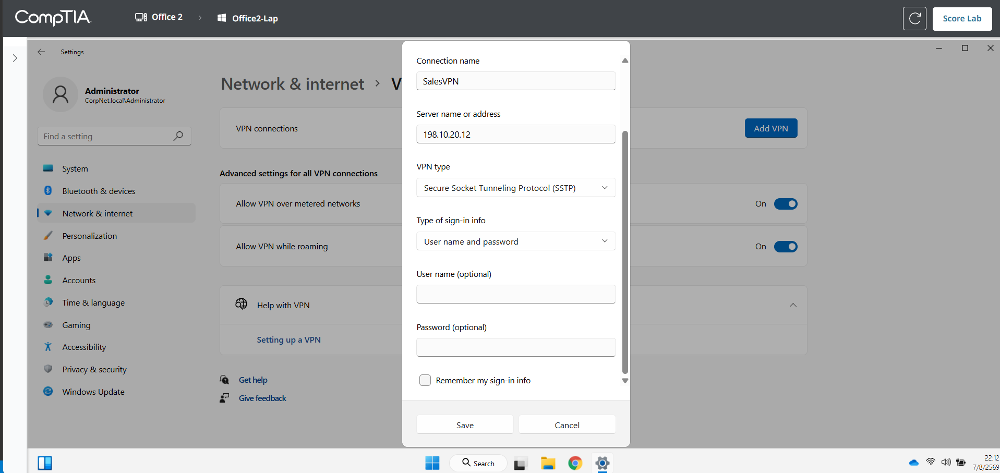
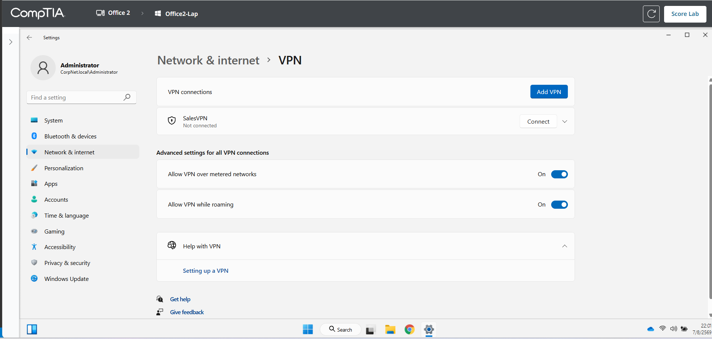
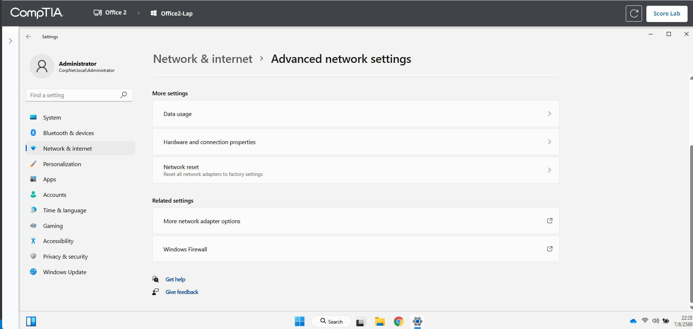
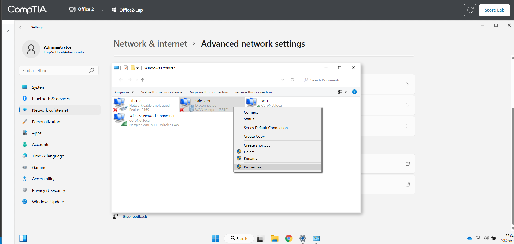
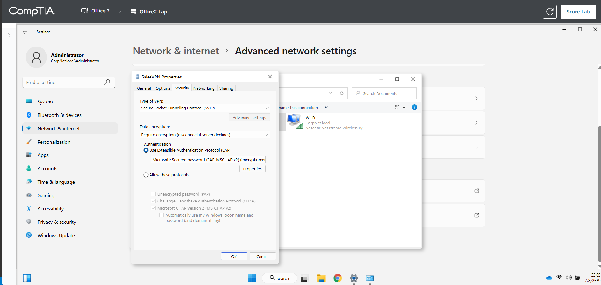
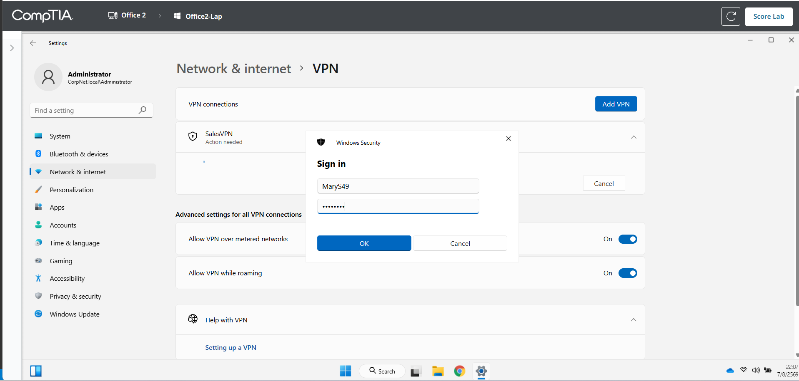
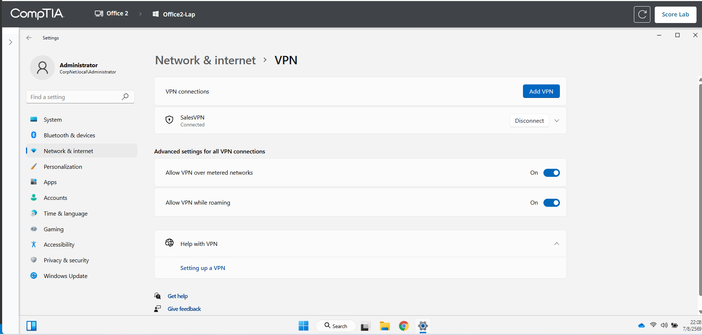
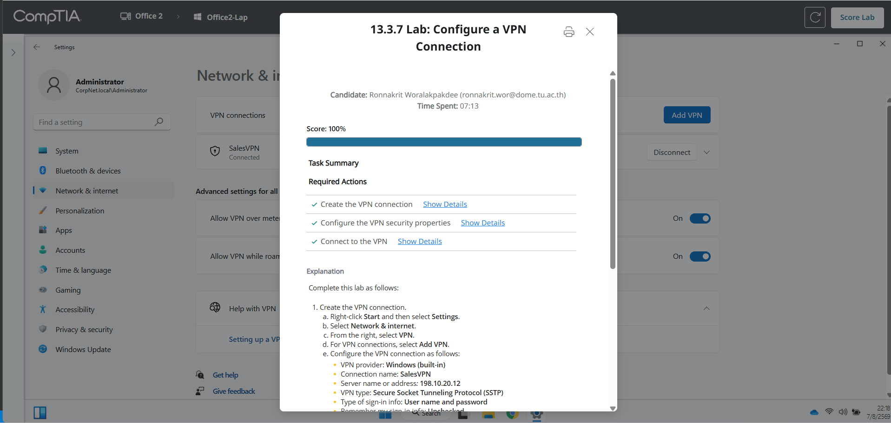

# 13.3.7 Lab: Configure a VPN Connection

## ข้อมูลผู้ทำ Lab

- ชื่อ Lab: 13.3.7 Lab: Configure a VPN Connection
- หัวข้อ: การสร้างและเชื่อมต่อ VPN บน Windows
- เครื่องที่ใช้งาน: Office2-Lap
- ผลลัพธ์สุดท้าย: ทำ Lab สำเร็จและได้คะแนน 100%

## ตอนนี้กำลังจะทำอะไร

ใน Lab นี้กำลังจะเพิ่ม VPN connection ให้กับเครื่อง `Office2-Lap` เพื่อให้ทีม Sales สามารถเชื่อมต่อกลับเข้าเครือข่ายบริษัทได้อย่างปลอดภัยเวลาอยู่นอกบริษัท

เหตุผลที่ต้องทำแบบนี้ เพราะเวลาพนักงานออกไปทำงานข้างนอก เช่น ไปพบลูกค้าหรือใช้เครือข่ายสาธารณะ การใช้ VPN จะช่วยสร้าง tunnel ที่ปลอดภัยกลับมายังระบบบริษัท ทำให้ข้อมูลที่ส่งผ่านเครือข่ายภายนอกปลอดภัยมากขึ้น

## วัตถุประสงค์

สิ่งที่ต้องทำใน Lab นี้มี 3 ส่วนหลัก:

1. สร้าง VPN connection ชื่อ `SalesVPN`
2. ตั้งค่า security properties ของ VPN ให้ใช้ `SSTP` และ `EAP-MSCHAP v2`
3. เชื่อมต่อ VPN ด้วย username และ password ที่โจทย์กำหนด

## ค่าที่ใช้ในการตั้งค่า

| รายการ | ค่าที่ต้องตั้ง |
| --- | --- |
| VPN provider | Windows (built-in) |
| Connection name | SalesVPN |
| Server name or address | 198.10.20.12 |
| VPN type | Secure Socket Tunneling Protocol (SSTP) |
| Type of sign-in info | User name and password |
| Remember my sign-in info | ไม่ต้องติ๊ก |
| Authentication | Microsoft: Secured password (EAP-MSCHAP v2) (encryption enabled) |
| Username | MaryS49 |
| Password | Sm@rt72# |
| Domain | ไม่ต้องระบุ |

## ทำไมต้องเลือก SSTP

โจทย์ต้องการ VPN type ที่ใช้ firewall port ซึ่งปกติมักถูกเปิดไว้ และค่าที่เหมาะสมคือ `Secure Socket Tunneling Protocol (SSTP)`

เหตุผลคือ SSTP ส่งข้อมูลผ่าน SSL/TLS บน HTTPS port `443` ซึ่งเป็น port ที่ firewall ส่วนใหญ่มักอนุญาตให้ใช้งาน เพราะเป็น port เดียวกับเว็บ HTTPS ทั่วไป ทำให้เหมาะกับการใช้งานนอกสถานที่มากกว่า VPN บางประเภทที่อาจถูก firewall block ง่ายกว่า

## ทำไมต้องใช้ EAP-MSCHAP v2

โจทย์ต้องการการยืนยันตัวตนแบบใช้ password ที่ปลอดภัยที่สุดโดยไม่ใช้ smart card ดังนั้นจึงต้องเลือก:

```text
Microsoft: Secured password (EAP-MSCHAP v2) (encryption enabled)
```

เหตุผลคือ EAP-MSCHAP v2 เป็นวิธี authentication แบบ password-based ที่ปลอดภัยกว่า protocol เก่า ๆ และรองรับการเข้ารหัสตามที่ Lab กำหนด

## ขั้นตอนการทำ Lab

### ขั้นตอนที่ 1: เปิดหน้า Network & internet

1. คลิกขวาที่ปุ่ม `Start`
2. เลือก `Settings`
3. ไปที่เมนู `Network & internet`
4. ตรวจสอบว่าขณะนี้เครื่อง `Office2-Lap` เชื่อมต่อ network อยู่
5. เลือกเมนู `VPN`

เหตุผลที่เริ่มจากหน้า `Network & internet` เพราะการตั้งค่า VPN เป็นส่วนหนึ่งของการตั้งค่า network บน Windows และเป็นจุดที่ใช้สร้าง VPN connection ใหม่



ภาพนี้แสดงหน้า `Network & internet` ก่อนเข้าไปตั้งค่า VPN

### ขั้นตอนที่ 2: เปิดหน้า VPN และเพิ่ม VPN ใหม่

1. จากหน้า `Network & internet`
2. เลือก `VPN`
3. ที่หัวข้อ `VPN connections`
4. กดปุ่ม `Add VPN`

เหตุผลที่ต้องกด `Add VPN` เพราะตอนนี้ยังไม่มี connection สำหรับ `SalesVPN` จึงต้องสร้าง VPN profile ใหม่ก่อน



ภาพนี้แสดงหน้า `VPN` ที่มีปุ่ม `Add VPN` สำหรับสร้าง VPN connection ใหม่

### ขั้นตอนที่ 3: กรอกข้อมูล Add a VPN connection

ในหน้าต่าง `Add a VPN connection` ให้กรอกค่าดังนี้:

```text
VPN provider: Windows (built-in)
Connection name: SalesVPN
Server name or address: 198.10.20.12
VPN type: Secure Socket Tunneling Protocol (SSTP)
Type of sign-in info: User name and password
User name: เว้นว่าง
Password: เว้นว่าง
Remember my sign-in info: ไม่ต้องติ๊ก
```

จากนั้นกด `Save`

เหตุผลที่ไม่กรอก username/password ในขั้นตอนนี้ เพราะโจทย์ระบุว่าไม่ให้ Windows จำ authentication credentials ดังนั้นให้เว้น username/password ไว้ แล้วค่อยกรอกตอน connect แทน



ภาพนี้แสดงค่าหลักของ VPN connection โดยตั้งชื่อเป็น `SalesVPN`, server เป็น `198.10.20.12`, ใช้ `SSTP` และไม่ติ๊ก `Remember my sign-in info`

### ขั้นตอนที่ 4: ตรวจสอบว่า SalesVPN ถูกสร้างแล้ว

หลังจากกด `Save` จะกลับมาที่หน้า `VPN` และควรเห็น connection ชื่อ `SalesVPN`

สถานะตอนนี้ควรเป็น:

```text
SalesVPN
Not connected
```

เหตุผลที่ยังเป็น `Not connected` เพราะขั้นตอนนี้เพิ่งสร้าง VPN profile เท่านั้น ยังไม่ได้ตั้งค่า security properties เพิ่มเติม และยังไม่ได้กด connect



ภาพนี้แสดงว่า `SalesVPN` ถูกสร้างเรียบร้อยแล้ว แต่ยังไม่ได้เชื่อมต่อ

### ขั้นตอนที่ 5: ไปที่ More network adapter options

1. กลับไปที่ `Network & internet`
2. เลือก `Advanced network settings`
3. เลื่อนลงไปที่หัวข้อ `Related settings`
4. เลือก `More network adapter options`

เหตุผลที่ต้องเข้า `More network adapter options` เพราะการตั้งค่า authentication แบบละเอียด เช่น `EAP-MSCHAP v2` ต้องเข้าไปตั้งผ่านหน้าต่าง properties ของ adapter ไม่ได้ตั้งครบจากหน้า Add VPN อย่างเดียว



ภาพนี้แสดงตำแหน่ง `More network adapter options` ที่ใช้เปิดหน้าต่าง Network Connections

### ขั้นตอนที่ 6: เปิด Properties ของ SalesVPN

1. ในหน้าต่าง `Network Connections`
2. คลิกขวาที่ `SalesVPN`
3. เลือก `Properties`

เหตุผลที่ต้องเปิด `Properties` ของ `SalesVPN` เพราะต้องเข้าไปแก้ค่าในแท็บ `Security` ให้ตรงกับ requirement ของ Lab



ภาพนี้แสดงการคลิกขวาที่ `SalesVPN` แล้วเลือก `Properties`

### ขั้นตอนที่ 7: ตั้งค่า Security ของ SalesVPN

ในหน้าต่าง `SalesVPN Properties` ให้ทำดังนี้:

1. เลือกแท็บ `Security`
2. ที่ `Type of VPN` ให้เลือก `Secure Socket Tunneling Protocol (SSTP)`
3. ที่ `Data encryption` ให้ใช้ค่าที่ต้องการ encryption
4. ในหัวข้อ `Authentication` ให้เลือก `Use Extensible Authentication Protocol (EAP)`
5. จาก drop-down ให้เลือก:

```text
Microsoft: Secured password (EAP-MSCHAP v2) (encryption enabled)
```

6. กด `OK`
7. ปิดหน้าต่าง `Network Connections`

เหตุผลที่ต้องเลือก `Use Extensible Authentication Protocol (EAP)` เพราะโจทย์กำหนดให้ใช้ EAP-MSCHAP v2 ซึ่งเป็น authentication แบบ password-based ที่ปลอดภัยกว่า และเป็นค่าที่ Lab ต้องการโดยตรง



ภาพนี้แสดงการตั้งค่า `Security` ของ `SalesVPN` โดยเลือก `SSTP` และ `Microsoft: Secured password (EAP-MSCHAP v2)`

### ขั้นตอนที่ 8: เชื่อมต่อ SalesVPN

1. กลับไปที่ `Settings`
2. ไปที่ `Network & internet`
3. เลือก `VPN`
4. ที่ `SalesVPN` กด `Connect`
5. เมื่อมีหน้าต่าง `Windows Security` ให้กรอก:

```text
Username: MaryS49
Password: Sm@rt72#
```

6. กด `OK`

ไม่ต้องใส่ domain เพราะโจทย์ระบุว่าไม่จำเป็นต้องระบุ domain สำหรับการเชื่อมต่อครั้งนี้



ภาพนี้แสดงหน้าต่าง sign in สำหรับเชื่อมต่อ `SalesVPN` โดยกรอก username และ password ตามโจทย์

### ขั้นตอนที่ 9: ตรวจสอบสถานะ Connected

หลังจากกด `OK` ให้รอสักครู่ แล้วตรวจสอบว่า `SalesVPN` เปลี่ยนสถานะเป็น:

```text
Connected
```

ถ้าขึ้นปุ่ม `Disconnect` แสดงว่า VPN เชื่อมต่อสำเร็จแล้ว

เหตุผลที่ต้องตรวจสอบสถานะนี้ เพราะ Lab ไม่ได้ต้องการแค่สร้าง VPN profile แต่ต้อง connect ให้สำเร็จด้วย



ภาพนี้แสดงว่า `SalesVPN` เชื่อมต่อสำเร็จแล้ว และปุ่มเปลี่ยนเป็น `Disconnect`

### ขั้นตอนที่ 10: ตรวจคะแนน Lab

1. กดปุ่ม `Score Lab`
2. ตรวจสอบว่า required actions ผ่านครบทุกข้อ

ผลลัพธ์ที่ถูกต้องควรเป็น:

```text
Score: 100%
Create the VPN connection: Completed
Configure the VPN security properties: Completed
Connect to the VPN: Completed
```



ภาพนี้แสดงผลลัพธ์สุดท้ายว่า Lab ได้คะแนน `100%` และ required actions ทั้งหมดผ่านครบ

## จุดที่ต้องระวัง

- ต้องเลือก VPN type เป็น `SSTP` ทั้งตอนสร้าง VPN และตอนตั้งค่าใน Security tab
- ต้องเลือก `Use Extensible Authentication Protocol (EAP)` ไม่ใช่ `Allow these protocols`
- ต้องเลือก `Microsoft: Secured password (EAP-MSCHAP v2) (encryption enabled)`
- ห้ามติ๊ก `Remember my sign-in info`
- ตอน connect ให้กรอกเฉพาะ username/password ไม่ต้องใส่ domain

## สรุปผล

ใน Lab นี้ได้สร้าง VPN connection ชื่อ `SalesVPN` บนเครื่อง `Office2-Lap` โดยใช้ server `198.10.20.12` และเลือก VPN type เป็น `SSTP` เพื่อให้ใช้งานผ่าน port ที่ firewall ส่วนใหญ่มักเปิดไว้ จากนั้นตั้งค่า authentication เป็น `EAP-MSCHAP v2` ตาม requirement ของ Lab และเชื่อมต่อด้วยบัญชี `MaryS49`

หลังจากตั้งค่าครบและเชื่อมต่อสำเร็จ ระบบแสดงสถานะ `SalesVPN Connected` และเมื่อกด `Score Lab` ได้คะแนน `100%`
