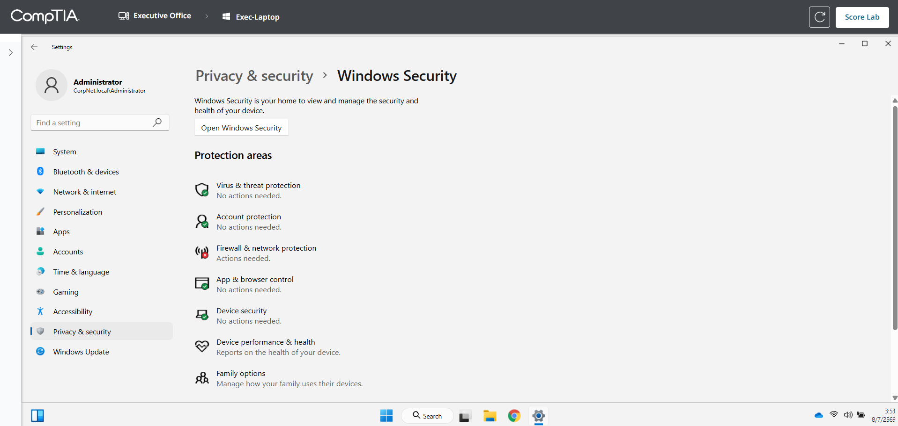
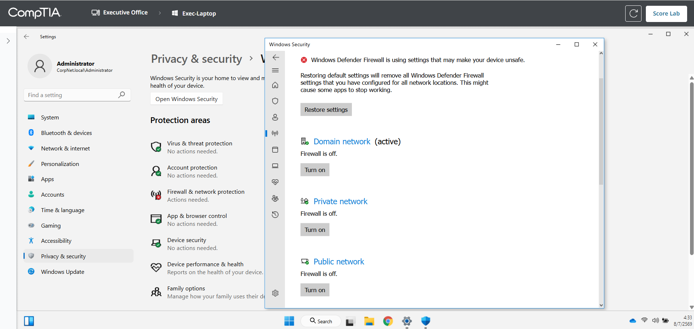
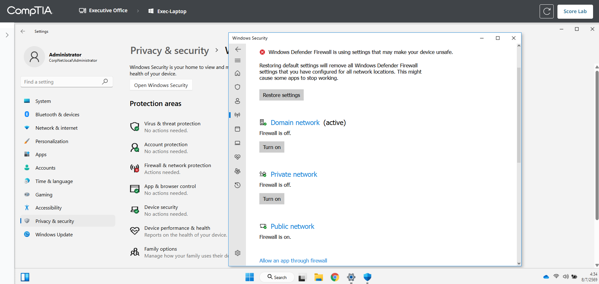
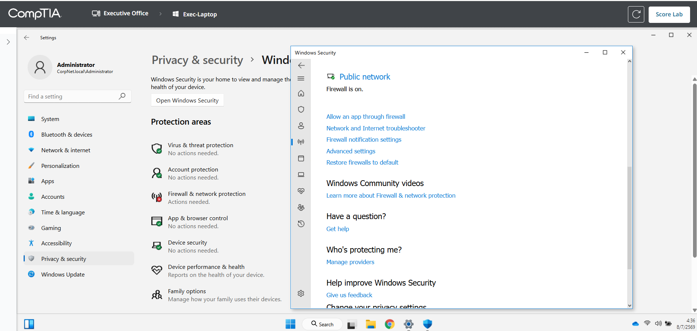
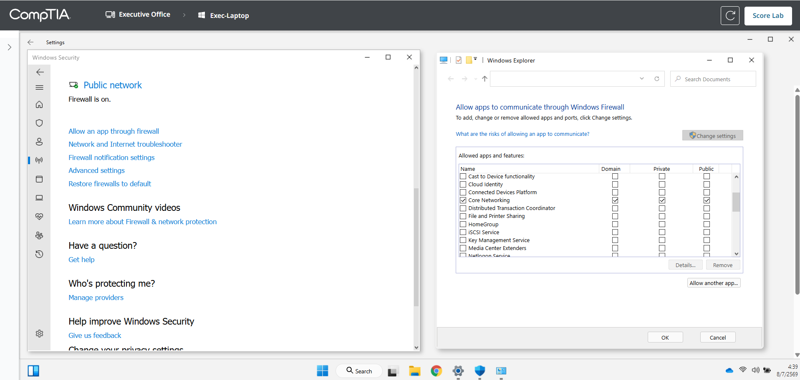
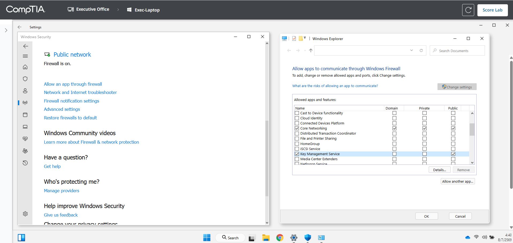
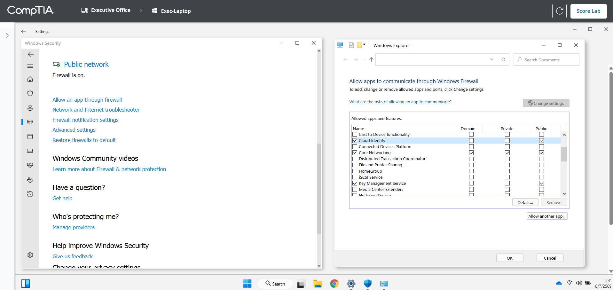
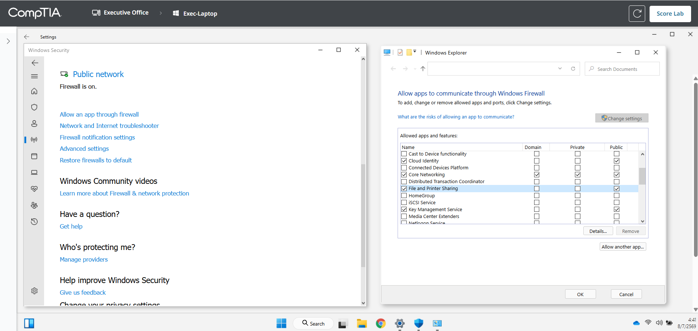
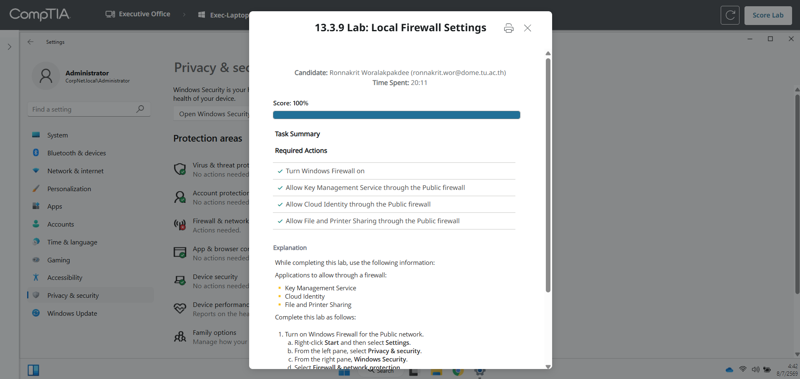

# 13.3.9 Lab: Local Firewall Settings

## ข้อมูลผู้ทำ Lab

- ชื่อ Lab: 13.3.9 Lab: Local Firewall Settings
- หัวข้อ: การเปิด Windows Firewall และอนุญาต services ผ่าน Public firewall
- เครื่องที่ใช้งาน: Exec-Laptop
- ผลลัพธ์สุดท้าย: ทำ Lab สำเร็จและได้คะแนน 100%

## ตอนนี้กำลังจะทำอะไร

ใน Lab นี้กำลังจะตั้งค่า Windows Firewall บนเครื่อง laptop โดยต้องเปิด firewall เฉพาะ `Public network profile` และอนุญาต services ที่โจทย์กำหนดให้ผ่าน firewall เฉพาะฝั่ง `Public` เท่านั้น

เหตุผลที่ต้องทำแบบนี้คือ laptop เครื่องนี้กำลังจะถูกนำไปใช้งานนอกองค์กร เช่น airport Wi-Fi hotspot ซึ่งถือเป็น public network ที่มีความเสี่ยงสูงกว่า network ภายในองค์กร ดังนั้นต้องเปิด firewall สำหรับ Public profile เพื่อช่วยป้องกันการเชื่อมต่อที่ไม่ปลอดภัยจากเครือข่ายสาธารณะ

## วัตถุประสงค์

วัตถุประสงค์ของ Lab นี้คือการตั้งค่า Windows Firewall ให้ถูกต้องตาม security requirement ของโจทย์

สิ่งที่ต้องทำมีดังนี้:

1. เปิด Windows Firewall สำหรับ `Public network`
2. อนุญาต `Key Management Service` ผ่าน firewall เฉพาะ `Public`
3. อนุญาต `Cloud Identity` ผ่าน firewall เฉพาะ `Public`
4. อนุญาต `File and Printer Sharing` ผ่าน firewall เฉพาะ `Public`
5. ตรวจสอบผลลัพธ์ด้วย `Score Lab`

## ค่าที่ต้องตั้งค่า

| รายการ | Network Profile ที่ต้องแก้ | ค่าที่ต้องตั้ง |
| --- | --- | --- |
| Windows Firewall | Public | On |
| Key Management Service | Public | Allow |
| Cloud Identity | Public | Allow |
| File and Printer Sharing | Public | Allow |

ข้อสำคัญคือ Lab นี้ต้องแก้เฉพาะ `Public` เท่านั้น ไม่ต้องแก้ `Domain` หรือ `Private` แม้ว่าเครื่องกำลังเชื่อมต่อกับ network ขององค์กรและใช้ Domain profile อยู่ก็ตาม

## หลักการที่ใช้ใน Lab

Windows Firewall แยกการตั้งค่าตาม network profile หลัก ๆ ได้แก่:

```text
Domain network: ใช้เมื่อเครื่องอยู่ใน domain ขององค์กร
Private network: ใช้กับเครือข่ายที่ไว้ใจได้ เช่น บ้านหรือสำนักงานขนาดเล็ก
Public network: ใช้กับเครือข่ายสาธารณะ เช่น airport Wi-Fi หรือ cafe Wi-Fi
```

ในสถานการณ์นี้ เครื่องกำลังจะเชื่อมต่อกับ airport Wi-Fi hotspot ซึ่งถือเป็น `Public network` ดังนั้นต้องเปิด firewall ของ Public profile เพื่อป้องกันเครื่องจาก traffic ที่ไม่จำเป็นในเครือข่ายสาธารณะ

ส่วนการ allow app หรือ service ผ่าน firewall ต้องเลือกคอลัมน์ `Public` เท่านั้น เพราะโจทย์ระบุชัดเจนว่าต้องอนุญาต services เหล่านี้ผ่าน Public firewall ไม่ใช่ Private หรือ Domain firewall

## ขั้นตอนการทำ Lab

### ขั้นตอนที่ 1: เปิด Windows Security

1. คลิกขวาที่ปุ่ม `Start`
2. เลือก `Settings`
3. ไปที่เมนู `Privacy & security`
4. เลือก `Windows Security`
5. ดูหัวข้อ `Protection areas`
6. เลือก `Firewall & network protection`

เหตุผลที่ต้องเข้าผ่าน Windows Security เพราะ Windows Firewall เป็นส่วนหนึ่งของ security settings และ Lab ต้องการแก้ค่า firewall profile โดยตรง



ภาพนี้แสดงหน้า `Windows Security` โดยเห็นว่า `Firewall & network protection` มีสถานะ `Actions needed` แปลว่ามีบาง profile ของ firewall ที่ต้องแก้ไข

### ขั้นตอนที่ 2: ตรวจสอบสถานะ Firewall Profiles

1. ในหน้า `Firewall & network protection`
2. ตรวจสอบรายการ network profiles ได้แก่:

```text
Domain network
Private network
Public network
```

3. ดูสถานะของ `Public network`
4. พบว่า `Public network` มีสถานะ `Firewall is off`
5. กดปุ่ม `Turn on` ใต้หัวข้อ `Public network`

เหตุผลที่ต้องเลือก `Public network` เพราะโจทย์ให้เปิด firewall สำหรับ Public profile เท่านั้น ไม่ใช่เปิดทุก profile ใน Lab นี้



ภาพนี้แสดงหน้า `Firewall & network protection` ก่อนแก้ไข โดย `Public network` ยังเป็น `Firewall is off` และมีปุ่ม `Turn on`

### ขั้นตอนที่ 3: ยืนยันว่า Public Firewall เปิดแล้ว

1. หลังจากกด `Turn on`
2. ตรวจสอบที่หัวข้อ `Public network`
3. ต้องเห็นสถานะ:

```text
Firewall is on.
```

4. ไม่จำเป็นต้องเปิดหรือแก้ `Domain network` และ `Private network`

เหตุผลที่ต้องตรวจซ้ำ เพราะ required action แรกของ Lab คือ `Turn Windows Firewall on` ซึ่งในบริบทของโจทย์หมายถึงเปิด firewall สำหรับ `Public network`



ภาพนี้แสดงว่า `Public network` ถูกเปิด firewall แล้ว โดยสถานะเปลี่ยนเป็น `Firewall is on.`

### ขั้นตอนที่ 4: เปิดหน้า Allow an app through firewall

1. อยู่ในหน้า `Firewall & network protection`
2. เลื่อนลงมาที่ส่วนลิงก์ด้านล่าง
3. เลือก `Allow an app through firewall`

เหตุผลที่ต้องเข้าเมนูนี้ เพราะการอนุญาต services เช่น `Key Management Service`, `Cloud Identity` และ `File and Printer Sharing` ต้องทำในหน้ารายการ allowed apps ของ Windows Firewall



ภาพนี้แสดงลิงก์ `Allow an app through firewall` ที่ใช้เปิดหน้าตั้งค่า allowed apps

### ขั้นตอนที่ 5: เปิดสิทธิ์แก้ไขรายการ Allowed Apps

1. จะมีหน้าต่าง `Allow apps to communicate through Windows Firewall`
2. กดปุ่ม `Change settings`
3. หลังจากกดแล้ว จะสามารถติ๊กช่องในรายการ apps และ services ได้
4. ดูคอลัมน์ที่ต้องใช้ ได้แก่:

```text
Domain
Private
Public
```

เหตุผลที่ต้องกด `Change settings` ก่อน เพราะถ้ายังไม่กด ระบบจะไม่อนุญาตให้แก้รายการ allowed apps และจะไม่สามารถติ๊กช่อง `Public` ได้



ภาพนี้แสดงหน้ารายการ allowed apps โดยต้องกด `Change settings` ก่อน แล้วจึงเลือกช่อง `Public` ของ services ที่โจทย์กำหนด

### ขั้นตอนที่ 6: อนุญาต Key Management Service ผ่าน Public Firewall

1. ในรายการ `Allowed apps and features`
2. หา `Key Management Service`
3. ติ๊กช่องด้านซ้ายของรายการ ถ้ายังไม่ได้เลือก
4. ติ๊กช่องใต้คอลัมน์ `Public`
5. ไม่ต้องติ๊ก `Private` ถ้าโจทย์ไม่ได้สั่ง

เหตุผลที่ต้องอนุญาตเฉพาะ `Public` เพราะ required action ระบุว่า `Allow Key Management Service through the Public firewall`



ภาพนี้แสดงว่า `Key Management Service` ถูกเลือก และช่อง `Public` ถูกติ๊กแล้ว

### ขั้นตอนที่ 7: อนุญาต Cloud Identity ผ่าน Public Firewall

1. หา `Cloud Identity`
2. ติ๊กช่องด้านซ้ายของรายการ ถ้ายังไม่ได้เลือก
3. ติ๊กช่องใต้คอลัมน์ `Public`
4. ตรวจสอบว่าไม่ได้เลือกผิดคอลัมน์เป็น `Private`

เหตุผลที่ต้องอนุญาต `Cloud Identity` เพราะเป็นหนึ่งใน services ที่โจทย์กำหนดให้ผ่าน Public firewall ได้



ภาพนี้แสดงว่า `Cloud Identity` ถูกเลือกและอนุญาตผ่านคอลัมน์ `Public`

### ขั้นตอนที่ 8: อนุญาต File and Printer Sharing ผ่าน Public Firewall

1. หา `File and Printer Sharing`
2. ติ๊กช่องด้านซ้ายของรายการ ถ้ายังไม่ได้เลือก
3. ติ๊กช่องใต้คอลัมน์ `Public`
4. ตรวจสอบว่า services ที่ต้องอนุญาตครบทั้ง 3 รายการแล้ว:

```text
Key Management Service: Public
Cloud Identity: Public
File and Printer Sharing: Public
```

5. กด `OK` เพื่อบันทึกการตั้งค่า

เหตุผลที่ต้องกด `OK` เพราะถ้าติ๊กแล้วปิดหน้าต่างโดยไม่บันทึก การตั้งค่าอาจไม่ถูกนำไปใช้ และ Lab จะยังไม่ผ่าน



ภาพนี้แสดงว่า `File and Printer Sharing` ถูกเลือกในคอลัมน์ `Public` และยังเห็นรายการอื่นที่ต้องอนุญาตผ่าน Public firewall ด้วย

### ขั้นตอนที่ 9: ตรวจคะแนน Lab

1. กลับไปที่หน้า Lab
2. กดปุ่ม `Score Lab`
3. ตรวจสอบว่า required actions ผ่านครบ

ผลลัพธ์ที่ถูกต้องคือ:

```text
Score: 100%
Turn Windows Firewall on: Completed
Allow Key Management Service through the Public firewall: Completed
Allow Cloud Identity through the Public firewall: Completed
Allow File and Printer Sharing through the Public firewall: Completed
```

เหตุผลที่ต้องตรวจคะแนน เพราะเป็นการยืนยันว่าเปิด firewall และ allow services ถูก profile ตามที่โจทย์กำหนดครบทุกข้อ



ภาพนี้แสดงว่า Lab สำเร็จแล้ว โดยได้คะแนน `100%` และ required actions ผ่านครบทุกข้อ

## สรุปผล

ใน Lab นี้ได้เปิด Windows Firewall สำหรับ `Public network profile` เพื่อเตรียม laptop ให้ปลอดภัยขึ้นเมื่อต้องเชื่อมต่อกับเครือข่ายสาธารณะ เช่น airport Wi-Fi hotspot

หลังจากเปิด firewall แล้ว ได้เข้าไปที่ `Allow an app through firewall` และอนุญาต services ที่โจทย์กำหนดผ่านคอลัมน์ `Public` ได้แก่ `Key Management Service`, `Cloud Identity` และ `File and Printer Sharing`

สิ่งสำคัญที่สุดของ Lab นี้คือการทำเฉพาะ `Public` เท่านั้น เพราะโจทย์ไม่ได้ต้องการให้แก้ `Domain` หรือ `Private` profile ในสถานการณ์นี้

สุดท้ายกด `Score Lab` และได้คะแนน `100%` แสดงว่าการตั้งค่า firewall ถูกต้องครบทุก required actions

