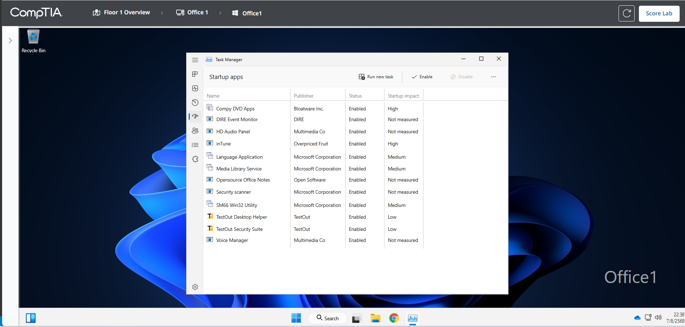
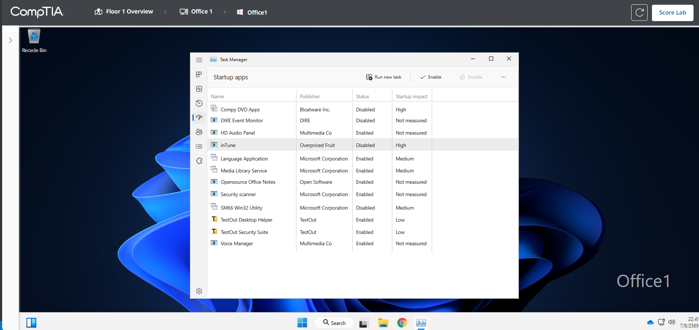
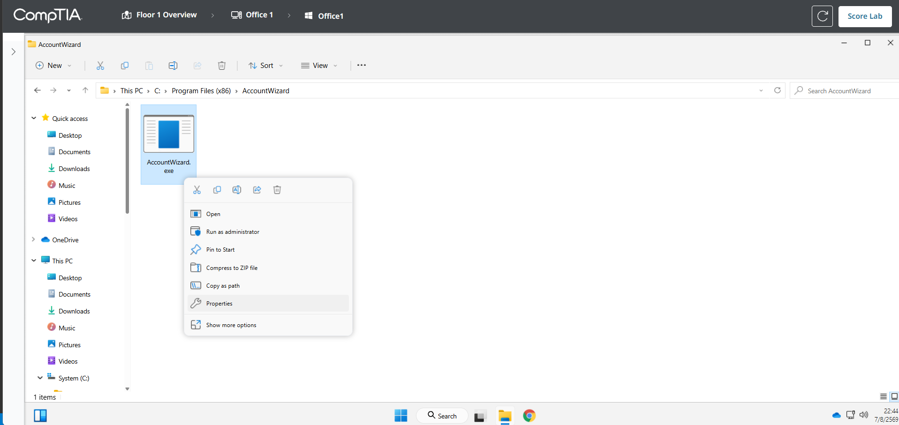
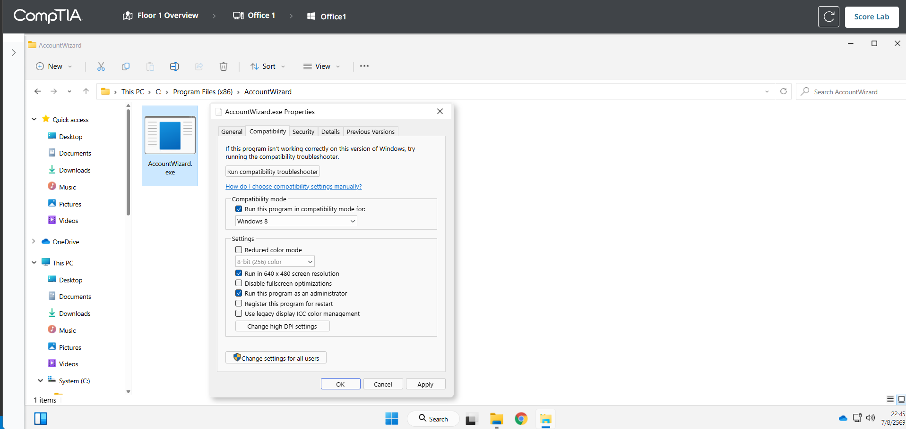
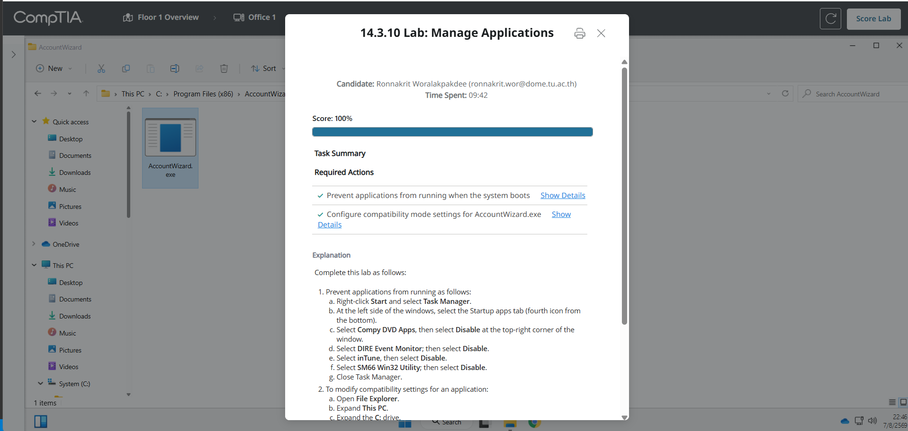

# 14.3.10 Lab: Manage Applications

## ข้อมูลผู้ทำ Lab

- ชื่อ Lab: 14.3.10 Lab: Manage Applications
- หัวข้อ: การจัดการโปรแกรมที่รันตอนเปิดเครื่อง และการตั้งค่า Compatibility ของโปรแกรม
- เครื่องที่ใช้งาน: Office1
- ผลลัพธ์สุดท้าย: ทำ Lab สำเร็จและได้คะแนน 100%

## ตอนนี้กำลังจะทำอะไร

ใน Lab นี้กำลังจะจัดการ application บนเครื่อง `Office1` โดยมีงานหลัก 2 ส่วน คือ ปิดโปรแกรมบางตัวไม่ให้เริ่มทำงานพร้อม Windows และตั้งค่า compatibility ให้โปรแกรม `AccountWizard.exe`

เหตุผลที่ต้องทำแบบนี้ เพราะบางโปรแกรมไม่จำเป็นต้องเริ่มทำงานตอนเปิดเครื่อง ถ้าปล่อยให้เปิดเองทั้งหมดอาจทำให้เครื่อง boot ช้าหรือใช้ resource โดยไม่จำเป็น ส่วน `AccountWizard.exe` เป็นโปรแกรมที่ต้องการสภาพแวดล้อมแบบระบบปฏิบัติการเก่ากว่า จึงต้องตั้ง compatibility mode ให้เหมาะสม

## วัตถุประสงค์

สิ่งที่ต้องทำใน Lab นี้มีดังนี้:

1. ใช้ `Task Manager` ปิด startup apps ที่โจทย์กำหนด
2. เข้าไปที่ไฟล์ `AccountWizard.exe`
3. ตั้งค่า compatibility mode เป็น `Windows 8`
4. ตั้งค่าให้รันแบบ `640 x 480 screen resolution`
5. ตั้งค่าให้รันแบบ administrator ทุกครั้ง
6. ตรวจสอบผลด้วย `Score Lab`

## ข้อมูลที่ต้องใช้

### รายชื่อโปรแกรมที่ต้อง Disable ใน Startup apps

| Application | ค่าที่ต้องตั้ง |
| --- | --- |
| Compy DVD Apps | Disabled |
| DIRE Event Monitor | Disabled |
| inTune | Disabled |
| SM66 Win32 Utility | Disabled |

### ไฟล์ที่ต้องตั้งค่า Compatibility

```text
C:\Program Files (x86)\AccountWizard\AccountWizard.exe
```

ค่าที่ต้องตั้ง:

```text
Compatibility mode: Windows 8
Run in 640 x 480 screen resolution: Enabled
Run this program as an administrator: Enabled
```

## ขั้นตอนการทำ Lab

### ขั้นตอนที่ 1: เปิด Task Manager

1. เข้าเครื่อง `Office1`
2. คลิกขวาที่ปุ่ม `Start`
3. เลือก `Task Manager`
4. ถ้าหน้าต่างเล็กหรือดูยาก ให้ขยายหน้าต่างให้ใหญ่ขึ้น
5. ที่แถบด้านซ้าย เลือกเมนู `Startup apps`

เหตุผลที่ต้องเข้า `Startup apps` เพราะเมนูนี้ใช้จัดการว่าโปรแกรมใดจะเริ่มทำงานอัตโนมัติตอน Windows boot



ภาพนี้แสดงหน้า `Task Manager > Startup apps` ก่อนปิดโปรแกรม โดยจะเห็นว่าโปรแกรมหลายตัวมีสถานะเป็น `Enabled`

### ขั้นตอนที่ 2: Disable โปรแกรมที่โจทย์กำหนด

ในหน้า `Startup apps` ให้ปิดโปรแกรมต่อไปนี้:

```text
Compy DVD Apps
DIRE Event Monitor
inTune
SM66 Win32 Utility
```

วิธีทำกับแต่ละโปรแกรม:

1. คลิกเลือกชื่อโปรแกรม
2. กดปุ่ม `Disable` ที่มุมขวาบนของ Task Manager
3. ตรวจสอบว่า `Status` เปลี่ยนเป็น `Disabled`
4. ทำซ้ำจนครบทั้ง 4 รายการ

เหตุผลที่ต้อง disable เฉพาะ 4 รายการนี้ เพราะโจทย์ระบุว่า application เหล่านี้ไม่ควรเริ่มทำงานพร้อมระบบ ส่วนรายการอื่น ๆ ไม่ควรไปเปลี่ยน เพราะอาจเป็นโปรแกรมที่ระบบหรือ Lab ต้องการให้ยังเปิดตามเดิม



ภาพนี้แสดงว่าโปรแกรมที่โจทย์กำหนดถูกตั้งเป็น `Disabled` แล้ว ได้แก่ `Compy DVD Apps`, `DIRE Event Monitor`, `inTune` และ `SM66 Win32 Utility`

### ขั้นตอนที่ 3: เปิด File Explorer และไปยังโฟลเดอร์ AccountWizard

1. ปิด `Task Manager`
2. เปิด `File Explorer`
3. ไปที่ `This PC`
4. เข้าไดรฟ์ `C:`
5. เข้าโฟลเดอร์ `Program Files (x86)`
6. เข้าโฟลเดอร์ `AccountWizard`

Path เต็มคือ:

```text
C:\Program Files (x86)\AccountWizard\
```

เหตุผลที่ต้องเข้า path นี้ เพราะโจทย์กำหนดให้ตั้ง compatibility settings ให้ไฟล์ `AccountWizard.exe` ที่อยู่ในโฟลเดอร์นี้โดยตรง



ภาพนี้แสดงตำแหน่งไฟล์ `AccountWizard.exe` ใน path `C:\Program Files (x86)\AccountWizard\`

### ขั้นตอนที่ 4: เปิด Properties ของ AccountWizard.exe

1. คลิกขวาที่ไฟล์ `AccountWizard.exe`
2. เลือก `Properties`
3. ไปที่แท็บ `Compatibility`

เหตุผลที่ต้องเปิด `Properties` เพราะการตั้ง compatibility mode, resolution และการรันแบบ administrator จะอยู่ในแท็บ `Compatibility` ของไฟล์ `.exe`

### ขั้นตอนที่ 5: ตั้งค่า Compatibility ของ AccountWizard.exe

ในแท็บ `Compatibility` ให้ตั้งค่าตามนี้:

1. ติ๊ก `Run this program in compatibility mode for:`
2. เลือกจาก drop-down เป็น `Windows 8`
3. ติ๊ก `Run in 640 x 480 screen resolution`
4. ติ๊ก `Run this program as an administrator`
5. กด `OK`

เหตุผลที่เลือก `Windows 8` เพราะโจทย์บอกว่าโปรแกรมนี้ต้องรันกับ operating system รุ่นเก่ากว่า จึงต้องใช้ compatibility mode เพื่อให้ Windows จำลองสภาพแวดล้อมที่เหมาะกับโปรแกรม

เหตุผลที่เลือก `640 x 480` เพราะโปรแกรมเก่าบางตัวอาจออกแบบมาสำหรับหน้าจอความละเอียดต่ำ ถ้าเปิดด้วย resolution ปัจจุบันอาจแสดงผลผิดหรือใช้งานไม่สมบูรณ์

เหตุผลที่เลือก `Run this program as an administrator` เพราะโปรแกรมบางตัวต้องใช้สิทธิ์สูงกว่า user ปกติในการเข้าถึงไฟล์ระบบหรือ registry จึงต้องตั้งให้รันด้วยสิทธิ์ administrator ทุกครั้ง



ภาพนี้แสดงการตั้งค่า compatibility ของ `AccountWizard.exe` โดยเลือก `Windows 8`, เปิด `640 x 480 screen resolution` และเปิด `Run this program as an administrator`

### ขั้นตอนที่ 6: ตรวจคะแนน Lab

1. กลับไปที่หน้า Lab
2. กด `Score Lab`
3. ตรวจสอบว่า required actions ผ่านครบทุกข้อ

ผลลัพธ์ที่ถูกต้องควรเป็น:

```text
Score: 100%
Prevent applications from running when the system boots: Completed
Configure compatibility mode settings for AccountWizard.exe: Completed
```



ภาพนี้แสดงผลลัพธ์สุดท้ายว่า Lab ได้คะแนน `100%` และ required actions ผ่านครบ

## จุดที่ต้องระวัง

- ต้องปิดเฉพาะ 4 โปรแกรมที่โจทย์กำหนดเท่านั้น
- อย่า disable โปรแกรมอื่นที่ไม่ได้อยู่ในโจทย์
- ต้องตั้ง compatibility ที่ไฟล์ `AccountWizard.exe` ไม่ใช่ตั้งที่โฟลเดอร์ `AccountWizard`
- ต้องเลือก `Windows 8` ไม่ใช่ Windows รุ่นอื่น
- ต้องติ๊กทั้ง `Run in 640 x 480 screen resolution` และ `Run this program as an administrator`

## สรุปผล

ใน Lab นี้ได้ใช้ `Task Manager` เพื่อปิด startup apps ที่ไม่ควรรันตอนเปิดเครื่อง ได้แก่ `Compy DVD Apps`, `DIRE Event Monitor`, `inTune` และ `SM66 Win32 Utility` ทำให้โปรแกรมเหล่านี้ไม่เริ่มทำงานอัตโนมัติเมื่อ Windows boot

หลังจากนั้นได้เข้าไปที่ `C:\Program Files (x86)\AccountWizard\AccountWizard.exe` และตั้งค่า compatibility ให้รันในโหมด `Windows 8`, ใช้ความละเอียด `640 x 480` และรันด้วยสิทธิ์ administrator ทุกครั้ง เมื่อกด `Score Lab` แล้วได้คะแนน `100%`
