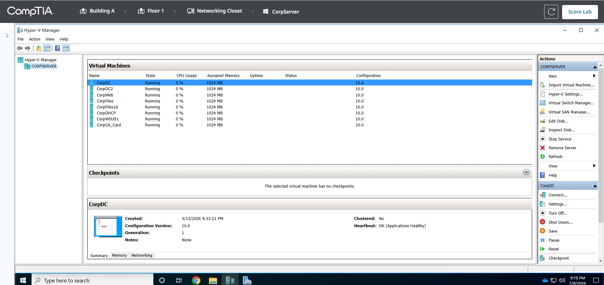
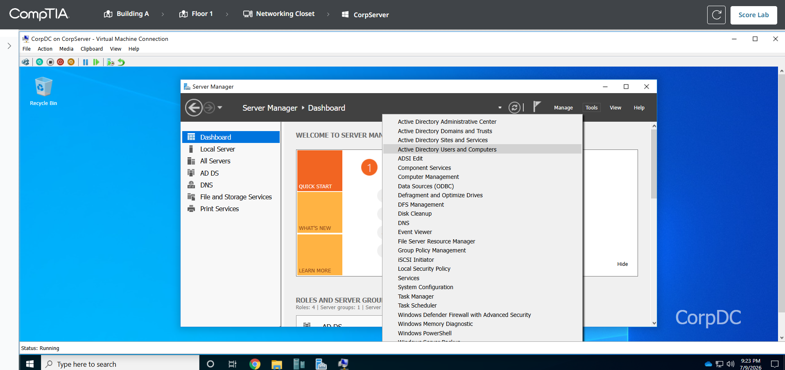
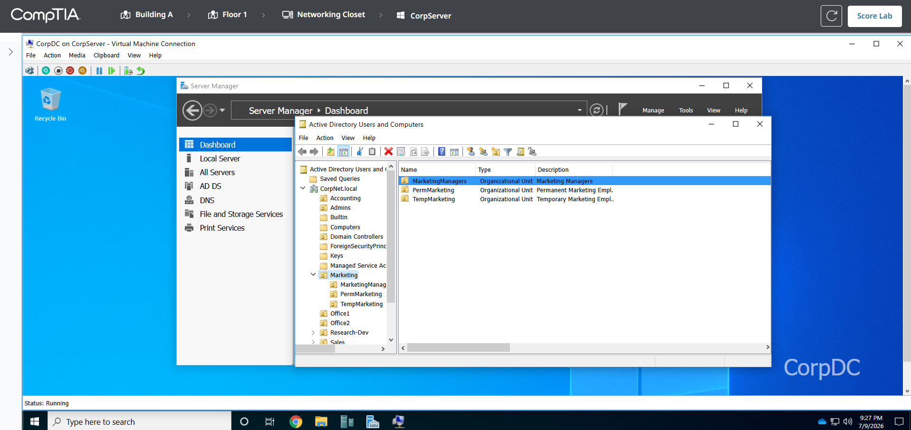
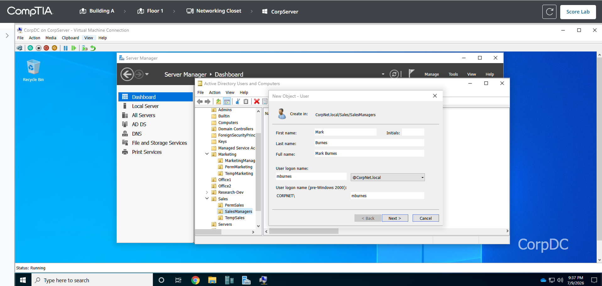
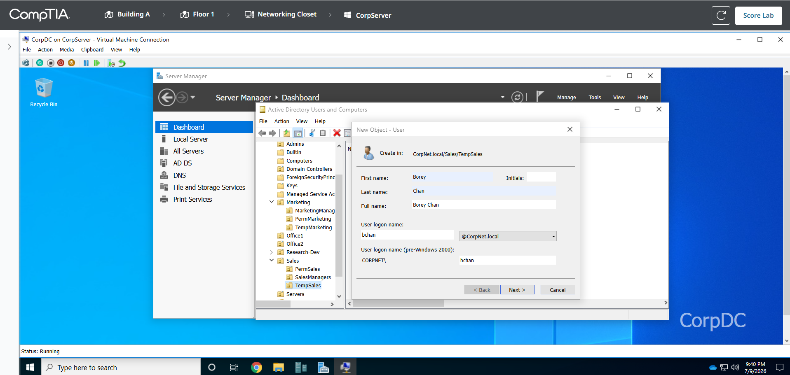
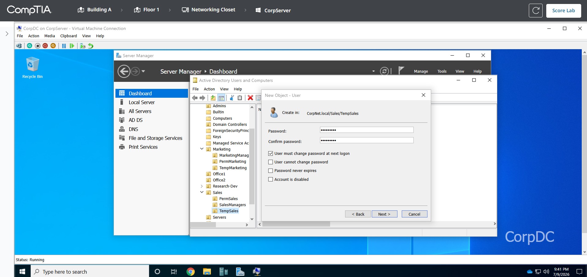
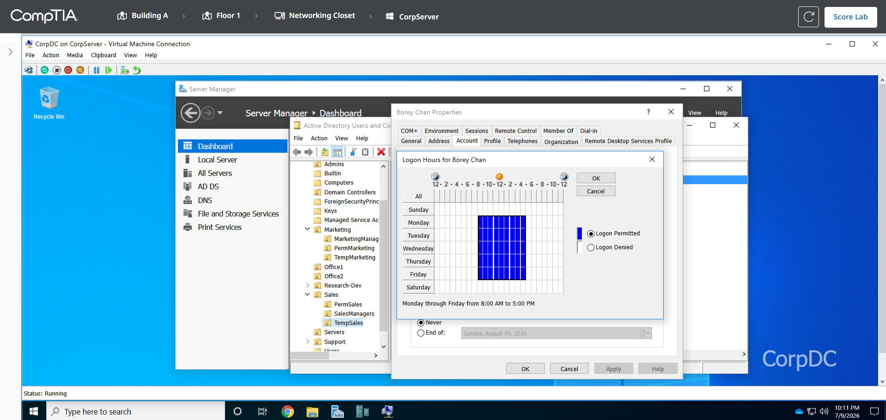
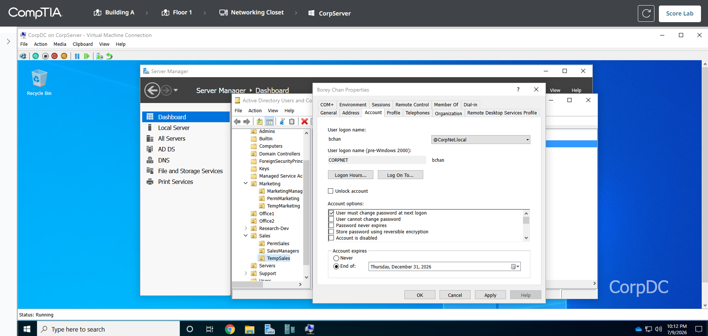
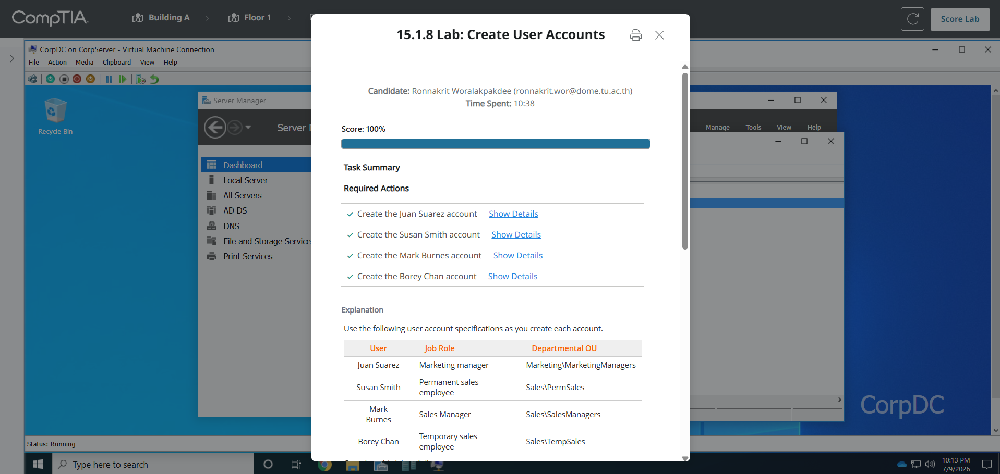

# 15.1.8 Lab: Create User Accounts

## ข้อมูลผู้ทำ Lab

- ชื่อ Lab: 15.1.8 Lab: Create User Accounts
- หัวข้อ: การสร้าง user account ใน Active Directory
- เครื่องที่ใช้งาน: CorpDC บน CorpServer
- เครื่องมือที่ใช้: Active Directory Users and Computers
- ผลลัพธ์สุดท้าย: ทำ Lab สำเร็จและได้คะแนน 100%

## ตอนนี้กำลังจะทำอะไร

ใน Lab นี้กำลังจะสร้างบัญชีผู้ใช้ใหม่ใน Active Directory ให้กับพนักงานใหม่ 4 คน โดยต้องสร้างใน OU ให้ตรงกับแผนกและตำแหน่งงานที่โจทย์กำหนด

เหตุผลที่ต้องสร้างใน OU ให้ถูกต้อง เพราะ Active Directory ใช้ OU เพื่อจัดกลุ่ม user ตามแผนกหรือบทบาทงาน ทำให้ผู้ดูแลระบบสามารถจัดการ permission, policy และข้อจำกัดของ user แต่ละกลุ่มได้ง่ายขึ้น

นอกจากนี้ temporary employee หรือพนักงานชั่วคราวต้องมีข้อจำกัดเพิ่ม คือเข้าใช้งานได้เฉพาะวันจันทร์ถึงศุกร์ เวลา 8:00 AM ถึง 5:00 PM และบัญชีต้องหมดอายุวันที่ 31 ธันวาคมของปีปัจจุบัน

## วัตถุประสงค์

วัตถุประสงค์ของ Lab นี้คือการฝึกสร้าง domain user account ใน Active Directory ตามมาตรฐานที่องค์กรกำหนด และตั้งค่าข้อจำกัดของบัญชี temporary employee ให้เหมาะสม

สิ่งที่ต้องทำมีดังนี้:

1. เปิดเครื่อง `CorpDC`
2. เข้าเครื่องมือ `Active Directory Users and Computers`
3. สร้าง user account ทั้ง 4 คนใน OU ที่ถูกต้อง
4. ตั้งค่า logon name ตามรูปแบบ `firstinitial + lastname`
5. ตั้งรหัสผ่านเริ่มต้นเป็น `asdf1234$`
6. บังคับให้ user เปลี่ยนรหัสผ่านหลัง logon ครั้งแรก
7. ตั้งค่า logon hours และ account expiration ให้ `Borey Chan`
8. ตรวจสอบผลลัพธ์ด้วย `Score Lab`

## ตารางข้อมูลที่ใช้สร้างบัญชี

| User | Job Role | Departmental OU | Logon Name |
| --- | --- | --- | --- |
| Juan Suarez | Marketing manager | Marketing\MarketingManagers | jsuarez |
| Susan Smith | Permanent sales employee | Sales\PermSales | ssmith |
| Mark Burnes | Sales manager | Sales\SalesManagers | mburnes |
| Borey Chan | Temporary sales employee | Sales\TempSales | bchan |

ค่าที่ใช้ร่วมกันทุก user:

```text
Domain: @CorpNet.local
Password: asdf1234$
Password option: User must change password at next logon
```

ข้อจำกัดเพิ่มเติมของ `Borey Chan`:

```text
Logon hours: Monday - Friday, 8:00 AM - 5:00 PM
Account expires: December 31, 2026
```

## วิธีคิด Logon Name

โจทย์กำหนดให้ logon name ใช้รูปแบบ:

```text
firstinitial + lastname
```

หมายความว่าให้นำตัวอักษรตัวแรกของชื่อจริงมารวมกับนามสกุล แล้วเขียนเป็นตัวพิมพ์เล็กทั้งหมด

ตัวอย่าง:

```text
Juan Suarez
First initial = j
Last name = suarez
Logon name = jsuarez
Full logon = jsuarez@CorpNet.local
```

รายชื่อทั้งหมดจะได้ logon name ดังนี้:

```text
Juan Suarez  -> jsuarez
Susan Smith  -> ssmith
Mark Burnes  -> mburnes
Borey Chan   -> bchan
```

เหตุผลที่ต้องใช้มาตรฐานเดียวกัน เพราะช่วยให้ชื่อบัญชีในองค์กรเป็นระเบียบ คาดเดารูปแบบได้ง่าย และลดความสับสนเวลาผู้ดูแลระบบค้นหาหรือจัดการบัญชีผู้ใช้

## ขั้นตอนการทำ Lab

### ขั้นตอนที่ 1: เปิดเครื่อง CorpDC

1. เข้า Lab `15.1.8 Lab: Create User Accounts`
2. ไปที่ `Building A`
3. เลือก `Floor 1`
4. เลือก `Networking Closet`
5. เลือกเครื่อง `CorpServer`
6. ใน `Hyper-V Manager` ให้เลือก virtual machine ชื่อ `CorpDC`
7. Double-click ที่ `CorpDC` เพื่อเปิดหน้าต่าง virtual machine

เหตุผลที่ต้องเข้า `CorpDC` เพราะเครื่องนี้เป็น Domain Controller ของ `CorpNet.local` และเป็นเครื่องที่ใช้จัดการ Active Directory ของโดเมน



ภาพนี้แสดงหน้า `Hyper-V Manager` ที่เลือก virtual machine ชื่อ `CorpDC` ซึ่งเป็นเครื่องที่ใช้สร้างและจัดการ user account ใน Active Directory

### ขั้นตอนที่ 2: เปิด Active Directory Users and Computers

1. ในเครื่อง `CorpDC` ให้เปิด `Server Manager`
2. ที่แถบด้านบน เลือก `Tools`
3. เลือก `Active Directory Users and Computers`
4. ขยายหน้าต่างให้ใหญ่ขึ้นเพื่อดู OU ได้สะดวก

เหตุผลที่ใช้ `Active Directory Users and Computers` เพราะเป็นเครื่องมือสำหรับสร้าง แก้ไข และจัดการ user account, computer account และ OU ภายในโดเมน



ภาพนี้แสดงการเข้าเมนู `Tools` แล้วเลือก `Active Directory Users and Computers` เพื่อเริ่มจัดการบัญชีผู้ใช้ในโดเมน

### ขั้นตอนที่ 3: ตรวจสอบ OU ที่ต้องใช้

1. ในหน้าต่าง `Active Directory Users and Computers`
2. ขยาย `CorpNet.local`
3. ตรวจสอบ OU หลักที่ต้องใช้ ได้แก่ `Marketing` และ `Sales`
4. ตรวจสอบ OU ย่อยที่โจทย์กำหนด เช่น `MarketingManagers`, `PermSales`, `SalesManagers` และ `TempSales`

เหตุผลที่ต้องตรวจ OU ก่อนสร้าง user เพราะถ้าสร้าง user ผิด OU ระบบอาจถือว่างานยังไม่ผ่าน และในงานจริง user อาจได้รับ policy หรือ permission ผิดกลุ่ม



ภาพนี้แสดง OU ใน Active Directory โดยเฉพาะฝั่ง `Marketing` ซึ่งมี OU ย่อยสำหรับแยกประเภทพนักงานตามบทบาทงาน

### ขั้นตอนที่ 4: สร้างบัญชี Juan Suarez

1. ไปที่ `CorpNet.local`
2. ขยาย `Marketing`
3. เลือก OU `MarketingManagers`
4. คลิกขวาในพื้นที่ว่างของ OU
5. เลือก `New`
6. เลือก `User`
7. กรอกข้อมูลดังนี้:

```text
First name: Juan
Last name: Suarez
Full name: Juan Suarez
User logon name: jsuarez
Domain: @CorpNet.local
```

8. กด `Next`

เหตุผลที่สร้าง `Juan Suarez` ใน `Marketing\MarketingManagers` เพราะโจทย์ระบุว่า Juan เป็น Marketing manager จึงต้องอยู่ใน OU ของผู้จัดการฝ่าย Marketing


ภาพนี้แสดงการกรอกข้อมูลของ `Juan Suarez` โดยใช้ logon name เป็น `jsuarez` ตามรูปแบบ first initial รวมกับ last name

จากนั้นตั้งรหัสผ่าน:

```text
Password: asdf1234$
Confirm password: asdf1234$
```

ให้เลือกไว้ที่:

```text
User must change password at next logon
```

แล้วกด `Next` และ `Finish`

เหตุผลที่ต้องเลือก `User must change password at next logon` เพราะรหัส `asdf1234$` เป็นรหัสเริ่มต้นที่ผู้ดูแลระบบตั้งให้ชั่วคราว เมื่อ user เข้าใช้งานครั้งแรกควรเปลี่ยนเป็นรหัสของตัวเองเพื่อความปลอดภัย


ภาพนี้แสดงการตั้งรหัสผ่านเริ่มต้นและเลือกให้ user ต้องเปลี่ยนรหัสผ่านในการเข้าสู่ระบบครั้งแรก

### ขั้นตอนที่ 5: สร้างบัญชี Susan Smith

1. ไปที่ `CorpNet.local`
2. ขยาย `Sales`
3. เลือก OU `PermSales`
4. คลิกขวาในพื้นที่ว่างของ OU
5. เลือก `New > User`
6. กรอกข้อมูลดังนี้:

```text
First name: Susan
Last name: Smith
Full name: Susan Smith
User logon name: ssmith
Domain: @CorpNet.local
```

7. กด `Next`
8. ตั้งรหัสผ่านเป็น `asdf1234$`
9. เลือก `User must change password at next logon`
10. กด `Next`
11. กด `Finish`

เหตุผลที่สร้าง `Susan Smith` ใน `Sales\PermSales` เพราะ Susan เป็น permanent sales employee หรือพนักงานฝ่ายขายประจำ จึงต้องอยู่ใน OU ของพนักงานขายประจำ


ภาพนี้แสดงการสร้างบัญชี `Susan Smith` ใน OU `Sales\PermSales` พร้อม logon name `ssmith`


ภาพนี้แสดงการตั้งรหัสผ่านเริ่มต้นให้ `Susan Smith` และเลือก `User must change password at next logon` ตามเงื่อนไขของ Lab

### ขั้นตอนที่ 6: สร้างบัญชี Mark Burnes

1. ไปที่ `CorpNet.local`
2. ขยาย `Sales`
3. เลือก OU `SalesManagers`
4. คลิกขวาในพื้นที่ว่างของ OU
5. เลือก `New > User`
6. กรอกข้อมูลดังนี้:

```text
First name: Mark
Last name: Burnes
Full name: Mark Burnes
User logon name: mburnes
Domain: @CorpNet.local
```

7. กด `Next`
8. ตั้งรหัสผ่านเป็น `asdf1234$`
9. เลือก `User must change password at next logon`
10. กด `Next`
11. กด `Finish`

เหตุผลที่ต้องระวังชื่อ `Burnes` เพราะโจทย์สะกดเป็น `Burnes` ดังนั้น logon name ต้องเป็น `mburnes` ไม่ใช่ `mburns`



ภาพนี้แสดงการสร้างบัญชี `Mark Burnes` ใน OU `Sales\SalesManagers` พร้อม logon name `mburnes`


ภาพนี้แสดงการตั้งรหัสผ่านเริ่มต้นให้ `Mark Burnes` และเลือกให้เปลี่ยนรหัสผ่านเมื่อ logon ครั้งแรกเหมือน user คนอื่น

### ขั้นตอนที่ 7: สร้างบัญชี Borey Chan

1. ไปที่ `CorpNet.local`
2. ขยาย `Sales`
3. เลือก OU `TempSales`
4. คลิกขวาในพื้นที่ว่างของ OU
5. เลือก `New > User`
6. กรอกข้อมูลดังนี้:

```text
First name: Borey
Last name: Chan
Full name: Borey Chan
User logon name: bchan
Domain: @CorpNet.local
```

7. กด `Next`
8. ตั้งรหัสผ่านเป็น `asdf1234$`
9. เลือก `User must change password at next logon`
10. กด `Next`
11. กด `Finish`

เหตุผลที่สร้าง `Borey Chan` ใน `Sales\TempSales` เพราะ Borey เป็น temporary sales employee หรือพนักงานฝ่ายขายชั่วคราว จึงต้องอยู่ใน OU สำหรับพนักงานชั่วคราว



ภาพนี้แสดงการสร้างบัญชี `Borey Chan` ใน OU `Sales\TempSales` พร้อม logon name `bchan`



ภาพนี้แสดงการตั้งรหัสผ่านเริ่มต้นให้ `Borey Chan` และเลือก `User must change password at next logon` ก่อนตั้งข้อจำกัดเพิ่มเติมของ temporary employee

### ขั้นตอนที่ 8: ตั้งค่า Logon Hours ให้ Borey Chan

หลังจากสร้างบัญชี `Borey Chan` เสร็จ ต้องตั้ง restriction เพิ่ม เพราะบัญชีนี้เป็น temporary employee

1. ไปที่ OU `Sales\TempSales`
2. คลิกขวาที่ user `Borey Chan`
3. เลือก `Properties`
4. ไปที่แท็บ `Account`
5. กด `Logon Hours`
6. ในหน้าต่าง Logon Hours ให้เลือก `Logon Denied` เพื่อเคลียร์เวลาทั้งหมดก่อน
7. เลือกช่วงเวลา `Monday` ถึง `Friday`
8. เลือกช่วงเวลา `8:00 AM` ถึง `5:00 PM`
9. เลือก `Logon Permitted`
10. กด `OK`

เหตุผลที่ต้องเคลียร์เป็น `Logon Denied` ก่อน เพราะค่าเริ่มต้นมักอนุญาตให้ logon ได้ทุกวันทุกเวลา ถ้าไม่เคลียร์ก่อน อาจเหลือช่วงเวลาที่ไม่ควรอนุญาตอยู่



ภาพนี้แสดงการตั้งค่าให้ `Borey Chan` logon ได้เฉพาะวันจันทร์ถึงศุกร์ เวลา 8:00 AM ถึง 5:00 PM

### ขั้นตอนที่ 9: ตั้งค่า Account Expiration ให้ Borey Chan

1. กลับมาที่แท็บ `Account` ของ `Borey Chan`
2. ที่หัวข้อ `Account expires`
3. เลือก `End of`
4. เลือกวันที่ `Thursday, December 31, 2026`
5. กด `Apply`
6. กด `OK`

เหตุผลที่ต้องตั้ง account expiration เพราะ Borey เป็นพนักงานชั่วคราว จึงไม่ควรปล่อยให้บัญชีใช้งานได้ตลอดไป หลังครบกำหนดบัญชีควรหมดอายุอัตโนมัติเพื่อลดความเสี่ยงด้านความปลอดภัย



ภาพนี้แสดงการตั้งค่าให้บัญชี `Borey Chan` หมดอายุวันที่ `December 31, 2026`

### ขั้นตอนที่ 10: ตรวจคะแนน Lab

1. กลับไปที่หน้าหลักของ Lab
2. กด `Score Lab`
3. ตรวจสอบว่า required actions ทุกข้อผ่านครบ

ผลลัพธ์ที่ถูกต้องควรเป็น:

```text
Score: 100%
Create the Juan Suarez account: Completed
Create the Susan Smith account: Completed
Create the Mark Burnes account: Completed
Create the Borey Chan account: Completed
```



ภาพนี้แสดงผลคะแนน `Score: 100%` และ required actions ทั้ง 4 ข้อผ่านครบ

## สรุปผล

ใน Lab นี้ได้สร้างบัญชีผู้ใช้ใหม่ใน Active Directory จำนวน 4 บัญชี โดยแต่ละบัญชีถูกสร้างใน OU ที่ตรงกับแผนกและบทบาทงานตามโจทย์กำหนด ได้แก่ `Marketing\MarketingManagers`, `Sales\PermSales`, `Sales\SalesManagers` และ `Sales\TempSales`

ทุกบัญชีใช้ logon name ตามมาตรฐาน `firstinitial + lastname` และตั้งรหัสผ่านเริ่มต้นเป็น `asdf1234$` พร้อมบังคับให้ user เปลี่ยนรหัสผ่านเมื่อ logon ครั้งแรก

สำหรับ `Borey Chan` ซึ่งเป็น temporary employee ได้ตั้งค่าเพิ่มเติมให้เข้าใช้งานได้เฉพาะวันจันทร์ถึงศุกร์ เวลา 8:00 AM ถึง 5:00 PM และตั้งให้บัญชีหมดอายุวันที่ `December 31, 2026`

หลังจากตั้งค่าครบแล้วกด `Score Lab` และได้ผลลัพธ์ `100%`

## หมายเหตุเรื่องรูปภาพ

รูปที่ใช้จริงใน README คือรูปที่ขึ้นต้นด้วยเลข `01` ถึง `14` ส่วนรูปที่ขึ้นต้นด้วย `unused-` เป็นรูปที่เก็บไว้ในโฟลเดอร์ `images` แต่ไม่ได้แทรกใน README เพราะเป็นรูปที่สื่อขั้นตอนเดียวกันหรือมีรูปอื่นที่อ่านง่ายกว่าแล้ว
