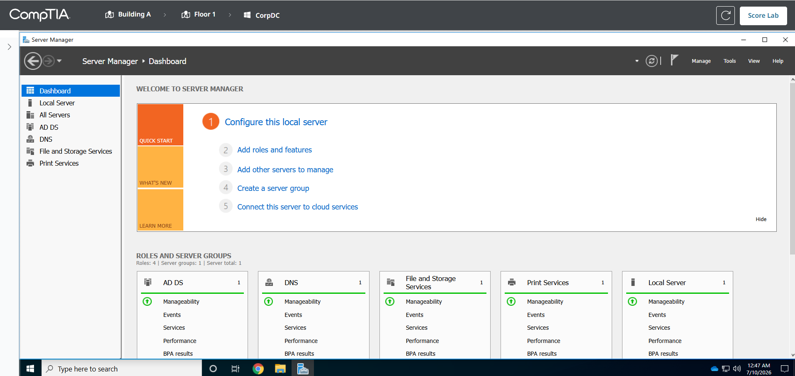
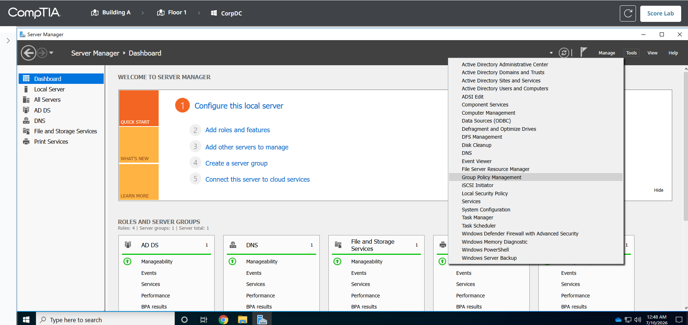
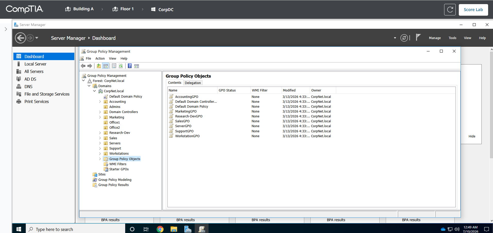
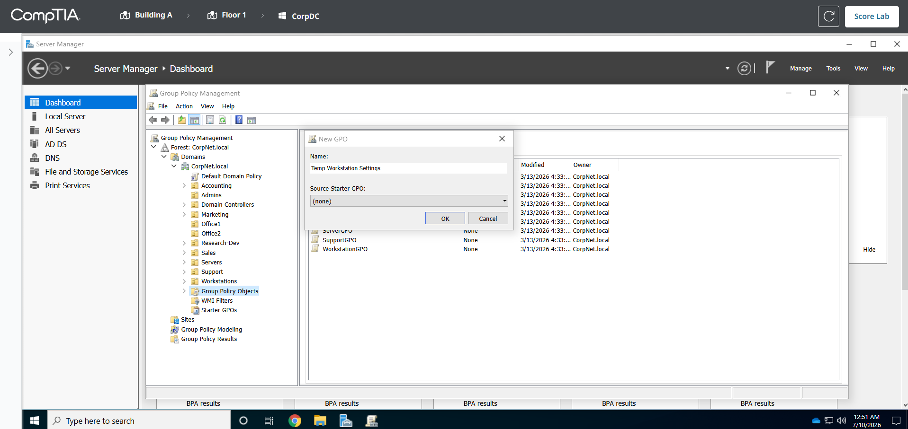
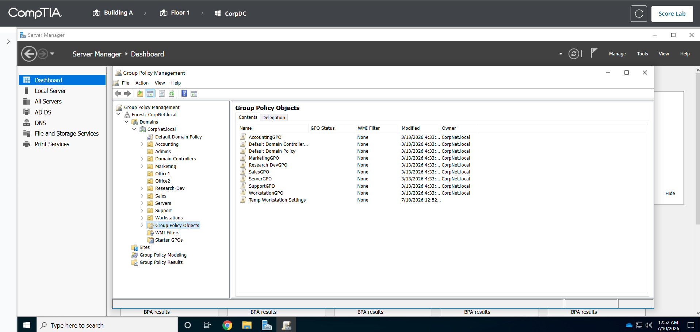
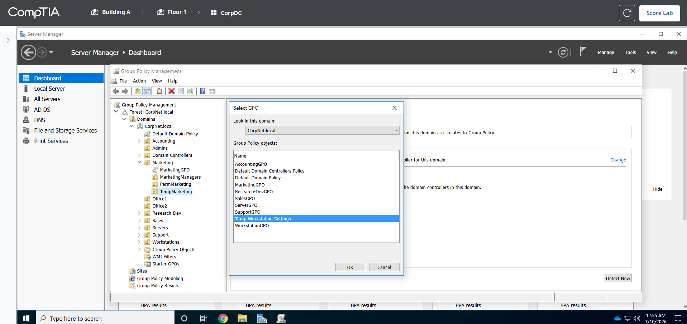
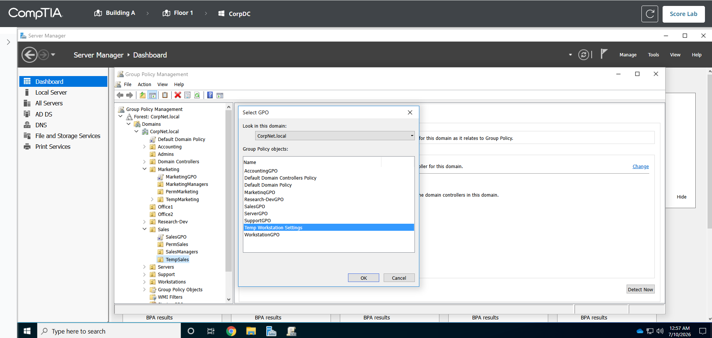
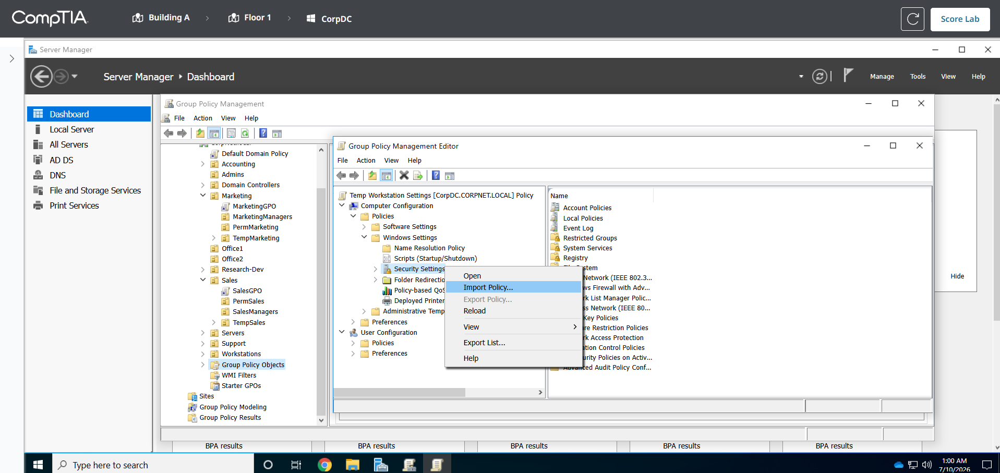
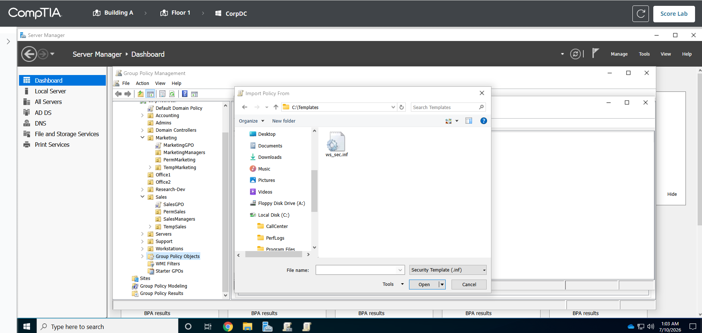
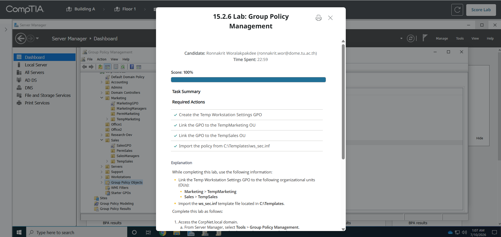

# 15.2.6 Lab: Group Policy Management

## ข้อมูลผู้ทำ Lab

- ชื่อ Lab: 15.2.6 Lab: Group Policy Management
- หัวข้อ: การสร้างและจัดการ Group Policy Object (GPO)
- เครื่องที่ใช้งาน: CorpDC
- Domain: CorpNet.local
- ผลลัพธ์สุดท้าย: ทำ Lab สำเร็จและได้คะแนน 100%

## ตอนนี้กำลังจะทำอะไร

ใน Lab นี้กำลังจะสร้าง Group Policy Object หรือ `GPO` ชื่อ `Temp Workstation Settings` เพื่อใช้บังคับ security settings กับ workstation ที่เกี่ยวข้องกับ temporary employees

หลังจากสร้าง GPO แล้ว จะนำ GPO เดียวกันไป link กับ OU ที่เก็บ temporary employees อยู่ 2 แผนก คือ `Marketing > TempMarketing` และ `Sales > TempSales` จากนั้นจะ import security template ชื่อ `ws_sec.inf` จาก path `C:\Templates` เข้าไปใน GPO

เหตุผลที่ทำแบบนี้คือบริษัทมี security template ที่เตรียมและทดสอบไว้แล้ว จึงไม่ต้องตั้งค่า security policy ทีละรายการเอง แต่ใช้วิธี import template เข้า GPO แล้วบังคับใช้กับ OU ที่ต้องการโดยตรง

## วัตถุประสงค์

วัตถุประสงค์ของ Lab นี้คือการใช้ Group Policy Management เพื่อจัดการ security settings ให้กับ workstation ของ temporary employees

สิ่งที่ต้องทำมีดังนี้:

1. สร้าง GPO ชื่อ `Temp Workstation Settings`
2. Link GPO ไปที่ OU `Marketing > TempMarketing`
3. Link GPO ไปที่ OU `Sales > TempSales`
4. Import security template จาก `C:\Templates\ws_sec.inf`
5. ตรวจสอบผลลัพธ์ด้วย `Score Lab`

## ข้อมูลที่ต้องใช้

| รายการ | ค่าที่ใช้ |
| --- | --- |
| Domain | CorpNet.local |
| GPO name | Temp Workstation Settings |
| OU ที่ต้อง link จุดที่ 1 | Marketing > TempMarketing |
| OU ที่ต้อง link จุดที่ 2 | Sales > TempSales |
| Security template | C:\Templates\ws_sec.inf |

## วิธีคิดของ Lab นี้

### 1. GPO คืออะไร

`GPO` หรือ `Group Policy Object` คือชุดนโยบายที่ใช้กำหนดค่าการทำงานของ computer หรือ user ใน domain เช่น security settings, password policy, Windows settings หรือ restriction ต่าง ๆ

ใน Lab นี้ GPO ถูกใช้เพื่อบังคับ security settings ให้กับเครื่องที่อยู่ใน OU ของ temporary employees

### 2. ทำไมต้อง link GPO กับ OU

การสร้าง GPO อย่างเดียวจะยังไม่ทำให้ policy ถูกใช้งานทันที ต้องนำ GPO ไป link กับตำแหน่งที่ต้องการ เช่น domain, site หรือ OU

ใน Lab นี้โจทย์ต้องการให้ policy ใช้กับ temporary employees เฉพาะบาง OU จึงต้อง link ไปที่:

```text
Marketing > TempMarketing
Sales > TempSales
```

เหตุผลที่ link กับ OU แทนการ link ทั้ง domain เพราะไม่ต้องการให้ policy นี้กระทบกับทุกเครื่องหรือทุก user ในบริษัท ต้องการจำกัดเฉพาะกลุ่ม temporary เท่านั้น

### 3. ทำไมใช้ GPO เดียว link หลาย OU

เพราะทั้ง `TempMarketing` และ `TempSales` ต้องใช้ policy ชุดเดียวกัน จึงสร้าง GPO เพียงตัวเดียว แล้วนำไป link กับทั้ง 2 OU

วิธีนี้ช่วยลดงานซ้ำ และถ้าต้องแก้ policy ในอนาคต ก็แก้ที่ GPO ตัวเดียว ไม่ต้องแก้หลายที่

### 4. ทำไมต้อง import `ws_sec.inf`

ไฟล์ `ws_sec.inf` เป็น security template ที่มี policy เตรียมไว้แล้ว การ import ไฟล์นี้เข้าไปใน GPO จะทำให้ GPO มี security settings ตามที่บริษัทกำหนด

ใน Lab นี้ import เข้าไปที่:

```text
Computer Configuration
Policies
Windows Settings
Security Settings
```

เหตุผลที่อยู่ฝั่ง `Computer Configuration` เพราะ security settings เหล่านี้ต้องการบังคับใช้กับ workstation หรือ computer object

## ขั้นตอนการทำ Lab

### ขั้นตอนที่ 1: เข้าเครื่อง CorpDC และเปิด Server Manager

1. เข้าไปที่เครื่อง `CorpDC`
2. เปิด `Server Manager`
3. ตรวจสอบว่าอยู่บนเครื่อง Domain Controller ที่ใช้จัดการ domain `CorpNet.local`

เหตุผลที่ต้องทำบน `CorpDC` เพราะเครื่องนี้เป็น Domain Controller และมีเครื่องมือสำหรับจัดการ Group Policy ของ domain



ภาพนี้แสดงหน้า `Server Manager` บนเครื่อง `CorpDC` ซึ่งเป็นจุดเริ่มต้นสำหรับเปิดเครื่องมือ Group Policy Management

### ขั้นตอนที่ 2: เปิด Group Policy Management

1. ใน `Server Manager` ไปที่เมนูด้านบน
2. เลือก `Tools`
3. เลือก `Group Policy Management`

เหตุผลที่เปิด `Group Policy Management` เพราะเครื่องมือนี้ใช้สร้าง GPO, link GPO กับ OU และแก้ไข policy ภายใน GPO



ภาพนี้แสดงการเลือกเมนู `Tools > Group Policy Management`

หลังจากเปิดเครื่องมือแล้ว ให้ขยายตามลำดับนี้:

```text
Forest: CorpNet.local
Domains
CorpNet.local
```



ภาพนี้แสดงหน้า `Group Policy Management` ที่เข้าไปถึง domain `CorpNet.local` แล้ว และเห็นโฟลเดอร์ `Group Policy Objects`

### ขั้นตอนที่ 3: สร้าง GPO ชื่อ Temp Workstation Settings

1. ใน `CorpNet.local` ให้คลิกขวาที่ `Group Policy Objects`
2. เลือก `New`
3. ที่ช่อง `Name` ให้กรอก:

```text
Temp Workstation Settings
```

4. กด `OK`

เหตุผลที่สร้าง GPO ใต้ `Group Policy Objects` ก่อน เพราะต้องสร้างตัว policy object ให้เรียบร้อย จากนั้นจึงนำไป link กับ OU ที่ต้องการ



ภาพนี้แสดงการตั้งชื่อ GPO เป็น `Temp Workstation Settings`

หลังจากสร้างเสร็จ จะเห็น GPO ใหม่นี้อยู่ในรายการ `Group Policy Objects`



ภาพนี้ยืนยันว่า GPO ชื่อ `Temp Workstation Settings` ถูกสร้างแล้ว

### ขั้นตอนที่ 4: Link GPO ไปที่ TempMarketing

1. ขยาย OU ตามนี้:

```text
CorpNet.local
Marketing
TempMarketing
```

2. คลิกขวาที่ `TempMarketing`
3. เลือก `Link an Existing GPO...`
4. เลือก GPO ชื่อ:

```text
Temp Workstation Settings
```

5. กด `OK`

เหตุผลที่ link กับ `TempMarketing` เพราะ temporary employees ฝั่ง Marketing ต้องได้รับ security settings ชุดนี้



ภาพนี้แสดงการเลือก GPO `Temp Workstation Settings` เพื่อ link เข้ากับ OU `TempMarketing`

### ขั้นตอนที่ 5: Link GPO ไปที่ TempSales

1. ขยาย OU ตามนี้:

```text
CorpNet.local
Sales
TempSales
```

2. คลิกขวาที่ `TempSales`
3. เลือก `Link an Existing GPO...`
4. เลือก GPO ชื่อ:

```text
Temp Workstation Settings
```

5. กด `OK`

เหตุผลที่ link กับ `TempSales` เพราะ temporary employees ฝั่ง Sales ต้องได้รับ security settings ชุดเดียวกันกับฝั่ง Marketing



ภาพนี้แสดงการเลือก GPO `Temp Workstation Settings` เพื่อ link เข้ากับ OU `TempSales`

### ขั้นตอนที่ 6: Import security template เข้า GPO

1. กลับไปที่ `Group Policy Objects`
2. คลิกขวาที่ `Temp Workstation Settings`
3. เลือก `Edit`
4. ในหน้าต่าง `Group Policy Management Editor` ให้ขยาย:

```text
Computer Configuration
Policies
Windows Settings
Security Settings
```

5. คลิกขวาที่ `Security Settings`
6. เลือก `Import Policy...`

เหตุผลที่ import จาก `Security Settings` เพราะไฟล์ `ws_sec.inf` เป็น security template จึงต้องนำเข้าที่หมวด security policy ของ GPO



ภาพนี้แสดงการเลือก `Import Policy...` จาก `Security Settings`

จากนั้นให้ไปที่ path:

```text
C:\Templates
```

เลือกไฟล์:

```text
ws_sec.inf
```

แล้วกด `Open`



ภาพนี้แสดงไฟล์ `ws_sec.inf` ในโฟลเดอร์ `C:\Templates` ซึ่งเป็น security template ที่ต้อง import เข้า GPO

### ขั้นตอนที่ 7: ตรวจคะแนน Lab

1. ปิดหน้าต่าง `Group Policy Management Editor`
2. กลับไปที่หน้า Lab
3. กด `Score Lab`
4. ตรวจสอบว่า required actions ผ่านครบทุกข้อ

ผลลัพธ์ที่ถูกต้องคือ:

```text
Score: 100%
Create the Temp Workstation Settings GPO: Completed
Link the GPO to the TempMarketing OU: Completed
Link the GPO to the TempSales OU: Completed
Import the policy from C:\Templates\ws_sec.inf: Completed
```



ภาพนี้แสดงผลคะแนน `100%` และ required actions ทั้งหมดผ่านครบ

## สรุปผล

ใน Lab นี้ได้สร้าง GPO ชื่อ `Temp Workstation Settings` บน domain `CorpNet.local` แล้วนำ GPO นี้ไป link กับ OU ของ temporary employees ทั้ง 2 จุด คือ `Marketing > TempMarketing` และ `Sales > TempSales`

หลังจากนั้นได้ import security template `C:\Templates\ws_sec.inf` เข้าไปใน GPO ผ่าน `Computer Configuration > Policies > Windows Settings > Security Settings`

การทำแบบนี้ช่วยให้บริษัทสามารถบังคับใช้ security settings กับ workstation ของ temporary employees ได้จากศูนย์กลาง โดยไม่ต้องไปตั้งค่าทีละเครื่อง และเมื่อกด `Score Lab` ได้ผลลัพธ์เป็น `100%`
