# 15.3.6 Lab: Configure NTFS Permissions

## ข้อมูลผู้ทำ Lab

- ชื่อ Lab: 15.3.6 Lab: Configure NTFS Permissions
- หัวข้อ: การตั้งค่า NTFS permissions ให้กับโฟลเดอร์
- เครื่องที่ใช้งาน: Office1
- โฟลเดอร์ที่ต้องแก้ไข: `D:\Day Data` และ `D:\Night Data`
- ผลลัพธ์สุดท้าย: ทำ Lab สำเร็จและได้คะแนน 100%

## ตอนนี้กำลังจะทำอะไร

ใน Lab นี้กำลังจะตั้งค่าสิทธิ์การเข้าถึงโฟลเดอร์บน drive `D:` ให้เหมาะกับกลุ่มผู้ใช้ 2 กลุ่ม คือ `DayGroup` และ `NightGroup`

เหตุผลที่ต้องทำแบบนี้ เพราะแต่ละกลุ่มควรเข้าถึงเฉพาะโฟลเดอร์ของตัวเองเท่านั้น โดย `DayGroup` ต้องได้สิทธิ์กับ `D:\Day Data` และ `NightGroup` ต้องได้สิทธิ์กับ `D:\Night Data` ส่วนกลุ่ม `Users` ต้องถูกเอาออกจาก ACL เพื่อลดสิทธิ์กว้าง ๆ ที่อาจทำให้ผู้ใช้ทั่วไปเข้าถึงโฟลเดอร์ได้เกินความจำเป็น

## วัตถุประสงค์

สิ่งที่ต้องทำกับทั้ง 2 โฟลเดอร์มีดังนี้:

1. ปิด permissions inheritance
2. Convert inherited permissions ให้กลายเป็น explicit permissions
3. ลบกลุ่ม `Users` ออกจาก ACL ของโฟลเดอร์
4. เพิ่มกลุ่มที่ถูกต้องเข้าไปใน ACL
5. ให้สิทธิ์ `Full Control` กับกลุ่มที่ถูกต้อง
6. ไม่แก้ไขสิทธิ์ของ user หรือ group อื่นที่ไม่ได้เกี่ยวข้อง

## ข้อมูลที่ต้องใช้

| Folder | Group ที่ต้องเพิ่ม | Permission |
| --- | --- | --- |
| `D:\Day Data` | `DayGroup` | Full Control |
| `D:\Night Data` | `NightGroup` | Full Control |

กลุ่มอื่นที่มีอยู่แล้ว เช่น `Administrators`, `SYSTEM` และ `CREATOR OWNER` ไม่ควรลบหรือแก้ไข เพราะเป็นสิทธิ์ที่ระบบและผู้ดูแลระบบต้องใช้ในการจัดการเครื่อง

## วิธีคิดของ Lab นี้

NTFS permissions คือสิทธิ์ที่ใช้ควบคุมว่า user หรือ group ใดสามารถทำอะไรกับไฟล์และโฟลเดอร์ได้บ้าง เช่น อ่านไฟล์ แก้ไขไฟล์ ลบไฟล์ หรือควบคุมสิทธิ์ทั้งหมด

ACL หรือ Access Control List คือรายการสิทธิ์ของโฟลเดอร์นั้น ๆ ว่ามี user/group ใดอยู่ในรายการ และแต่ละรายการมีสิทธิ์ระดับไหน

Inheritance คือการรับสิทธิ์ต่อมาจากโฟลเดอร์แม่ เช่น `D:\Day Data` อาจรับ permission มาจาก drive `D:` ทำให้บางสิทธิ์ถูกส่งต่อมาอัตโนมัติ ถ้าเราต้องการจัดสิทธิ์เฉพาะโฟลเดอร์นี้เอง ต้องปิด inheritance ก่อน

ใน Lab นี้ต้องเลือก `Convert inherited permissions into explicit permissions on this object` เพราะโจทย์ต้องการให้แปลงสิทธิ์เดิมที่รับมาจาก parent ให้กลายเป็นสิทธิ์ของโฟลเดอร์นี้โดยตรง จากนั้นเราจึงสามารถลบ `Users` ออกได้โดยไม่กระทบ permission อื่นที่ยังจำเป็น

เหตุผลที่ลบ `Users` เพราะเป็นกลุ่มกว้างมาก ผู้ใช้ทั่วไปจำนวนมากอาจอยู่ในกลุ่มนี้ ถ้าปล่อยไว้จะทำให้คนที่ไม่ใช่ `DayGroup` หรือ `NightGroup` มีสิทธิ์เข้าถึงโฟลเดอร์ได้

เหตุผลที่เพิ่มเป็น group แทนการเพิ่ม user ทีละคน เพราะการจัดสิทธิ์ผ่าน group ดูแลได้ง่ายกว่า ถ้ามีสมาชิกใหม่เข้ากะกลางวันก็แค่เพิ่มคนนั้นเข้า `DayGroup` ไม่ต้องมาแก้ permission ที่โฟลเดอร์ทุกครั้ง

## ขั้นตอนการทำ Lab

### ขั้นตอนที่ 1: เปิด drive Data (D:)

เปิด File Explorer จาก taskbar จากนั้นไปที่ `This PC` แล้วเปิด `Data (D:)`

ใน drive นี้จะเห็นโฟลเดอร์ที่ต้องแก้ไขคือ `Day Data` และ `Night Data`

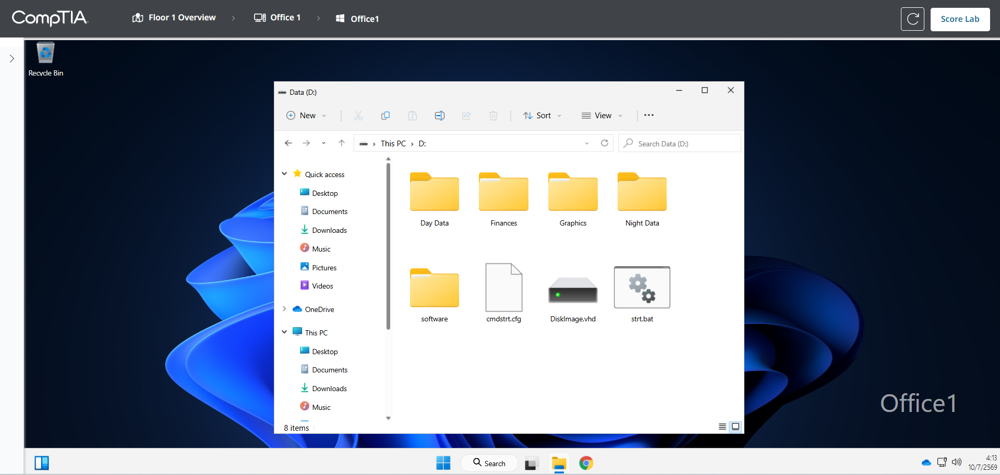

เหตุผลที่ต้องเข้ามาที่ drive `D:` เพราะโจทย์ระบุ path ของโฟลเดอร์เป็น `D:\Day Data` และ `D:\Night Data` ดังนั้นต้องแก้ permission ที่โฟลเดอร์จริงบน drive นี้

### ขั้นตอนที่ 2: เปิด Security tab ของ Day Data

คลิกขวาที่โฟลเดอร์ `Day Data` แล้วเลือก `Properties`

จากนั้นไปที่แท็บ `Security`

ในหน้านี้จะเห็นรายชื่อ group/user ที่มี permission อยู่แล้ว เช่น `Administrators`, `Users`, `CREATOR OWNER` และ `SYSTEM`

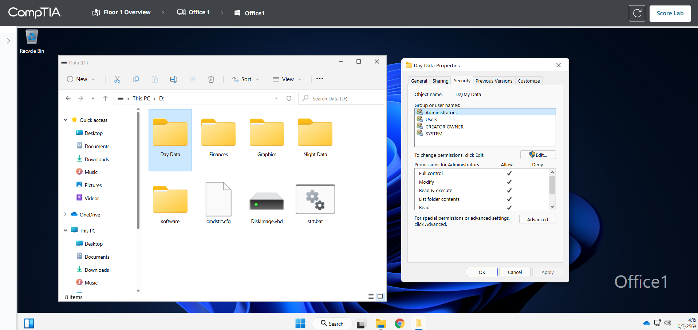

เหตุผลที่ต้องเข้าที่แท็บ `Security` เพราะการตั้งค่า NTFS permissions ของโฟลเดอร์จะทำผ่านแท็บนี้

### ขั้นตอนที่ 3: ปิด inheritance ของ Day Data

ในแท็บ `Security` ให้กด `Advanced`

จากนั้นกด `Disable inheritance`

เมื่อมีกล่อง `Block Inheritance` ขึ้นมา ให้เลือก:

```text
Convert inherited permissions into explicit permissions on this object.
```

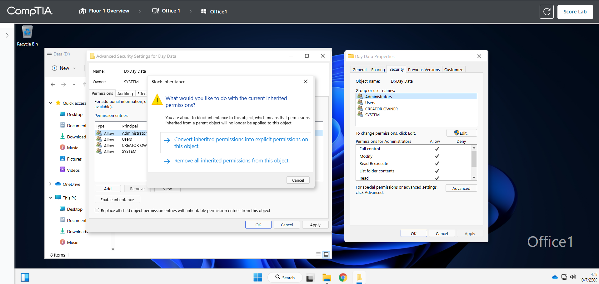

เหตุผลที่เลือก Convert เพราะเราต้องการเก็บ permission เดิมไว้ก่อน แต่เปลี่ยนให้เป็น permission ที่แก้ไขได้โดยตรงบน `Day Data` ถ้าเลือก Remove inherited permissions อาจทำให้ permission สำคัญหายไปมากเกินไป

### ขั้นตอนที่ 4: ลบ Users ออกจาก Day Data

หลังจาก convert แล้ว ให้เลือก `Users` ในรายการ permission entries แล้วกด `Remove`

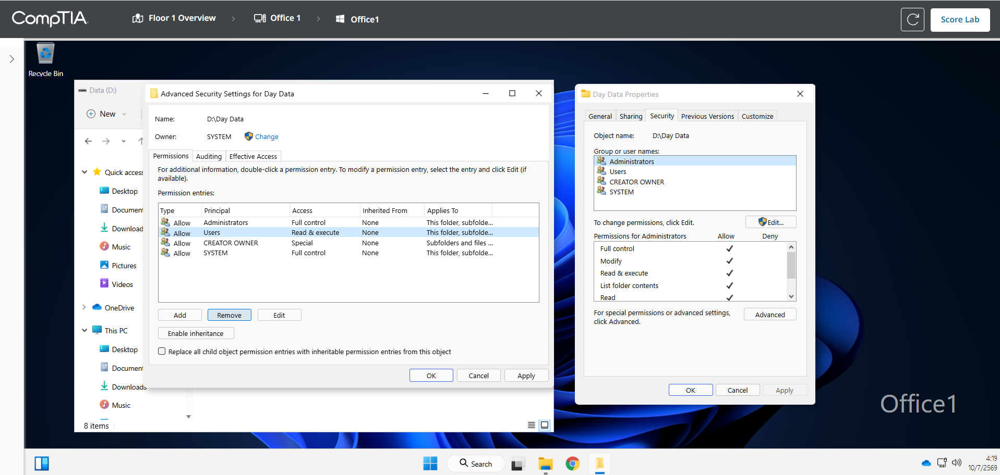

เหตุผลที่ต้องลบ `Users` เพราะโจทย์ต้องการให้จัดสิทธิ์เฉพาะกลุ่มที่เหมาะสม การปล่อย `Users` ไว้อาจทำให้ user ทั่วไปเข้าถึง `Day Data` ได้ แม้ไม่ได้เป็นสมาชิกของ `DayGroup`

### ขั้นตอนที่ 5: เพิ่ม DayGroup ให้กับ Day Data

กลับมาที่หน้าต่าง Properties ของ `Day Data`

กด `Edit` แล้วกด `Add`

ในช่อง object name ให้พิมพ์:

```text
DayGroup
```

จากนั้นกด `OK`

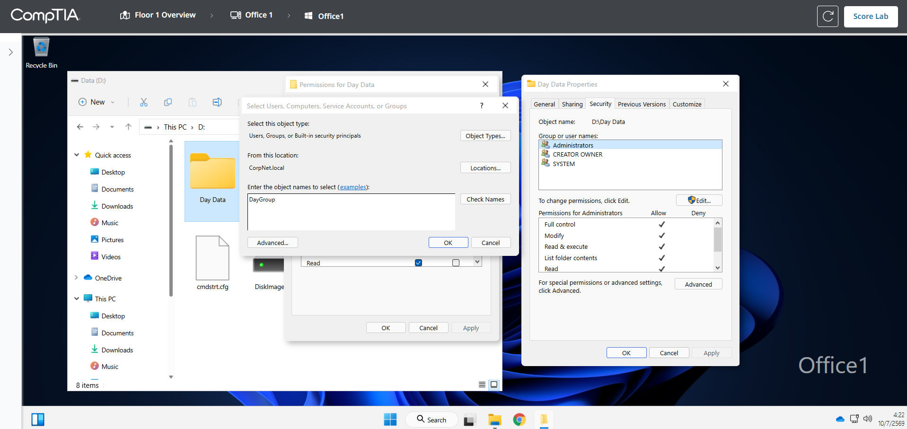

เหตุผลที่เพิ่ม `DayGroup` เพราะโฟลเดอร์ `Day Data` เป็นข้อมูลของกลุ่มผู้ใช้เวลากลางวัน จึงต้องให้กลุ่มนี้เป็นผู้มีสิทธิ์หลักในการใช้งานโฟลเดอร์

### ขั้นตอนที่ 6: ให้ DayGroup เป็น Full Control

เลือก `DayGroup`

ในช่อง `Allow` ให้ติ๊ก `Full control`

จากนั้นกด `OK` เพื่อปิดหน้าต่าง Permissions และกด `OK` อีกครั้งเพื่อปิด Properties

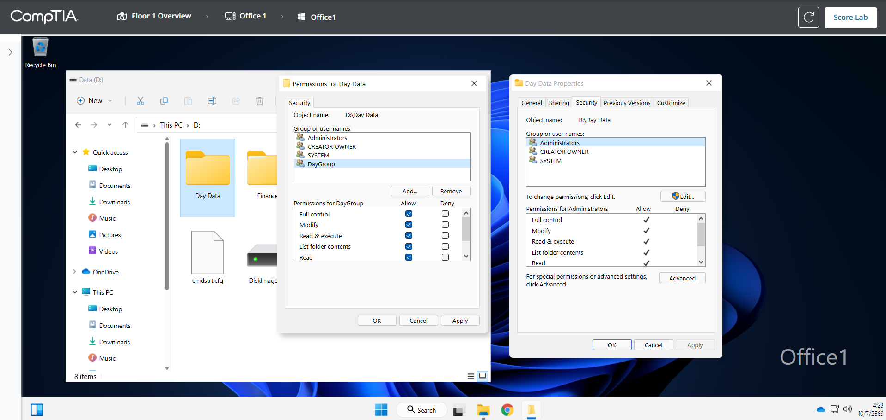

เหตุผลที่ให้ `Full Control` เพราะโจทย์กำหนดให้กลุ่มที่ถูกต้องต้องมีสิทธิ์เต็มกับโฟลเดอร์ของตนเอง ซึ่งรวมถึงการอ่าน เขียน แก้ไข และลบข้อมูลภายในโฟลเดอร์

### ขั้นตอนที่ 7: เปิด Security tab ของ Night Data

กลับไปที่ drive `Data (D:)`

คลิกขวาที่โฟลเดอร์ `Night Data` แล้วเลือก `Properties`

จากนั้นไปที่แท็บ `Security`

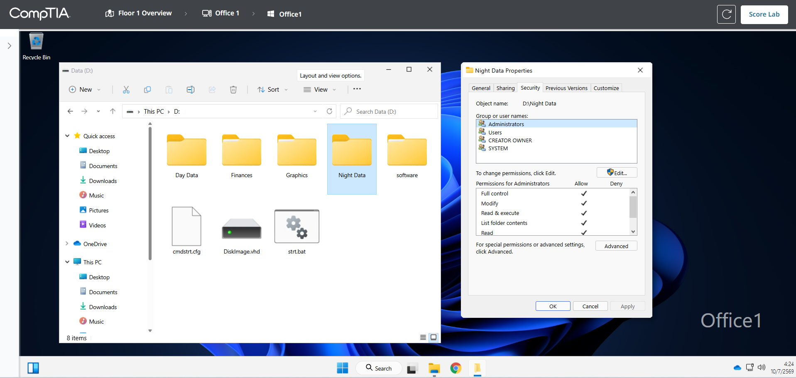

เหตุผลที่ต้องทำกับ `Night Data` ด้วย เพราะโจทย์กำหนดให้แก้ permission ทั้งสองโฟลเดอร์ ไม่ใช่เฉพาะ `Day Data`

### ขั้นตอนที่ 8: ปิด inheritance ของ Night Data

ในแท็บ `Security` ของ `Night Data` ให้กด `Advanced`

กด `Disable inheritance`

จากนั้นเลือก:

```text
Convert inherited permissions into explicit permissions on this object.
```

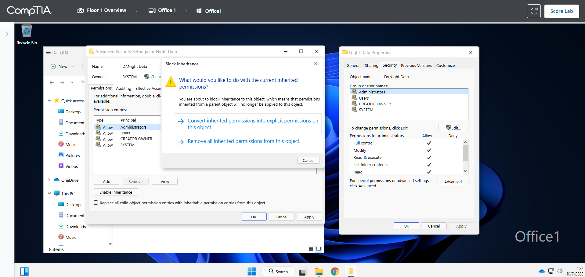

เหตุผลเหมือนกับ `Day Data` คือเราต้องทำให้ permission ที่รับมาจาก parent กลายเป็น explicit permission ก่อน เพื่อให้สามารถลบ `Users` และเพิ่ม `NightGroup` ได้อย่างถูกต้อง

### ขั้นตอนที่ 9: ลบ Users ออกจาก Night Data

เลือก `Users` แล้วกด `Remove`

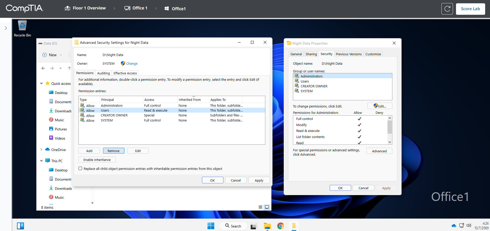

เหตุผลที่ต้องลบ `Users` เพราะ `Night Data` ควรให้สิทธิ์กับ `NightGroup` เท่านั้น ไม่ควรเปิดให้ user ทั่วไปเข้าถึงได้ผ่านกลุ่มกว้าง ๆ

### ขั้นตอนที่ 10: เพิ่ม NightGroup ให้กับ Night Data

กลับมาที่หน้าต่าง Properties ของ `Night Data`

กด `Edit` แล้วกด `Add`

ในช่อง object name ให้พิมพ์:

```text
NightGroup
```

จากนั้นกด `OK`

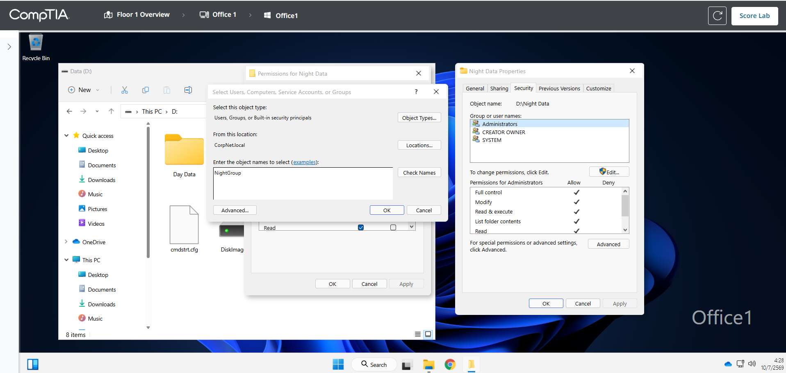

เหตุผลที่เพิ่ม `NightGroup` เพราะโฟลเดอร์ `Night Data` เป็นข้อมูลของกลุ่มผู้ใช้เวลากลางคืน จึงต้องให้กลุ่มนี้เป็นผู้มีสิทธิ์หลักในการใช้งานโฟลเดอร์

### ขั้นตอนที่ 11: ให้ NightGroup เป็น Full Control

เลือก `NightGroup`

ในช่อง `Allow` ให้ติ๊ก `Full control`

จากนั้นกด `OK` เพื่อบันทึก permission

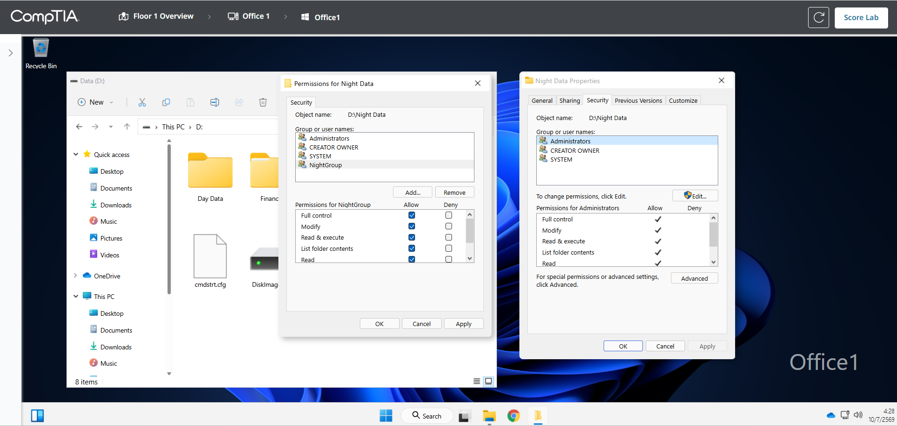

เหตุผลที่ตั้งเป็น `Full Control` เพราะโจทย์ระบุให้กลุ่มที่ตรงกับโฟลเดอร์ต้องมีสิทธิ์ควบคุมโฟลเดอร์แบบเต็ม

### ขั้นตอนที่ 12: ตรวจคะแนนด้วย Score Lab

หลังจากตั้งค่าทั้ง `Day Data` และ `Night Data` เสร็จแล้ว ให้กด `Score Lab`

ผลลัพธ์ที่ได้คือ 100%

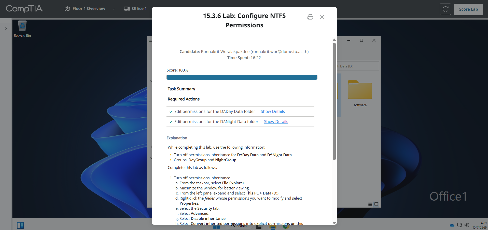

## สรุปผลลัพธ์

หลังจากทำ Lab เสร็จ สิทธิ์ของโฟลเดอร์ควรเป็นดังนี้:

| Folder | สิ่งที่แก้ไขสำเร็จ |
| --- | --- |
| `D:\Day Data` | ปิด inheritance, ลบ `Users`, เพิ่ม `DayGroup`, ให้ `DayGroup` เป็น Full Control |
| `D:\Night Data` | ปิด inheritance, ลบ `Users`, เพิ่ม `NightGroup`, ให้ `NightGroup` เป็น Full Control |

สรุปคือ Lab นี้สอนการจัดการ NTFS permissions แบบอิงตาม group โดยใช้หลัก least privilege คือให้สิทธิ์เฉพาะกลุ่มที่จำเป็น และลดสิทธิ์กว้าง ๆ อย่าง `Users` ออกจากโฟลเดอร์ที่ต้องควบคุมการเข้าถึง
