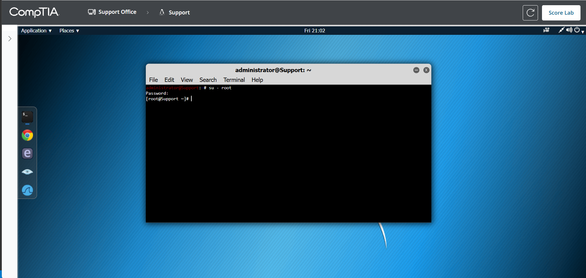
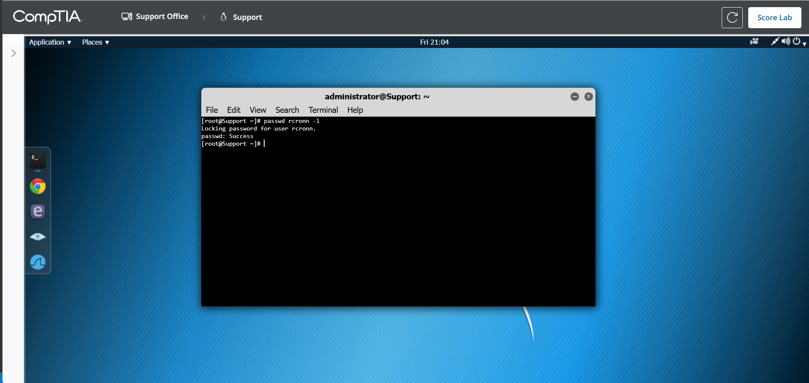
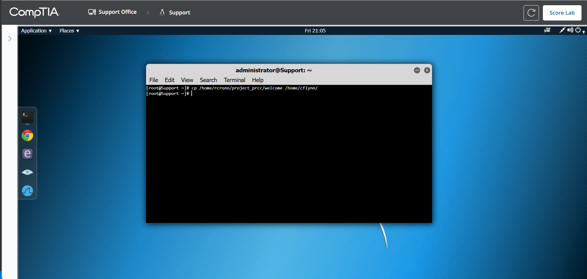
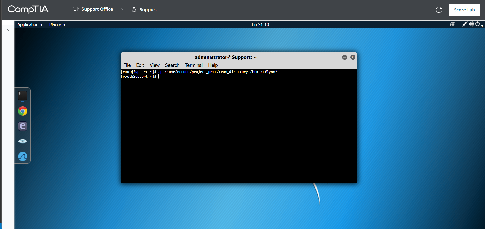
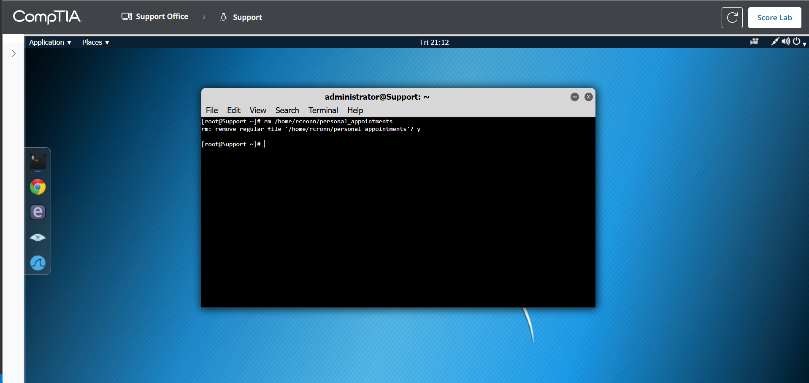
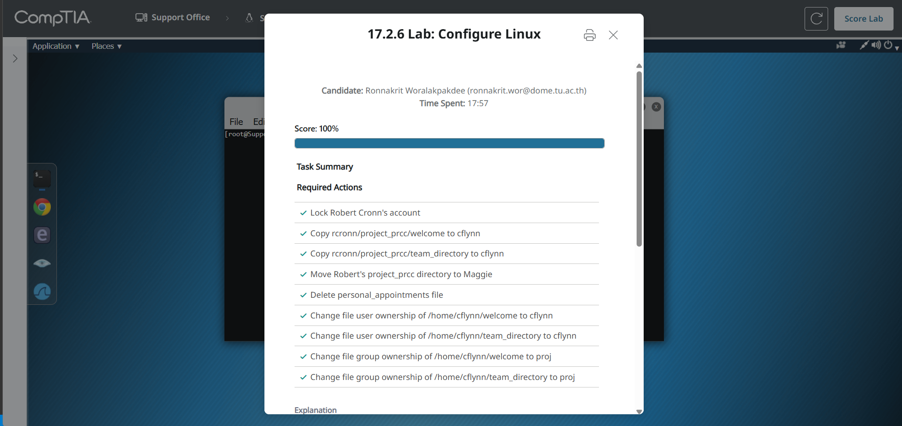

# 17.2.6 Lab: Configure Linux

## ข้อมูลผู้ทำ Lab

- ชื่อ Lab: 17.2.6 Lab: Configure Linux
- หัวข้อ: การจัดการ Linux user account, project files, file ownership และ group ownership
- เครื่องที่ใช้ใน Lab: Support
- ผลลัพธ์สุดท้าย: ทำ Lab สำเร็จและได้คะแนน 100%

## ตอนนี้กำลังจะทำอะไร

ใน Lab นี้กำลังจะจัดการข้อมูลหลังจาก `Robert Cronn` ลาออกจากองค์กร โดย user เดิมของ Robert คือ `rcronn` และมีการแต่งตั้ง `Maggie Brown` หรือ user `mbrown` เป็น project manager คนใหม่ของ project `PRCC`

สิ่งที่ต้องทำคือ lock account ของ Robert, copy ไฟล์บางส่วนให้ `Corey Flynn` หรือ user `cflynn`, move project directory ไปให้ Maggie, ลบไฟล์ส่วนตัวของ Robert และแก้ owner/group ของไฟล์ที่อยู่ใน account ของ Corey ให้ถูกต้อง

เหตุผลที่ต้องทำแบบนี้ เพราะหลังพนักงานลาออก ไม่ควรปล่อยให้ account เดิม login ได้อีก และไฟล์งานต้องถูกส่งต่อไปให้คนที่รับผิดชอบใหม่อย่างถูกต้อง ส่วนไฟล์ส่วนตัวที่ไม่เกี่ยวกับงานไม่ควรถูกย้ายต่อไปให้คนอื่น

## วัตถุประสงค์

สิ่งที่ต้องทำใน Lab นี้มีดังนี้:

1. เปลี่ยนเป็น root account
2. ดู man page ของคำสั่ง `passwd` เพื่อดูข้อมูลเกี่ยวกับการ lock account
3. lock account ของ Robert Cronn หรือ user `rcronn`
4. copy ไฟล์ `welcome` จาก `/home/rcronn/project_prcc` ไปที่ `/home/cflynn`
5. copy ไฟล์ `team_directory` จาก `/home/rcronn/project_prcc` ไปที่ `/home/cflynn`
6. move directory `/home/rcronn/project_prcc` ไปที่ `/home/mbrown`
7. ลบไฟล์ `/home/rcronn/personal_appointments`
8. เปลี่ยน user owner ของไฟล์ใน `/home/cflynn` ให้เป็น `cflynn`
9. เปลี่ยน group owner ของไฟล์ใน `/home/cflynn` ให้เป็น `proj`
10. ตรวจสอบผลลัพธ์และกด `Score Lab`

## ข้อมูลที่ต้องใช้ใน Lab

| รายการ | ค่า |
| --- | --- |
| root password | `1worm4b8` |
| user เดิมของ Robert Cronn | `rcronn` |
| user ของ Maggie Brown | `mbrown` |
| user ของ Corey Flynn | `cflynn` |
| project directory เดิม | `/home/rcronn/project_prcc` |
| project directory ใหม่ | `/home/mbrown/project_prcc` |
| group owner ที่ต้องใช้ | `proj` |

## คำสั่งที่ใช้ใน Lab

| คำสั่ง | หน้าที่ |
| --- | --- |
| `su - root` | เปลี่ยนจาก user ปัจจุบันเป็น root |
| `man passwd` | เปิด manual page ของคำสั่ง `passwd` |
| `passwd rcronn -l` | lock account ของ user `rcronn` |
| `cp` | copy ไฟล์จากที่หนึ่งไปอีกที่หนึ่ง |
| `mv` | move หรือย้ายไฟล์/directory |
| `rm` | remove หรือลบไฟล์ |
| `chown` | เปลี่ยน user owner ของไฟล์ |
| `chgrp` | เปลี่ยน group owner ของไฟล์ |
| `ls` / `ls -l` | ตรวจสอบไฟล์และรายละเอียด owner/group |

## คำสั่งทั้งหมดแบบสรุป

ถ้าต้องการทำแบบรวดเร็ว ให้ใช้คำสั่งตามลำดับนี้:

```bash
su - root
man passwd
passwd rcronn -l
cp /home/rcronn/project_prcc/welcome /home/cflynn
cp /home/rcronn/project_prcc/team_directory /home/cflynn
mv /home/rcronn/project_prcc /home/mbrown
rm /home/rcronn/personal_appointments
chown cflynn /home/cflynn/welcome
chown cflynn /home/cflynn/team_directory
chgrp proj /home/cflynn/welcome
chgrp proj /home/cflynn/team_directory
ls -l /home/cflynn
ls /home/mbrown
```

หมายเหตุ: ถ้าคำสั่ง `rm` ถามยืนยัน ให้พิมพ์ `y` แล้วกด `Enter`

## ขั้นตอนการทำ Lab

### ขั้นตอนที่ 1: เปิด Terminal และเปลี่ยนเป็น root

1. จากหน้า Linux ให้เปิด `Terminal`
2. ที่ terminal prompt ให้พิมพ์:

```bash
su - root
```

3. กด `Enter`
4. เมื่อระบบถาม password ให้พิมพ์:

```text
1worm4b8
```

5. กด `Enter`
6. ถ้าเข้าสู่ root สำเร็จ prompt จะเปลี่ยนเป็นลักษณะนี้:

```bash
[root@Support ~]#
```

เหตุผลที่ต้องเปลี่ยนเป็น root เพราะงานนี้ต้องจัดการ account และไฟล์ใน home directory ของ user หลายคน ซึ่ง user ธรรมดาไม่มีสิทธิ์เพียงพอ



### ขั้นตอนที่ 2: ดู man page ของ passwd

1. หลังจากอยู่ใน root แล้ว ให้พิมพ์:

```bash
man passwd
```

2. อ่านข้อมูล option ที่เกี่ยวกับการ lock account เช่น `-l`
3. กด `q` เพื่อออกจาก manual page

เหตุผลที่โจทย์ให้ดู man page เพราะต้องการให้รู้ว่า `passwd` ไม่ได้ใช้แค่เปลี่ยนรหัสผ่าน แต่ยังใช้ lock account ได้ด้วย

### ขั้นตอนที่ 3: Lock account ของ Robert Cronn

พิมพ์คำสั่ง:

```bash
passwd rcronn -l
```

ผลลัพธ์ที่ถูกต้องควรมีข้อความลักษณะนี้:

```text
Locking password for user rcronn.
passwd: Success
```

เหตุผลที่ต้อง lock account คือ Robert ลาออกแล้ว จึงต้องป้องกันไม่ให้ user `rcronn` login เข้าระบบได้อีก แต่ยังไม่ลบ account ทิ้ง เพื่อให้ยังเก็บข้อมูลไว้ตรวจสอบย้อนหลังได้

จุดที่ต้องระวังคือใน Lab นี้ให้ใช้คำสั่งตามเฉลย:

```bash
passwd rcronn -l
```

แม้ใน Linux หลายระบบจะใช้ `passwd -l rcronn` ได้เช่นกัน แต่ใน simulation นี้ใช้รูปแบบตาม Lab จะปลอดภัยที่สุด



### ขั้นตอนที่ 4: Copy ไฟล์ welcome ไปให้ Corey Flynn

พิมพ์คำสั่ง:

```bash
cp /home/rcronn/project_prcc/welcome /home/cflynn
```

คำสั่งนี้หมายความว่า copy ไฟล์:

```text
/home/rcronn/project_prcc/welcome
```

ไปไว้ที่:

```text
/home/cflynn
```

เหตุผลที่ต้อง copy ไฟล์นี้ เพราะ Corey Flynn จะรับ role เดิมบางส่วนของ Maggie จึงต้องได้ไฟล์ project ที่จำเป็นต่อการทำงานต่อ



### ขั้นตอนที่ 5: Copy ไฟล์ team_directory ไปให้ Corey Flynn

พิมพ์คำสั่ง:

```bash
cp /home/rcronn/project_prcc/team_directory /home/cflynn
```

คำสั่งนี้ copy ไฟล์ `team_directory` ไปไว้ใน home directory ของ Corey:

```text
/home/cflynn/team_directory
```

เหตุผลที่ต้อง copy แยกอีกคำสั่ง เพราะ Lab ตรวจว่าไฟล์ `welcome` และ `team_directory` ถูก copy ไปยัง `/home/cflynn` ทั้งคู่



### ขั้นตอนที่ 6: Move project_prcc directory ไปให้ Maggie Brown

พิมพ์คำสั่ง:

```bash
mv /home/rcronn/project_prcc /home/mbrown
```

หลังจากใช้คำสั่งนี้ directory เดิม:

```text
/home/rcronn/project_prcc
```

จะถูกย้ายไปเป็น:

```text
/home/mbrown/project_prcc
```

เหตุผลที่ใช้ `mv` ไม่ใช่ `cp` เพราะโจทย์บอกให้ move project directory ทั้งชุดไปให้ Maggie ซึ่งเป็น project manager คนใหม่ ดังนั้น directory ควรถูกย้ายออกจาก account เดิมของ Robert


### ขั้นตอนที่ 7: ลบไฟล์ personal_appointments ของ Robert

พิมพ์คำสั่ง:

```bash
rm /home/rcronn/personal_appointments
```

ถ้าระบบถามยืนยัน ให้พิมพ์:

```text
y
```

แล้วกด `Enter`

เหตุผลที่ต้องลบไฟล์นี้ เพราะ `personal_appointments` เป็นไฟล์ส่วนตัวของ Robert ไม่ใช่ไฟล์งาน project จึงไม่ควรถูกส่งต่อให้ Maggie หรือ Corey



### ขั้นตอนที่ 8: เปลี่ยน user owner ของไฟล์ใน /home/cflynn

ตอนนี้ไฟล์ `welcome` และ `team_directory` ถูก copy มาอยู่ใน `/home/cflynn` แล้ว แต่ owner อาจยังไม่ถูกต้อง จึงต้องเปลี่ยน user owner ให้เป็น `cflynn`

พิมพ์คำสั่ง:

```bash
chown cflynn /home/cflynn/welcome
chown cflynn /home/cflynn/team_directory
```

เหตุผลที่ต้องทำ เพราะไฟล์ที่อยู่ใน home directory ของ Corey ควรถูกถือครองโดย user `cflynn` เพื่อให้ Corey จัดการไฟล์ได้ถูกต้อง

### ขั้นตอนที่ 9: เปลี่ยน group owner ของไฟล์ใน /home/cflynn

พิมพ์คำสั่ง:

```bash
chgrp proj /home/cflynn/welcome
chgrp proj /home/cflynn/team_directory
```

เหตุผลที่ต้องเปลี่ยน group owner เป็น `proj` เพราะไฟล์ทั้งสองเกี่ยวข้องกับ project ดังนั้นควรอยู่ใน group ของ project เพื่อให้ permission สอดคล้องกับกลุ่มงาน

### ขั้นตอนที่ 10: ตรวจสอบ owner และ group ของไฟล์ใน /home/cflynn

พิมพ์คำสั่ง:

```bash
ls -l /home/cflynn
```

ผลลัพธ์ที่ถูกต้องควรเห็นไฟล์:

```text
welcome
team_directory
```

โดย user owner และ group owner ควรเป็น:

```text
cflynn proj
```

ตัวอย่างผลลัพธ์:

```text
-rw-r--r--. 1 cflynn proj 4096 ... team_directory
-rw-r--r--. 1 cflynn proj 4096 ... welcome
```

เหตุผลที่ต้องตรวจด้วย `ls -l` เพราะคำสั่งนี้แสดงรายละเอียด owner และ group ของไฟล์ ทำให้ยืนยันได้ว่า `chown` และ `chgrp` ทำงานสำเร็จ


### ขั้นตอนที่ 11: ตรวจสอบว่า project_prcc ถูกย้ายไปที่ /home/mbrown แล้ว

พิมพ์คำสั่ง:

```bash
ls /home/mbrown
```

ผลลัพธ์ควรเห็น:

```text
project_prcc
```

เหตุผลที่ต้องตรวจขั้นตอนนี้ เพราะ Lab ตรวจว่า Robert's `project_prcc` directory ถูกย้ายไปให้ Maggie จริง ไม่ใช่แค่ copy ไฟล์บางส่วน


### ขั้นตอนที่ 12: ตรวจสอบผลลัพธ์ด้วย Score Lab

หลังทำทุกขั้นตอนครบแล้ว ให้กด `Score Lab`

ผลลัพธ์ที่ได้ควรเป็น:

```text
Score: 100%
```

รายการที่ควรผ่านทั้งหมดคือ:

```text
Lock Robert Cronn's account
Copy welcome to cflynn
Copy team_directory to cflynn
Move project_prcc directory to Maggie
Delete personal_appointments file
Change user ownership of welcome to cflynn
Change user ownership of team_directory to cflynn
Change group ownership of welcome to proj
Change group ownership of team_directory to proj
```



## จุดที่ต้องระวัง

1. ต้องใช้ root ก่อนทำคำสั่งสำคัญ ไม่อย่างนั้นอาจ permission denied
2. คำสั่ง lock account ใน Lab ใช้ `passwd rcronn -l`
3. ต้อง copy ไฟล์ `welcome` และ `team_directory` ก่อน move directory `project_prcc`
4. คำสั่ง `mv /home/rcronn/project_prcc /home/mbrown` จะย้าย directory ทั้งชุดไปที่ Maggie
5. ถ้า `rm` ถามยืนยัน ต้องตอบ `y`
6. ต้องเปลี่ยนทั้ง user owner และ group owner ของไฟล์ใน `/home/cflynn`
7. ใช้ `ls -l` เพื่อตรวจ owner/group เพราะ `ls` ปกติจะไม่แสดงรายละเอียด ownership

## สรุปผลลัพธ์

Lab นี้ทำให้ได้ฝึกคำสั่ง Linux พื้นฐานที่ใช้จริงในงานดูแลระบบ เช่น `su`, `passwd`, `cp`, `mv`, `rm`, `chown`, `chgrp` และ `ls -l`

สิ่งสำคัญที่ได้เรียนคือเวลาพนักงานลาออก ต้องจัดการ account และไฟล์อย่างเป็นระบบ โดย lock account เพื่อป้องกันการ login, ย้าย project files ให้เจ้าของงานใหม่, ลบไฟล์ส่วนตัวที่ไม่เกี่ยวข้อง และตั้ง owner/group ให้ไฟล์ที่ส่งต่อไปยังผู้รับผิดชอบใหม่อย่างถูกต้อง
