# 18.1.3 Lab: Respond to Social Engineering Exploits

## ข้อมูลผู้ทำ Lab

- ชื่อ Lab: 18.1.3 Lab: Respond to Social Engineering Exploits
- หัวข้อ: การตรวจสอบอีเมล Social Engineering และแยกอีเมลอันตรายออกจากอีเมลปลอดภัย
- เครื่องที่ใช้งาน: Exec
- บัญชีอีเมลที่ตรวจสอบ: George Fairbanks
- ผลลัพธ์สุดท้าย: ทำ Lab สำเร็จและได้คะแนน 100%

## ตอนนี้กำลังจะทำอะไร

ใน Lab นี้กำลังจะตรวจสอบอีเมลของผู้จัดการทีละฉบับ เพื่อแยกว่าอีเมลไหนเป็นอีเมลปลอดภัย และอีเมลไหนเป็นการโจมตีแบบ Social Engineering เช่น phishing, spear phishing, whaling, hoax หรือ malicious attachment

เหตุผลที่ต้องทำแบบนี้ เพราะผู้โจมตีมักใช้ข้อความในอีเมลหลอกให้ผู้ใช้กดลิงก์ เปิดไฟล์แนบ หรือส่งต่อข้อความโดยไม่ตรวจสอบก่อน ถ้าผู้ใช้หลงเชื่อ อาจทำให้เครื่องติด malware หรือข้อมูลสำคัญขององค์กรรั่วไหลได้

## วัตถุประสงค์

วัตถุประสงค์ของ Lab นี้คือการอ่านอีเมลแต่ละฉบับ ตรวจสอบความน่าเชื่อถือ และตัดสินใจให้ถูกต้องว่าอีเมลนั้นควรลบหรือควรเก็บไว้

สิ่งที่ต้องทำมีดังนี้:

1. อ่านอีเมลทุกฉบับใน inbox
2. ตรวจสอบผู้ส่ง หัวข้อ เนื้อหา ลิงก์ และไฟล์แนบ
3. ใช้วิธี hover link เพื่อดู URL จริงก่อนตัดสินใจ
4. ลบอีเมลที่เป็น Social Engineering
5. เก็บอีเมลที่ปลอดภัยไว้
6. ตรวจสอบผลลัพธ์ด้วย `Score Lab`

## หลักการตรวจสอบอีเมล

ก่อนตัดสินใจลบหรือเก็บอีเมล ต้องดูสัญญาณเสี่ยงเหล่านี้:

- ผู้ส่งดูน่าเชื่อถือหรือไม่
- หัวข้ออีเมลเร่งให้รีบทำอะไรบางอย่างหรือไม่
- มีคำสะกดผิดหรือภาษาที่ดูผิดปกติหรือไม่
- มีลิงก์ให้กดหรือไม่
- URL จริงตรงกับชื่อเว็บที่อ้างหรือไม่
- มีไฟล์แนบที่ไม่คาดคิดหรือไม่
- มีการขอให้ forward ต่อหรือไม่
- มีการหลอกด้วยรางวัล เงิน หรือความกลัวหรือไม่

จุดสำคัญคือถ้ามีลิงก์ในอีเมล ไม่ควรกดลิงก์ทันที แต่ให้เอาเมาส์ไปชี้ที่ลิงก์ก่อน เพื่อดู URL จริงที่ status bar ด้านล่างของหน้าจอ

## ตารางสรุปการตัดสินใจ

| Email | ประเภท | Action | เหตุผล |
| --- | --- | --- | --- |
| Microsoft Windows Update Center - New Service Pack | Phishing | Delete | มีคำผิด และลิงก์จริงไม่ได้ไปเว็บ Microsoft |
| Jim Haws - Re: Lunch Today? | Malicious Attachment | Delete | เนื้อหาไม่สอดคล้องกับบทสนทนา และมีไฟล์แนบ `.exe` |
| Executive Recruiting - Executive Jobs | Whaling | Delete | ใช้ข้อมูลที่เจาะจงผู้บริหารและล่อให้กดลิงก์ |
| Human Resources - Ethics Video | Safe | Keep | มี digital signature และเป็นลิงก์ภายในองค์กร |
| Riverdale Estates HOA - Payment Pending | Phishing | Delete | หลอกให้ยืนยันบัญชี และ URL จริงเป็น IP แปลก |
| Grandma White - FW: FW: FW: Virus Attack Warning | Hoax | Delete | ขอให้ส่งต่อข้อความไปยังคนอื่น |
| Daisy Knudsen - Web Site Update | Spear Phishing | Delete | เหมือนมาจากคนรู้จัก แต่ลิงก์ไปไฟล์ `.exe` จาก domain แปลก |
| Rachelle Hancock - Wow!! | Malicious Attachment | Delete | คนไม่รู้จักส่งไฟล์แนบมา และใช้คำทักกว้าง ๆ |
| Grandma White - Free Airline Tickets | Hoax | Delete | หลอกด้วยรางวัลและขอให้ forward ต่อ |
| Human Resources - IMPORTANT NOTICE-Action Required | Safe | Keep | แจ้งข้อมูลให้ไปทำงานในระบบที่รู้จัก ไม่ได้ให้กดลิงก์หรือเปิดไฟล์แนบ |
| Activities Committee - Pumpkin Contest | Safe | Keep | เป็นอีเมลกิจกรรม ไม่มีลิงก์หรือไฟล์แนบอันตราย |
| Bob Averez - Presentation | Safe | Keep | เป็นข้อความปกติ ไม่ได้ให้เปิดไฟล์แนบหรือกดลิงก์แปลก |

## ขั้นตอนการทำ Lab

### ขั้นตอนที่ 1: เปิด Inbox และตรวจสอบอีเมล Microsoft Windows Update Center

1. เข้า Lab `18.1.3 Lab: Respond to Social Engineering Exploits`
2. เปิด webmail ของ George Fairbanks
3. เลือกอีเมล `Microsoft Windows Update Center`
4. อ่านหัวข้อ `New Service Pack Available`
5. เอาเมาส์ชี้ที่ลิงก์ในอีเมลเพื่อดู URL จริงด้านล่าง

จากภาพจะเห็นว่าอีเมลอ้างว่าเป็น Microsoft แต่ URL จริงด้านล่างไม่ได้เป็นเว็บ Microsoft จริง และยังมีคำสะกดผิดในเนื้อหา เช่น `aveable` จึงถือว่าเป็น phishing email

ให้ลบอีเมลนี้

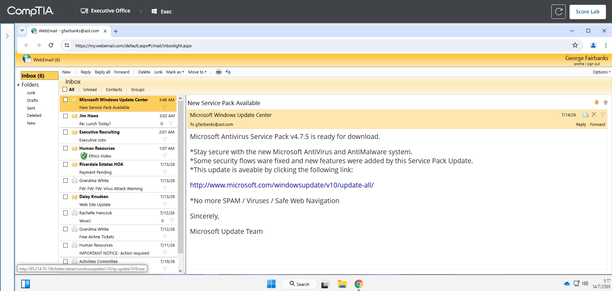

เหตุผลที่ต้องลบ เพราะอีเมล phishing มักใช้ชื่อบริษัทที่น่าเชื่อถือเพื่อหลอกให้ผู้ใช้กดลิงก์ ถ้ากดลิงก์อาจถูกพาไปเว็บปลอมหรือดาวน์โหลด malware ได้

### ขั้นตอนที่ 2: ตรวจสอบอีเมล Jim Haws

1. เลือกอีเมลจาก `Jim Haws`
2. ตรวจสอบหัวข้อ `Re: Lunch Today?`
3. ดูไฟล์แนบในอีเมล

อีเมลนี้เหมือนมาจากเพื่อนร่วมงาน แต่มีไฟล์แนบชื่อ `tpmreport.exe` ซึ่งเป็นไฟล์ executable และเนื้อหาไม่สอดคล้องกับการนัดกินข้าว จึงเป็น malicious attachment

ให้ลบอีเมลนี้

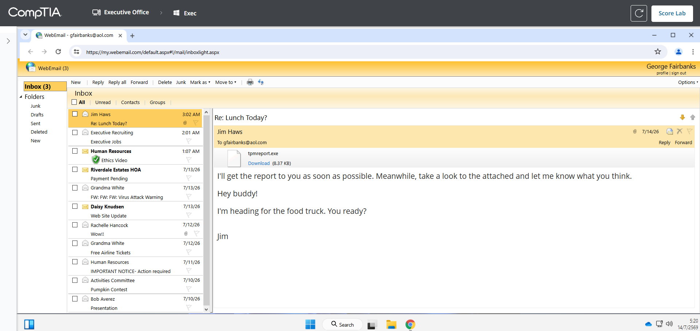

เหตุผลที่ต้องลบ เพราะไฟล์ `.exe` ในอีเมลอาจเป็น malware ได้ โดยเฉพาะเมื่อไฟล์นั้นไม่ใช่สิ่งที่เราคาดว่าจะได้รับ

### ขั้นตอนที่ 3: ตรวจสอบอีเมล Executive Recruiting

1. เลือกอีเมลจาก `Executive Recruiting`
2. อ่านหัวข้อ `Executive Jobs`
3. สังเกตว่าอีเมลเรียกชื่อผู้รับโดยตรงและพูดถึงตำแหน่งผู้บริหาร

อีเมลนี้เป็นการโจมตีแบบ whaling เพราะพยายามหลอกกลุ่มผู้บริหารหรือบุคคลสำคัญในองค์กรด้วยข้อเสนอที่ดูน่าสนใจ

ให้ลบอีเมลนี้

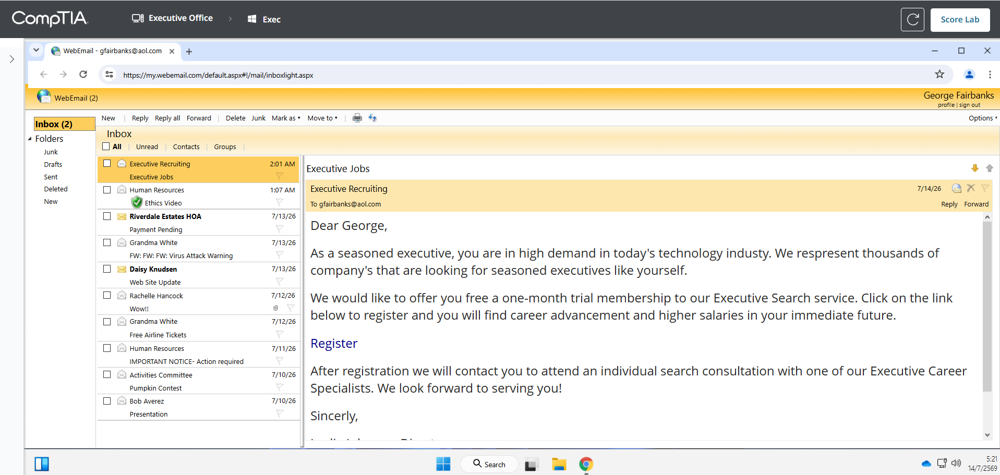

เหตุผลที่ต้องลบ เพราะ whaling มักออกแบบมาเฉพาะบุคคล ถ้าผู้บริหารกดลิงก์ อาจทำให้ข้อมูลระดับสูงขององค์กรถูกขโมยได้

### ขั้นตอนที่ 4: ตรวจสอบอีเมล Human Resources - Ethics Video

1. เลือกอีเมลจาก `Human Resources`
2. อ่านหัวข้อ `Ethics Video`
3. ตรวจสอบสัญลักษณ์ digital signature
4. ดูว่าอีเมลเป็นการแจ้งเตือนเรื่องงานภายในองค์กร

อีเมลนี้เป็นอีเมลปลอดภัย เพราะมี digital signature และเป็นอีเมลจากฝ่าย Human Resources

ให้เก็บอีเมลนี้ไว้ ไม่ต้องลบ

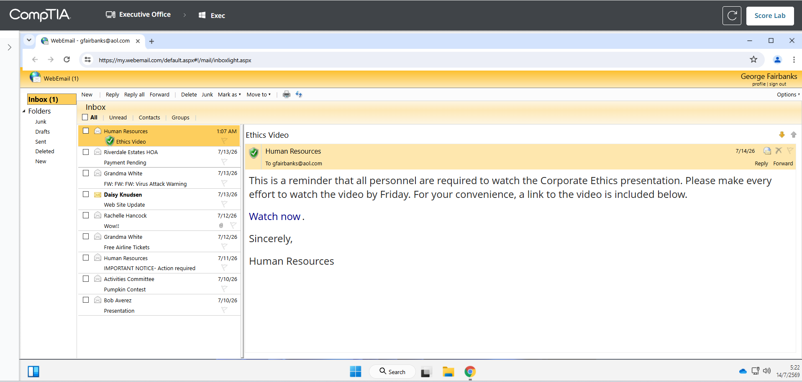

เหตุผลที่เก็บไว้ เพราะ digital signature ช่วยยืนยันว่าอีเมลมาจากผู้ส่งที่เชื่อถือได้ และเนื้อหาไม่มีพฤติกรรมหลอกให้เปิดไฟล์แนบแปลก ๆ

### ขั้นตอนที่ 5: ตรวจสอบอีเมล Riverdale Estates HOA

1. เลือกอีเมลจาก `Riverdale Estates HOA`
2. อ่านหัวข้อ `Payment Pending`
3. เอาเมาส์ชี้ที่ลิงก์ `Account Verification`
4. ดู URL จริงที่ status bar ด้านล่าง

อีเมลนี้พยายามหลอกให้ยืนยันข้อมูลบัญชี โดย URL จริงเป็น IP address แปลก ไม่ใช่เว็บไซต์ธนาคารหรือ credit union ที่น่าเชื่อถือ

ให้ลบอีเมลนี้

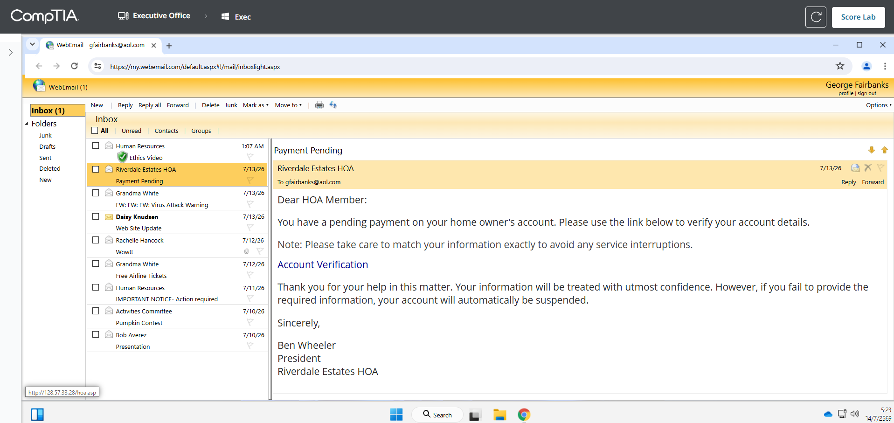

เหตุผลที่ต้องลบ เพราะอีเมลเกี่ยวกับเงินหรือบัญชีที่ให้กรอกข้อมูลผ่านลิงก์แปลก ๆ เป็นลักษณะสำคัญของ phishing

### ขั้นตอนที่ 6: ตรวจสอบอีเมล Grandma White - Virus Attack Warning

1. เลือกอีเมลจาก `Grandma White`
2. อ่านหัวข้อ `FW: FW: FW: Virus Attack Warning`
3. สังเกตข้อความที่ขอให้ forward ต่อไปยังทุกคน

อีเมลนี้เป็น hoax เพราะใช้ข้อความน่ากลัวและบอกให้ส่งต่อไปเรื่อย ๆ

ให้ลบอีเมลนี้

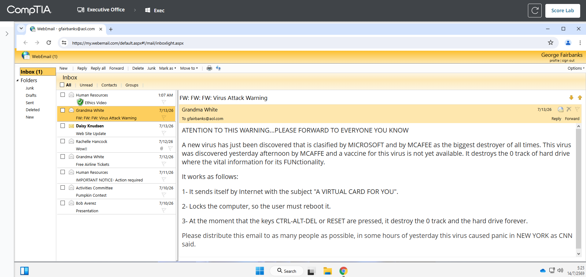

เหตุผลที่ต้องลบ เพราะอีเมลที่ขอให้ forward ต่อโดยไม่มีแหล่งอ้างอิงที่ชัดเจน มักเป็นข่าวลวงหรือ chain email

### ขั้นตอนที่ 7: ตรวจสอบอีเมล Daisy Knudsen

1. เลือกอีเมลจาก `Daisy Knudsen`
2. อ่านหัวข้อ `Web Site Update`
3. เอาเมาส์ชี้ที่ลิงก์ในอีเมล
4. ตรวจสอบ URL จริงด้านล่าง

อีเมลนี้เหมือนมาจากคนรู้จัก แต่ URL จริงไปที่ domain แปลกและเป็นไฟล์ `.exe` จึงเป็น spear phishing

ให้ลบอีเมลนี้

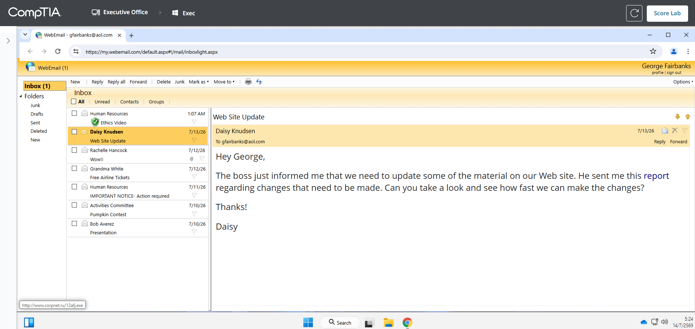

เหตุผลที่ต้องลบ เพราะ spear phishing มักปลอมเป็นคนในองค์กรเพื่อให้ผู้รับไว้ใจ และไฟล์ `.exe` จาก domain แปลกมีความเสี่ยงสูงมาก

### ขั้นตอนที่ 8: ตรวจสอบอีเมล Rachelle Hancock

1. เลือกอีเมลจาก `Rachelle Hancock`
2. อ่านหัวข้อ `Wow!!`
3. ตรวจสอบไฟล์แนบ `Amazing.jpg`
4. สังเกตคำขึ้นต้น `Dear Friend`

อีเมลนี้มาจากคนที่ไม่รู้จัก ใช้ข้อความชวนคลิก และมีไฟล์แนบที่ไม่คาดคิด จึงเป็น malicious attachment

ให้ลบอีเมลนี้

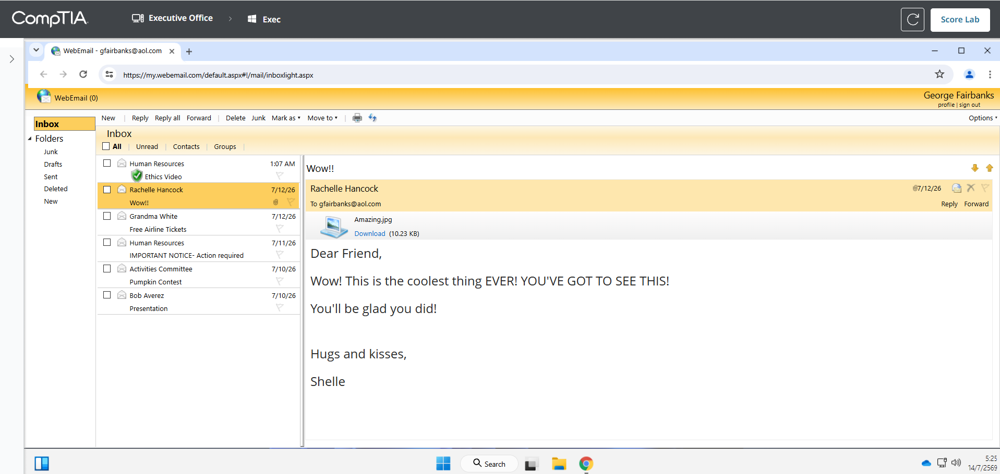

เหตุผลที่ต้องลบ เพราะไฟล์แนบจากคนไม่รู้จักมีความเสี่ยงสูง แม้ชื่อไฟล์จะดูเหมือนรูปภาพก็ตาม

### ขั้นตอนที่ 9: ตรวจสอบอีเมล Grandma White - Free Airline Tickets

1. เลือกอีเมลจาก `Grandma White`
2. อ่านหัวข้อ `Free Airline Tickets`
3. สังเกตเนื้อหาที่พูดถึงรางวัลและการส่งต่อ

อีเมลนี้เป็น hoax เพราะใช้รางวัลฟรีมาหลอกให้ผู้รับ forward ข้อความต่อ

ให้ลบอีเมลนี้

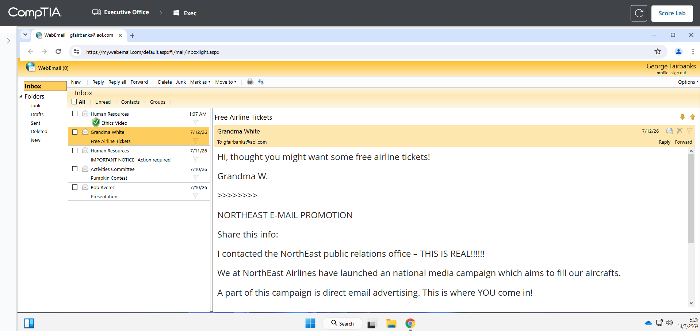

เหตุผลที่ต้องลบ เพราะอีเมลที่อ้างว่าจะได้รางวัลจากการส่งต่อมักเป็นข่าวลวง และไม่มีวิธีตรวจสอบได้จริงว่าใครส่งต่อไปแล้วกี่คน

### ขั้นตอนที่ 10: ตรวจสอบอีเมลปลอดภัยที่เหลือ

หลังจากลบอีเมลอันตรายแล้ว ให้ตรวจสอบว่าใน inbox เหลือเฉพาะอีเมลที่ปลอดภัย ได้แก่:

```text
Human Resources - Ethics Video
Human Resources - IMPORTANT NOTICE-Action required
Activities Committee - Pumpkin Contest
Bob Averez - Presentation
```

อีเมลเหล่านี้ไม่ต้องลบ เพราะไม่ได้มีพฤติกรรมหลอกให้กดลิงก์แปลก ๆ เปิดไฟล์แนบเสี่ยง หรือ forward ต่อ

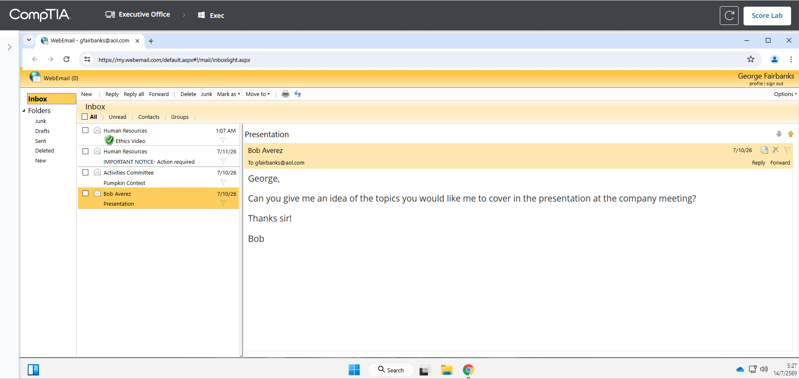

เหตุผลที่ต้องตรวจสอบซ้ำ เพราะ Lab ต้องการให้ลบเฉพาะอีเมลที่เป็น social engineering เท่านั้น ถ้าลบอีเมลปลอดภัยผิด อาจทำให้คะแนนไม่ผ่าน

### ขั้นตอนที่ 11: ตรวจคะแนน Lab

1. ตรวจสอบว่าอีเมลอันตรายถูกลบครบ
2. ตรวจสอบว่าอีเมลปลอดภัยยังอยู่ใน inbox
3. กด `Score Lab`
4. ตรวจสอบว่า required actions ผ่านทั้งหมด

ผลลัพธ์สุดท้าย:

```text
Score: 100%
Delete the Microsoft Windows Update Center phishing email: Completed
Delete the Jim Haws malicious attachment email: Completed
Delete the Executive Recruiting whaling email: Completed
Delete the Riverdale Estates HOA Online Banking phishing email: Completed
Delete the Grandma White forwarded email hoax: Completed
Delete the Daisy Knudsen spear phishing email: Completed
Delete the Rachelle Hancock malicious attachment email: Completed
Delete the Grandma White forwarded email hoax: Completed
```

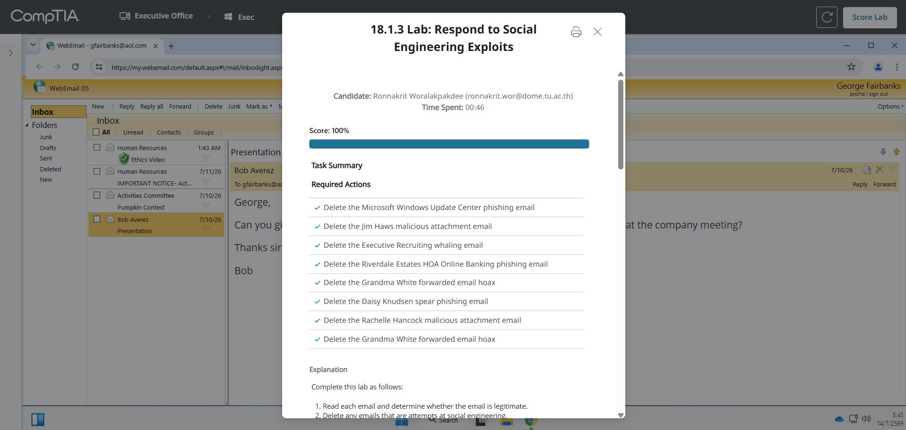

ภาพนี้แสดงผลคะแนน `Score: 100%` และ required actions ทั้งหมดผ่านครบ แปลว่าลบอีเมล social engineering ถูกต้องตามที่ Lab ต้องการ

## สรุปผล

ใน Lab นี้ได้ฝึกตรวจสอบอีเมลที่มีความเสี่ยงด้าน Social Engineering โดยใช้หลักการดูผู้ส่ง เนื้อหา ลิงก์จริง ไฟล์แนบ และพฤติกรรมของข้อความ อีเมลที่มีลักษณะ phishing, spear phishing, whaling, hoax และ malicious attachment ถูกลบออกทั้งหมด ส่วนอีเมลที่ปลอดภัยจาก Human Resources, Activities Committee และ Bob Averez ถูกเก็บไว้ตามโจทย์

หลังจากตรวจสอบและลบอีเมลครบแล้ว กด `Score Lab` และได้คะแนน 100%
