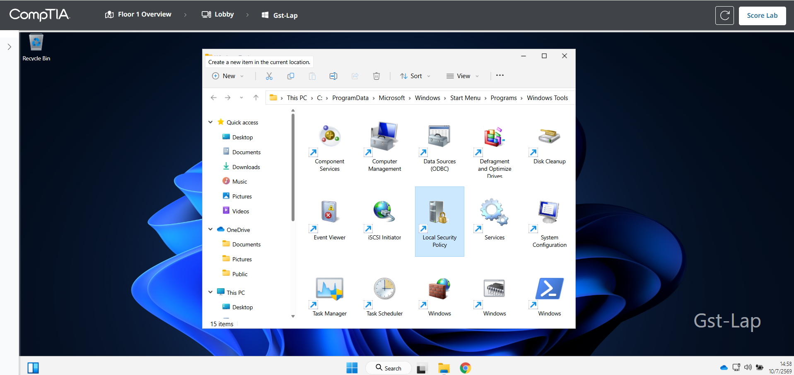
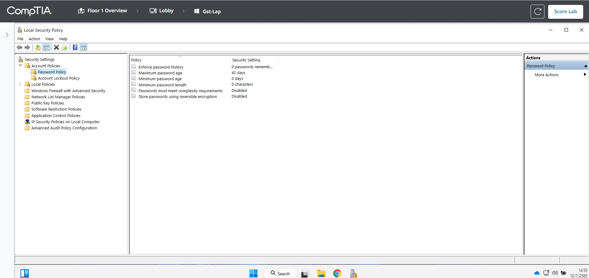
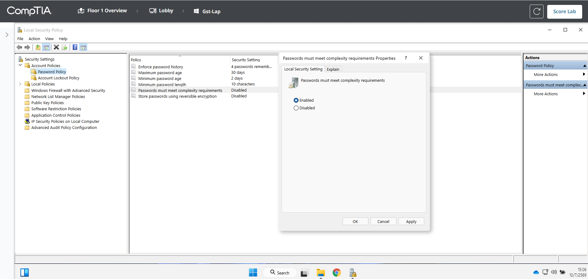
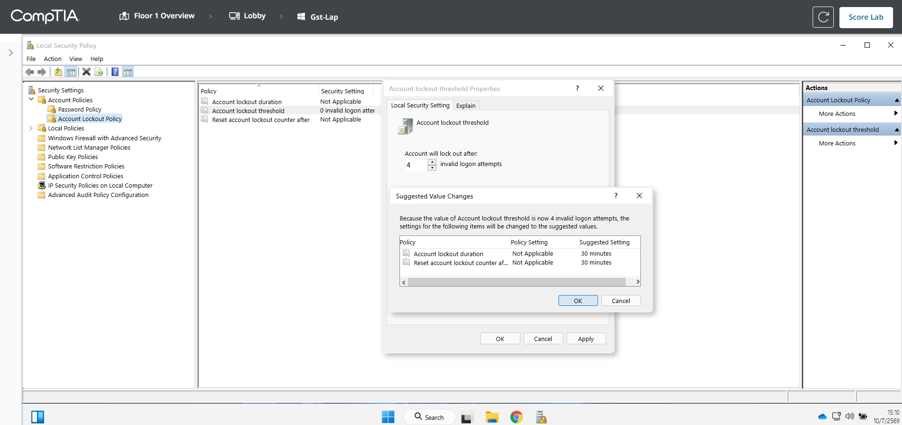
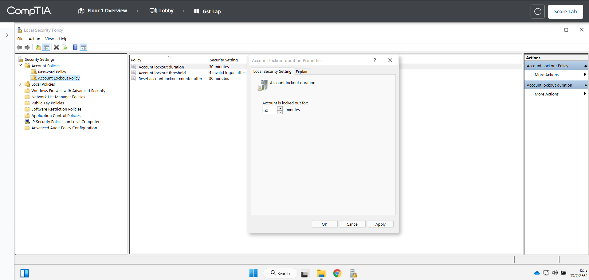
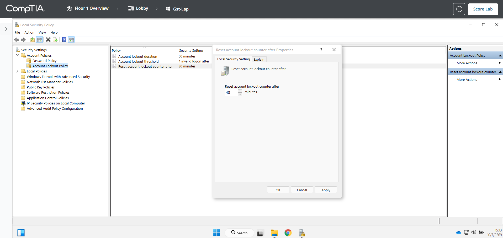
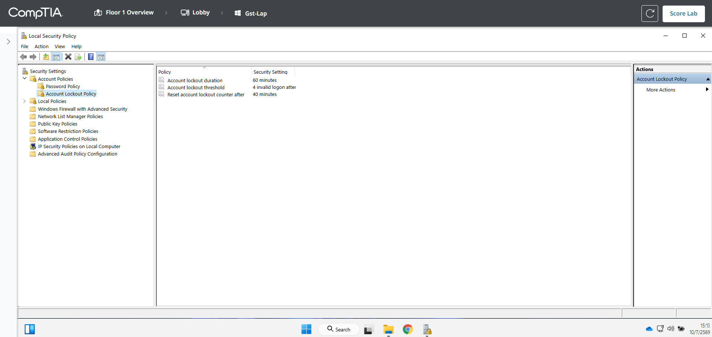
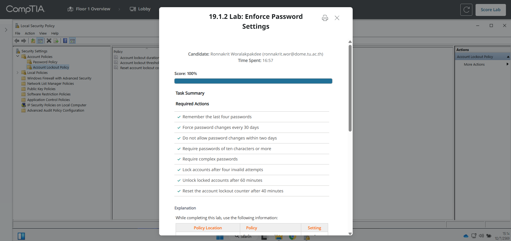

# 19.1.2 Lab: Enforce Password Settings

## ข้อมูลผู้ทำ Lab

- ชื่อ Lab: 19.1.2 Lab: Enforce Password Settings
- หัวข้อ: การตั้งค่า Local Security Policy เพื่อบังคับ password policy และ account lockout policy
- เครื่องที่ใช้งาน: Gst-Lap ใน Lobby
- เครื่องมือที่ใช้: Windows Tools และ Local Security Policy
- ผลลัพธ์สุดท้าย: ทำ Lab สำเร็จและได้คะแนน 100%

## ตอนนี้กำลังจะทำอะไร

ใน Lab นี้กำลังจะตั้งค่า security policy ภายในเครื่อง laptop ที่อยู่ใน Lobby เพื่อให้รหัสผ่านปลอดภัยขึ้น และลดความเสี่ยงจากการเดารหัสผ่านหลายครั้ง

เหตุผลที่ต้องทำแบบนี้ เพราะโจทย์บอกว่ามีพนักงานชั่วคราวหลายคนใช้ laptop เครื่องนี้ร่วมกัน ถ้าไม่มี policy ที่เข้มขึ้น ผู้ใช้สามารถตั้งรหัสผ่านง่าย ๆ ใช้รหัสเดิมซ้ำ หรือมีคนพยายามเดารหัสผิดหลายครั้งโดยบัญชีไม่ถูกล็อกได้

## วัตถุประสงค์

สิ่งที่ต้องตั้งค่าใน Lab นี้แบ่งเป็น 2 ส่วน:

1. Password Policy
2. Account Lockout Policy

โดยต้องตั้งค่าตามโจทย์ให้ครบทุกข้อ แล้วกด `Score Lab` เพื่อตรวจสอบผลลัพธ์

## ตารางค่าที่ต้องตั้ง

| Policy Location | Policy | Setting |
| --- | --- | --- |
| Account Policies/Password Policy | Enforce password history | 4 |
| Account Policies/Password Policy | Maximum password age | 30 |
| Account Policies/Password Policy | Minimum password age | 2 |
| Account Policies/Password Policy | Minimum password length | 10 |
| Account Policies/Password Policy | Passwords must meet complexity requirements | Enabled |
| Account Policies/Account Lockout Policy | Account lockout duration | 60 |
| Account Policies/Account Lockout Policy | Account lockout threshold | 4 |
| Account Policies/Account Lockout Policy | Reset account lockout counter after | 40 |

## วิธีคิดของ Lab นี้

Password Policy คือกฎที่ใช้ควบคุมคุณภาพและอายุของ password เช่น ต้องยาวเท่าไร ใช้ซ้ำได้ไหม ต้องซับซ้อนหรือไม่ และต้องเปลี่ยนทุกกี่วัน

Account Lockout Policy คือกฎที่ใช้ควบคุมการล็อกบัญชีเมื่อใส่ password ผิดหลายครั้ง ช่วยลดความเสี่ยงจากการ brute force หรือการเดารหัสผ่านซ้ำ ๆ

ใน Lab นี้ต้องตั้ง `Account lockout threshold` เป็น `4` เพราะโจทย์ต้องการให้บัญชีถูกล็อกหลังใส่รหัสผิด 4 ครั้ง จากนั้นต้องตั้ง `Account lockout duration` เป็น `60` นาที และตั้ง `Reset account lockout counter after` เป็น `40` นาที

จุดที่ต้องระวังคือ Windows อาจแสดงกล่อง `Suggested Value Changes` หลังตั้งค่า threshold ซึ่งจะเสนอค่า default เช่น 30 นาที แต่โจทย์ต้องการ `60` และ `40` ดังนั้นหลังจากกด `OK` ที่กล่อง suggested values แล้ว ต้องกลับไปแก้ค่าทั้งสองตัวให้ตรงกับโจทย์

## ขั้นตอนการทำ Lab

### ขั้นตอนที่ 1: เปิด Windows Tools

ไปที่เครื่อง `Gst-Lap` ใน Lobby

กด Start แล้วค้นหา:

```text
Windows Tools
```

จากนั้นเปิด `Windows Tools`

ในหน้าต่าง Windows Tools ให้หา `Local Security Policy`



เหตุผลที่ต้องเปิด Windows Tools เพราะโจทย์ระบุให้เข้าถึง `Local Security Policy` ผ่าน Windows Tools

### ขั้นตอนที่ 2: เปิด Local Security Policy และเข้า Password Policy

ดับเบิลคลิก `Local Security Policy`

จากนั้นไปที่เมนูด้านซ้าย:

```text
Security Settings > Account Policies > Password Policy
```

จะเห็นรายการ policy เกี่ยวกับรหัสผ่าน เช่น password history, password age, password length และ password complexity



เหตุผลที่ต้องเข้าหน้านี้ เพราะค่ารหัสผ่านทั้งหมดในโจทย์อยู่ภายใต้ `Password Policy`

### ขั้นตอนที่ 3: ตั้ง Enforce password history

ดับเบิลคลิก `Enforce password history`

ตั้งค่าเป็น:

```text
4 passwords remembered
```

แล้วกด `OK`


เหตุผลที่ตั้งเป็น 4 เพราะต้องป้องกันไม่ให้ผู้ใช้เอารหัสผ่าน 4 ครั้งล่าสุดกลับมาใช้ซ้ำ

### ขั้นตอนที่ 4: ตั้ง Maximum password age

ดับเบิลคลิก `Maximum password age`

ตั้งค่าเป็น:

```text
30 days
```

แล้วกด `OK`


เหตุผลที่ตั้งเป็น 30 วัน เพราะโจทย์ต้องการบังคับให้ผู้ใช้เปลี่ยน password ทุก 30 วัน หากใช้ password เดิมนานเกินไปจะเพิ่มความเสี่ยงถ้า password หลุด

### ขั้นตอนที่ 5: ตั้ง Minimum password age

ดับเบิลคลิก `Minimum password age`

ตั้งค่าเป็น:

```text
2 days
```

แล้วกด `OK`


เหตุผลที่ตั้งเป็น 2 วัน เพราะต้องกันไม่ให้ผู้ใช้เปลี่ยน password หลายครั้งติดกันเพื่อวนกลับไปใช้รหัสเดิม

### ขั้นตอนที่ 6: ตั้ง Minimum password length

ดับเบิลคลิก `Minimum password length`

ตั้งค่าเป็น:

```text
10 characters
```

แล้วกด `OK`


เหตุผลที่ตั้งเป็น 10 ตัวอักษร เพราะ password ที่ยาวขึ้นจะเดายากขึ้น และลดโอกาสถูกโจมตีด้วยการสุ่มรหัสผ่าน

### ขั้นตอนที่ 7: เปิด Password complexity

ดับเบิลคลิก `Passwords must meet complexity requirements`

เลือก `Enabled`

แล้วกด `OK`



เหตุผลที่เปิด complexity เพราะต้องบังคับให้ password มีความซับซ้อนมากขึ้น เช่น มีตัวพิมพ์ใหญ่ ตัวพิมพ์เล็ก ตัวเลข หรือสัญลักษณ์พิเศษ

### ขั้นตอนที่ 8: ตรวจสอบ Password Policy หลังตั้งค่า

หลังตั้งค่าเสร็จ ค่าในหน้า Password Policy ควรเป็นดังนี้:

```text
Enforce password history: 4 passwords remembered
Maximum password age: 30 days
Minimum password age: 2 days
Minimum password length: 10 characters
Passwords must meet complexity requirements: Enabled
```


เหตุผลที่ต้องตรวจสอบหน้านี้ เพราะเป็นจุดสรุปว่าตั้งค่าหมวด Password Policy ครบตรงตามโจทย์แล้ว

### ขั้นตอนที่ 9: เข้า Account Lockout Policy

จากเมนูด้านซ้าย ไปที่:

```text
Security Settings > Account Policies > Account Lockout Policy
```

หน้านี้ใช้ตั้งค่าว่าบัญชีจะถูกล็อกเมื่อใส่ password ผิดกี่ครั้ง และจะปลดล็อกเมื่อไร

### ขั้นตอนที่ 10: ตั้ง Account lockout threshold

ดับเบิลคลิก `Account lockout threshold`

ตั้งค่าเป็น:

```text
4 invalid logon attempts
```

แล้วกด `OK`


เหตุผลที่ตั้งเป็น 4 เพราะโจทย์ต้องการให้บัญชีถูกล็อกหลังจากใส่ password ผิด 4 ครั้ง

### ขั้นตอนที่ 11: กด OK ที่ Suggested Value Changes

หลังตั้ง `Account lockout threshold` อาจมีกล่อง `Suggested Value Changes` แสดงขึ้นมา

ให้กด `OK` ได้



เหตุผลที่กล่องนี้ขึ้นมา เพราะเมื่อเปิด account lockout threshold แล้ว Windows ต้องการกำหนดค่า lockout duration และ reset counter ให้สัมพันธ์กันก่อน แต่ค่า suggested ยังไม่ตรงกับโจทย์ทั้งหมด ดังนั้นต้องกลับไปแก้ค่าต่อในขั้นตอนถัดไป

### ขั้นตอนที่ 12: ตั้ง Account lockout duration

ดับเบิลคลิก `Account lockout duration`

ตั้งค่าเป็น:

```text
60 minutes
```

แล้วกด `OK`



เหตุผลที่ตั้งเป็น 60 นาที เพราะโจทย์ต้องการให้บัญชีที่ถูกล็อกปลดล็อกอัตโนมัติหลัง 1 ชั่วโมง

### ขั้นตอนที่ 13: ตั้ง Reset account lockout counter after

ดับเบิลคลิก `Reset account lockout counter after`

ตั้งค่าเป็น:

```text
40 minutes
```

แล้วกด `OK`



เหตุผลที่ตั้งเป็น 40 นาที เพราะถ้าผู้ใช้ใส่ password ผิดแต่ยังไม่ครบ 4 ครั้ง ระบบจะรีเซ็ตจำนวนครั้งที่ผิดกลับเป็น 0 หลังผ่านไป 40 นาที

### ขั้นตอนที่ 14: ตรวจสอบ Account Lockout Policy หลังตั้งค่า

ค่าควรเป็นดังนี้:

```text
Account lockout duration: 60 minutes
Account lockout threshold: 4 invalid logon attempts
Reset account lockout counter after: 40 minutes
```



เหตุผลที่ต้องตรวจสอบหน้านี้ เพราะค่า suggested value จาก Windows อาจไม่ตรงกับโจทย์ จึงต้องเช็กว่าแก้เป็น `60`, `4` และ `40` ครบแล้ว

### ขั้นตอนที่ 15: ตรวจคะแนนด้วย Score Lab

หลังตั้งค่าครบทั้ง Password Policy และ Account Lockout Policy ให้กด `Score Lab`

ผลลัพธ์ที่ได้คือ 100%



## สรุปผลลัพธ์

หลังทำ Lab เสร็จ เครื่อง `Gst-Lap` มี policy หลักดังนี้:

| หมวด | ผลลัพธ์ |
| --- | --- |
| Password reuse | จำ password เก่า 4 ครั้งล่าสุด เพื่อกันใช้ซ้ำ |
| Password age | ต้องเปลี่ยน password ทุก 30 วัน และเปลี่ยนซ้ำไม่ได้ภายใน 2 วัน |
| Password strength | password ต้องยาวอย่างน้อย 10 ตัวอักษร และต้องผ่าน complexity |
| Account lockout | ใส่ password ผิด 4 ครั้งจะถูกล็อก |
| Unlock behavior | บัญชีที่ล็อกจะปลดล็อกหลัง 60 นาที |
| Reset counter | จำนวนครั้งที่ใส่ผิดจะรีเซ็ตหลัง 40 นาที |

สรุปคือ Lab นี้สอนการตั้งค่า Local Security Policy เพื่อเพิ่มความปลอดภัยให้เครื่องที่มีผู้ใช้หลายคน โดยใช้ password policy เพื่อเพิ่มคุณภาพของรหัสผ่าน และใช้ account lockout policy เพื่อลดความเสี่ยงจากการเดารหัสผ่าน
