# 19.2.14 Applied Live Lab: Analyze Workstation Security Settings

## ข้อมูลผู้ทำ Lab

- ชื่อ Lab: 19.2.14 Applied Live Lab: Analyze Workstation Security Settings
- หัวข้อ: วิเคราะห์ malware และตรวจสอบ security settings ของ workstation
- เครื่องที่ใช้ใน Lab: `ADMIN` และ `LAPTOP`
- ผลลัพธ์สุดท้าย: ทำ Lab สำเร็จและได้คะแนน 100%

## ตอนนี้กำลังจะทำอะไร

ใน Lab นี้กำลังจะใช้เครื่องมือด้านความปลอดภัยของ Windows เพื่อตรวจสอบ 2 เรื่องหลัก คือ

1. ตรวจสอบ malware จากแผ่น DVD ที่ถูกสงสัยว่ามีไฟล์อันตราย
2. วิเคราะห์ security settings ของเครื่อง `LAPTOP` ว่าตั้งค่าปลอดภัยตามที่ควรเป็นหรือไม่

เหตุผลที่ต้องทำแบบนี้ เพราะงานจริงของ IT technician ไม่ได้มีแค่แก้เครื่องให้ใช้งานได้ แต่ต้องตรวจสอบด้วยว่าเครื่องมีความเสี่ยงด้านความปลอดภัยตรงไหนบ้าง เช่น malware, firewall, antivirus, UAC, BitLocker, screen lock และ account password

## วัตถุประสงค์

วัตถุประสงค์ของ Lab นี้คือการใช้เครื่องมือที่เหมาะสมในการตรวจหา threat และตรวจสอบ workstation security settings แล้วนำข้อมูลที่พบไปกรอกใน incident report และ security report ให้ถูกต้อง

สิ่งที่ต้องทำมีดังนี้:

1. โหลด DVD ชื่อ `ANGEL-DVD` บนเครื่อง `ADMIN`
2. ตรวจสอบไฟล์ `msfpatcher` ว่าเป็น malware หรือไม่
3. ตอบ incident report เกี่ยวกับ malware
4. เข้าเครื่อง `LAPTOP` ด้วยบัญชี `Sam`
5. ตรวจสอบ security settings ของเครื่อง `LAPTOP`
6. ตอบ security report ให้ครบ
7. Evaluate และตรวจสอบผลคะแนน

## บัญชีที่ใช้ใน Lab

| เครื่อง | User | Password |
| --- | --- | --- |
| ADMIN | Bobby | Pa55w0rd! |
| LAPTOP | Sam | Pa55w0rd! |

## คำตอบที่ใช้กรอกใน Report

### Task 1: Validate Malware Detection

| คำถาม | คำตอบ |
| --- | --- |
| What type of malware was identified? | Trojan |
| Why was full quarantine not possible? | Malware stored on non-writable media |
| Was execution of the infected file possible? | No |
| Was the infected file autorun? | No |
| Are all anti-malware components enabled? | No |

### Task 2: Analyze Security Settings

| คำถาม | คำตอบ |
| --- | --- |
| All user accounts password-protected | No |
| Automatic screen lock at 15 minutes or less | Yes |
| UAC set to default level | No |
| BitLocker encryption enabled on system drive | No |
| Windows Security Virus & threat protection all features enabled | Yes |
| Identify any folders or files excluded from malware scanning | 0 |
| Windows Security Firewall & network protection enabled for all profiles | Yes |
| Identify any non-standard firewall exceptions | Mc |

## ข้อควรรู้ก่อนเริ่ม

Lab นี้เป็น Applied Live Lab ดังนั้นระบบจะเหมือนเครื่องจริงมากกว่า Lab แบบ simulation ทั่วไป และมีปุ่ม `Evaluate` สำหรับตรวจคำตอบของแต่ละ task

ถ้าต้องการคะแนนเต็ม ควรทำตาม flow ให้ครบก่อนกด `Evaluate` และไม่ควรกดใช้ hints เพราะระบบจะตรวจว่ามีการใช้ hint หรือ retry หรือไม่

## ขั้นตอนการทำ Lab

### ขั้นตอนที่ 1: โหลดแผ่น DVD ที่ต้องตรวจสอบ

1. เข้าเครื่อง `ADMIN`
2. ไปที่แท็บ `Resources`
3. ที่ช่อง `DVD Drive` เลือก `ANGEL-DVD`
4. รอให้ Windows แสดง AutoPlay notification

เหตุผลที่ต้องเลือก `ANGEL-DVD` เพราะโจทย์แจ้งว่ามี DVD media ที่อาจมี malware และต้องให้เราตรวจสอบว่าเหตุการณ์นี้เป็นจริงหรือไม่

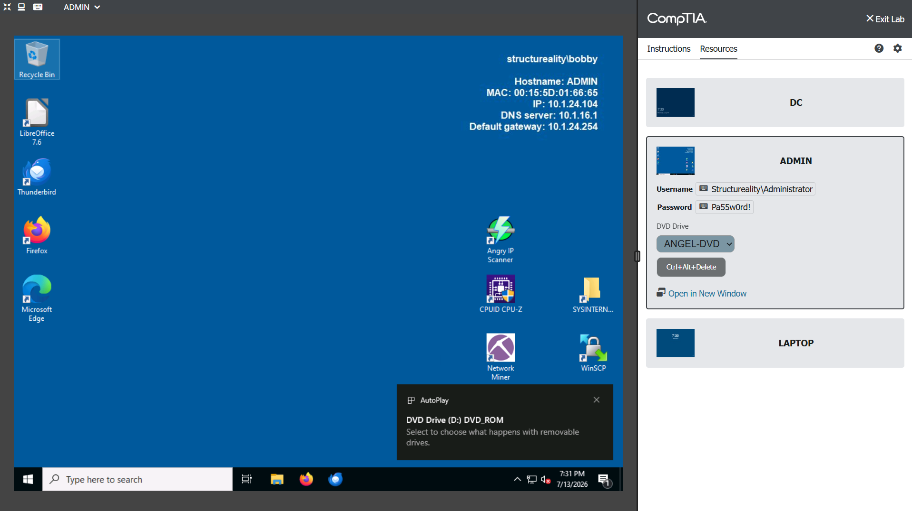

### ขั้นตอนที่ 2: เปิดไฟล์ใน DVD

1. คลิก AutoPlay notification
2. เลือก `Open folder to view files`

เหตุผลที่เลือกเปิดโฟลเดอร์ คือเราต้องดูว่าใน DVD มีไฟล์อะไรอยู่ และต้องตรวจสอบไฟล์ที่น่าสงสัยจากแหล่งที่มาโดยตรง

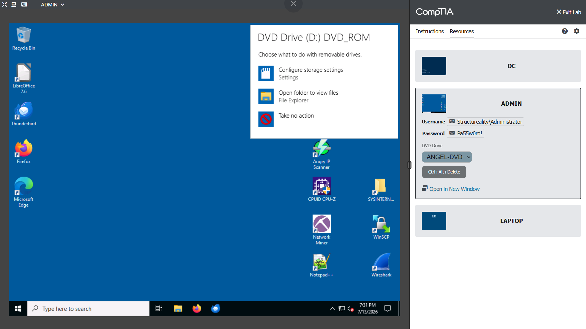

### ขั้นตอนที่ 3: ตรวจสอบไฟล์ที่อยู่ใน DVD

1. ใน File Explorer จะเปิดไปที่ DVD drive
2. ตรวจสอบไฟล์ที่อยู่ในแผ่น
3. จะพบไฟล์ application ชื่อ `msfpatcher`

ไฟล์นี้เป็นไฟล์ที่ต้องทดสอบ เพราะโจทย์ให้ตรวจสอบว่ามี malware ใน DVD หรือไม่ และไฟล์ application เป็นไฟล์ที่มีความเสี่ยงสูงกว่าไฟล์เอกสารทั่วไป

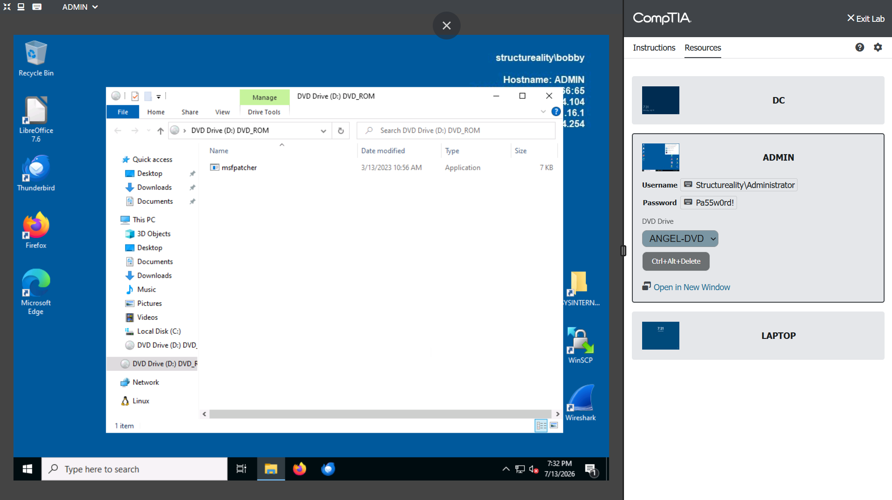

### ขั้นตอนที่ 4: ทดสอบว่าไฟล์ msfpatcher รันได้หรือไม่

1. ลองเปิดไฟล์ `msfpatcher`
2. Windows จะแสดง error ว่าไม่สามารถทำงานได้ เพราะไฟล์มี virus หรือ potentially unwanted software
3. จะมี Windows Security notification แจ้งว่าเจอ threat

จากจุดนี้สรุปได้ว่า execution ของไฟล์ไม่สำเร็จ ดังนั้นคำตอบของข้อ `Was execution of the infected file possible?` คือ `No`

เหตุผลที่ตอบ `No` เพราะ Windows Defender บล็อกไฟล์ก่อนที่จะรันสำเร็จ

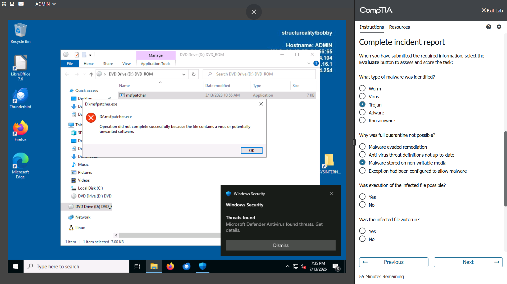

### ขั้นตอนที่ 5: ตรวจชนิดของ malware ใน Windows Security

1. เปิด `Windows Security`
2. ไปที่ `Virus & threat protection`
3. ดูรายละเอียด threat ที่ตรวจพบ
4. พบชื่อ threat เป็น `Trojan:Win64/Meterpreter!pz`

จากข้อมูลนี้คำตอบของข้อ `What type of malware was identified?` คือ `Trojan`

เหตุผลที่ตอบ `Trojan` เพราะ Windows Security ระบุชื่อ threat ขึ้นต้นด้วย `Trojan`

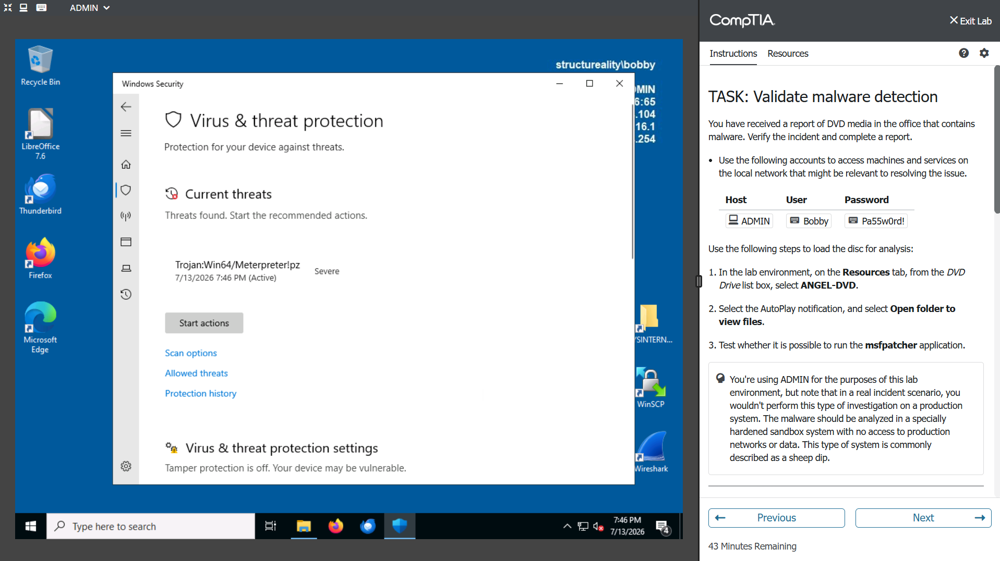

### ขั้นตอนที่ 6: ตรวจว่า quarantine ทำได้สมบูรณ์หรือไม่ และ anti-malware ครบหรือไม่

1. ตรวจสอบสถานะของ Windows Security บนเครื่อง `ADMIN`
2. ดูส่วน `Virus & threat protection settings`
3. พบว่า `Tamper Protection` เป็น `Off`
4. ไฟล์ malware อยู่บน DVD ซึ่งเป็น non-writable media

ดังนั้นคำตอบที่เกี่ยวข้องคือ:

```text
Why was full quarantine not possible?
Malware stored on non-writable media

Are all anti-malware components enabled?
No
```

เหตุผลที่ quarantine ไม่สมบูรณ์ เพราะไฟล์อยู่บนแผ่น DVD ซึ่งไม่สามารถเขียนทับหรือแก้ไขไฟล์บน media ได้เหมือน hard drive ปกติ

เหตุผลที่ตอบ anti-malware components เป็น `No` เพราะ `Tamper Protection` ถูกปิดอยู่ จึงถือว่าส่วนประกอบด้าน anti-malware ไม่ได้เปิดครบทั้งหมด

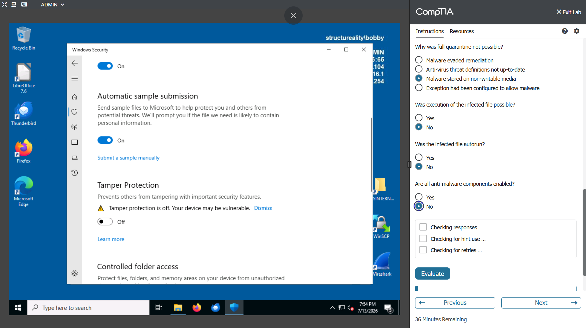

### ขั้นตอนที่ 7: กรอกและ Evaluate incident report

ใน incident report ให้กรอกคำตอบดังนี้:

```text
What type of malware was identified?
Trojan

Why was full quarantine not possible?
Malware stored on non-writable media

Was execution of the infected file possible?
No

Was the infected file autorun?
No

Are all anti-malware components enabled?
No
```

เหตุผลที่ตอบ autorun เป็น `No` เพราะไฟล์ไม่ได้รันเองอัตโนมัติจาก DVD แต่เกิดจากการที่เราลองเปิดไฟล์เอง และ Windows Defender บล็อกไว้

หลังกรอกครบให้กด `Evaluate` เพื่อตรวจ Task 1

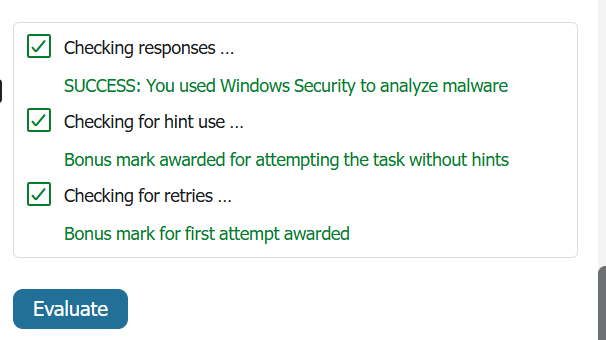

### ขั้นตอนที่ 8: เข้าเครื่อง LAPTOP และตรวจบัญชีผู้ใช้

1. เข้าเครื่อง `LAPTOP`
2. Login ด้วยบัญชี `Sam`
3. เปิด Command Prompt
4. ใช้คำสั่ง:

```cmd
net user sam
```

5. ตรวจบรรทัด `Password required`
6. พบว่าเป็น `No`

ดังนั้นคำตอบของข้อ `All user accounts password-protected` คือ `No`

เหตุผลที่ตอบ `No` เพราะบัญชี `Sam` ไม่ได้ require password ทำให้เครื่องมีความเสี่ยงหากมีคนเข้าถึงเครื่องได้

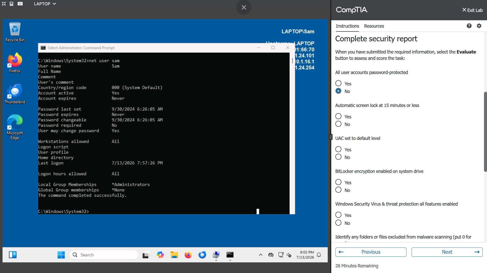

### ขั้นตอนที่ 9: ตรวจ Automatic Screen Lock

1. เปิด `Screen Saver Settings`
2. ตรวจค่า `Wait`
3. ตรวจว่ามีการติ๊ก `On resume, display logon screen` หรือไม่
4. พบว่า `Wait` ตั้งไว้ `1 minutes` และมีการติ๊กให้กลับมาต้อง logon

ดังนั้นคำตอบของข้อ `Automatic screen lock at 15 minutes or less` คือ `Yes`

เหตุผลที่ตอบ `Yes` เพราะเครื่องตั้งให้ lock ภายใน 1 นาที ซึ่งน้อยกว่า 15 นาทีตามเงื่อนไขของ report

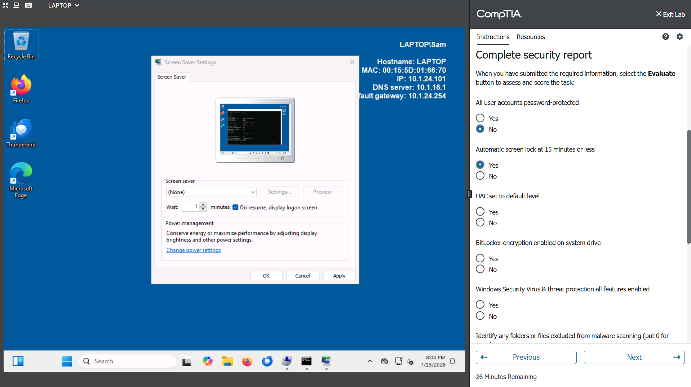

### ขั้นตอนที่ 10: ตรวจระดับ UAC

1. เปิด `Change User Account Control settings`
2. ตรวจตำแหน่ง slider
3. พบว่า slider อยู่ล่างสุดที่ `Never notify`

ดังนั้นคำตอบของข้อ `UAC set to default level` คือ `No`

เหตุผลที่ตอบ `No` เพราะค่า default ของ UAC ไม่ใช่ `Never notify` การตั้งแบบนี้ทำให้ระบบแจ้งเตือนน้อยเกินไปเมื่อต้องมีการเปลี่ยนแปลงสำคัญในเครื่อง

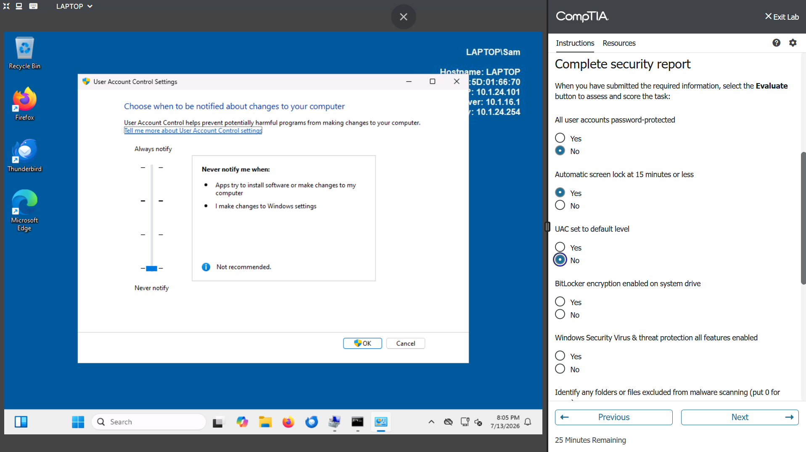

### ขั้นตอนที่ 11: ตรวจ BitLocker

1. เปิด `BitLocker Drive Encryption`
2. ตรวจ system drive หรือไดรฟ์ `C:`
3. พบว่า `BitLocker off`

ดังนั้นคำตอบของข้อ `BitLocker encryption enabled on system drive` คือ `No`

เหตุผลที่ตอบ `No` เพราะไดรฟ์ระบบยังไม่ได้เปิด encryption ถ้าเครื่องหายหรือถูกขโมย ข้อมูลใน drive อาจถูกเข้าถึงได้ง่ายกว่าเครื่องที่เปิด BitLocker

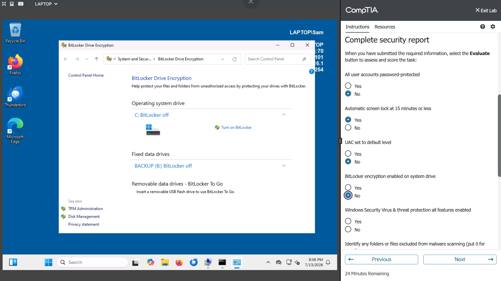

### ขั้นตอนที่ 12: ตรวจ Virus & Threat Protection ของ LAPTOP

1. เปิด `Windows Security`
2. ไปที่ `Virus & threat protection`
3. เลือก `Manage settings`
4. ตรวจว่า feature หลักเปิดอยู่หรือไม่ เช่น
   - Real-time protection
   - Cloud-delivered protection
   - Automatic sample submission
   - Tamper Protection

จากภาพพบว่า feature เหล่านี้เปิดอยู่ โดยเฉพาะ `Tamper Protection` เป็น `On`

ดังนั้นคำตอบของข้อ `Windows Security Virus & threat protection all features enabled` คือ `Yes`

เหตุผลที่ตอบ `Yes` เพราะบนเครื่อง `LAPTOP` ส่วนประกอบหลักของ Virus & threat protection เปิดใช้งานครบ

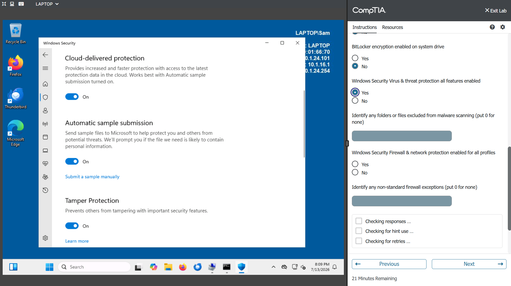

### ขั้นตอนที่ 13: ตรวจ Exclusions ของ malware scanning

1. ใน `Virus & threat protection settings`
2. ไปที่หัวข้อ `Exclusions`
3. เลือก `Add or remove exclusions`
4. ตรวจว่ามีรายการ exclusion หรือไม่
5. พบว่าไม่มีรายการ exclusion

ดังนั้นช่อง `Identify any folders or files excluded from malware scanning` ให้กรอก:

```text
0
```

เหตุผลที่กรอก `0` เพราะไม่มี folder หรือ file ที่ถูกยกเว้นจากการสแกน malware

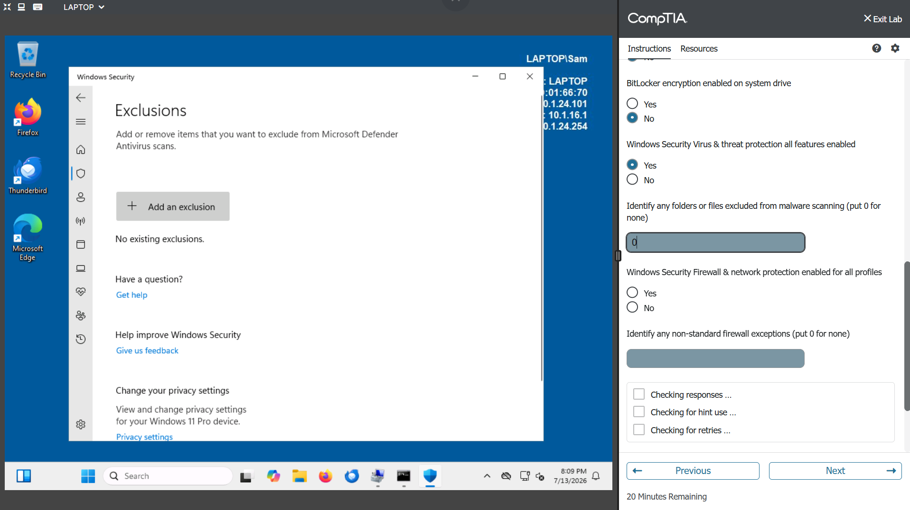

### ขั้นตอนที่ 14: ตรวจ Firewall ทุก profile

1. เปิด `Windows Security`
2. ไปที่ `Firewall & network protection`
3. ตรวจสถานะของทั้ง 3 profile:
   - Domain network
   - Private network
   - Public network
4. พบว่าทุก profile แสดงว่า `Firewall is on`

ดังนั้นคำตอบของข้อ `Windows Security Firewall & network protection enabled for all profiles` คือ `Yes`

เหตุผลที่ตอบ `Yes` เพราะ firewall เปิดครบทั้ง Domain, Private และ Public profile

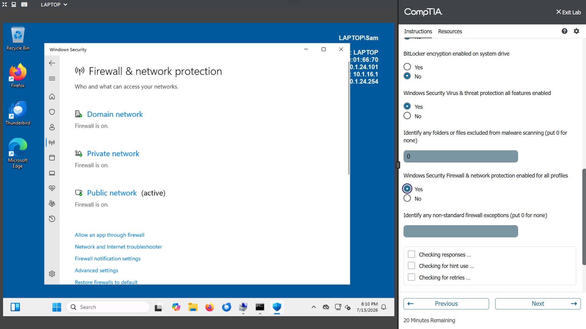

### ขั้นตอนที่ 15: ตรวจ non-standard firewall exceptions

1. จากหน้า `Firewall & network protection`
2. เลือก `Allow an app through firewall`
3. ดูรายการ allowed apps
4. พบ exception ที่ไม่ใช่รายการมาตรฐานชื่อ `Mc`

ดังนั้นช่อง `Identify any non-standard firewall exceptions` ให้กรอก:

```text
Mc
```

เหตุผลที่ต้องกรอก `Mc` เพราะในหน้าต่าง `Allowed apps` มีรายการชื่อ `Mc` แสดงอยู่จริง และช่องคำถามต้องการให้ระบุชื่อ firewall exception ที่ไม่ใช่รายการมาตรฐาน ดังนั้นต้องกรอกชื่อตามที่เห็นในรายการ ไม่ได้แปลหรือเดาชื่อใหม่

สาเหตุที่ `Mc` ถูกมองว่าไม่ใช่รายการมาตรฐาน เพราะชื่อสั้นและไม่สื่อความหมายชัดเจนว่าเป็นโปรแกรมหรือบริการอะไร ต่างจากรายการปกติที่มักมีชื่อ vendor หรือชื่อ feature ชัดเจน เช่น Windows service, Remote Assistance หรือ File and Printer Sharing อีกทั้ง `Mc` ไม่ได้เป็นชื่อ component มาตรฐานของ Windows ที่ควรถูกอนุญาตผ่าน firewall โดยอัตโนมัติ จึงถือว่าเป็น exception ที่น่าสงสัยและต้องรายงานในช่อง non-standard firewall exceptions

ในมุม security การอนุญาต app ที่ไม่รู้ที่มาให้ผ่าน firewall อาจเพิ่ม attack surface ของเครื่องได้ เพราะโปรแกรมนั้นอาจรับหรือส่ง traffic ผ่าน network ได้โดยไม่จำเป็น ดังนั้น Lab จึงให้เราระบุ `Mc` เป็นรายการผิดปกติที่ควรถูกตรวจสอบเพิ่มเติม

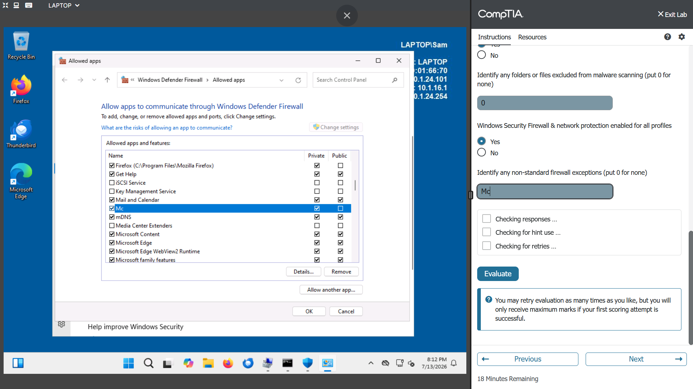

### ขั้นตอนที่ 16: กรอกและ Evaluate security report

ใน security report ให้กรอกคำตอบดังนี้:

```text
All user accounts password-protected: No
Automatic screen lock at 15 minutes or less: Yes
UAC set to default level: No
BitLocker encryption enabled on system drive: No
Windows Security Virus & threat protection all features enabled: Yes
Identify any folders or files excluded from malware scanning: 0
Windows Security Firewall & network protection enabled for all profiles: Yes
Identify any non-standard firewall exceptions: Mc
```

หลังกรอกครบให้กด `Evaluate`

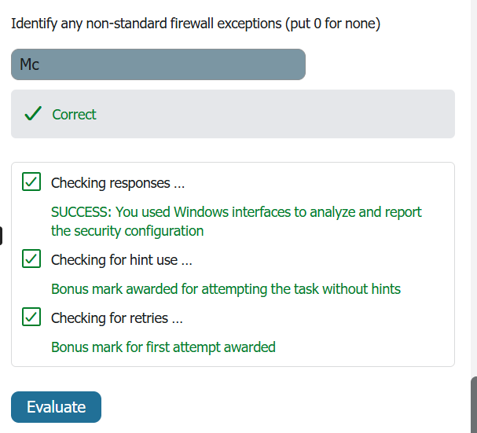

### ขั้นตอนที่ 17: ตรวจผลคะแนน Lab

หลังจากทำครบทั้ง 2 task ให้ตรวจสอบผลคะแนนรวมของ Lab

ผลลัพธ์ที่ถูกต้องคือได้คะแนนเต็ม และ task ต่าง ๆ ผ่านทั้งหมด

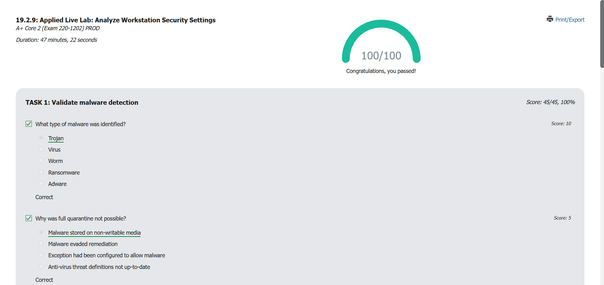

หมายเหตุ: ในหน้าคะแนนของแพลตฟอร์มอาจแสดงเลข Lab เป็น `19.2.9` แต่เป็น Applied Live Lab หัวข้อเดียวกันเกี่ยวกับการวิเคราะห์ workstation security settings

## สรุปผลลัพธ์

Lab นี้ทำสำเร็จและได้คะแนน 100%

สิ่งที่ได้ทำสำเร็จ:

```text
Validate malware detection: Completed
Analyze security settings: Completed
```

สิ่งที่ได้เรียนรู้จาก Lab นี้:

1. วิธีตรวจ malware จาก removable/non-writable media
2. วิธีอ่านชื่อ threat จาก Windows Security เพื่อแยกประเภท malware
3. เหตุผลที่บางกรณี quarantine malware ได้ไม่สมบูรณ์
4. วิธีตรวจว่า anti-malware components เปิดครบหรือไม่
5. วิธีใช้ `net user` ตรวจว่าบัญชี require password หรือไม่
6. วิธีตรวจ screen lock, UAC, BitLocker, Defender, exclusions และ firewall
7. วิธีระบุ non-standard firewall exception ที่อาจเป็นความเสี่ยง

โดยรวม Lab นี้เน้นให้มอง security แบบ defense in depth คือไม่ดูแค่ antivirus อย่างเดียว แต่ต้องดูหลายชั้นพร้อมกัน เพราะความปลอดภัยของเครื่องขึ้นอยู่กับการตั้งค่าหลายส่วนประกอบกัน
