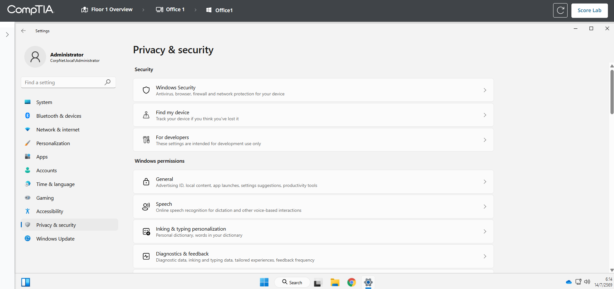
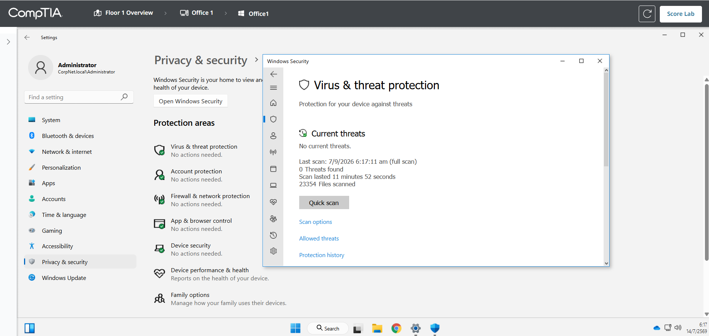
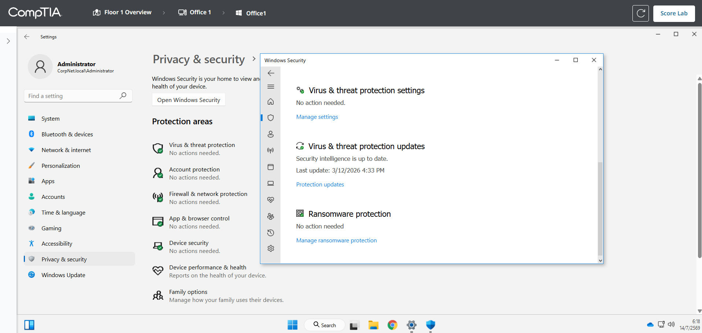
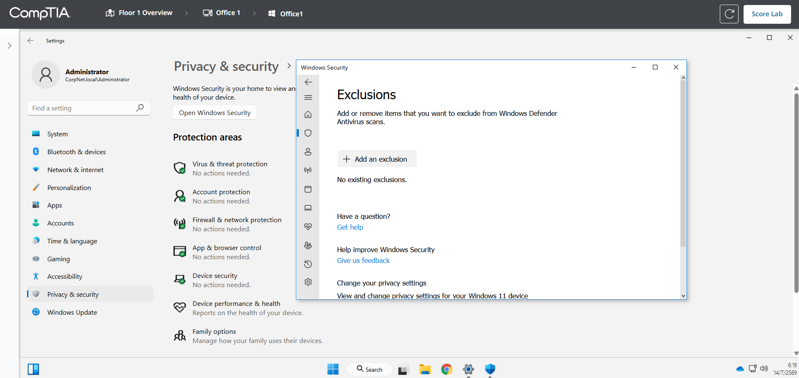
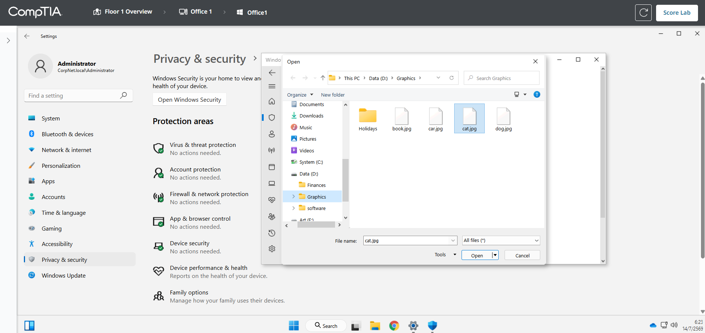
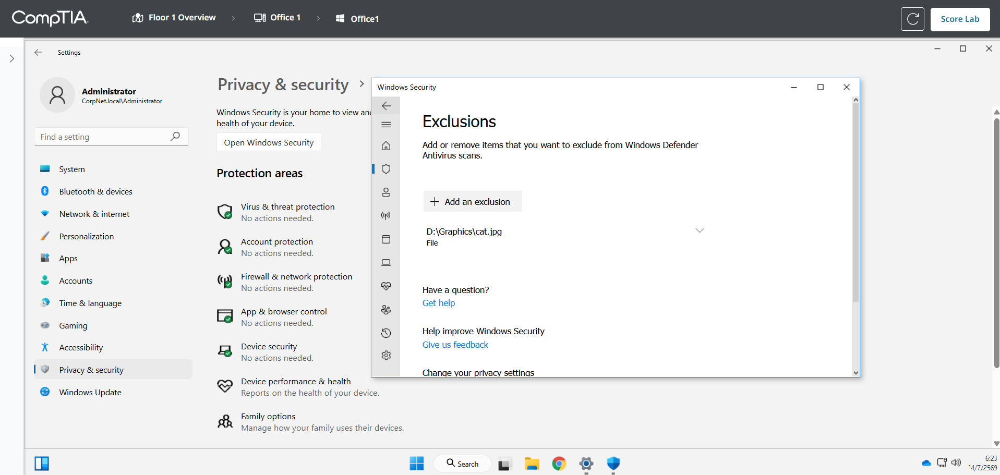
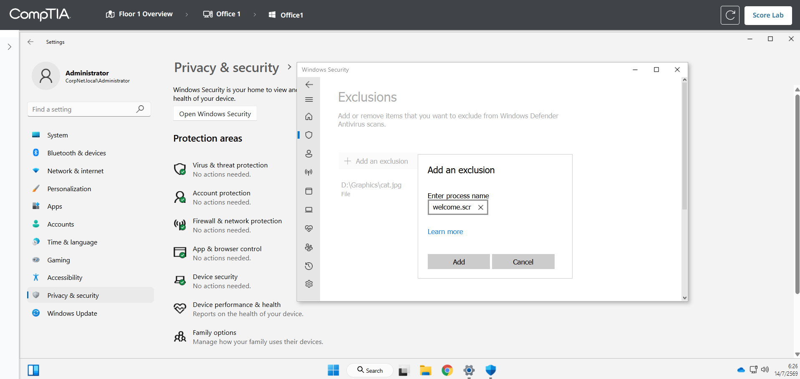
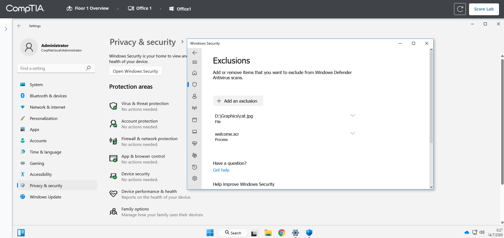
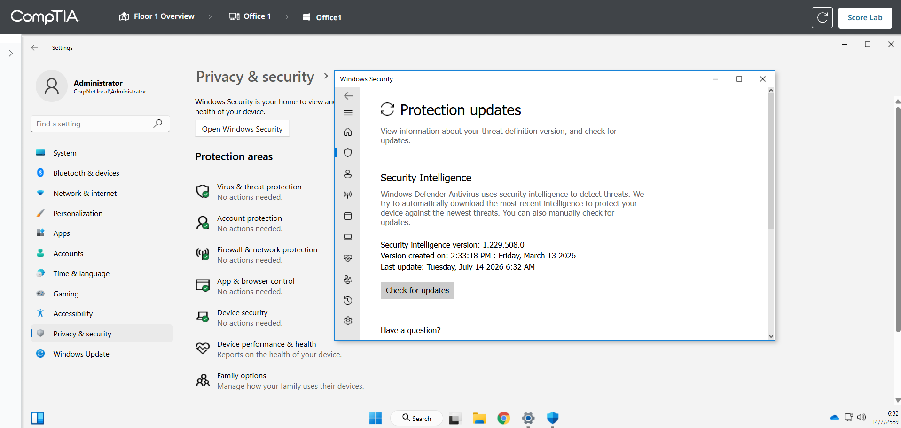
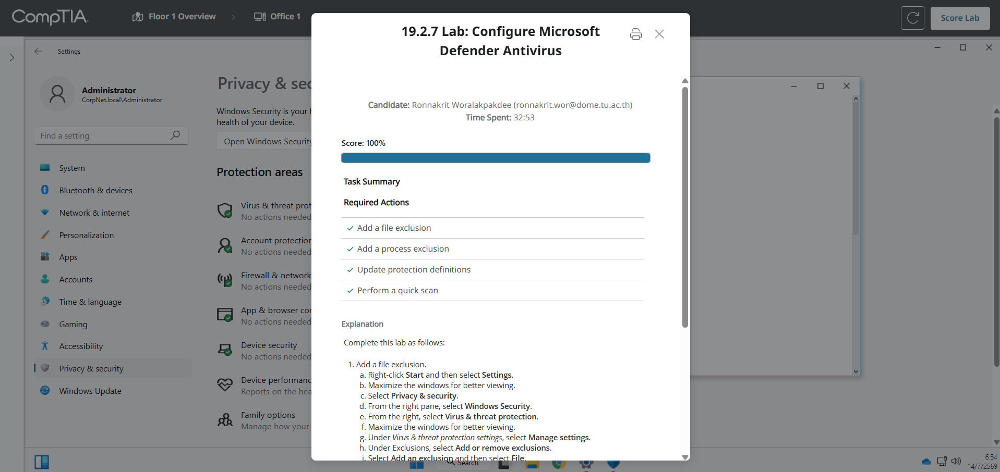

# 19.2.7 Lab: Configure Microsoft Defender Antivirus

## ข้อมูลผู้ทำ Lab

- ชื่อ Lab: 19.2.7 Lab: Configure Microsoft Defender Antivirus
- หัวข้อ: การตั้งค่า Microsoft Defender Antivirus ผ่าน Windows Security
- เครื่องที่ใช้งาน: Office 1
- ผลลัพธ์สุดท้าย: ทำ Lab สำเร็จและได้คะแนน 100%

## ตอนนี้กำลังจะทำอะไร

ใน Lab นี้กำลังจะตั้งค่า Microsoft Defender Antivirus เพื่อป้องกันเครื่องจาก malware โดยทำ 4 งานหลัก คือเพิ่ม file exclusion, เพิ่ม process exclusion, อัปเดต protection definitions และสั่ง quick scan

เหตุผลที่ต้องทำแบบนี้ เพราะ Microsoft Defender ใช้ตรวจจับ malware และภัยคุกคามในเครื่อง แต่บางครั้งผู้ดูแลระบบอาจต้องยกเว้นบางไฟล์หรือบาง process ที่รู้ว่าปลอดภัย เพื่อไม่ให้ Defender ตรวจซ้ำหรือ block การทำงานผิดพลาด จากนั้นต้องอัปเดตฐานข้อมูลไวรัสและสแกนเครื่องเพื่อยืนยันว่าระบบยังปลอดภัย

## วัตถุประสงค์

วัตถุประสงค์ของ Lab นี้คือการตั้งค่า Microsoft Defender Antivirus ให้ตรงตามโจทย์ โดยใช้เมนู `Virus & threat protection` ใน Windows Security

สิ่งที่ต้องทำมีดังนี้:

1. เพิ่ม file exclusion สำหรับ `D:\Graphics\cat.jpg`
2. เพิ่ม process exclusion สำหรับ `welcome.scr`
3. Update protection definitions
4. Perform a quick scan
5. ตรวจสอบผลลัพธ์ด้วย `Score Lab`

## ตารางค่าที่ใช้ตั้งค่า

| รายการ | ค่าที่ต้องตั้ง | ความหมาย |
| --- | --- | --- |
| File exclusion | `D:\Graphics\cat.jpg` | ยกเว้นไฟล์นี้ไม่ให้ Defender scan |
| Process exclusion | `welcome.scr` | ยกเว้น process ชื่อนี้ไม่ให้ Defender ตรวจตอนทำงาน |
| Protection definitions | Check for updates | อัปเดตฐานข้อมูลตรวจจับ malware |
| Scan type | Quick scan | สแกนพื้นที่สำคัญของระบบอย่างรวดเร็ว |

## คำอธิบายก่อนเริ่ม

`Exclusion` คือรายการที่ Microsoft Defender จะไม่ตรวจสอบตามที่เรากำหนด มีได้หลายประเภท เช่น file, folder, file type และ process

ใน Lab นี้ใช้ 2 ประเภท:

- `File exclusion` คือยกเว้นไฟล์เฉพาะไฟล์เดียว
- `Process exclusion` คือยกเว้น process ตามชื่อไฟล์ที่กำลังทำงาน

ข้อควรระวังคือในงานจริงไม่ควรเพิ่ม exclusion โดยไม่จำเป็น เพราะอาจทำให้ malware หลบการตรวจจับได้ แต่ใน Lab นี้โจทย์กำหนดชัดเจนว่าต้องเพิ่ม exclusion ทั้ง 2 รายการ

## ขั้นตอนการทำ Lab

### ขั้นตอนที่ 1: เปิด Settings

1. คลิกขวาที่ปุ่ม `Start`
2. เลือก `Settings`
3. ถ้าหน้าต่างเล็ก ให้ maximize หน้าต่างเพื่อให้เห็นเมนูครบ

เหตุผลที่ต้องเริ่มจาก Settings เพราะ Windows Security อยู่ภายใต้หมวด `Privacy & security` และเป็นช่องทางหลักสำหรับเข้าไปตั้งค่า Microsoft Defender Antivirus

ควรถ่ายรูปตรงนี้: หน้า `Settings` หรือหน้า `Privacy & security` ก่อนเข้า Windows Security



### ขั้นตอนที่ 2: เปิด Windows Security

1. จากแถบด้านซ้าย เลือก `Privacy & security`
2. จากด้านขวา เลือก `Windows Security`
3. เลือก `Virus & threat protection`

เมื่อเข้าหน้านี้แล้ว จะเห็นหน้าจัดการ Microsoft Defender Antivirus เช่น current threats, scan options, protection updates และ virus & threat protection settings

เหตุผลที่ต้องเข้า `Virus & threat protection` เพราะการเพิ่ม exclusion, update definitions และ quick scan อยู่ในส่วนนี้ทั้งหมด

ควรถ่ายรูปตรงนี้: หน้า `Virus & threat protection`



### ขั้นตอนที่ 3: เข้า Manage settings

1. ในหน้า `Virus & threat protection`
2. เลื่อนลงไปที่หัวข้อ `Virus & threat protection settings`
3. กด `Manage settings`

เหตุผลที่ต้องเข้า `Manage settings` เพราะเมนู `Exclusions` อยู่ในหน้าการตั้งค่าของ Virus & threat protection ไม่ได้อยู่ในหน้าแรกโดยตรง

ควรถ่ายรูปตรงนี้: หน้า `Virus & threat protection settings`



### ขั้นตอนที่ 4: เข้า Add or remove exclusions

1. ในหน้า settings ให้เลื่อนลงไปที่หัวข้อ `Exclusions`
2. กด `Add or remove exclusions`
3. ถ้ามีหน้าต่างถามสิทธิ์หรือ User Account Control ให้กด `Yes`

เหตุผลที่ระบบอาจถามสิทธิ์ เพราะการเพิ่ม exclusion เป็นการเปลี่ยนค่าความปลอดภัยของเครื่อง จึงต้องได้รับสิทธิ์ระดับผู้ดูแลระบบ

ควรถ่ายรูปตรงนี้: หน้า `Exclusions` ก่อนเพิ่มรายการ



### ขั้นตอนที่ 5: เพิ่ม File exclusion

1. ในหน้า `Exclusions` กด `Add an exclusion`
2. เลือก `File`
3. จากหน้าต่างเลือกไฟล์ ให้ไปที่ `Data (D:)`
4. เปิดโฟลเดอร์ `Graphics`
5. เลือกหรือ double-click ไฟล์ `cat.jpg`

ค่าที่ต้องได้คือ:

```text
D:\Graphics\cat.jpg
```

เหตุผลที่เลือก `File` เพราะโจทย์ให้ยกเว้นไฟล์เฉพาะไฟล์เดียว คือ `cat.jpg` ไม่ใช่ทั้ง folder หรือ file type

ควรถ่ายรูปตรงนี้: หน้า `Exclusions` ที่เห็นรายการ `D:\Graphics\cat.jpg`





### ขั้นตอนที่ 6: เพิ่ม Process exclusion

1. ยังอยู่ที่หน้า `Exclusions`
2. กด `Add an exclusion`
3. เลือก `Process`
4. ในช่อง `Enter process name` ให้พิมพ์:

```text
welcome.scr
```

5. กด `Add`

เหตุผลที่เลือก `Process` เพราะโจทย์ต้องการยกเว้น process ชื่อ `welcome.scr` ไม่ใช่เลือกไฟล์จาก path แบบขั้นตอนก่อนหน้า

ควรถ่ายรูปตรงนี้: หน้า `Exclusions` ที่เห็นทั้ง `D:\Graphics\cat.jpg` และ `welcome.scr`





### ขั้นตอนที่ 7: กลับไปหน้า Virus & threat protection

1. จากเมนูด้านซ้ายของ Windows Security ให้กดไอคอนรูปโล่
2. หรือกลับไปที่หน้า `Virus & threat protection`

เหตุผลที่ต้องกลับมาหน้านี้ เพราะขั้นตอน update definitions และ quick scan อยู่ในหน้า `Virus & threat protection`

### ขั้นตอนที่ 8: Update protection definitions

1. ในหน้า `Virus & threat protection`
2. หา section `Virus & threat protection updates`
3. กด `Protection updates`
4. ใต้หัวข้อ `Security Intelligence` ให้กด `Check for updates`
5. รอให้ระบบตรวจสอบหรือ update เสร็จ

เหตุผลที่ต้อง update protection definitions เพราะ Defender ใช้ security intelligence หรือฐานข้อมูลตรวจจับภัยคุกคาม ถ้าฐานข้อมูลไม่อัปเดต อาจตรวจจับ malware รุ่นใหม่ ๆ ได้ไม่ดี

ควรถ่ายรูปตรงนี้: หน้า `Protection updates` หลังจากกด `Check for updates`



### ขั้นตอนที่ 9: Perform a quick scan

1. กลับไปหน้า `Virus & threat protection`
2. ที่หัวข้อ `Current threats`
3. กด `Quick scan`
4. รอให้ quick scan เริ่มทำงาน หรือรอจนเสร็จตามที่ Lab ต้องการ

เหตุผลที่เลือก `Quick scan` เพราะโจทย์กำหนดให้ทำ quick scan โดย scan ประเภทนี้จะตรวจพื้นที่สำคัญของระบบ เช่น memory, startup และ system locations ซึ่งเป็นจุดที่ malware มักซ่อนอยู่

ควรถ่ายรูปตรงนี้: หน้า quick scan ตอนกำลัง scan หรือหลัง scan เสร็จ


### ขั้นตอนที่ 10: ตรวจคะแนน Lab

1. กลับไปหน้า Lab
2. กด `Score Lab`
3. ตรวจสอบว่า required actions ผ่านครบทั้ง 4 รายการ

ผลลัพธ์สุดท้าย:

```text
Score: 100%
Add a file exclusion: Completed
Add a process exclusion: Completed
Update protection definitions: Completed
Perform a quick scan: Completed
```

ควรถ่ายรูปตรงนี้: หน้า `Score: 100%`



## สรุปผล

ใน Lab นี้ได้ตั้งค่า Microsoft Defender Antivirus ผ่าน Windows Security โดยเพิ่ม file exclusion สำหรับ `D:\Graphics\cat.jpg` และเพิ่ม process exclusion สำหรับ `welcome.scr` จากนั้นอัปเดต protection definitions เพื่อให้ Defender มีฐานข้อมูลตรวจจับ malware ล่าสุด และสั่ง quick scan เพื่อตรวจสอบพื้นที่สำคัญของระบบ

หลังจากทำครบทุกขั้นตอน กด `Score Lab` และได้คะแนน 100%
