# 19.5 Challenge Lab: Resolve Security Tickets

## ข้อมูลผู้ทำ Lab

- ชื่อ Lab: 19.5 Challenge Lab: Resolve Security Tickets
- หัวข้อ: การแก้ไข security tickets ผ่านระบบ help desk และเครื่องมือของ Windows
- เครื่องที่ใช้ใน Lab: `ADMIN`, `PC`, `HR`, `HOMEPC`
- ผลลัพธ์สุดท้าย: ทำ Lab สำเร็จและได้คะแนน 100%

## ตอนนี้กำลังจะทำอะไร

ใน Lab นี้กำลังจะรับเคสจากระบบ ticket แล้วแก้ปัญหาความปลอดภัยให้ครบทั้งหมด โดยมี 3 งานหลักคือ ปิดบัญชีผู้ใช้ที่เสี่ยง, แก้สิทธิ์และรหัสผ่านให้พนักงานใหม่, และเปิด BitLocker ให้ drive ที่กำหนด

เหตุผลที่ต้องทำตาม ticket เพราะในงาน IT จริง เราไม่ควรแก้แบบเดาสุ่ม แต่ต้องอ่านคำขอ ดูรายละเอียดของผู้แจ้ง แล้วแก้ให้ตรงกับ requirement จากนั้นต้อง update ticket เพื่อให้มีหลักฐานว่าแก้ไขอะไรไปแล้ว

## วัตถุประสงค์

สิ่งที่ต้องทำใน Lab นี้มีดังนี้:

1. Login เข้า `osTicket` บนเครื่อง `ADMIN`
2. อ่าน ticket ทั้งหมดที่เปิดอยู่
3. แก้ ticket `Urgent - disable Angel account`
4. แก้ ticket `Frankie new hire`
5. แก้ ticket `Bitlocker`
6. update ticket ให้ถูกต้องตามสถานะงาน
7. ตรวจสอบผลด้วย `Evaluate` และ `Score Lab`

## บัญชีที่ใช้ใน Lab

| เครื่อง | User | Password |
| --- | --- | --- |
| ADMIN | Bobby | Pa55w0rd! |
| HR | Frankie | Pa55w0rd! |
| HOMEPC | Sam | Pa55w0rd! |

## ภาพรวม Ticket ที่ต้องทำ

| Ticket | สิ่งที่ต้องทำ | สถานะสุดท้าย |
| --- | --- | --- |
| Urgent - disable Angel account | Disable account `angel`, export Security log เป็น XML, แล้ว escalate ไป `Level 2 Support` | Escalated |
| Frankie new hire | เพิ่ม Frankie เข้า group `sec-glo-hr`, สร้าง password ใหม่, เปลี่ยน password ให้ user | Resolved |
| Bitlocker | เปิด BitLocker ให้ drive `USB (U:)`, ตั้ง password, save recovery key, เลือก encryption ให้ถูกต้อง | Resolved |

## ค่าที่ต้องระวัง

ค่าที่สำคัญใน Lab นี้คือ:

```text
แก้ account Angel
Account: angel
Export log path: C:\SETUP\pc-security.xml
Escalate team: Level 2 Support
Escalate message: Done now escalating

แก้ account Frankie
Group ที่ต้องเพิ่ม: sec-glo-hr
Password generator URL: updates.ad.structureality.com
Password length: 12
Include symbols: Off
Password ที่ได้จากรอบนี้: Kh9teoDc8ZIp

ตั้งค่า BitLocker
Drive: USB (U:)
Unlock password: Pa55w0rd!
Recovery key location: C:\SETUP
Encryption amount: Encrypt entire drive
Encryption mode: New encryption mode
Ticket close message: Done
```

หมายเหตุ: password ที่ได้จาก password generator อาจเปลี่ยนได้ถ้าทำ Lab รอบใหม่ ให้ใช้ password ที่ระบบสร้างในรอบนั้นจริง ๆ ไม่จำเป็นต้องเป็น `Kh9teoDc8ZIp` เสมอ

## แนวคิดก่อนลงมือ

Lab นี้ไม่ใช่แค่ทำให้เครื่องใช้งานได้ แต่เป็นการทำงานตาม ticket แบบมีขั้นตอนและมีหลักฐาน ดังนั้นทุก ticket ต้องทำ 3 อย่างให้ครบ:

1. อ่าน requirement จาก ticket ให้ชัดก่อน
2. ไปแก้ที่เครื่องมือหรือเครื่องปลายทางที่เกี่ยวข้อง
3. กลับมา update ticket ให้ถูกสถานะ

จุดสำคัญคือแต่ละ ticket ปิดงานไม่เหมือนกัน เช่น ticket ของ Angel ต้องส่งต่อให้ `Level 2 Support` เพราะเป็นเหตุการณ์ด้าน security ส่วน ticket ของ Frankie และ BitLocker สามารถปิดเป็น `Resolved` ได้เมื่อแก้ครบแล้ว

## ขั้นตอนการทำ Lab

### ขั้นตอนที่ 1: เข้า osTicket บนเครื่อง ADMIN

1. เข้าเครื่อง `ADMIN`
2. เปิดระบบ `osTicket`
3. Login ด้วยบัญชีที่ Lab ให้ไว้
4. ตรวจสอบว่าเข้าหน้า ticket ได้สำเร็จ

เหตุผลที่เริ่มจาก osTicket เพราะ ticket เป็นแหล่งข้อมูลหลักของงานทั้งหมด เราต้องอ่านรายละเอียดก่อนว่าผู้ใช้แจ้งปัญหาอะไร และต้องแก้เครื่องไหน

ถ้าเพิ่งเข้า Lab แล้วไม่เห็นระบบ ticket ให้ดูที่ desktop หรือ taskbar ของเครื่อง `ADMIN` ก่อน โดยปกติจะมี browser หรือ shortcut สำหรับเปิด `osTicket` อยู่แล้ว หลัง login สำเร็จให้เช็กว่าบัญชีที่ใช้อยู่เป็น staff/admin view ไม่ใช่หน้า user portal เพราะเราต้องจัดการ ticket และเปลี่ยนสถานะงาน

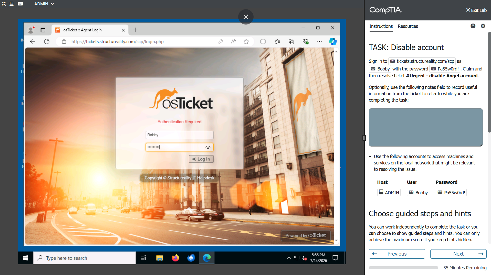

### ขั้นตอนที่ 2: ตรวจสอบรายการ ticket ที่เปิดอยู่

1. ไปที่หน้า `Open Tickets`
2. ตรวจสอบว่ามี ticket ที่ต้องทำทั้งหมด 3 รายการ
3. เปิด ticket ทีละรายการเพื่ออ่าน requirement

ticket ที่ต้องทำคือ:

```text
Urgent - disable Angel account
Frankie new hire
Bitlocker
```

เหตุผลที่ต้องดูทั้งหมดก่อน เพราะ Lab นี้เป็น Challenge Lab มีหลายงานพร้อมกัน ถ้าทำผิด ticket หรือปิด ticket ผิดสถานะ อาจเสียคะแนนได้

แนะนำให้ทำทีละ ticket แล้วค่อย `Evaluate` เฉพาะงานนั้นก่อน เพราะถ้ามีจุดผิดจะรู้ทันทีว่าผิดที่ ticket ไหน ไม่ต้องย้อนตรวจทุกอย่างพร้อมกันตอนท้าย

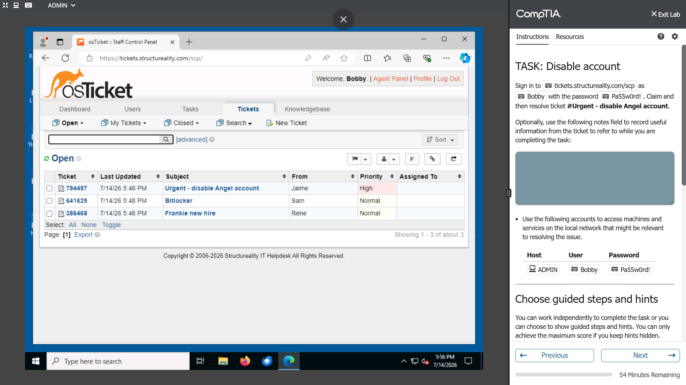

## Ticket 1: Urgent - disable Angel account

### ขั้นตอนที่ 3: อ่าน ticket ของ Angel

1. เปิด ticket `Urgent - disable Angel account`
2. อ่านรายละเอียดใน ticket
3. สรุปสิ่งที่ต้องทำจาก ticket

สิ่งที่ ticket ต้องการคือ:

```text
Disable account ของ Angel
Export Security log จากเครื่อง PC
บันทึกไฟล์เป็น C:\SETUP\pc-security.xml บนเครื่อง ADMIN
หลังทำเสร็จให้ escalate ticket
```

เหตุผลที่ต้อง disable account ก่อน เพราะ ticket แจ้งว่ามี unusual activity จาก SIEM ถ้าปล่อยบัญชีไว้ active ต่อ อาจทำให้ attacker ใช้บัญชีเดิมเข้าระบบได้อีก

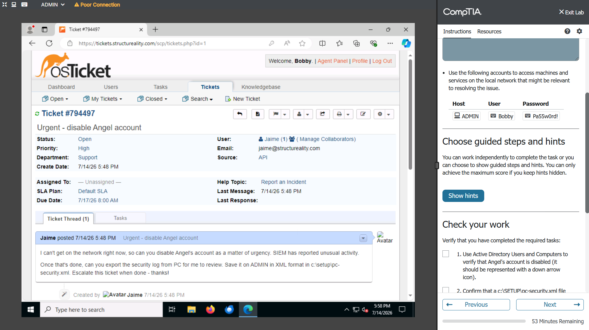

### ขั้นตอนที่ 4: Disable account ของ Angel ใน Active Directory

1. เปิด `Active Directory Users and Computers`
2. ไปที่ domain หรือ OU ที่มี user account
3. หา user ชื่อ `angel`
4. คลิกขวาที่ `angel`
5. เลือก `Disable Account`
6. กดยืนยันถ้ามีกล่องแจ้งเตือน

เหตุผลที่ต้องใช้ `Disable Account` คือเป็นการหยุดการใช้งานบัญชีทันทีโดยไม่ลบ account ทิ้ง ทำให้ยังเก็บข้อมูลบัญชีไว้สำหรับตรวจสอบย้อนหลังได้

วิธีเปิดเครื่องมือถ้ายังไม่เปิดอยู่ ให้ใช้ `Start` แล้วหา `Active Directory Users and Computers` หรือเปิดจาก `Administrative Tools` ก็ได้ จากนั้นขยาย domain แล้วค้นหา user `angel` ถ้า disable สำเร็จ user icon จะมีสัญลักษณ์ลูกศรลง แปลว่าบัญชีถูกปิดใช้งานแล้ว

จุดที่ต้องระวังคืออย่า delete account เพราะการลบ account จะทำให้ข้อมูลอ้างอิงและหลักฐานบางส่วนหายไป งานนี้ต้องการแค่ระงับการใช้งานชั่วคราวเพื่อควบคุมความเสี่ยง

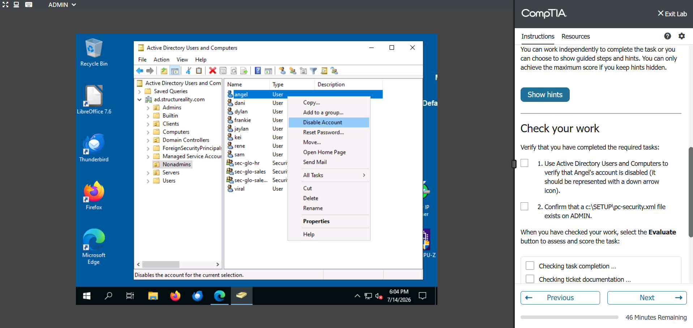

### ขั้นตอนที่ 5: Export Security log เป็นไฟล์ XML

1. เปิด `Event Viewer`
2. ไปที่ `Windows Logs`
3. เลือก `Security`
4. ใช้คำสั่ง export หรือ save log
5. บันทึกไฟล์ไปที่:

```text
C:\SETUP\pc-security.xml
```

6. เลือกชนิดไฟล์เป็น `Xml File (*.xml)`
7. กด `Save`

เหตุผลที่ต้อง export เป็น XML เพราะไฟล์ XML เก็บโครงสร้าง log ได้ดี สามารถนำไปวิเคราะห์ต่อโดยทีม security หรือระบบอื่นได้ง่ายกว่า screenshot ธรรมดา

วิธีทำแบบละเอียดคือเปิด `Computer Management` บนเครื่อง `ADMIN` แล้วเชื่อมไปยังเครื่อง `PC` จากนั้นไปที่ `System Tools` > `Event Viewer` > `Windows Logs` > `Security` แล้วใช้คำสั่ง `Save All Events As...` หรือคำสั่ง export ที่อยู่ทางขวา เลือกบันทึกไฟล์ลง `C:\SETUP`

ตอนตั้งชื่อไฟล์ให้พิมพ์ `pc-security` และเลือกชนิดไฟล์เป็น `Xml (Xml File) (*.xml)` ระบบจะได้ไฟล์เต็มเป็น `pc-security.xml` ตรงกับที่ Lab ตรวจ ถ้าบันทึกเป็น `.evtx` หรือพิมพ์ชื่อไฟล์ผิด คะแนนส่วนนี้จะไม่ผ่าน

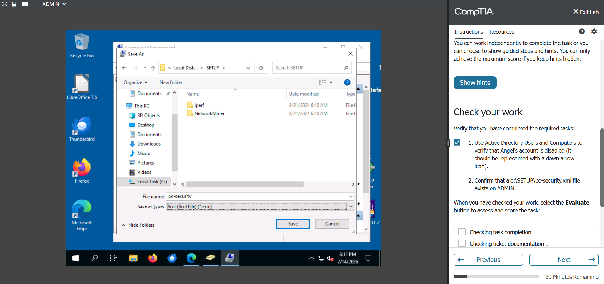

### ขั้นตอนที่ 6: Escalate ticket ของ Angel ไป Level 2 Support

1. กลับไปที่ ticket ของ Angel
2. เลือกคำสั่ง `Reassign` หรือ `Assign`
3. เลือกทีมเป็น:

```text
Level 2 Support
```

4. ใส่ข้อความ:

```text
Done now escalating
```

5. กด `Assign`

เหตุผลที่ ticket นี้ต้อง escalate ไม่ใช่ปิดเป็น resolved เพราะงานนี้เกี่ยวข้องกับ security incident ต้องส่งต่อให้ทีมระดับสูงกว่าตรวจสอบ log และวิเคราะห์เหตุการณ์ต่อ

ตรงนี้เป็นจุดที่สำคัญมาก ห้ามปิด ticket ของ Angel เป็น `Resolved` เพราะ flow ที่ถูกต้องคือเราทำงานเบื้องต้นเสร็จแล้วจึงส่งต่อทีม `Level 2 Support` พร้อมข้อความ `Done now escalating` เพื่อบอกว่าปิด account และ export log แล้ว แต่ยังต้องให้ทีมระดับสูงตรวจสอบเหตุการณ์ต่อ

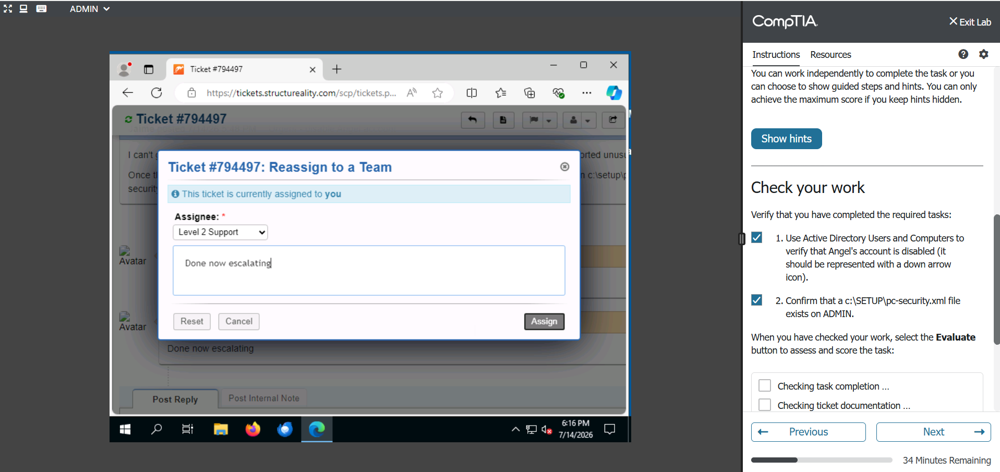

### ขั้นตอนที่ 7: Evaluate งานของ Angel

หลังทำครบแล้วให้กด `Evaluate` สำหรับ task นี้ จะเห็นว่ารายการของ Angel ผ่านทั้งหมด

สิ่งที่ควรผ่านคือ:

```text
Angel account ถูก disable
Security log ถูก export
ticket ถูก escalate พร้อม message ที่ถูกต้อง
```

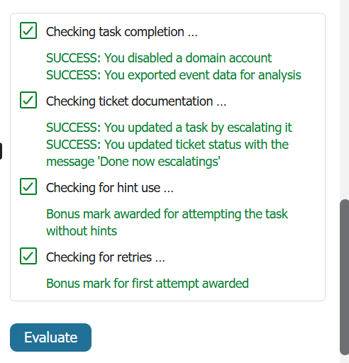

## Ticket 2: Frankie new hire

### ขั้นตอนที่ 8: อ่าน ticket ของ Frankie

1. เปิด ticket `Frankie new hire`
2. อ่านรายละเอียดว่า Frankie เป็นพนักงานใหม่
3. ตรวจสอบว่า user ถูกสร้างไว้แล้ว แต่ยังต้องแก้ group และ password

สิ่งที่ต้องทำคือ:

```text
เพิ่ม Frankie เข้า security group ที่ถูกต้อง
สร้าง password ใหม่จาก password generator
นำ password ไปตั้งให้ account Frankie
login เป็น Frankie เพื่อเปลี่ยน password
ปิด ticket เป็น Resolved พร้อมข้อความ Done
```

เหตุผลที่ต้องเพิ่ม group ก่อน เพราะสิทธิ์เข้าถึงระบบของพนักงานมักอิงจาก security group ถ้า user ไม่ได้อยู่ใน group ที่ถูกต้อง ก็อาจเข้าใช้งาน resource ของแผนกไม่ได้

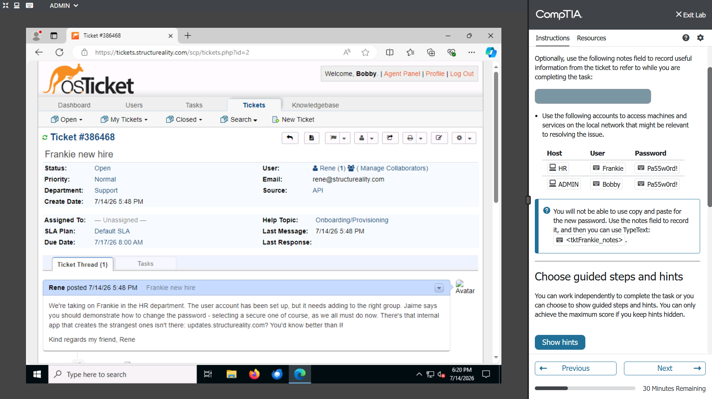

### ขั้นตอนที่ 9: เพิ่ม Frankie เข้า group sec-glo-hr

1. เปิด `Active Directory Users and Computers`
2. หา user `Frankie`
3. เปิด Properties ของ user
4. ไปที่แท็บ `Member Of`
5. กด `Add`
6. ใส่ชื่อ group:

```text
sec-glo-hr
```

7. กด `Check Names`
8. กด `OK`

เหตุผลที่ใช้ `sec-glo-hr` เพราะเป็น security group ของ HR ตามที่ flow ที่ถูกต้องใน Lab ต้องการ ไม่ใช่ใส่ group ชื่อ `HR` เฉย ๆ

ตอนกด `Add` ให้พิมพ์ชื่อ group ให้ครบว่า `sec-glo-hr` แล้วกด `Check Names` เพื่อให้ Active Directory ตรวจสอบว่ามี group นี้จริง ถ้าชื่อถูกต้อง ระบบจะ underline หรือ resolve ชื่อ group ให้ ถ้าไม่ resolve แปลว่าพิมพ์ผิด ต้องแก้ก่อนกด `OK`

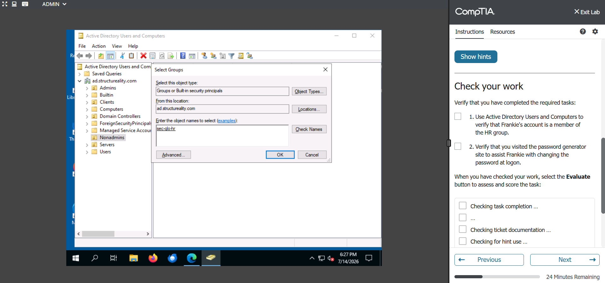

### ขั้นตอนที่ 10: ตรวจสอบว่าเพิ่ม group สำเร็จ

หลังเพิ่ม group แล้วควรเห็นผลว่า `Add to Group` สำเร็จ หรือในแท็บ `Member Of` มี group `sec-glo-hr` อยู่แล้ว

เหตุผลที่ต้องตรวจสอบซ้ำ เพราะถ้าพิมพ์ชื่อ group ผิดหรือไม่ได้กด `Check Names` ระบบอาจไม่เพิ่ม group ให้จริง และ ticket จะไม่ผ่าน

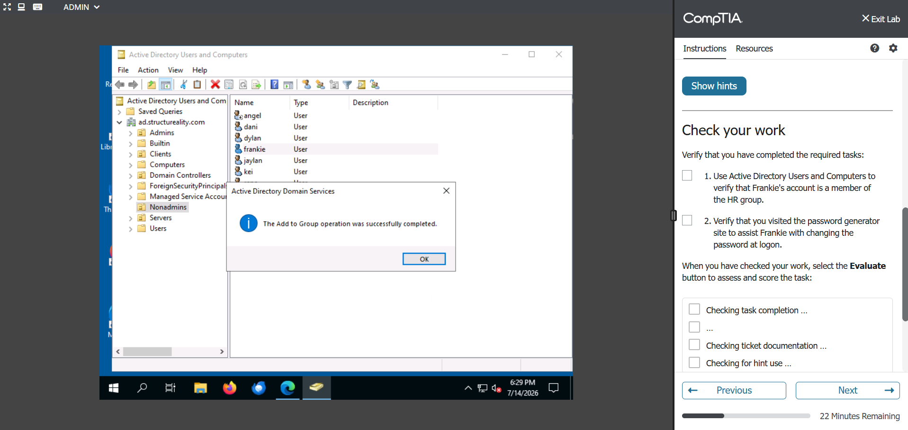

### ขั้นตอนที่ 11: สร้าง password ใหม่จาก password generator

1. เปิด browser
2. เข้าเว็บไซต์:

```text
updates.ad.structureality.com
```

3. ตั้งค่า password generator ดังนี้:

```text
Length: 12
Include symbols: ไม่ต้องเลือก
```

4. กด generate password
5. จดหรือคัดลอก password ที่ได้
6. ใส่ password ลงใน notes field ของ task ตามที่ Lab ต้องการ

ในรอบนี้ password ที่ได้คือ:

```text
Kh9teoDc8ZIp
```

เหตุผลที่ใช้ password generator เพราะ Lab ต้องการให้สร้างรหัสผ่านแบบสุ่มตามนโยบายที่กำหนด ไม่ใช้รหัสผ่านง่าย ๆ หรือเดาเอง

หลังได้ password แล้วให้ใส่ลงในช่อง notes ของ task ด้วย เพราะ Lab ใช้ notes เป็นหลักฐานว่าคุณใช้ password generator ตามที่กำหนด ไม่ได้ตั้ง password เองแบบสุ่มจากความจำ จุดนี้ถ้าลืมใส่ notes อาจทำให้ส่วน password generator ไม่ผ่านได้

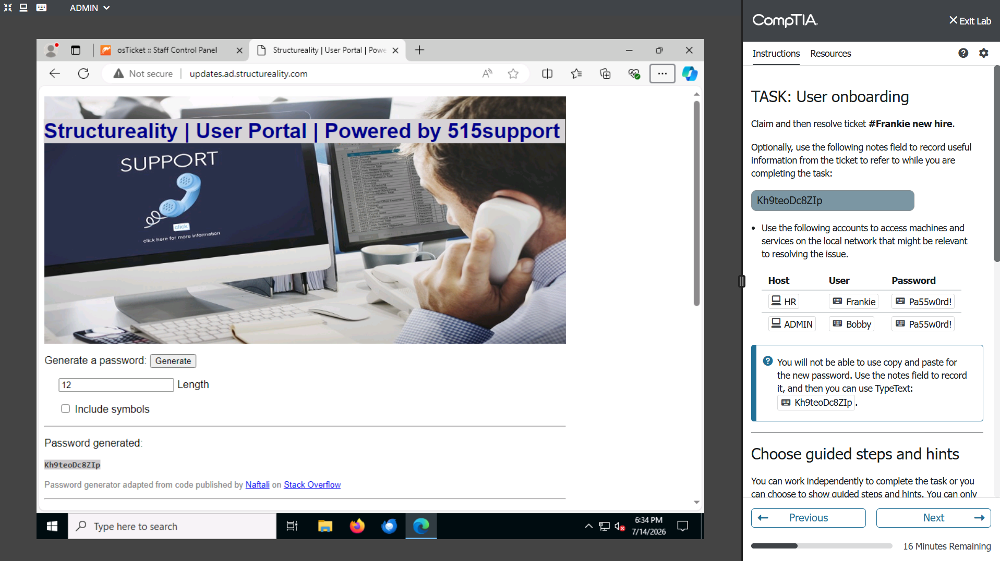

### ขั้นตอนที่ 12: เปลี่ยน password ของ Frankie

1. ไปที่เครื่อง `HR`
2. Login ด้วย user `Frankie`
3. ใช้ old password เดิมที่ Lab ให้ไว้
4. ใส่ new password ที่ได้จาก generator
5. ยืนยัน password ใหม่
6. กดเปลี่ยน password

ค่าที่ใช้ในรอบนี้คือ:

```text
Old password: Pa55w0rd!
New password: Kh9teoDc8ZIp
```

เหตุผลที่ต้อง login เป็น Frankie แล้วเปลี่ยน password เพราะต้องยืนยันว่า account ใช้งานได้จริง และ password ใหม่ถูกตั้งสำเร็จตาม requirement ของ ticket

ในหน้าจอเปลี่ยน password ให้ใส่ old password เป็น `Pa55w0rd!` แล้วใส่ new password เป็นค่าที่ generator สร้างให้ ถ้าระบบเปลี่ยนผ่านได้แปลว่า account ของ Frankie พร้อมใช้งานแล้ว หลังจากนั้นจึงกลับไปปิด ticket ได้

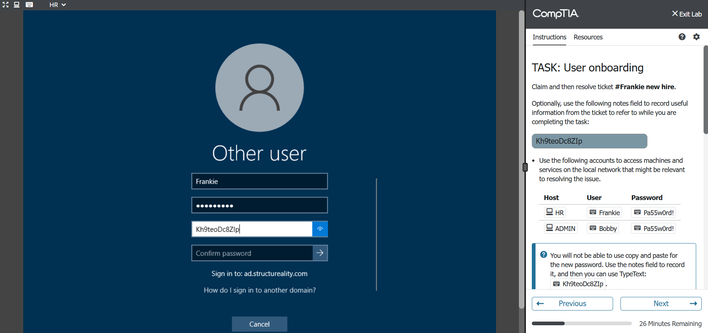

### ขั้นตอนที่ 13: ปิด ticket ของ Frankie

1. กลับไปที่ osTicket
2. เปิด ticket `Frankie new hire`
3. ใส่ข้อความ update ว่า:

```text
Done
```

4. เปลี่ยนสถานะ ticket เป็น `Resolved`
5. บันทึก ticket

เหตุผลที่ ticket นี้ปิดเป็น `Resolved` ได้ เพราะงานตาม ticket เสร็จครบแล้ว ไม่ต้องส่งต่อทีมอื่น

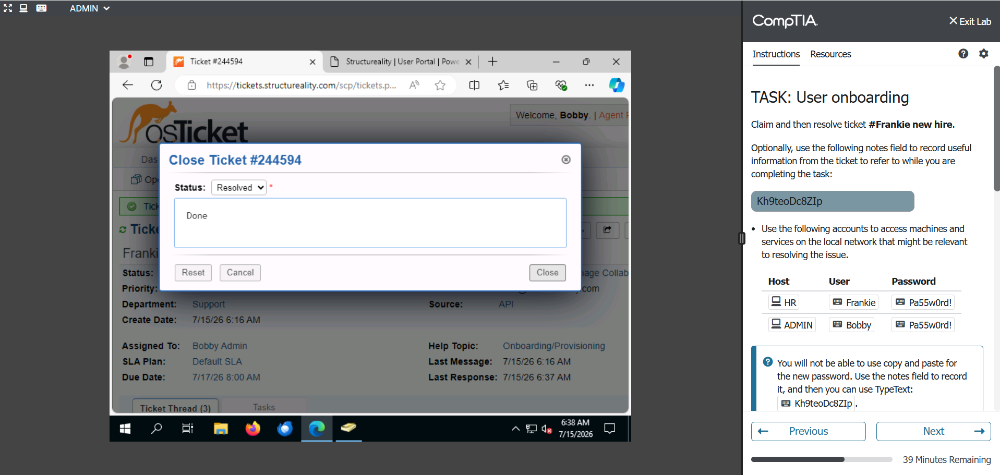

### ขั้นตอนที่ 14: Evaluate งานของ Frankie

หลังทำครบแล้วให้กด `Evaluate` สำหรับ task นี้ จะเห็นว่ารายการของ Frankie ผ่านทั้งหมด

สิ่งที่ควรผ่านคือ:

```text
Frankie ถูกเพิ่มเข้า group ที่ถูกต้อง
password ถูกสร้างด้วย generator
password ถูกเปลี่ยนสำเร็จ
ticket ถูกปิดด้วยข้อความ Done
```

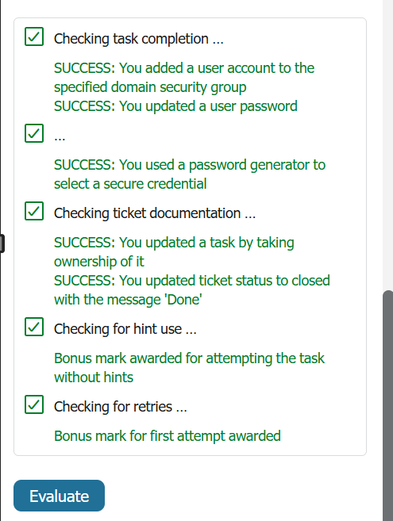

## Ticket 3: Bitlocker

### ขั้นตอนที่ 15: อ่าน ticket Bitlocker

1. เปิด ticket `Bitlocker`
2. อ่านรายละเอียดจาก Sam
3. สรุปว่าโจทย์ต้องการให้ตั้งค่า BitLocker กับ drive ที่เป็น `USB`

ใน Lab นี้ drive ที่ต้องทำคือ:

```text
USB (U:)
```

เหตุผลที่ต้องใช้ drive `USB (U:)` เพราะ Lab ระบุว่า removable drive อาจถูกจำลองเป็น drive ที่มี label ว่า `USB` ดังนั้นให้ดู label เป็นหลัก ไม่ใช่ดูเฉพาะชนิดอุปกรณ์จริง

ใน ticket นี้ผู้ใช้ถามเรื่องการเปิด BitLocker ให้ drive เพิ่มเติม จึงต้องไปที่เครื่อง `HOMEPC` ตาม flow ของ Lab ไม่ใช่ทำบน `ADMIN` หรือเครื่องอื่น ถ้าทำผิดเครื่อง ถึงจะตั้งค่า BitLocker ได้จริงก็อาจไม่ตรงกับสิ่งที่ Lab ตรวจ

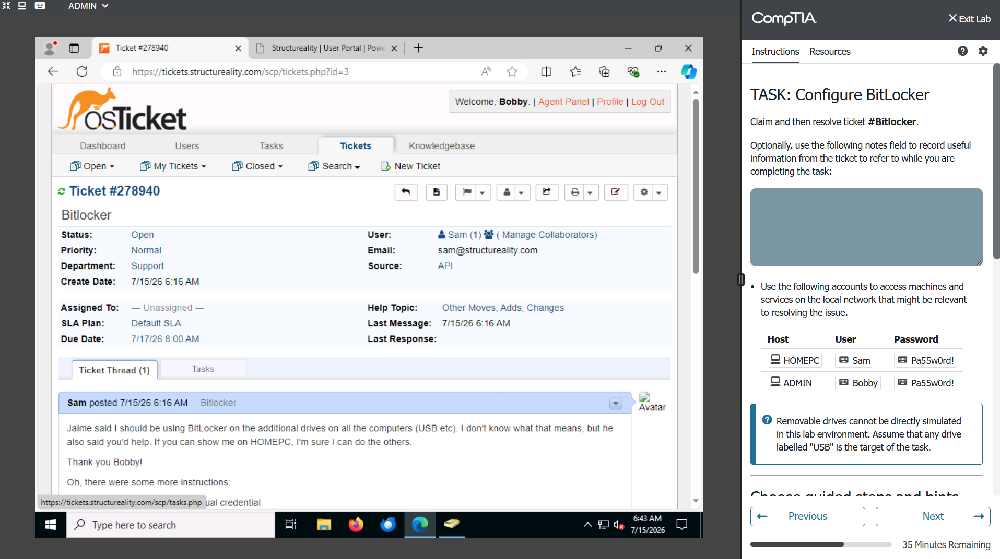

### ขั้นตอนที่ 16: เปิดหน้า BitLocker Drive Encryption

1. ไปที่เครื่อง `HOMEPC`
2. Login ด้วยบัญชี `Sam`
3. เปิด `Control Panel`
4. ไปที่ `BitLocker Drive Encryption`
5. หา drive:

```text
USB (U:)
```

6. ตรวจสอบว่า BitLocker ยังเป็น `Off`

เหตุผลที่ต้องตรวจสถานะก่อน เพราะต้องมั่นใจว่าเรากำลังเปิด BitLocker ให้ drive ที่ถูกต้อง และไม่ได้ไปแก้ system drive หรือ drive อื่นผิดตัว

ถ้าหาเมนูไม่เจอ ให้ค้นหา `Manage BitLocker` จาก Start หรือเปิด `Control Panel` แล้วค้นคำว่า `BitLocker` จากช่องค้นหามุมขวาบน จากนั้นดูให้แน่ใจว่าเลือก drive `USB (U:)` ที่ขึ้นว่า `BitLocker off`

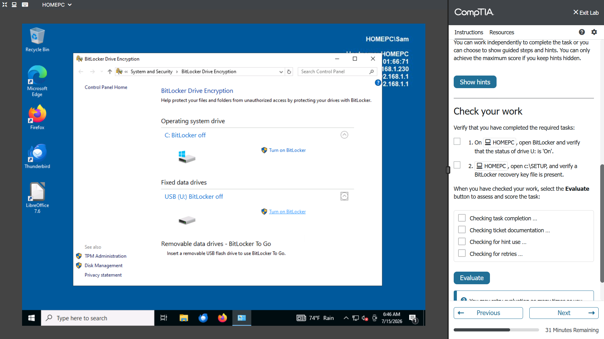

### ขั้นตอนที่ 17: ตั้ง password สำหรับ unlock drive

1. ที่ `USB (U:)` เลือก `Turn on BitLocker`
2. เลือก `Use a password to unlock the drive`
3. กรอก password:

```text
Pa55w0rd!
```

4. ยืนยัน password เดิมอีกครั้ง
5. กด `Next`

เหตุผลที่ตั้ง password เพราะ BitLocker ต้องมีวิธี unlock drive เมื่อมีคนต้องการใช้งานข้อมูลใน drive นี้

รหัส `Pa55w0rd!` เป็นรหัสที่ Lab ใช้ซ้ำใน environment นี้ และตรงกับข้อมูลบัญชีที่ให้มา ถ้าพิมพ์ผิดในช่องยืนยัน password ระบบจะไปต่อไม่ได้ ให้พิมพ์ทั้งสองช่องให้เหมือนกัน

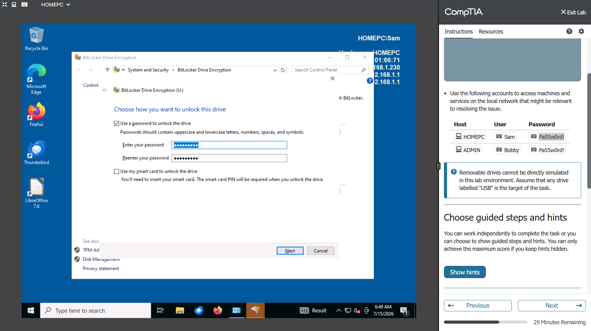

### ขั้นตอนที่ 18: Save recovery key เป็นไฟล์

1. ในหน้า `How do you want to back up your recovery key?`
2. เลือก `Save to a file`
3. บันทึก recovery key ไว้ที่:

```text
C:\SETUP
```

เหตุผลที่ต้อง save recovery key เพราะถ้าลืม password หรือ unlock drive ไม่ได้ recovery key จะเป็นวิธีสำรองในการกู้คืนการเข้าถึงข้อมูล

ตอนเลือกที่เก็บ recovery key ให้เลือก save ลง `C:\SETUP` ไม่ใช่ลง drive `USB (U:)` ที่กำลังเข้ารหัส เพราะ recovery key ควรแยกจาก drive ที่ถูกป้องกัน ถ้าบันทึกผิดที่ Lab อาจตรวจไม่เจอหลักฐาน recovery key

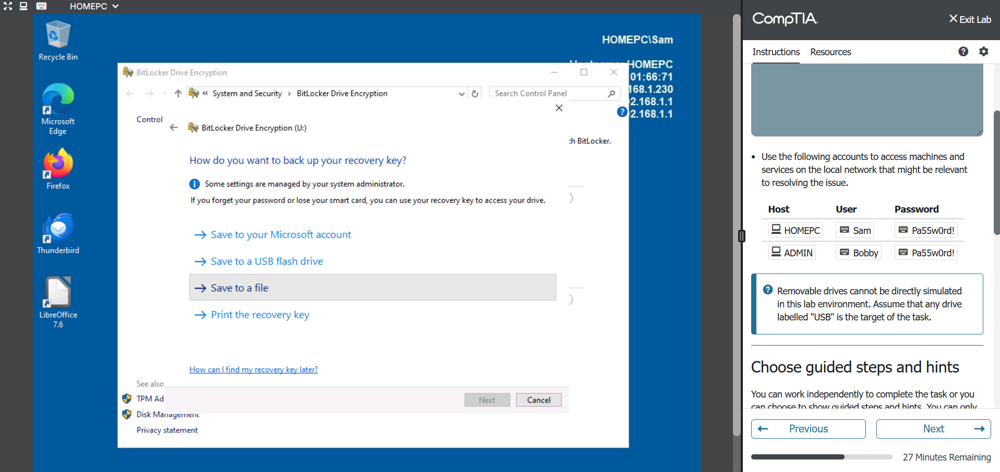

### ขั้นตอนที่ 19: เลือก Encrypt entire drive

1. ในหน้า `Choose how much of your drive to encrypt`
2. เลือก:

```text
Encrypt entire drive
```

3. กด `Next`

เหตุผลที่เลือก `Encrypt entire drive` เพราะ Lab ต้องการให้เข้ารหัสทั้ง drive ไม่ใช่เฉพาะพื้นที่ที่มีข้อมูลอยู่ เพื่อให้พื้นที่ว่างหรือข้อมูลเก่าที่อาจกู้คืนได้ถูกป้องกันด้วย

ห้ามเลือก `Encrypt used disk space only` ใน Lab นี้ ถึงตัวเลือกนั้นจะเร็วกว่า แต่ไม่ตรงกับ flow ที่ถูกต้อง เพราะโจทย์ต้องการ security parameters ที่เข้มกว่า

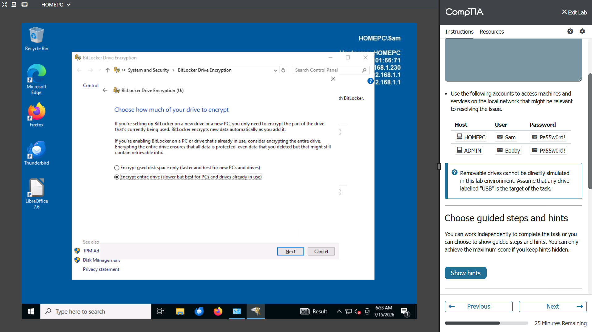

### ขั้นตอนที่ 20: เลือก New encryption mode

1. ในหน้า `Choose which encryption mode to use`
2. เลือก:

```text
New encryption mode
```

3. กด `Next`

เหตุผลที่เลือก `New encryption mode` เพราะเป็น mode ที่เหมาะกับ drive ที่ใช้งานกับ Windows รุ่นใหม่ และตรงกับ flow ที่ถูกต้องของ Lab นี้

ห้ามเลือก `Compatible mode` ใน Lab นี้ เพราะ compatible mode เหมาะกับ drive ที่ต้องนำไปใช้กับ Windows รุ่นเก่า แต่ flow ที่ถูกต้องให้ใช้ `New encryption mode`

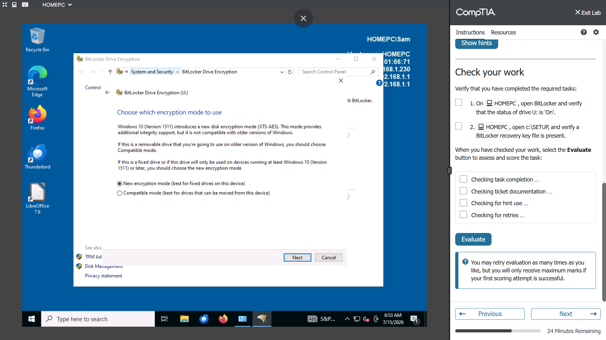

### ขั้นตอนที่ 21: เริ่มเข้ารหัส drive

1. กด `Start encrypting`
2. รอให้ระบบเริ่มกระบวนการเข้ารหัส
3. กลับมาดูหน้า BitLocker แล้วตรวจสอบว่า `USB (U:)` อยู่ในสถานะกำลัง encrypt หรือเปิด BitLocker แล้ว

เหตุผลที่ต้องรอให้เริ่ม encrypt เพราะถ้าออกจากขั้นตอนก่อนเริ่มจริง Lab อาจยังไม่นับว่า BitLocker ถูก configure แล้ว

ไม่จำเป็นต้องรอจน encryption ครบ 100% เสมอไป จุดสำคัญคือให้เห็นว่า BitLocker เริ่มทำงานกับ `USB (U:)` แล้ว เช่นสถานะ `Encrypting` หรือ `BitLocker on` จากนั้นจึงกลับไป update ticket

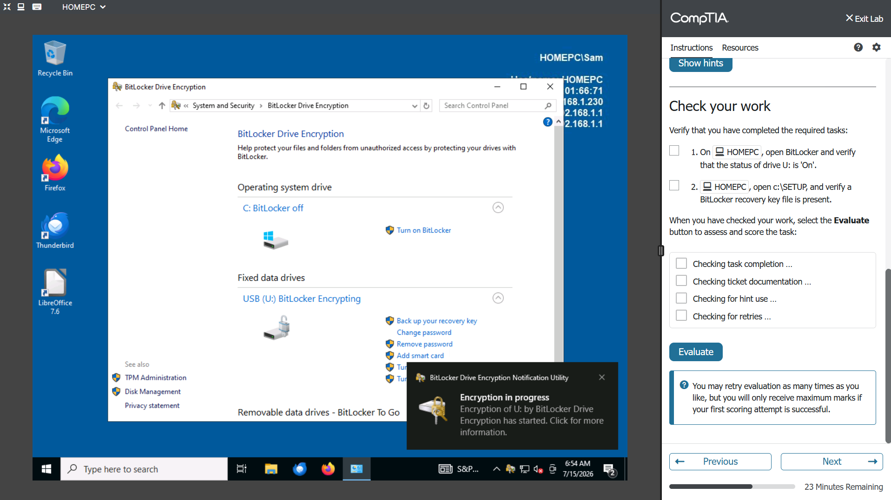

### ขั้นตอนที่ 22: ปิด ticket Bitlocker

1. กลับไปที่ osTicket
2. เปิด ticket `Bitlocker`
3. ใส่ข้อความ update ว่า:

```text
Done
```

4. เปลี่ยนสถานะ ticket เป็น `Resolved`
5. บันทึก ticket

เหตุผลที่ปิดเป็น `Resolved` เพราะตั้งค่า BitLocker เสร็จแล้ว และไม่มีขั้นตอนที่ต้อง escalate ต่อ

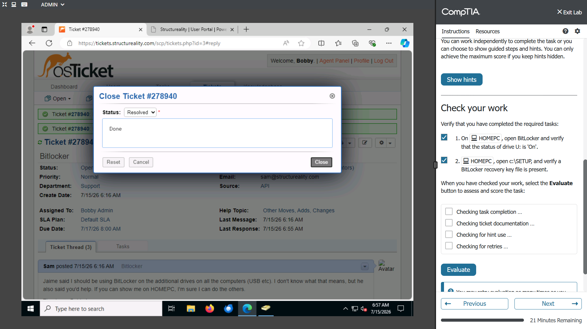

### ขั้นตอนที่ 23: Evaluate งาน BitLocker

หลังทำครบแล้วให้กด `Evaluate` สำหรับ task นี้ จะเห็นว่างาน BitLocker ผ่านทั้งหมด

สิ่งที่ควรผ่านคือ:

```text
BitLocker ถูกเปิดให้ drive ที่ถูกต้อง
ตั้ง password unlock แล้ว
บันทึก recovery key แล้ว
เลือก security parameters ถูกต้อง
ticket ถูกปิดด้วยข้อความ Done
```

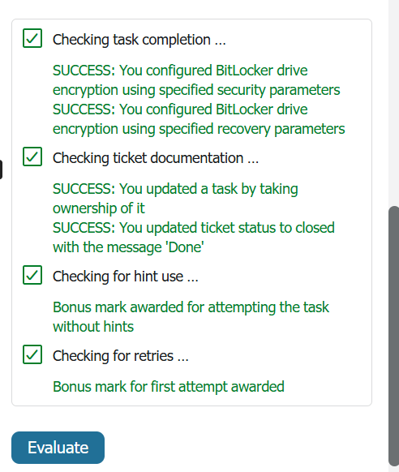

## จุดที่มักทำผิดใน Lab นี้

1. ปิด ticket ของ Angel เป็น `Resolved` ทั้งที่ต้อง `Escalate` ไป `Level 2 Support`
2. เพิ่ม Frankie เข้า group ผิด เช่น `HR` แทนที่จะเป็น `sec-glo-hr`
3. ใช้ password ที่คิดเอง แทนที่จะใช้ password generator จาก `updates.ad.structureality.com`
4. ลืมใส่ password ที่ generate ได้ลงใน notes field ของ task
5. เปิด BitLocker ผิด drive หรือเลือก system drive แทน `USB (U:)`
6. เลือก `Encrypt used disk space only` แทน `Encrypt entire drive`
7. เลือก `Compatible mode` แทน `New encryption mode`
8. ลืมกลับไป update ticket ด้วยข้อความ `Done` หรือ `Done now escalating`

## สรุปผลลัพธ์

เมื่อทำครบทั้ง 3 ticket แล้วให้กด `Score Lab` เพื่อดูผลลัพธ์สุดท้าย

ผลลัพธ์ที่ได้:

```text
Score: 100%
Angel ticket: Completed
Frankie ticket: Completed
BitLocker ticket: Completed
```

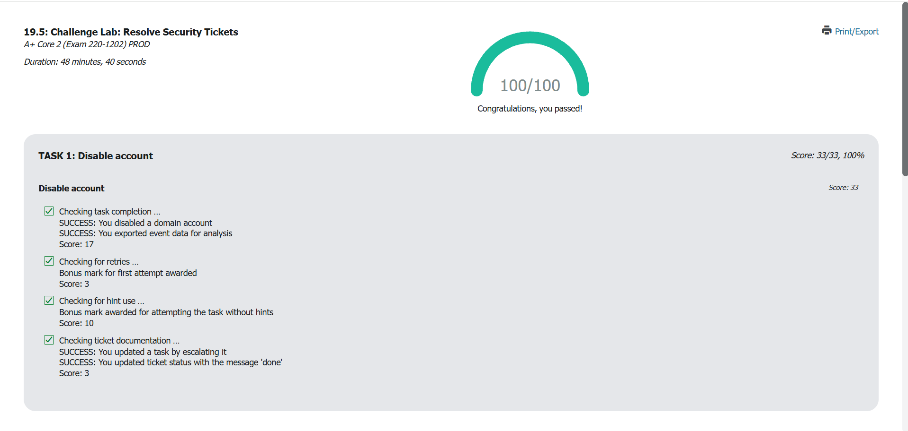

## สรุปสิ่งที่ได้เรียนรู้

Lab นี้ช่วยฝึกการทำงานแบบ IT support/security support ที่ต้องอ่าน ticket ให้ละเอียดก่อนลงมือแก้ เพราะแต่ละ ticket มีวิธีปิดงานไม่เหมือนกัน เช่น ticket ของ Angel ต้อง `Escalate` ต่อ แต่ ticket ของ Frankie และ BitLocker สามารถปิดเป็น `Resolved` ได้

อีกจุดที่สำคัญคือการแก้ security issue ต้องมีหลักฐานและทำตาม requirement ให้ตรง เช่น export log เป็น XML, ใช้ security group ที่ถูกต้อง, ใช้ password generator, save recovery key และเลือก BitLocker option ให้ตรงกับ policy ที่กำหนด
