# 21.4 Challenge Live Lab: Resolve Incident Response Tickets

## ข้อมูลผู้ทำ Lab

- ชื่อ Lab: 21.4 Challenge Live Lab: Resolve Incident Response Tickets
- หัวข้อ: การตรวจสอบเหตุการณ์ผิดปกติ วิเคราะห์มัลแวร์ และแก้ไขปัญหาด้าน Compliance ผ่านระบบ Ticket
- เครื่องที่ใช้ใน Lab: `ADMIN`, `HR` และ `PC`
- ผลลัพธ์สุดท้าย: ทำ Lab สำเร็จและได้คะแนน `100/100`

> หมายเหตุ: หน้ารายงานคะแนนสุดท้ายใน Lab instance นี้แสดงชื่อเป็น `21.5 Challenge Lab: Resolve Incident Response Tickets` แต่เป็นงานชุดเดียวกับโฟลเดอร์ `21.4` นี้ ความแตกต่างเกิดจากหมายเลขบทเรียนของแพลตฟอร์มแต่ละเวอร์ชัน

## ตอนนี้กำลังจะทำอะไร

ใน Lab นี้กำลังรับผิดชอบ Incident Response Ticket จำนวน 3 รายการ ได้แก่ การตรวจสอบ Wazuh installer ที่น่าสงสัย การวิเคราะห์มัลแวร์จากแผ่น DVD และการตรวจสอบเครื่องที่อาจมีโปรแกรมไม่ได้รับอนุญาตหรือไฟล์ที่มีข้อมูลส่วนบุคคล

แต่ละงานไม่ได้จบแค่การแก้ปัญหาบนเครื่องเท่านั้น ต้องกลับไปบันทึกความคืบหน้าใน `osTicket` และเลือกว่าจะปิด Ticket หรือส่งต่อให้ `Level 2 Support` ตาม Support Procedure ของบริษัทด้วย

เหตุผลที่ต้องทำตามลำดับนี้ เพราะงาน Incident Response ต้องมีทั้งการเก็บหลักฐาน การจำกัดความเสียหาย การแก้ไขสาเหตุ และการจัดทำบันทึกว่าได้ดำเนินการอะไรไปแล้ว หากแก้เครื่องสำเร็จแต่ไม่ได้ update Ticket หรือเลือกสถานะผิด ระบบประเมินจะถือว่างานยังไม่ครบ

## วัตถุประสงค์

สิ่งที่ต้องทำใน Lab นี้มีดังนี้:

1. ตรวจสอบและจัดการ Wazuh installer ที่ถูกดัดแปลงบนเครื่อง `HR`
2. ติดตั้ง Wazuh Agent ที่ตรวจสอบแล้วและยืนยันว่าเครื่อง `HR` ปรากฏใน SIEM
3. วิเคราะห์ไฟล์มัลแวร์จาก `DYLAN-DVD` ด้วย Windows Defender, Task Manager, Resource Monitor และ `netstat`
4. กรอก Malware Analysis Report ให้ถูกต้อง
5. ตรวจหา Shadow IT และไฟล์ที่มี PII ในบัญชี `Angel`, `Sam` และ `Jaylan`
6. ถอนโปรแกรมไม่ได้รับอนุญาตและย้ายไฟล์ PII ไปยังพื้นที่ Compliance
7. ตอบกลับ ปิด หรือ escalate Ticket ให้ถูกต้อง
8. ตรวจสอบผลด้วย `Evaluate` และรายงานคะแนนสุดท้าย

## บัญชีที่ใช้ใน Lab

| เครื่องหรือระบบ | User | Password | หน้าที่ |
| --- | --- | --- | --- |
| ADMIN | Bobby | Pa55w0rd! | เปิด Ticket, อ่าน FAQ และจัดการสถานะงาน |
| HR | Bobby | Pa55w0rd! | ตรวจ installer และติดตั้ง Wazuh Agent |
| PC | Angel | Pa55w0rd! | ตรวจไฟล์ของ Angel |
| PC | Sam | Pa55w0rd! | ตรวจโปรแกรมและไฟล์ของ Sam |
| PC | Jaylan | Pa55w0rd! | ตรวจโปรแกรมและไฟล์ของ Jaylan |
| Wazuh SIEM | admin | Pa55w0rd+ | ตรวจว่า Agent ของ HR เป็น Active |

บัญชีและรหัสผ่านเหล่านี้ใช้เฉพาะใน Lab environment เท่านั้น ในระบบจริงไม่ควรใช้รหัสผ่านเดียวกันกับหลายบัญชี และไม่ควรขอรหัสผ่านจริงจากผู้ใช้เพื่อเข้าไปตรวจเครื่องโดยตรง

## ภาพรวม Ticket และสถานะสุดท้าย

| Task | Ticket | งานหลัก | สถานะสุดท้าย |
| --- | --- | --- | --- |
| 1 | Anomalous activity | Hash และย้าย suspect installer, ติดตั้ง Wazuh Agent ที่ถูกต้อง | Escalate ไป Level 2 Support |
| 2 | Infected disc | วิเคราะห์ `slipatch2.exe` และกรอก Malware Analysis Report | ปิดเป็น Resolved |
| 3 | PC compliance issues | ถอน Joplin และย้ายไฟล์ PII ไป `\\MS\COMPLIANCE` | Escalate ไป Level 2 Support |

จุดสำคัญคือ Task 1 และ Task 3 เกี่ยวข้องกับเหตุการณ์ที่อาจกระทบความปลอดภัยหรือข้อมูลส่วนบุคคล จึงต้องส่งต่อ `Level 2 Support` ส่วน Task 2 มีขอบเขตการวิเคราะห์และแก้ไขชัดเจน จึงปิดเป็น `Resolved` ได้

## ข้อมูลสำคัญที่ใช้ใน Lab

```text
Wazuh Manager/Registration Server: 10.1.16.242

Suspect installer:
C:\Users\Avon\Downloads\wazuh-agent-4.9.0-1.msi

Suspect SHA-256:
C3E8AA55C8E5AD64D00BC08C826164126B73C02B31BBCB2014D316679DAA6A0F

Verified installer SHA-256:
3C2902FA2BD3BCCD7C4001A9B01219B82DF347F5F6E0A96760AD42259FBB3829

Malware file: slipatch2.exe
Classification: Trojan
C2 address: 10.1.24.66
C2 port: 443
Connection established: No

PII quarantine location:
\\MS\COMPLIANCE
```

## แนวคิดก่อนลงมือ

### 1. Preserve evidence ก่อน remediation

ใน Task 1 ต้องคำนวณ hash ของไฟล์ต้องสงสัยก่อนย้ายไฟล์ เพราะ hash ทำหน้าที่เป็นลายนิ้วมือของไฟล์ ช่วยยืนยันว่าไฟล์ใดถูกตรวจสอบและสามารถใช้เปรียบเทียบกับ installer ที่ถูกต้องได้

### 2. วิเคราะห์พฤติกรรม ไม่ดูแค่ชื่อไฟล์

ใน Task 2 ต้องใช้หลายเครื่องมือร่วมกัน เพราะ Windows Defender บอกชนิดของมัลแวร์ แต่ Task Manager และ Resource Monitor ช่วยบอกว่าไฟล์ทำงานในลักษณะใด ส่วน `netstat` ช่วยแสดง IP, port และสถานะการเชื่อมต่อจริง

### 3. ใช้ Allowlist และ Procedure เป็นเกณฑ์

ใน Task 3 ไม่ควรตัดสินว่าโปรแกรมหรือไฟล์ปลอดภัยจากชื่อเพียงอย่างเดียว ต้องเทียบโปรแกรมกับ `Supported software` FAQ และตรวจไฟล์ตาม `PII` procedure ถ้าเป็นข้อมูลส่วนบุคคลต้องย้ายไปพื้นที่ Compliance แทนการลบทิ้ง

## ขั้นตอนการทำ Lab

## Task 1: Investigate anomalous activity

### ขั้นตอนที่ 1: เข้า osTicket และเปิด Ticket Anomalous activity

1. เข้าเครื่อง `ADMIN`
2. เปิดเว็บเบราว์เซอร์และเข้า:

```text
https://tickets.structureality.com/scp
```

3. Login ด้วย `Bobby` และ `Pa55w0rd!`
4. เปิดหน้า `Tickets`
5. เลือก Ticket `Anomalous activity`
6. อ่านรายละเอียดให้ครบก่อนเริ่มแก้ไข

เหตุผลที่ต้องเริ่มจาก Ticket เพราะรายละเอียดจากผู้แจ้งช่วยระบุว่าเหตุการณ์เกิดที่เครื่องใด ไฟล์ใดน่าสงสัย และงานนี้มีโอกาสเกี่ยวข้องกับ security breach

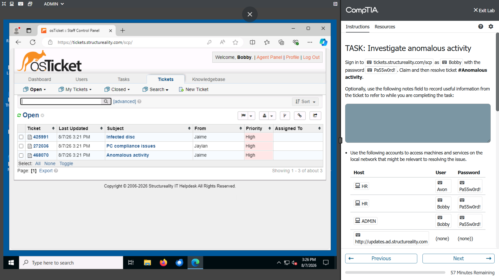

ภาพนี้แสดง Ticket ที่เปิดอยู่ในระบบ โดย Task แรกต้องเลือก `Anomalous activity`

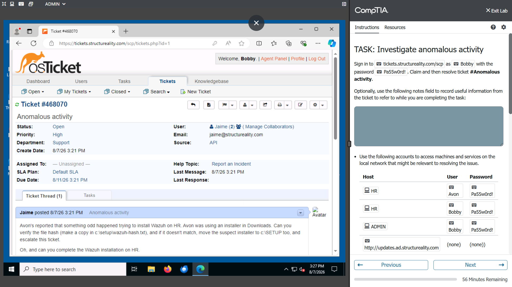

ภาพนี้แสดงรายละเอียดเหตุการณ์ก่อนรับงาน

### ขั้นตอนที่ 2: Claim Ticket และแจ้งว่ากำลังดำเนินการ

1. กดเมนู `Claim`
2. ใส่ข้อความ:

```text
Working on it
```

3. ยืนยันการ Claim
4. อย่าเพิ่งปิด Ticket

เหตุผลที่ต้อง Claim เพราะเป็นการระบุว่าเราเป็นผู้รับผิดชอบงาน และข้อความ `Working on it` ทำให้ผู้แจ้งหรือทีม support ทราบว่า Ticket ถูกนำไปดำเนินการแล้ว

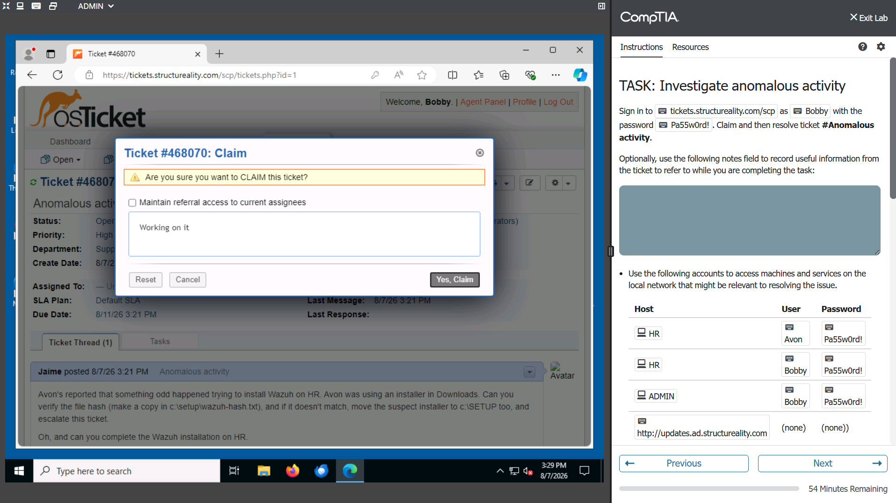

### ขั้นตอนที่ 3: อ่าน Wazuh agent installation FAQ

1. ไปที่ `Knowledgebase`
2. เปิดหมวด `Support Procedures`
3. เลือก `Wazuh agent installation`
4. จดค่าของ Manager และลำดับการติดตั้ง

ค่าที่ใช้คือ:

```text
Wazuh Manager: 10.1.16.242
Registration Server: 10.1.16.242
```

เหตุผลที่ต้องใช้ FAQ เพราะ Lab ตรวจว่าดำเนินการตาม procedure ขององค์กร ไม่ใช่เพียงติดตั้งโปรแกรมด้วยค่าที่คาดเดาเอง

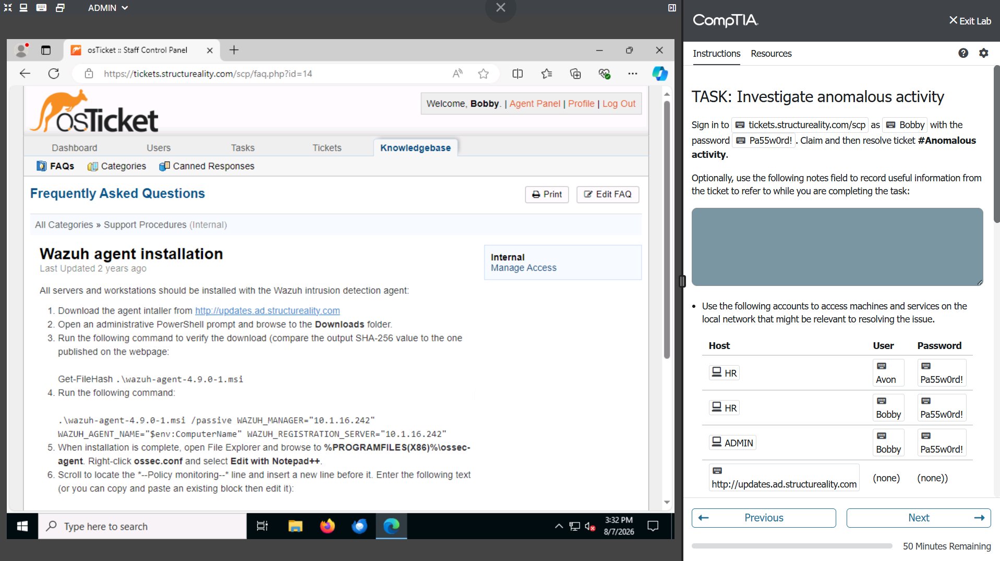

ภาพนี้แสดงคำสั่งติดตั้งและค่าของ Wazuh Manager ที่กำหนดโดยองค์กร

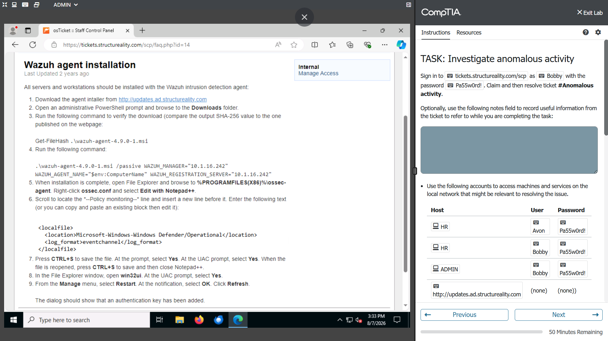

ภาพนี้แสดงข้อมูล configuration เพิ่มเติมใน FAQ ส่วนการลงทะเบียน Agent ที่ทำจริงใน Lab รอบนี้ใช้ Wazuh Agent GUI ตามขั้นตอนที่ 7

### ขั้นตอนที่ 4: ไปเครื่อง HR และค้นหา suspect installer

1. เข้าเครื่อง `HR`
2. Login เป็น `Bobby`
3. เปิด PowerShell แบบ Administrator
4. ตรวจชื่อเครื่องและบัญชีที่กำลังใช้งาน:

```powershell
hostname
whoami
```

5. ค้นหา Wazuh installer ใน profile ของผู้ใช้:

```powershell
Get-ChildItem C:\Users -Filter "wazuh-agent-4.9.0-1.msi" -File -Recurse -ErrorAction SilentlyContinue |
Select-Object FullName, Length, LastWriteTime
```

ไฟล์ต้องสงสัยใน Lab instance นี้อยู่ที่:

```text
C:\Users\Avon\Downloads\wazuh-agent-4.9.0-1.msi
Size: 82493440 bytes
```

เหตุผลที่ต้องค้นหาทั้ง path และขนาด เพราะมี Wazuh installer ชื่อเดียวกันอีกไฟล์หนึ่งที่ดาวน์โหลดจากเว็บ Updates แต่ไฟล์สองตัวมีเนื้อหาและ hash ต่างกัน ห้ามนำไฟล์ต้องสงสัยไปติดตั้ง

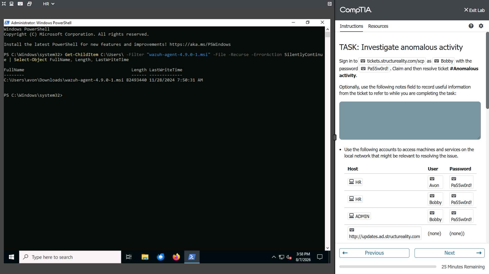

### ขั้นตอนที่ 5: สร้าง hash และย้ายไฟล์ต้องสงสัย

1. สร้างโฟลเดอร์สำหรับเก็บหลักฐาน:

```powershell
New-Item -Path "C:\SETUP" -ItemType Directory -Force
```

2. คำนวณ SHA-256 และบันทึกผลลงไฟล์:

```powershell
Get-FileHash "C:\Users\Avon\Downloads\wazuh-agent-4.9.0-1.msi" -Algorithm SHA256 |
Out-File "C:\SETUP\wazuh-hash.txt" -Encoding ascii
```

3. อ่านผล hash:

```powershell
Get-Content "C:\SETUP\wazuh-hash.txt"
```

4. ตรวจว่าค่า hash ของ suspect installer คือ:

```text
C3E8AA55C8E5AD64D00BC08C826164126B73C02B31BBCB2014D316679DAA6A0F
```

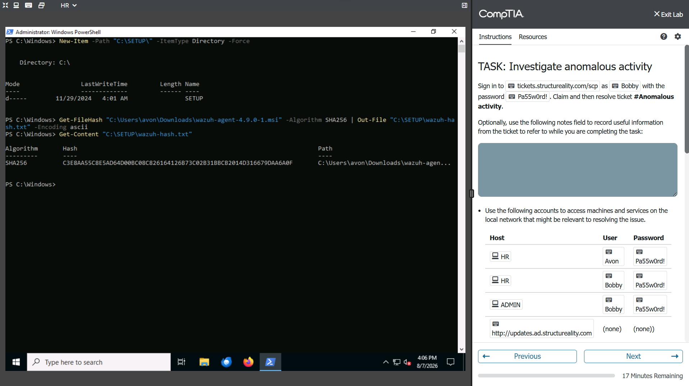

5. ย้ายไฟล์ต้องสงสัยไปที่ `C:\SETUP`:

```powershell
Move-Item "C:\Users\Avon\Downloads\wazuh-agent-4.9.0-1.msi" `
"C:\SETUP\wazuh-agent-4.9.0-1.msi"
```

6. ตรวจว่ามีทั้ง installer และไฟล์ hash:

```powershell
Get-ChildItem "C:\SETUP\wazuh-agent-4.9.0-1.msi","C:\SETUP\wazuh-hash.txt"
```

7. ตรวจว่าไฟล์ต้นทางถูกย้ายออกแล้ว:

```powershell
Test-Path "C:\Users\Avon\Downloads\wazuh-agent-4.9.0-1.msi"
```

ผลที่ถูกต้องควรเป็น `False`

เหตุผลที่ใช้ `Move-Item` ไม่ใช่ `Copy-Item` เพราะต้องนำไฟล์ต้องสงสัยออกจากตำแหน่งที่ผู้ใช้สามารถเปิดใช้งานได้ ขณะเดียวกันยังเก็บไฟล์และ hash ไว้ใน `C:\SETUP` สำหรับการตรวจสอบต่อ

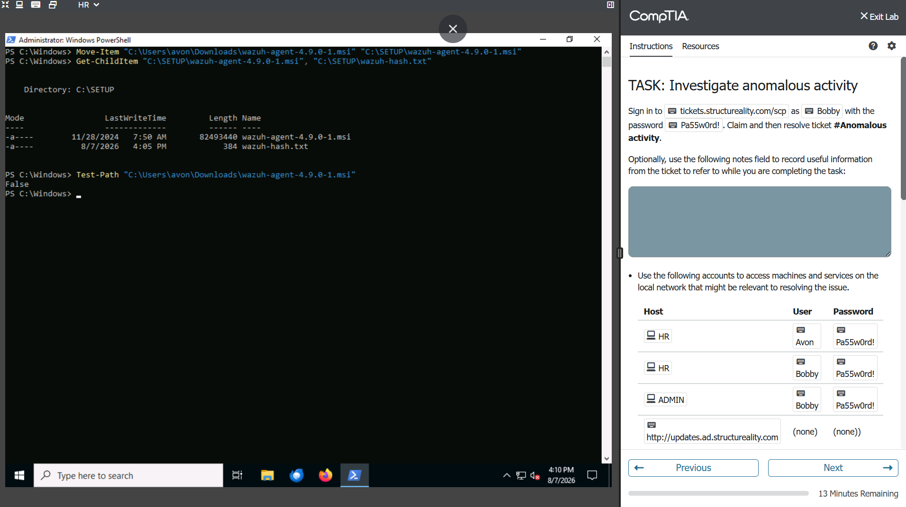

### ขั้นตอนที่ 6: ดาวน์โหลดและตรวจสอบ installer ที่ถูกต้อง

1. เปิดเว็บต่อไปนี้บนเครื่อง `HR`:

```text
http://updates.ad.structureality.com
```

2. ดาวน์โหลด Wazuh Agent ไปยัง `Downloads`
3. เปิด PowerShell Administrator
4. ไปที่ Downloads:

```powershell
cd $env:USERPROFILE\Downloads
```

5. คำนวณ hash ของไฟล์ที่ดาวน์โหลด:

```powershell
Get-FileHash .\wazuh-agent-4.9.0-1.msi -Algorithm SHA256
```

6. เปรียบเทียบกับค่าในเว็บไซต์:

```text
3C2902FA2BD3BCCD7C4001A9B01219B82DF347F5F6E0A96760AD42259FBB3829
```

เหตุผลที่ต้องตรวจ hash ก่อนติดตั้ง เพราะชื่อไฟล์อย่างเดียวไม่สามารถยืนยันความถูกต้องได้ ถ้า hash ตรงกับค่าที่แหล่งดาวน์โหลดเผยแพร่จึงถือว่าเป็น installer ที่ผ่านการตรวจสอบสำหรับ Lab นี้

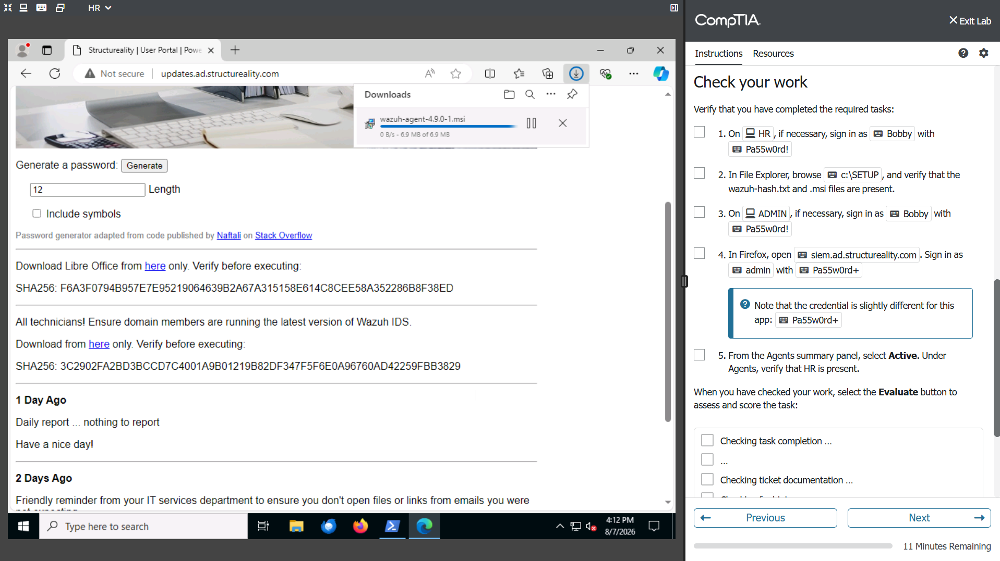

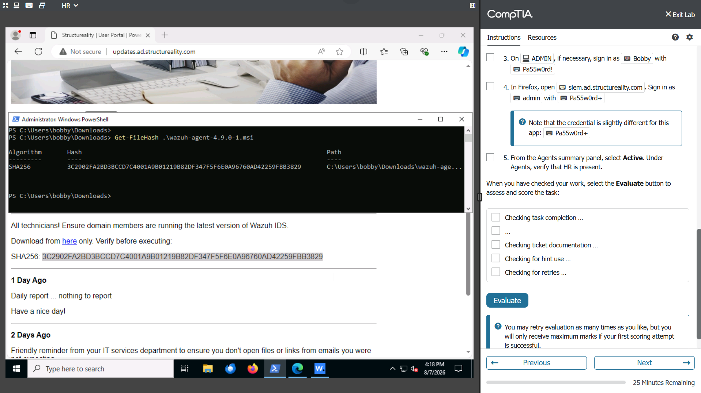

### ขั้นตอนที่ 7: ติดตั้งและกำหนดค่า Wazuh Agent ผ่าน GUI

1. เปิดโฟลเดอร์ `Downloads` บนเครื่อง `HR`
2. ดับเบิลคลิก Wazuh installer ที่ดาวน์โหลดจากเว็บไซต์ Updates และตรวจ hash แล้ว
3. ถ้ามีหน้าต่าง SmartScreen ให้เลือก `Run`
4. ถ้ามีหน้าต่าง User Account Control ให้เลือก `Yes`
5. ทำขั้นตอนติดตั้งจนเสร็จ
6. เปิดโปรแกรม `Wazuh Agent` หรือ `win32ui`
7. ที่ช่อง Manager IP address ใส่:

```text
10.1.16.242
```

8. กด `Save` เพื่อบันทึกค่า Manager ให้ Agent
9. กด `Restart` เพื่อให้ Wazuh Agent เริ่มทำงานใหม่ด้วยค่าที่บันทึกไว้
10. กด `Refresh` เพื่อดึงสถานะล่าสุดมาแสดงในหน้าต่าง
11. รอจนหน้าต่าง Wazuh Agent แสดง Authentication key
12. ตรวจสอบข้อมูลสำคัญดังนี้:

```text
Agent name: HR
Manager IP: 10.1.16.242
Status: Running
Authentication key: แสดงค่าแล้ว
```

เหตุผลที่ใส่ `10.1.16.242` เพราะเป็น IP address ของ Wazuh Manager ที่ Agent ต้องใช้สำหรับลงทะเบียนและส่งข้อมูลเหตุการณ์ไปยัง SIEM

เหตุผลที่ต้องกด `Save` ก่อน `Restart` เพราะถ้ายังไม่บันทึก Agent อาจเริ่มใหม่โดยใช้ configuration เดิม ส่วน `Refresh` ใช้ปรับข้อมูลบนหน้าจอให้เป็นสถานะล่าสุดหลังจาก service เริ่มทำงานใหม่

เมื่อ Authentication key ปรากฏ หมายความว่า Agent ได้รับ key สำหรับยืนยันตัวตนกับ Wazuh Manager แล้ว จากนั้นจึงค่อยไปตรวจที่ Wazuh SIEM ว่าเครื่อง `HR` แสดงสถานะ `Active` หรือไม่

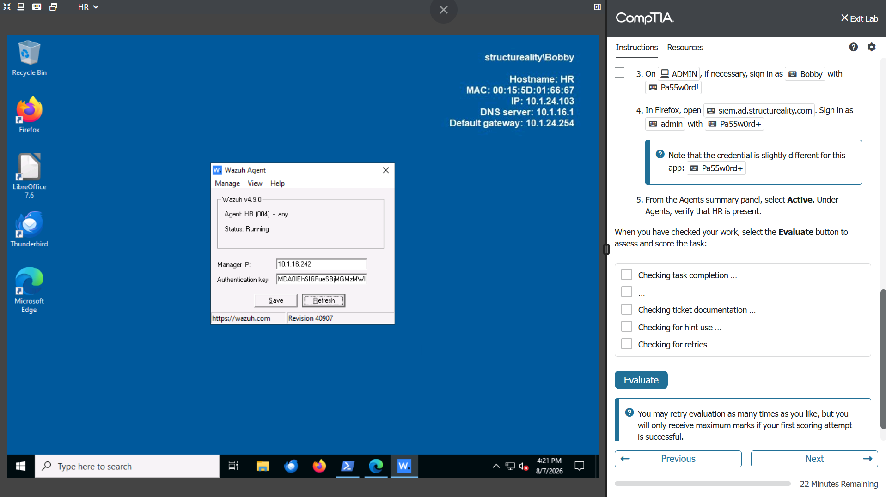

### ขั้นตอนที่ 8: ยืนยันว่า HR เป็น Active ใน Wazuh SIEM

1. กลับเครื่อง `ADMIN`
2. เปิด:

```text
https://siem.ad.structureality.com
```

3. Login ด้วย `admin` และ `Pa55w0rd+`
4. ไปที่หน้า Agents หรือ Endpoints
5. กรองสถานะเป็น `Active`
6. ตรวจว่าพบเครื่อง `HR`

ใน Lab instance นี้ HR ใช้ Agent ID `004` แต่ ID อาจเปลี่ยนได้เมื่อเริ่ม Lab รอบใหม่ ให้ตรวจจากชื่อเครื่องและสถานะเป็นหลัก

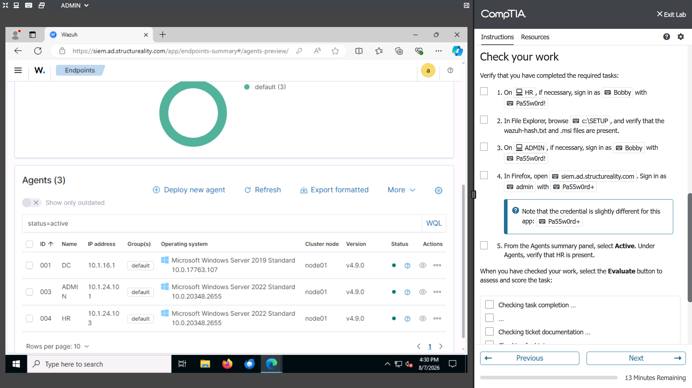

### ขั้นตอนที่ 9: ตอบ Ticket และ Escalate ไป Level 2 Support

1. กลับ Ticket `Anomalous activity`
2. Post Reply อธิบายสิ่งที่ทำ หรือใช้ข้อความสั้นตามที่ระบบยอมรับ เช่น:

```text
Done
```

ข้อความที่เหมาะกับงานจริงมากกว่าคือ:

```text
Moved the suspect installer to C:\SETUP and recorded its SHA-256 hash.
Installed and registered the verified Wazuh agent and confirmed HR is active in SIEM.
Escalating to Level 2 Support for further security investigation.
```

3. กดเมนู Assignment
4. เลือก `Team`
5. เลือก `Level 2 Support`
6. ใส่ข้อความ `Done` แล้วกด `Assign`

เหตุผลที่ต้อง escalate เพราะเหตุการณ์เกี่ยวข้องกับ installer ที่ถูกดัดแปลงและอาจเป็น security breach ทีมระดับถัดไปต้องตรวจสอบผลกระทบและทำ investigation ต่อ

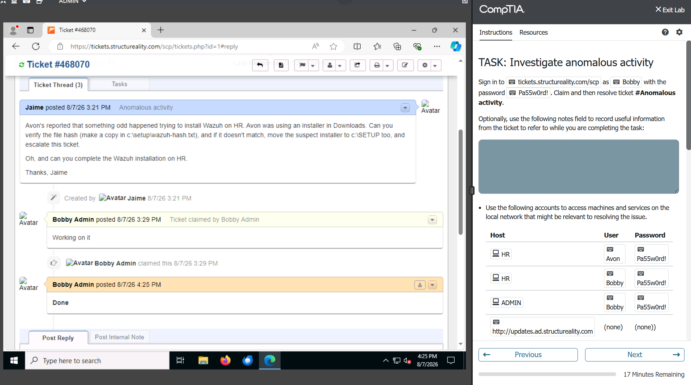

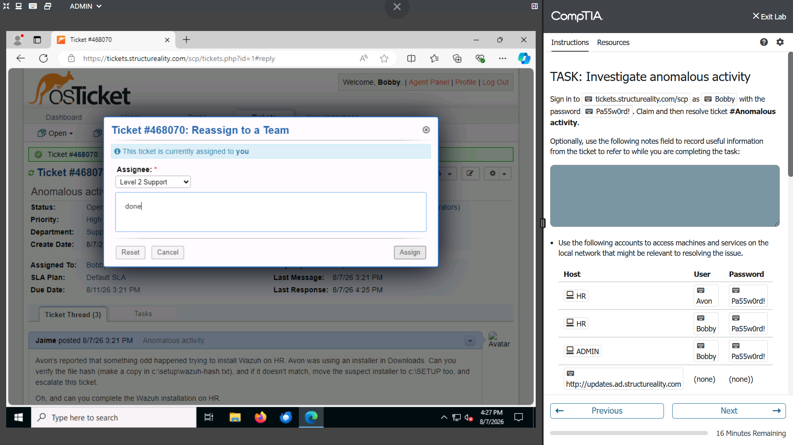

### ขั้นตอนที่ 10: Evaluate Task 1

1. ติ๊ก Checklist ของ Task 1 ให้ครบ
2. กด `Evaluate`
3. ตรวจผลการ hash, remediation และ ticket documentation

ภาพ Evaluate ในรอบนี้แสดงว่า file hashing, remediation และการ escalate ผ่าน แต่มีข้อความ:

```text
FIX: Agent configuration not detected - install and register the agent
```

อย่างไรก็ตาม ในรอบนี้ได้กำหนด Manager IP ผ่าน Wazuh Agent GUI, กด `Save`, `Restart` และ `Refresh` จน Authentication key ปรากฏ รวมถึงตรวจพบ `HR` เป็น `Active` ใน SIEM แล้ว รายงานคะแนนสุดท้ายจึงให้ Task 1 เท่ากับ `33/33` และให้หัวข้อ Agent configuration `7` คะแนน ข้อความ `FIX` ข้างต้นจึงไม่ตรงกับคะแนนสุดท้ายที่ระบบบันทึก

หากเริ่ม Lab รอบใหม่ ให้ใช้หลักฐานจาก GUI และ SIEM เป็นจุดตรวจสำคัญ ได้แก่ Manager IP ถูกต้อง, Agent เป็น `Running`, มี Authentication key และพบเครื่อง `HR` เป็น `Active` ก่อนกด Evaluate

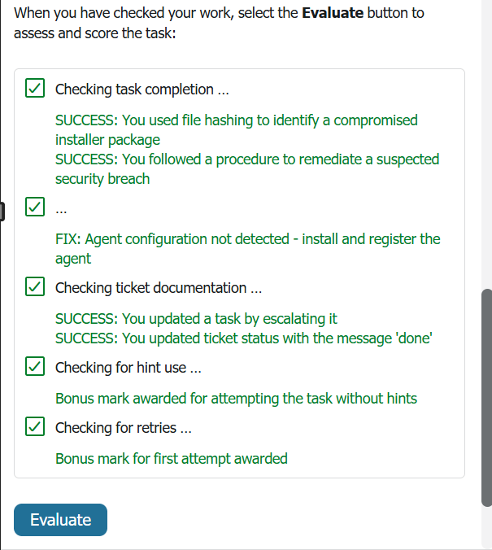

## Task 2: Analyze malware infection

> หมายเหตุเรื่องลำดับภาพ: ภาพ Ticket ช่วงเริ่มต้นและช่วงปิดงานถูกถ่ายจากคนละ Lab attempt ทำให้หมายเลข Ticket ไม่ตรงกัน แต่ขั้นตอนที่ต้องทำเหมือนกัน คือ Claim และตอบ `Working on it` ก่อนวิเคราะห์ จากนั้นจึงตอบ `Done` และปิดเป็น `Resolved`

### ขั้นตอนที่ 11: เปิดและ Claim Ticket Infected disc

1. บนเครื่อง `ADMIN` เปิด Ticket `Infected disc`
2. อ่านรายละเอียดว่าได้รับแผ่นที่อาจมีมัลแวร์
3. กด `Claim`
4. Post Reply:

```text
Working on it
```

5. อย่าเพิ่งปิด Ticket

เหตุผลที่ต้องรับ Ticket ก่อนวิเคราะห์ เพื่อให้ระบบบันทึก ownership และทำให้ผู้แจ้งทราบว่างานกำลังถูกตรวจสอบ

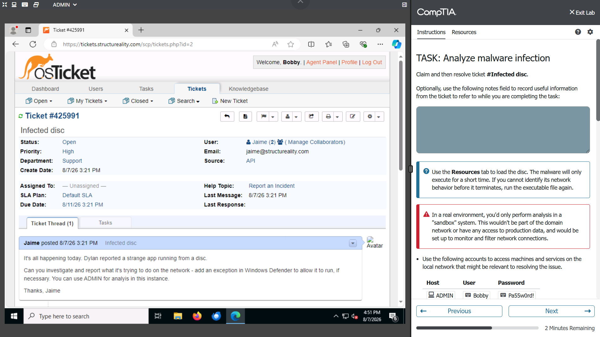

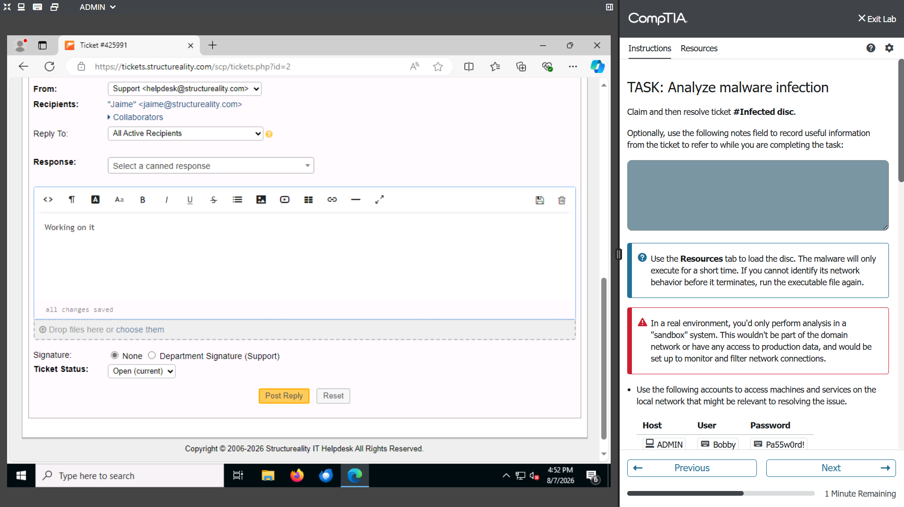

### ขั้นตอนที่ 12: โหลด DYLAN-DVD และเปิดไฟล์ในแผ่น

1. เปิดแท็บ `Resources` ของ Lab
2. ที่ DVD Drive เลือก `DYLAN-DVD`
3. รอ AutoPlay notification
4. เลือก `Open folder to view files`
5. ตรวจว่าในแผ่นมีไฟล์ `slipatch2.exe`

เหตุผลที่ใช้ Resources ของ Lab เพราะเป็นการจำลองการใส่แผ่น DVD เข้าเครื่อง `ADMIN` และไฟล์ตัวอย่างถูกจัดเตรียมไว้ใน media นี้

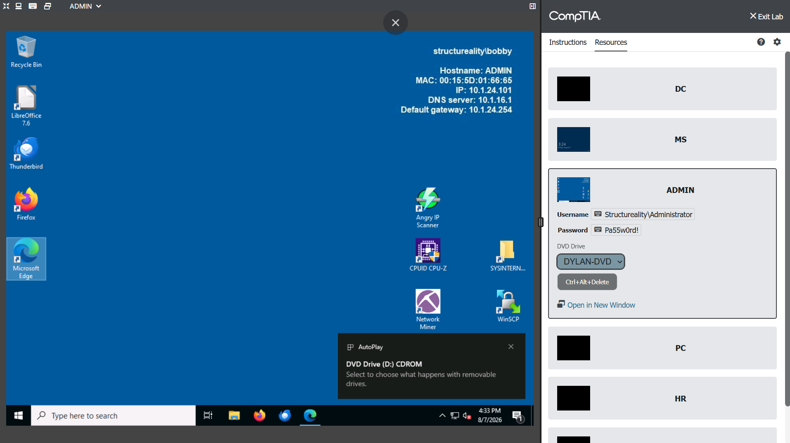

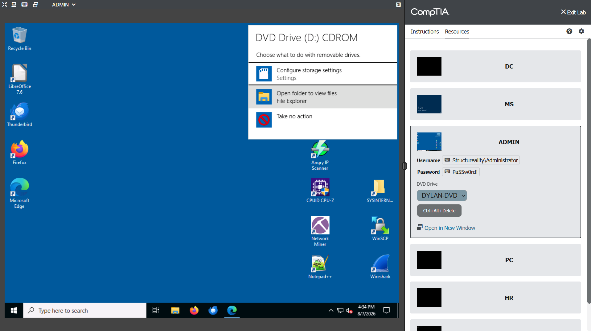

### ขั้นตอนที่ 13: ตรวจผลจาก Windows Defender

1. ทดสอบเปิด `slipatch2.exe` ภายใน Lab environment
2. สังเกต Windows Security notification
3. เปิด `Windows Security > Virus & threat protection`
4. ตรวจชื่อ threat

ผลที่พบคือ:

```text
Trojan:Win64/Meterpreter.B
```

ดังนั้นคำตอบของ `Windows Defender classification` คือ `Trojan`

เหตุผลที่ไม่ตอบชื่อเต็มของ signature เพราะช่องรายงานถามประเภทของมัลแวร์ ซึ่ง Windows Defender ระบุชัดว่าเป็น Trojan

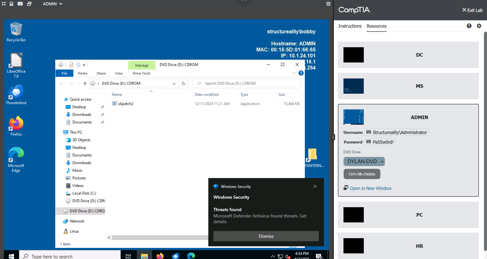

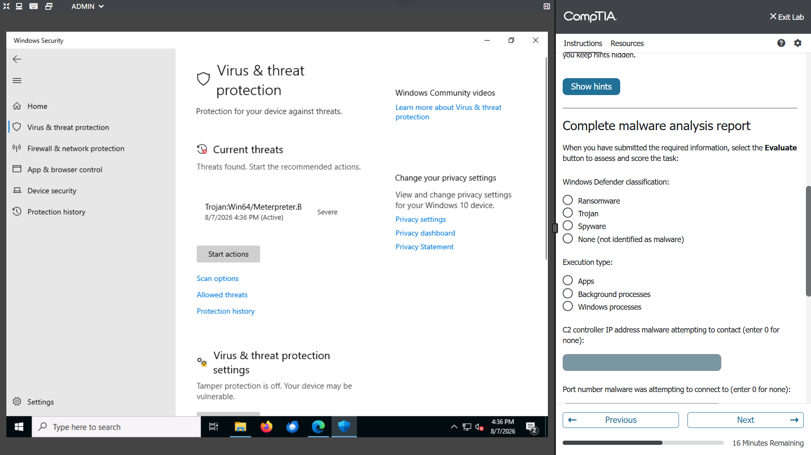

> ในระบบจริงไม่ควรรันไฟล์ต้องสงสัยบน production workstation การวิเคราะห์ควรทำใน sandbox หรือเครื่องที่แยกออกจากเครือข่าย ขั้นตอนนี้ทำได้เพราะเป็น Lab environment ที่ออกแบบมาสำหรับการวิเคราะห์โดยเฉพาะ

### ขั้นตอนที่ 14: ตรวจ Execution type ด้วย Task Manager

1. เปิด `Task Manager`
2. ไปที่หน้า `Processes`
3. มองหา `slipatch2.exe`
4. ตรวจว่า process อยู่ภายใต้หัวข้อ `Apps`

ดังนั้นคำตอบของ `Execution type` คือ:

```text
Apps
```

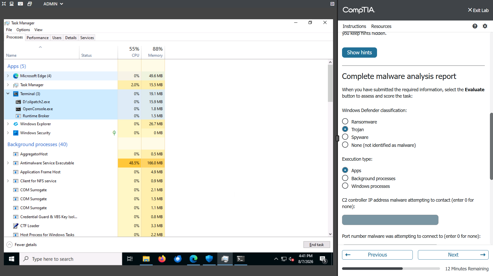

### ขั้นตอนที่ 15: ตรวจ Network activity ด้วย Resource Monitor

1. เปิด `Resource Monitor`
2. ไปที่แท็บ `Network`
3. ขยาย `Processes with Network Activity`
4. เลือกหรือมองหา `slipatch2.exe`
5. ตรวจ `TCP Connections`
6. จด PID, remote address และ remote port

ผลที่พบในภาพคือ:

```text
Process: slipatch2.exe
PID: 1184
Remote address: 10.1.24.66
Remote port: 443
```

PID เป็นค่าที่ระบบสร้างตอน process เริ่มทำงาน จึงเปลี่ยนได้ทุกครั้ง ห้ามใช้ `1184` เป็นค่าตายตัวใน Lab รอบใหม่

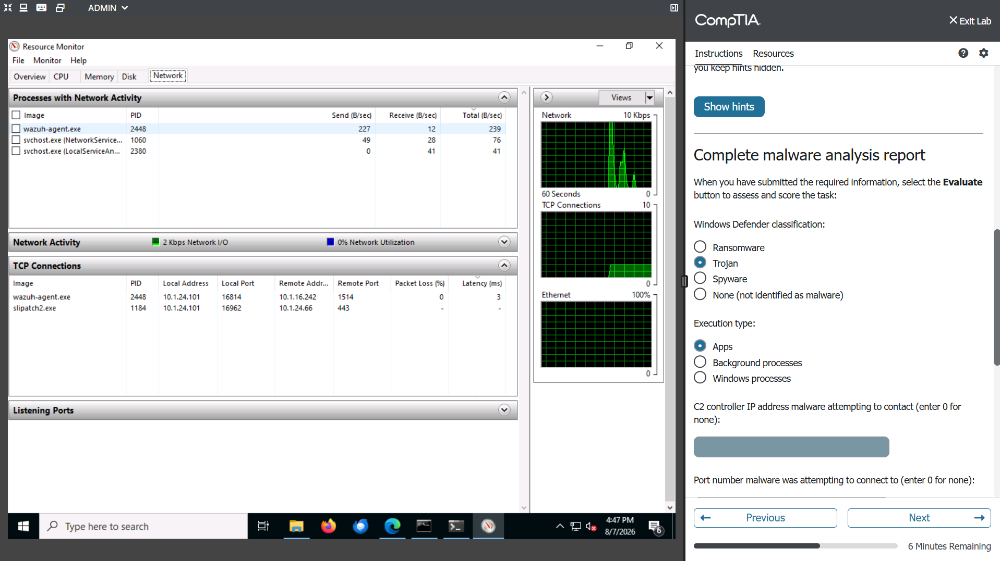

### ขั้นตอนที่ 16: ยืนยันการเชื่อมต่อด้วย netstat

1. เปิด Command Prompt หรือ Terminal แบบ Administrator
2. ใช้ PID ที่เห็นจาก Resource Monitor:

```powershell
netstat -ano | findstr 1184
```

รูปแบบทั่วไปที่ควรใช้เมื่อ PID เปลี่ยนคือ:

```powershell
netstat -ano | findstr <PID>
```

ผลที่พบในรอบนี้คือ:

```text
TCP  10.1.24.101:<dynamic-port>  10.1.24.66:443  SYN_SENT  1184
```

`SYN_SENT` หมายความว่าเครื่องส่งคำขอเริ่ม TCP connection ออกไปแล้ว แต่ยังไม่ได้รับการตอบกลับเพื่อทำ three-way handshake ให้สมบูรณ์ ดังนั้นต้องตอบว่า `Connection established: No`

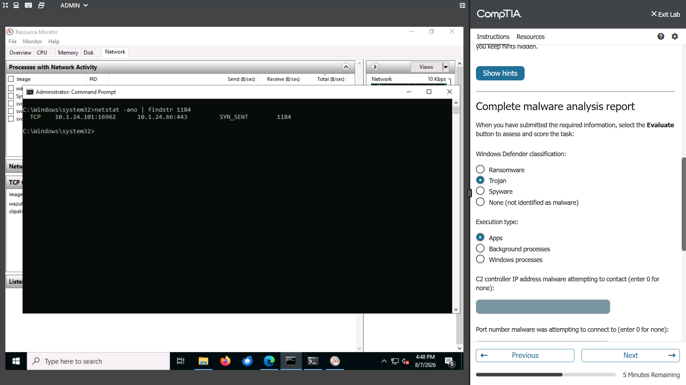

### ขั้นตอนที่ 17: กรอก Malware Analysis Report

กรอกข้อมูลดังนี้:

| Field | Answer |
| --- | --- |
| Windows Defender classification | Trojan |
| Execution type | Apps |
| C2 controller IP address | 10.1.24.66 |
| Port | 443 |
| Connection established | No |
| C2 controller connection response | Destination host unreachable/request timed out |

เหตุผลที่เลือก `Destination host unreachable/request timed out` เพราะการเชื่อมต่อค้างที่ `SYN_SENT` และไม่สามารถสร้าง session กับ C2 server ได้สำเร็จ

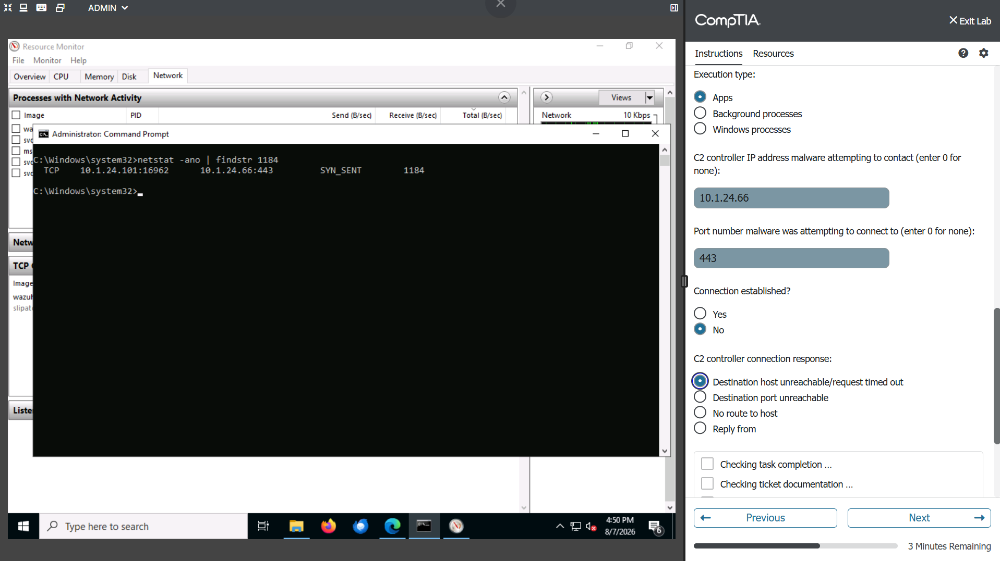

หลังเก็บหลักฐานครบแล้ว ในงานจริงควร contain หรือ quarantine threat และยกเลิก exception ชั่วคราวที่อาจใช้ระหว่างการวิเคราะห์ แต่ภาพชุดนี้ไม่มีขั้นตอนดังกล่าวเป็นรายการประเมินโดยตรง จึงไม่ควรนำไปปะปนกับคำตอบของ report

### ขั้นตอนที่ 18: ตอบและปิด Ticket เป็น Resolved

1. กลับ Ticket `Infected disc`
2. Post Reply ว่า `Done` หรือเขียนรายละเอียด เช่น:

```text
Analyzed slipatch2.exe with Windows Defender, Task Manager,
Resource Monitor, and netstat. The file was identified as a Trojan.
It attempted to contact 10.1.24.66 on TCP port 443, but the connection
was not established.
```

3. เปลี่ยน Ticket Status เป็น `Resolved`
4. ใส่ข้อความ `Done`
5. กดยืนยันปิด Ticket

เหตุผลที่ปิด Ticket นี้ได้ เพราะรวบรวมข้อมูลตาม report ครบและจบขอบเขตงานที่ได้รับมอบหมายแล้ว ไม่ได้มี procedure กำหนดให้ส่งต่อ Level 2

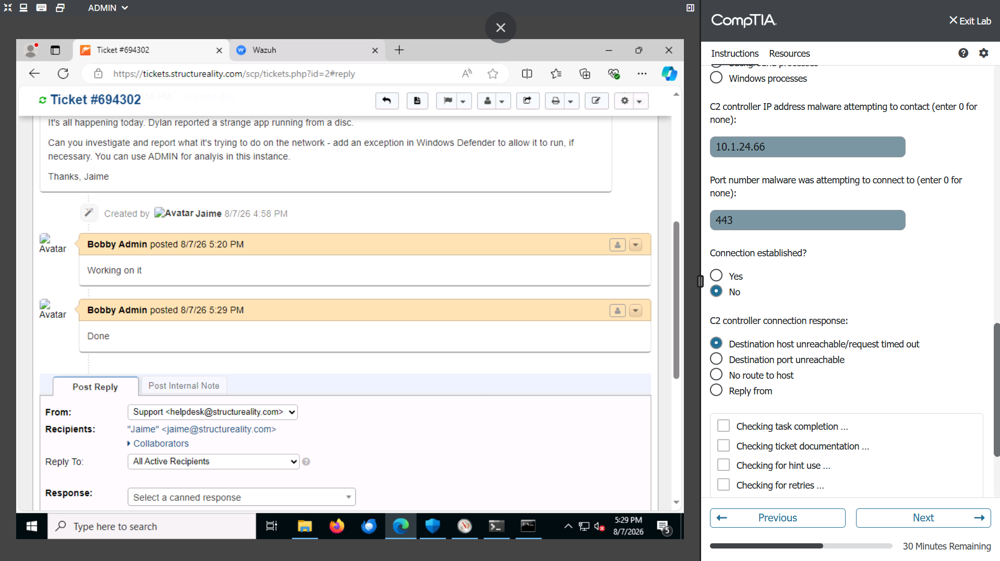

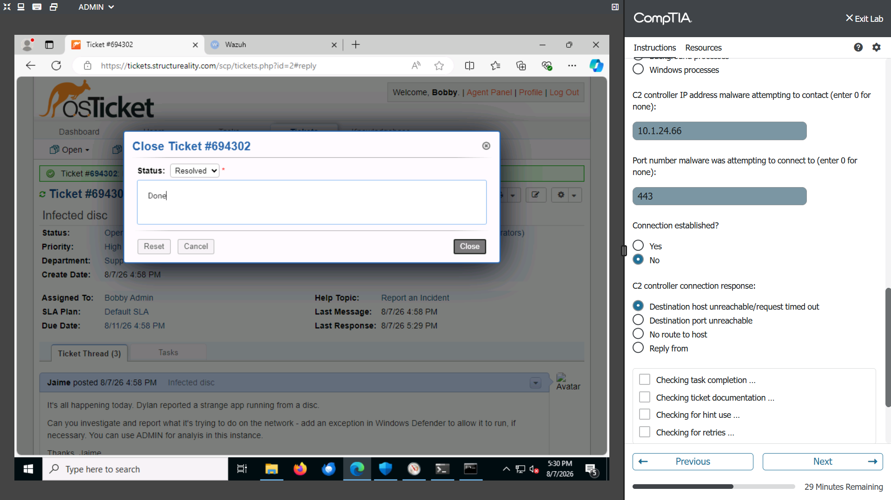

### ขั้นตอนที่ 19: ตรวจคำตอบและ Evaluate Task 2

1. ตรวจว่าคำตอบทั้ง 6 ช่องขึ้น `Correct`
2. ติ๊ก Checklist ให้ครบ
3. กด `Evaluate`
4. ตรวจว่าระบบพบการใช้เครื่องมือวิเคราะห์ การ Claim และการปิด Ticket

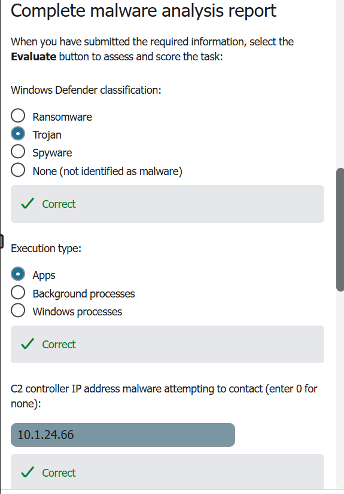

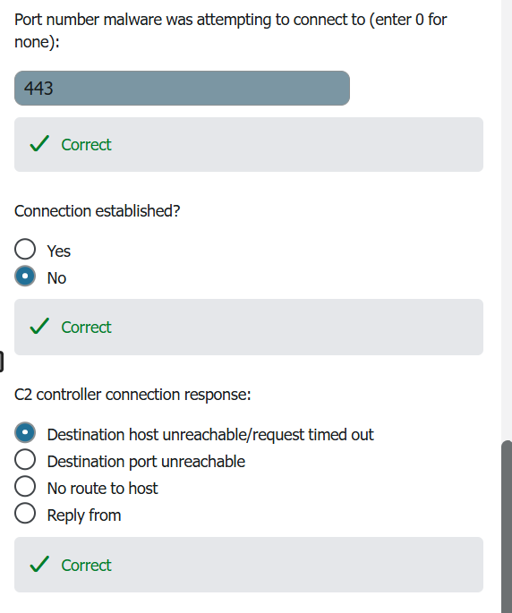

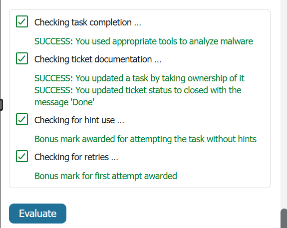

## Task 3: Manage compliance issues

### ขั้นตอนที่ 20: เปิดและ Claim Ticket PC compliance issues

1. เปิด Ticket `PC compliance issues`
2. อ่านรายละเอียดว่าอาจมีทั้ง unauthorized application และเอกสารที่มี personal data
3. กด `Claim`
4. ใส่ข้อความ:

```text
Working on it
```

5. ยืนยันการรับ Ticket

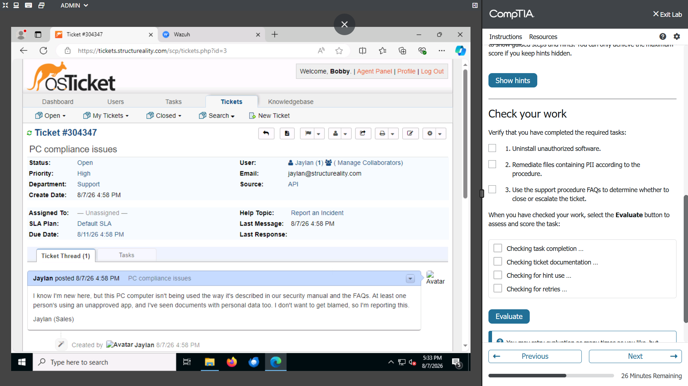

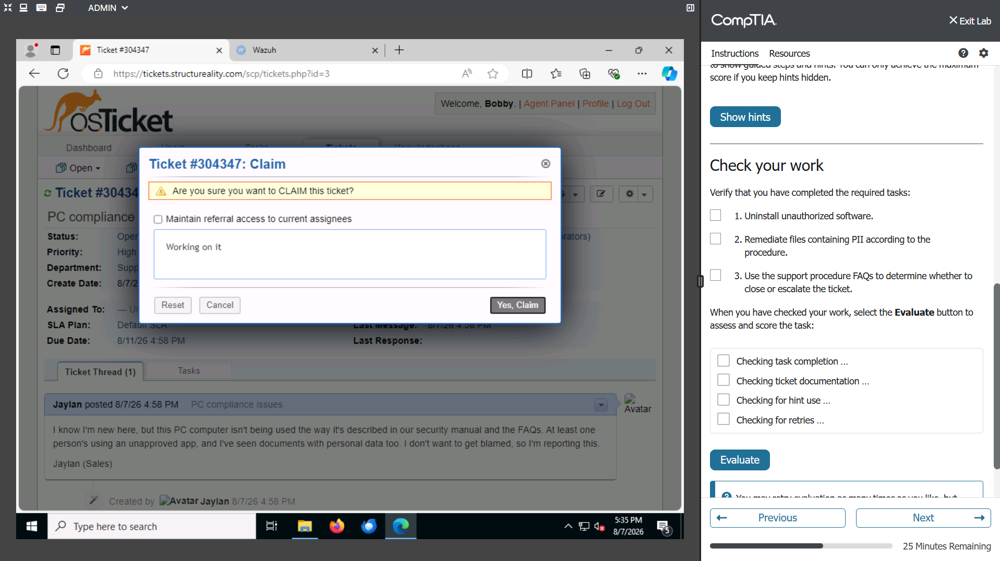

### ขั้นตอนที่ 21: อ่าน Supported software และ PII FAQ

1. ไปที่ `Knowledgebase > Support Procedures`
2. เปิด `Supported software`
3. ใช้รายการนี้เป็น allowlist สำหรับเปรียบเทียบโปรแกรมในเครื่อง
4. เปิด `PII` FAQ
5. จดตำแหน่งที่ใช้เก็บไฟล์ต้องสงสัย:

```text
\\MS\COMPLIANCE
```

โปรแกรมสำคัญที่อนุญาตบน employee workstation ประกอบด้วย CPUID, HeavyLoad, LibreOffice, Microsoft Edge, Microsoft Visual C++ Redistributable, Mozilla applications, Nmap/Npcap, Notepad++, Sysinternals, WinSCP และ Wireshark

`Joplin` ไม่ปรากฏใน Supported software FAQ จึงถือเป็น unauthorized software หรือ Shadow IT ใน Lab นี้

เหตุผลที่ต้องอ่าน FAQ ก่อนตรวจ เพราะเราไม่สามารถตัดสินว่าโปรแกรมผิด policy จากความรู้สึกส่วนตัว ต้องใช้รายการที่องค์กรอนุมัติเป็นเกณฑ์เดียวกัน

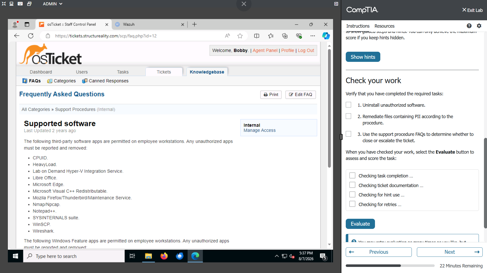

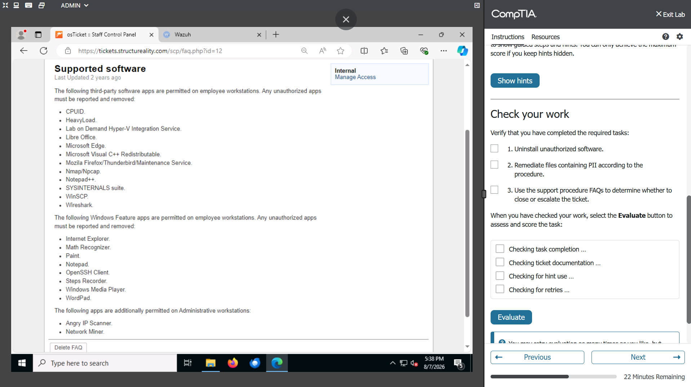

PII procedure ระบุว่าเอกสารที่มีข้อมูลส่วนบุคคลห้ามเก็บไว้บน client PC และต้องย้ายไป `\\MS\COMPLIANCE` เพื่อให้ทีมที่รับผิดชอบวิเคราะห์ต่อ ห้ามคัดลอกค่าข้อมูลส่วนบุคคลลงใน Ticket

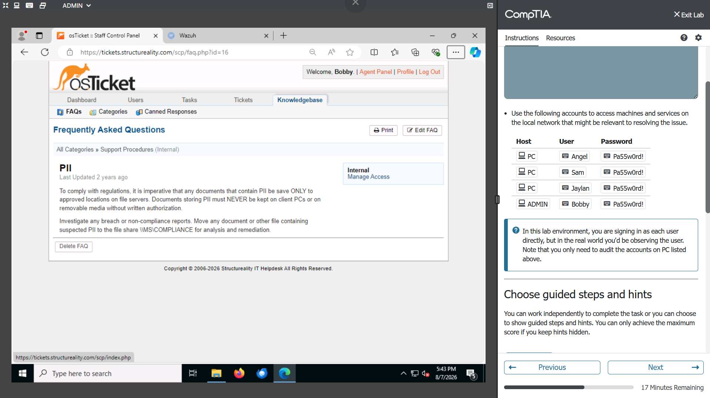

### ขั้นตอนที่ 22: ตรวจบัญชี Angel และระบุไฟล์ PII

1. เข้าเครื่อง `PC`
2. Login เป็น `Angel`
3. ตรวจรายการโปรแกรม พบว่าไม่มีโปรแกรมที่ขัดกับ Supported software FAQ
4. ตรวจ `Desktop`, `Downloads` และ `Documents`
5. ใน `Documents` พบไฟล์และโฟลเดอร์สำคัญ ได้แก่:

```text
PIPELINE
TEMPLATES
CORPORATE
CUSTOMERS
SALES
```

6. ตรวจใน `PIPELINE` พบ `REPORT-CORPNET` และ `REPORT-ROBOGOTO`
7. สรุปไฟล์ที่มี PII และต้องย้ายคือ:

```text
CUSTOMERS
SALES
REPORT-CORPNET
```

`REPORT-ROBOGOTO` ไม่ใช่ไฟล์ที่ต้องย้ายใน Lab instance นี้

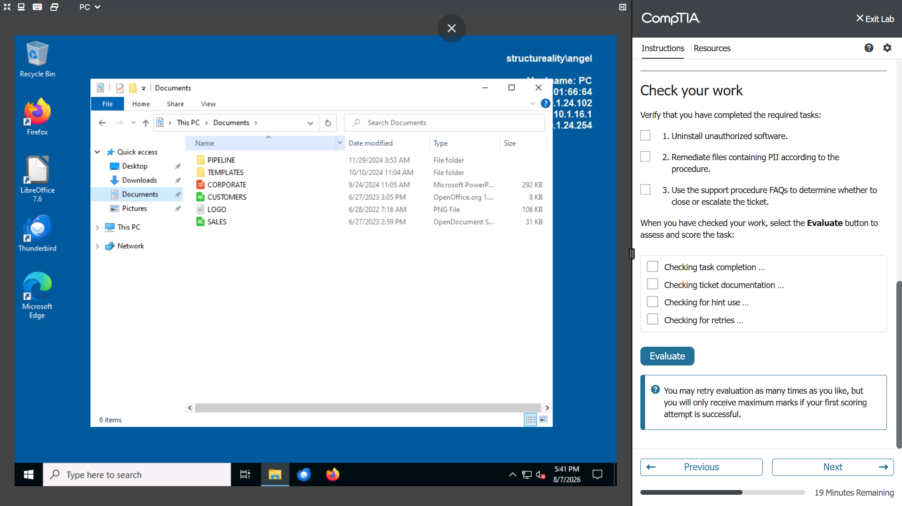

### ขั้นตอนที่ 23: ย้ายไฟล์ PII ไปยัง Compliance share

หากบัญชี Angel ไม่มีสิทธิ์เขียนไปยัง share ให้เปลี่ยนมาใช้บัญชีผู้ดูแล `Bobby` บนเครื่อง `PC` แล้วทำดังนี้:

1. เปิด:

```text
C:\Users\Angel\Documents
```

2. Cut ไฟล์ `CUSTOMERS` และ `SALES`
3. เปิด:

```text
C:\Users\Angel\Documents\PIPELINE
```

4. Cut ไฟล์ `REPORT-CORPNET`
5. เปิด:

```text
\\MS\COMPLIANCE
```

6. Paste ทั้ง 3 ไฟล์
7. ตรวจว่า Compliance share มี `CUSTOMERS`, `SALES` และ `REPORT-CORPNET`
8. กลับไปตรวจ Documents ของ Angel ว่าไฟล์ถูกย้ายออกแล้ว
9. ตรวจ `PIPELINE` ว่าเหลือ `REPORT-ROBOGOTO`

เหตุผลที่ใช้ Cut/Move ไม่ใช่ Copy เพราะ PII procedure ต้องการนำข้อมูลออกจาก client PC เพื่อลดความเสี่ยงที่ข้อมูลจะยังคงอยู่ใน profile ของผู้ใช้

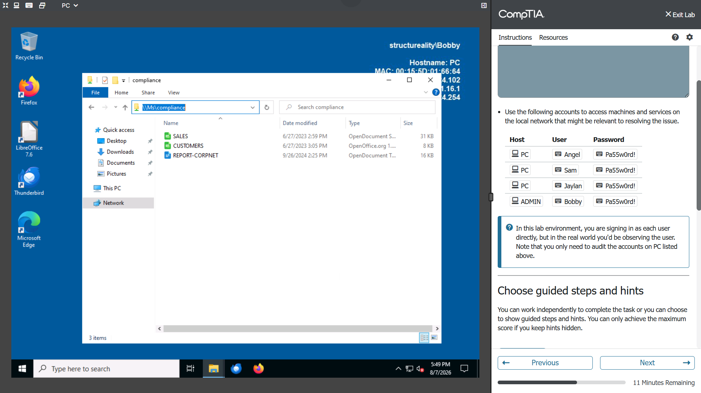

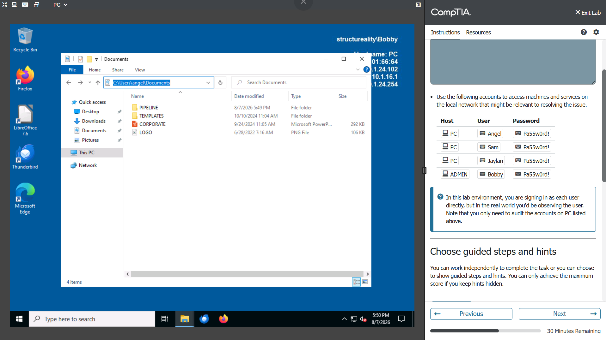

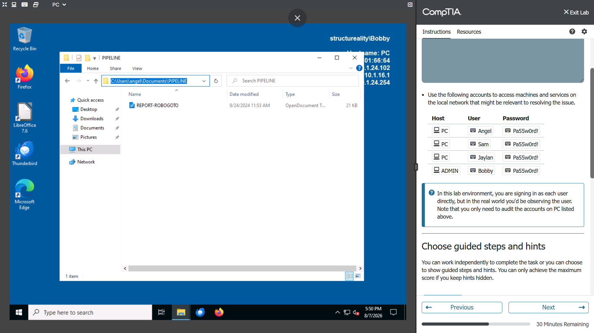

### ขั้นตอนที่ 24: ตรวจ Sam และถอน Joplin

1. Login เครื่อง `PC` เป็น `Sam`
2. เปิด `Settings > Apps > Apps & features`
3. พบ `Joplin 2.14.23`
4. เปรียบเทียบกับ Supported software FAQ
5. เนื่องจากไม่มี Joplin ใน allowlist ให้เลือก `Uninstall`
6. รอจน Joplin หายจากรายการ
7. ตรวจ `Desktop`, `Documents` และ `Downloads`
8. ไม่พบไฟล์ PII ของ Sam

เหตุผลที่ต้องถอน Joplin แม้โปรแกรมอาจเป็นโปรแกรมจดบันทึกทั่วไป เพราะในบริบทขององค์กร โปรแกรมที่ไม่ได้อยู่ใน allowlist ถือเป็น Shadow IT ซึ่งอาจไม่ได้รับการ patch, monitoring หรืออนุมัติด้านการจัดเก็บข้อมูล

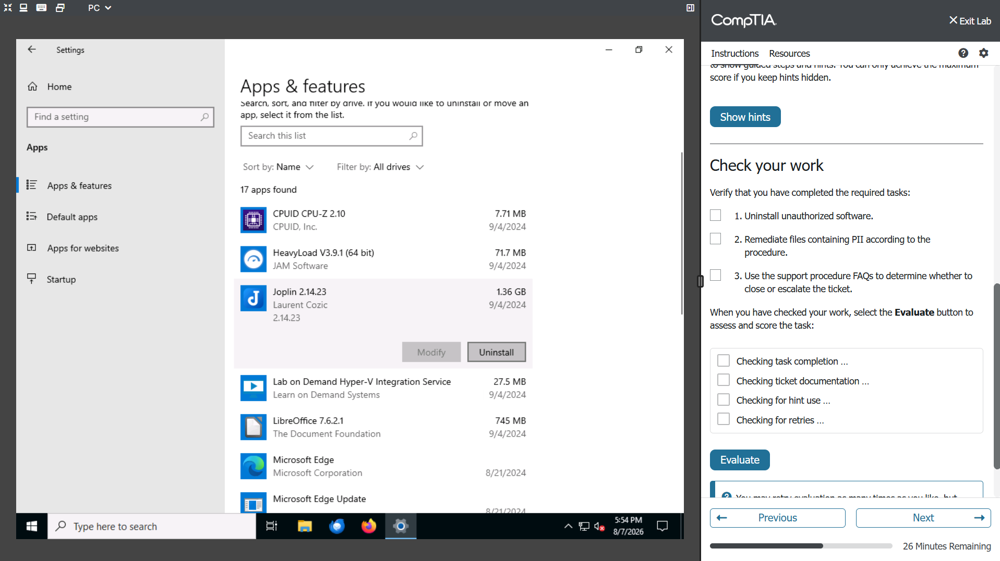

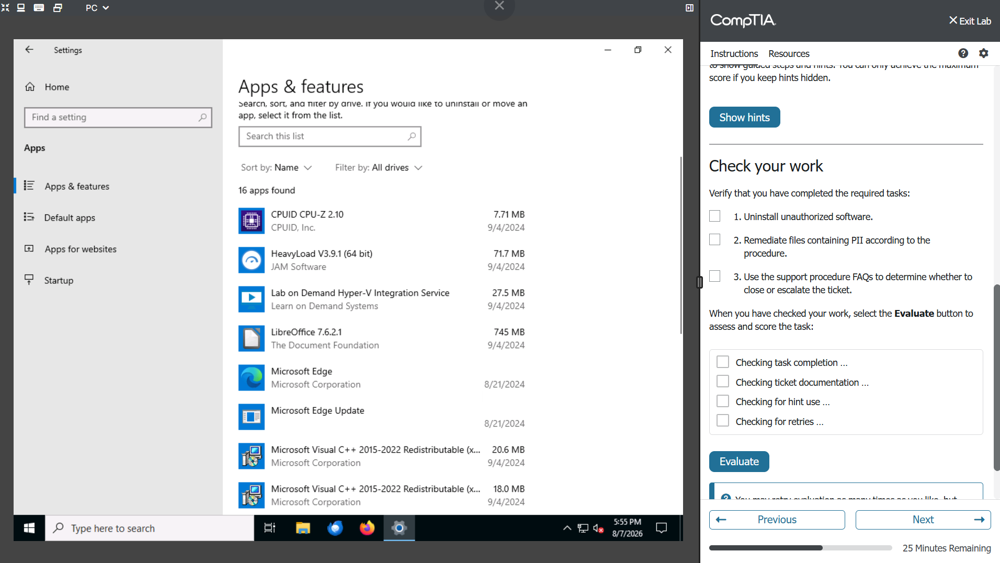

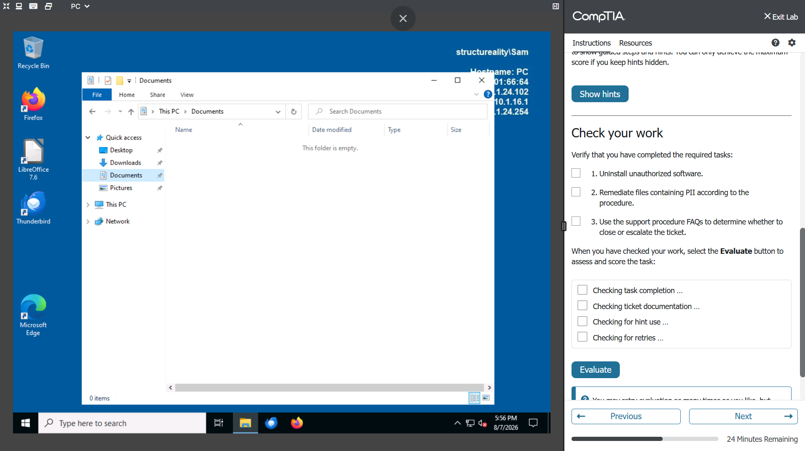

### ขั้นตอนที่ 25: ตรวจ Jaylan

1. Login เครื่อง `PC` เป็น `Jaylan`
2. ตรวจรายการโปรแกรม ไม่พบโปรแกรมที่ไม่ได้รับอนุญาต
3. ตรวจ `Desktop`, `Documents` และ `Downloads`
4. ไม่พบไฟล์ PII

ดังนั้น Jaylan ไม่ต้องมี remediation เพิ่มเติม

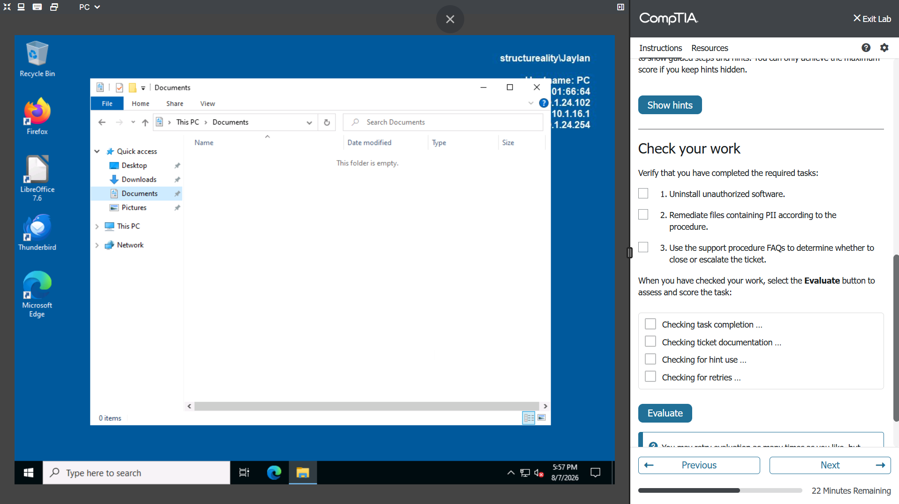

### ขั้นตอนที่ 26: สรุปผล Compliance audit

| User | Unauthorized software | PII ที่ต้องย้าย |
| --- | --- | --- |
| Angel | ไม่พบ | CUSTOMERS, SALES, REPORT-CORPNET |
| Sam | Joplin 2.14.23 | ไม่พบ |
| Jaylan | ไม่พบ | ไม่พบ |

Remediation ที่ทำคือ:

```text
Uninstall Joplin 2.14.23
Move CUSTOMERS to \\MS\COMPLIANCE
Move SALES to \\MS\COMPLIANCE
Move REPORT-CORPNET to \\MS\COMPLIANCE
```

### ขั้นตอนที่ 27: ตอบ Ticket และ Escalate ไป Level 2 Support

1. กลับ Ticket `PC compliance issues`
2. Post Reply ว่า `Done` หรือใช้ข้อความที่ให้รายละเอียดมากกว่า:

```text
Audited the Angel, Sam, and Jaylan profiles. Removed the unauthorized
Joplin application and moved suspected PII files to \\MS\COMPLIANCE
according to the support procedure. Escalating to Level 2 Support.
```

3. ห้ามใส่ข้อมูล PII จริงลงใน Ticket
4. เลือก Assignment แบบ `Team`
5. เลือก `Level 2 Support`
6. ใส่ข้อความ `Done`
7. กด `Assign`

เหตุผลที่ต้อง escalate เพราะมีความเป็นไปได้ว่าข้อมูลส่วนบุคคลหรือข้อมูลบริษัทเคยถูกเก็บผิดตำแหน่ง ทีม Level 2 ต้องตรวจสอบขอบเขตและผลกระทบต่อไป

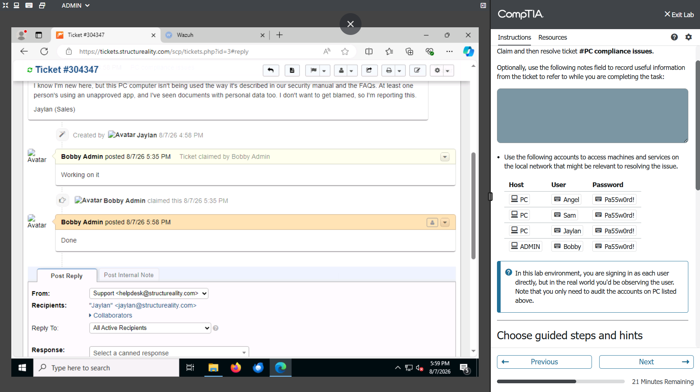

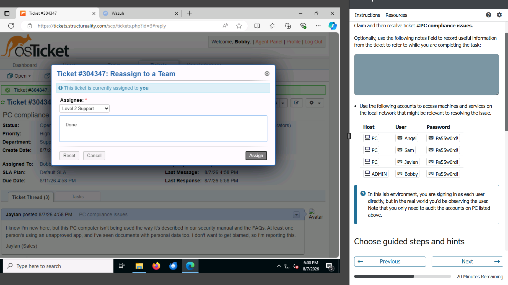

### ขั้นตอนที่ 28: Evaluate Task 3

1. ติ๊ก Checklist ให้ครบ:
   - Uninstall unauthorized software
   - Remediate files containing PII
   - Use Support Procedure FAQ to determine whether to close or escalate
2. กด `Evaluate`
3. ตรวจว่าระบบพบทั้ง PII remediation, Shadow IT remediation และการ escalate Ticket

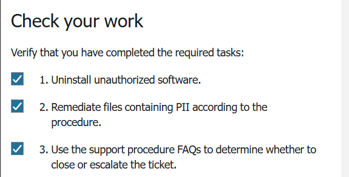

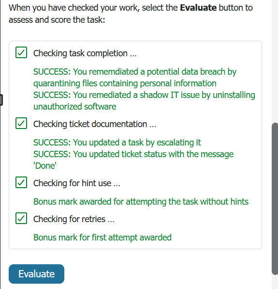

### ขั้นตอนที่ 29: ตรวจคะแนนรวม

หลังทำทั้ง 3 Tasks ครบ ให้ตรวจผลลัพธ์สุดท้ายของ Lab

ผลที่ได้ในรอบนี้คือ:

```text
Score: 100/100
Task 1: 33/33
Task 2: Completed
Task 3: Completed
```

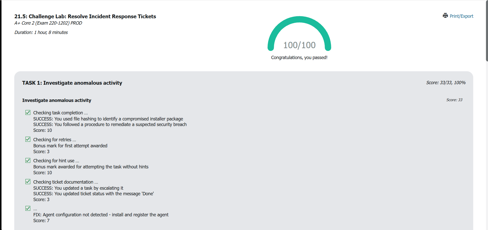

## จุดที่มักทำผิดใน Lab นี้

1. Hash หรือติดตั้ง Wazuh จากไฟล์ผิดตัว เพราะ suspect installer และ verified installer ใช้ชื่อเดียวกัน
2. ใช้ `Copy-Item` แทน `Move-Item` ทำให้ suspect installer ยังอยู่ใน Downloads
3. ลืมสร้าง `C:\SETUP\wazuh-hash.txt`
4. ใส่ Manager IP ผิด หรือลืมกด `Save`, `Restart` และ `Refresh` จน Authentication key ปรากฏ
5. ตอบ Task 1 ว่าสำเร็จก่อนตรวจว่า `HR` เป็น Active ใน SIEM
6. ทำภาพ Task 2 ตามลำดับชื่อไฟล์เดิม ทำให้ภาพเปิด Ticket ไปอยู่หลังขั้นตอนวิเคราะห์มัลแวร์
7. ใช้ PID จากตัวอย่างตายตัว ทั้งที่ PID ของ `slipatch2.exe` เปลี่ยนทุกครั้ง
8. เห็น `SYN_SENT` แล้วตอบว่า connection established ทั้งที่ handshake ยังไม่สำเร็จ
9. ปิด Task 1 หรือ Task 3 เป็น Resolved ทั้งที่ต้อง escalate ไป `Level 2 Support`
10. ย้าย `REPORT-ROBOGOTO` ทั้งที่ไฟล์ PII ที่ Lab ตรวจคือ `REPORT-CORPNET`
11. ลบไฟล์ PII ทิ้งแทนการย้ายไป `\\MS\COMPLIANCE`
12. ใส่ค่า PII จริงลงใน Ticket ซึ่งเพิ่มความเสี่ยงด้านข้อมูลแทนที่จะลดความเสี่ยง

## สรุปผล

Lab นี้เริ่มจากการตรวจสอบ Wazuh installer ที่น่าสงสัยด้วย SHA-256 จากนั้นย้ายไฟล์ออกจาก Downloads เก็บ hash เป็นหลักฐาน ดาวน์โหลด installer ที่ตรวจสอบแล้ว ติดตั้ง Wazuh Agent และยืนยันว่าเครื่อง `HR` ปรากฏเป็น Active ใน SIEM ก่อนส่งต่อ Ticket ให้ Level 2 Support

ใน Task วิเคราะห์มัลแวร์ ได้ใช้ Windows Defender ระบุว่า `slipatch2.exe` เป็น Trojan ใช้ Task Manager ยืนยันว่าอยู่ในกลุ่ม Apps และใช้ Resource Monitor ร่วมกับ `netstat` พบว่าพยายามติดต่อ `10.1.24.66:443` แต่ connection ยังอยู่ในสถานะ `SYN_SENT` จึงตอบว่าไม่ได้เชื่อมต่อสำเร็จ แล้วปิด Ticket เป็น Resolved

Task สุดท้ายได้ตรวจบัญชี Angel, Sam และ Jaylan พบ Joplin เป็น Shadow IT ในบัญชี Sam และพบไฟล์ PII สามรายการใน profile ของ Angel จึงถอน Joplin และย้ายไฟล์ไป `\\MS\COMPLIANCE` ก่อน escalate Ticket ให้ Level 2 Support ตรวจสอบต่อ ผลลัพธ์สุดท้ายของ Lab คือ `100/100`

## สิ่งที่ได้เรียนรู้

Lab นี้แสดงให้เห็นว่า Incident Response ไม่ใช่แค่การลบไฟล์หรือถอนโปรแกรม แต่ต้องเริ่มจากการอ่าน Ticket และ procedure เก็บหลักฐานให้ตรวจสอบย้อนหลังได้ ใช้หลายเครื่องมือยืนยันพฤติกรรมจริง ทำ remediation ให้ตรงกับ policy และบันทึกผลก่อนเลือกสถานะ Ticket ที่เหมาะสม

อีกประเด็นสำคัญคือการแยกระหว่างการแก้ปัญหาที่จบได้ในระดับปัจจุบันกับเหตุการณ์ที่ต้อง escalate เมื่อพบความเสี่ยงต่อระบบหรือข้อมูลส่วนบุคคล การส่งต่อพร้อมบันทึกที่ชัดเจนช่วยให้ทีมระดับถัดไปทำ investigation ต่อได้โดยไม่ต้องเริ่มต้นใหม่ทั้งหมด
