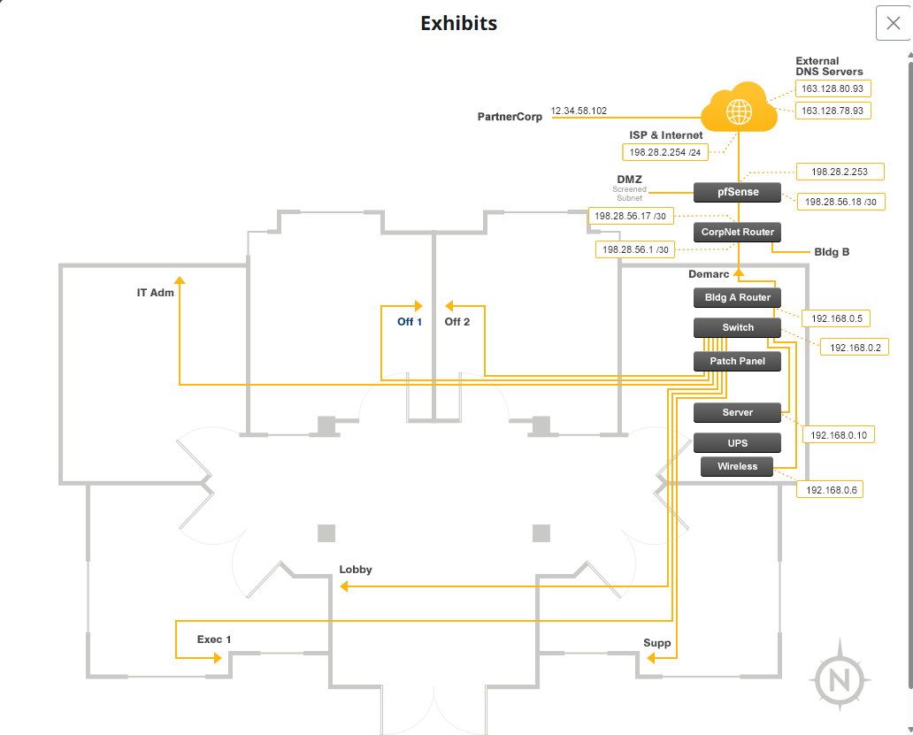
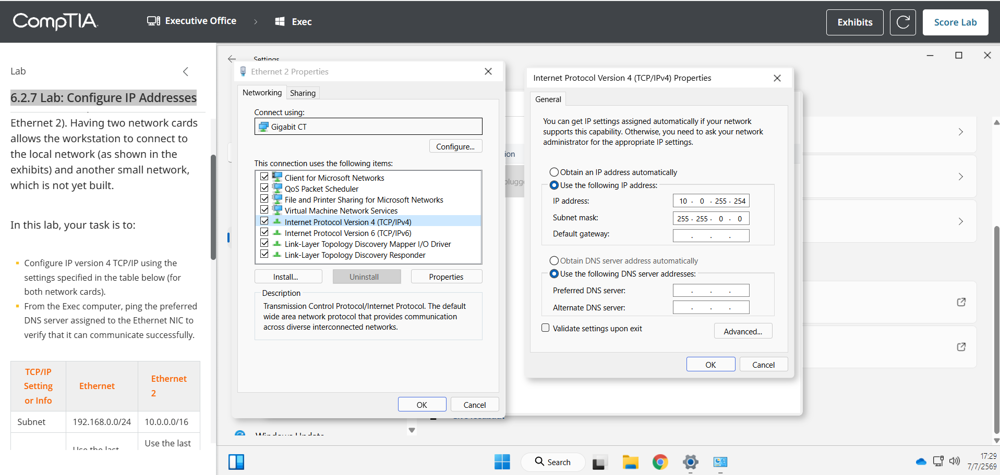
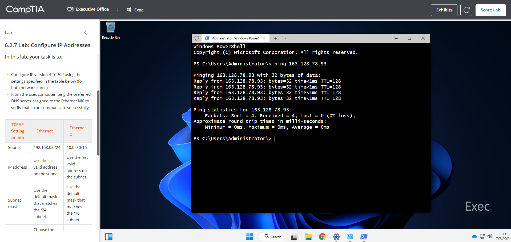
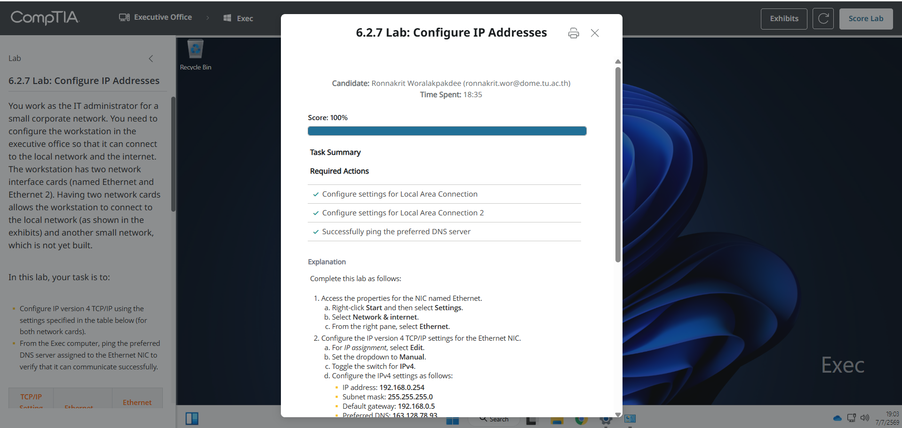

# 6.2.7 Lab: Configure IP Addresses

## ข้อมูลผู้ทำ Lab

- ชื่อ Lab: 6.2.7 Lab: Configure IP Addresses
- หัวข้อ: การตั้งค่า IPv4 Address ให้กับ Network Interface Card
- เครื่องที่ใช้งาน: Exec
- ผลลัพธ์สุดท้าย: ทำ Lab สำเร็จและได้คะแนน 100%

## ตอนนี้กำลังจะทำอะไร

ใน Lab นี้กำลังจะตั้งค่า IPv4 แบบ Manual/Static ให้กับการ์ดเครือข่าย 2 ตัวบนเครื่อง Exec ได้แก่ `Ethernet` และ `Ethernet 2`

เหตุผลที่ต้องทำแบบนี้คือเครื่อง Exec ต้องเชื่อมต่อกับเครือข่ายภายในบริษัทและสามารถออกไปยัง DNS server ภายนอกได้ โดย `Ethernet` ใช้สำหรับเชื่อมต่อกับ local network ส่วน `Ethernet 2` เตรียมไว้สำหรับเชื่อมต่อกับอีกเครือข่ายหนึ่งที่ยังไม่ได้สร้าง จึงต้องตั้งค่า IP ให้ถูกต้องตาม subnet ที่กำหนดในโจทย์

## วัตถุประสงค์

วัตถุประสงค์ของ Lab นี้คือการกำหนดค่า IPv4 ให้ถูกต้องกับ network adapter ทั้งสองตัว และทดสอบว่าเครื่อง Exec สามารถติดต่อกับ preferred DNS server ได้สำเร็จด้วยคำสั่ง `ping`

สิ่งที่ต้องทำมีดังนี้:

1. ตั้งค่า IPv4 ให้กับ `Ethernet`
2. ตั้งค่า IPv4 ให้กับ `Ethernet 2`
3. ทดสอบการเชื่อมต่อโดย ping ไปยัง preferred DNS server
4. ตรวจสอบผลลัพธ์ด้วย `Score Lab`

## ข้อมูลจาก Exhibit

จากแผนผังเครือข่ายใน Exhibit พบข้อมูลสำคัญดังนี้:

- Default gateway ของเครือข่าย `192.168.0.0/24` คือ `192.168.0.5`
- External DNS servers คือ `163.128.78.93` และ `163.128.80.93`
- เครื่อง Exec ใช้ network adapter สองตัว คือ `Ethernet` และ `Ethernet 2`

เหตุผลที่ต้องดู Exhibit ก่อน เพราะโจทย์ไม่ได้ให้ค่า default gateway และ DNS server ในตารางโดยตรง แต่บอกให้เลือกจากแผนผังเครือข่าย ดังนั้นต้องอ้างอิงค่าจาก Exhibit เพื่อให้ตั้งค่าได้ถูกต้อง

## ตารางค่าที่ใช้ตั้งค่า

| Adapter | Subnet | IP Address | Subnet Mask | Default Gateway | Preferred DNS | Alternate DNS |
| --- | --- | --- | --- | --- | --- | --- |
| Ethernet | 192.168.0.0/24 | 192.168.0.254 | 255.255.255.0 | 192.168.0.5 | 163.128.78.93 | 163.128.80.93 |
| Ethernet 2 | 10.0.0.0/16 | 10.0.255.254 | 255.255.0.0 | เว้นว่าง | เว้นว่าง | เว้นว่าง |

## วิธีคำนวณ IP Address

### 1. คำนวณ IP สำหรับ Ethernet

โจทย์กำหนด subnet ของ `Ethernet` เป็น:

```text
192.168.0.0/24
```

`/24` หมายความว่า subnet mask คือ:

```text
255.255.255.0
```

เครือข่ายแบบ `/24` มี IP ทั้งหมด 256 addresses ตั้งแต่:

```text
192.168.0.0 ถึง 192.168.0.255
```

โดยแบ่งได้ดังนี้:

```text
Network address: 192.168.0.0
Usable IP range: 192.168.0.1 - 192.168.0.254
Broadcast address: 192.168.0.255
```

โจทย์ให้ใช้ `last valid address` หรือ IP สุดท้ายที่ใช้งานได้ใน subnet ดังนั้น IP ที่ต้องใช้คือ:

```text
192.168.0.254
```

เหตุผลที่ไม่ใช้ `192.168.0.255` เพราะเป็น broadcast address ใช้สำหรับส่งข้อมูลไปยังทุก host ใน subnet เดียวกัน จึงไม่สามารถนำมาใช้เป็น IP ของเครื่องได้

### 2. คำนวณ IP สำหรับ Ethernet 2

โจทย์กำหนด subnet ของ `Ethernet 2` เป็น:

```text
10.0.0.0/16
```

`/16` หมายความว่า subnet mask คือ:

```text
255.255.0.0
```

เครือข่ายแบบ `/16` มี IP ทั้งหมด 65,536 addresses ตั้งแต่:

```text
10.0.0.0 ถึง 10.0.255.255
```

โดยแบ่งได้ดังนี้:

```text
Network address: 10.0.0.0
Usable IP range: 10.0.0.1 - 10.0.255.254
Broadcast address: 10.0.255.255
```

โจทย์ให้ใช้ `last valid address` ดังนั้น IP ที่ต้องใช้คือ:

```text
10.0.255.254
```

เหตุผลที่ไม่ใช้ `10.0.255.255` เพราะเป็น broadcast address ของ subnet `10.0.0.0/16`

## ขั้นตอนการทำ Lab

### ขั้นตอนที่ 1: เปิด Exhibit

1. เข้า Lab `6.2.7 Lab: Configure IP Addresses`
2. กดปุ่ม `Exhibits` ที่มุมขวาบน
3. ตรวจสอบแผนผังเครือข่าย
4. จดค่า default gateway และ DNS server

ค่าที่ได้จาก Exhibit คือ:

```text
Default gateway: 192.168.0.5
Preferred DNS: 163.128.78.93
Alternate DNS: 163.128.80.93
```

เหตุผลที่ต้องทำขั้นตอนนี้ก่อน เพราะต้องรู้ว่า router และ DNS server ใช้ IP อะไร ก่อนนำไปตั้งค่าให้กับ network adapter



ภาพนี้แสดงแผนผังเครือข่ายใน Exhibit โดยใช้ดูค่า default gateway ของเครือข่าย `192.168.0.0/24` และ DNS servers ภายนอก

### ขั้นตอนที่ 2: ตั้งค่า Ethernet

1. คลิกขวาที่ปุ่ม `Start`
2. เลือก `Settings`
3. ไปที่ `Network & internet`
4. เลือก `Advanced network settings`
5. เลือก `More network adapter options`
6. จะเปิดหน้าต่าง `Network Connections`
7. คลิกขวาที่ `Ethernet`
8. เลือก `Properties`
9. เลือก `Internet Protocol Version 4 (TCP/IPv4)`
10. กด `Properties`
11. เลือก `Use the following IP address`
12. กรอกค่าดังนี้:

```text
IP address: 192.168.0.254
Subnet mask: 255.255.255.0
Default gateway: 192.168.0.5
```

13. เลือก `Use the following DNS server addresses`
14. กรอกค่าดังนี้:

```text
Preferred DNS: 163.128.78.93
Alternate DNS: 163.128.80.93
```

15. กด `OK`
16. กด `OK` หรือ `Close` เพื่อปิดหน้าต่าง `Ethernet Properties`

เหตุผลที่เลือก `Use the following IP address` เพราะ Lab ต้องการกำหนด IP address แบบ static ตามค่าที่โจทย์ระบุ ไม่ได้ให้รับ IP อัตโนมัติจาก DHCP

เหตุผลที่ใส่ default gateway เฉพาะ `Ethernet` เพราะ adapter นี้เชื่อมต่อกับ local network ที่มี router สำหรับออกไปยังเครือข่ายอื่นและ internet


ภาพนี้แสดงการตั้งค่า IPv4 ของ `Ethernet` โดยกำหนด IP address, subnet mask, default gateway และ DNS servers สำหรับเชื่อมต่อ local network และ internet

### ขั้นตอนที่ 3: ตั้งค่า Ethernet 2

1. จากหน้าต่าง `Network Connections` เดิม ให้คลิกขวาที่ `Ethernet 2`
2. เลือก `Properties`
3. เลือก `Internet Protocol Version 4 (TCP/IPv4)`
4. กด `Properties`
5. เลือก `Use the following IP address`
6. กรอกค่าดังนี้:

```text
IP address: 10.0.255.254
Subnet mask: 255.255.0.0
Default gateway: เว้นว่าง
Preferred DNS server: เว้นว่าง
Alternate DNS server: เว้นว่าง
```

7. กด `OK`
8. กด `Close`

เหตุผลที่เว้น default gateway และ DNS ของ `Ethernet 2` ไว้ เพราะโจทย์ระบุว่าเครือข่ายที่สองยังไม่ได้สร้าง และให้เว้น gateway/DNS ว่างไว้ เพื่อไม่ให้เครื่องพยายามใช้ adapter นี้เป็นเส้นทางออก internet หรือ DNS



ภาพนี้แสดงการตั้งค่า IPv4 ของ `Ethernet 2` โดยใช้ IP address สุดท้ายที่ใช้งานได้ใน subnet `10.0.0.0/16` และเว้น gateway/DNS ว่างตามที่โจทย์กำหนด

### ขั้นตอนที่ 4: ทดสอบด้วยคำสั่ง Ping

1. คลิกขวาที่ปุ่ม `Start`
2. เลือก `Terminal (Admin)`
3. ที่หน้าต่าง PowerShell ให้พิมพ์คำสั่ง:

```powershell
ping 163.128.78.93
```

4. กด `Enter`
5. ตรวจสอบผลลัพธ์

ผลลัพธ์ที่ถูกต้องควรมีข้อความลักษณะนี้:

```text
Reply from 163.128.78.93
Packets: Sent = 4, Received = 4, Lost = 0 (0% loss)
```

เหตุผลที่ต้อง ping preferred DNS server เพราะโจทย์ต้องการตรวจสอบว่าเครื่อง Exec สามารถสื่อสารออกไปถึง DNS server ที่กำหนดให้กับ `Ethernet` ได้จริง

เหตุผลที่ใช้ `Terminal (Admin)` เพราะใน Lab environment การเปิด `cmd` ผ่านบางวิธีอาจไม่ถูกจำลองไว้ แต่ PowerShell/Terminal สามารถใช้คำสั่ง `ping` ได้เหมือนกัน และตรงกับขั้นตอนที่ระบบแนะนำหลังจากตรวจคะแนน



ภาพนี้แสดงผลการใช้คำสั่ง `ping 163.128.78.93` โดยได้รับ reply ครบ 4 ครั้งและมี packet loss 0% แสดงว่าสามารถติดต่อ DNS server ได้สำเร็จ

### ขั้นตอนที่ 5: ตรวจคะแนน Lab

1. กลับไปที่หน้า Lab
2. กด `Score Lab`
3. ตรวจสอบว่าทุก required action ผ่านครบ

ผลลัพธ์สุดท้าย:

```text
Score: 100%
Configure settings for Local Area Connection: Completed
Configure settings for Local Area Connection 2: Completed
Successfully ping the preferred DNS server: Completed
```



ภาพนี้แสดงผลคะแนน `Score: 100%` และ required actions ทั้งหมดผ่านครบ

## สรุปผล

ใน Lab นี้ได้ตั้งค่า IPv4 แบบ static ให้กับ network adapter ทั้งสองตัวบนเครื่อง Exec โดย `Ethernet` ใช้ IP address สุดท้ายที่ใช้งานได้ใน subnet `192.168.0.0/24` คือ `192.168.0.254` พร้อมตั้งค่า default gateway และ DNS server ตาม Exhibit ส่วน `Ethernet 2` ใช้ IP address สุดท้ายที่ใช้งานได้ใน subnet `10.0.0.0/16` คือ `10.0.255.254` และเว้น gateway/DNS ว่างตามโจทย์

หลังจากตั้งค่าเสร็จ ได้ทดสอบการเชื่อมต่อด้วยคำสั่ง `ping 163.128.78.93` และได้รับ reply พร้อม packet loss 0% แสดงว่าสามารถติดต่อ preferred DNS server ได้สำเร็จ จากนั้นกด `Score Lab` และได้คะแนน 100%
