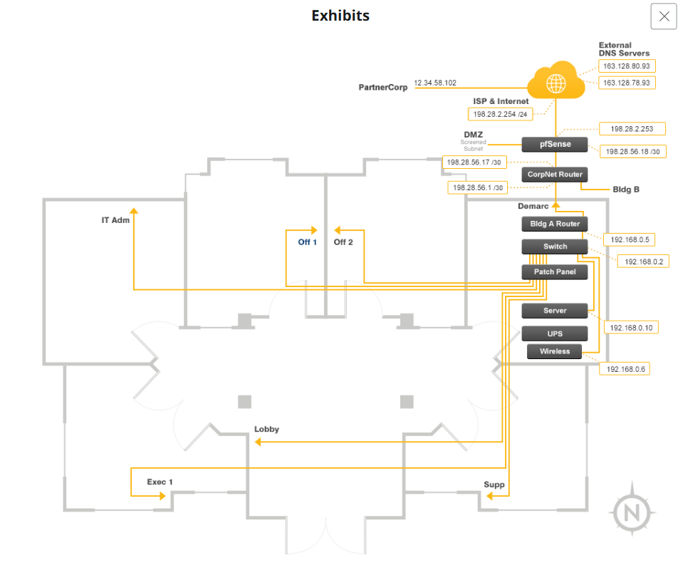
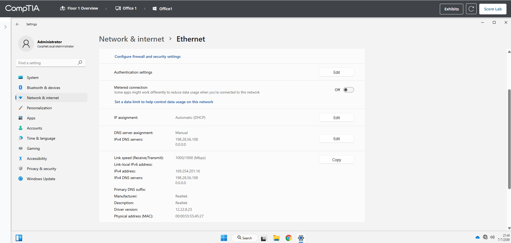
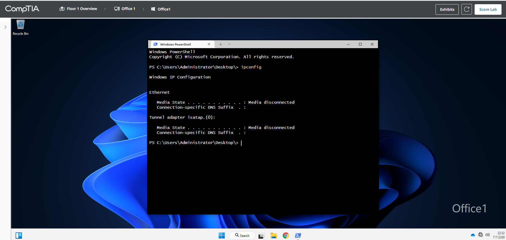
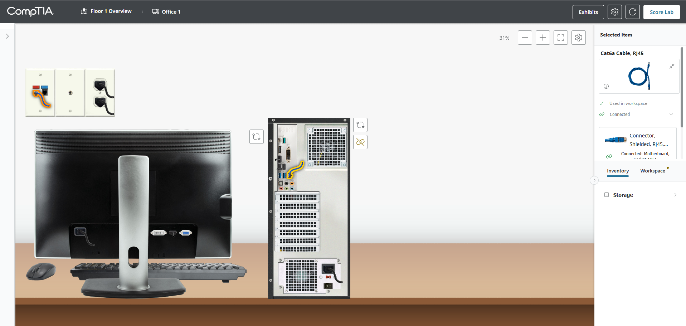
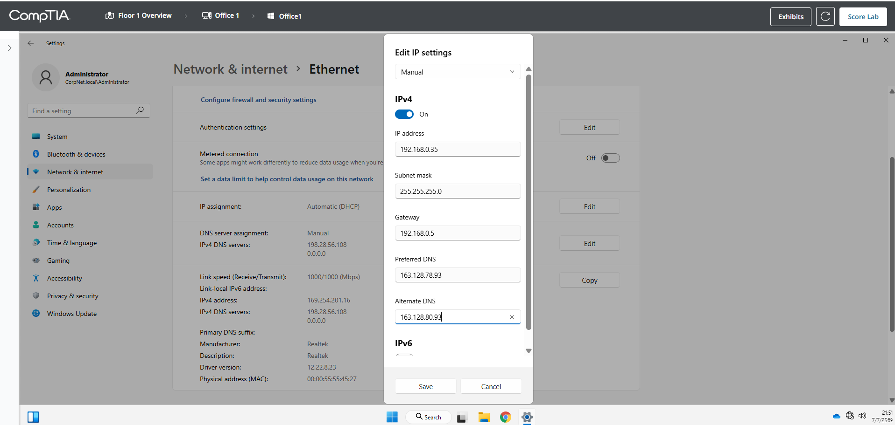
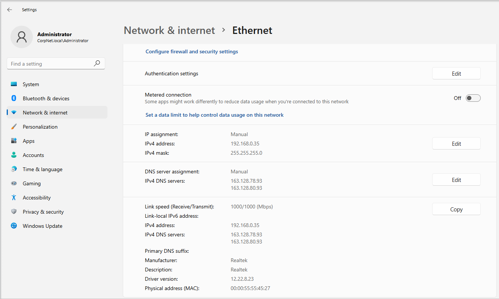
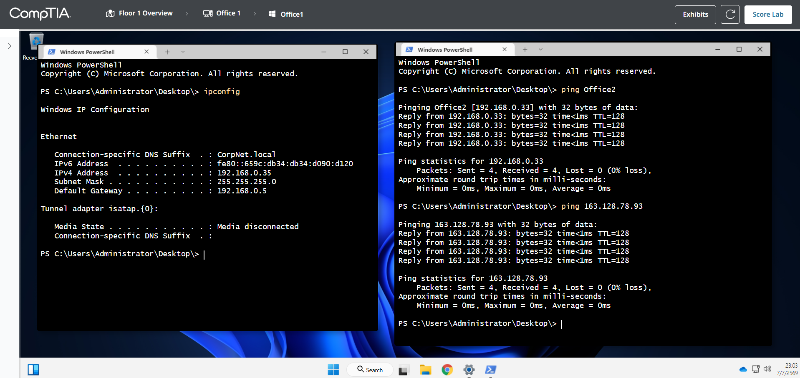
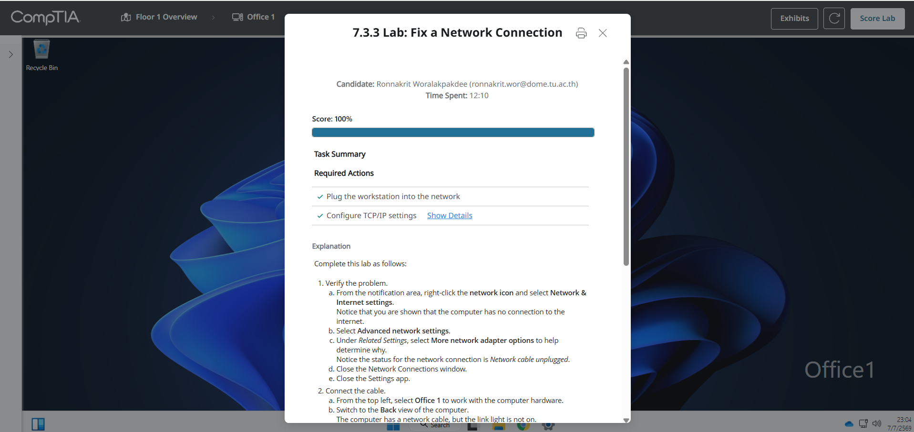

# 7.3.3 Lab: Fix a Network Connection

## ข้อมูลผู้ทำ Lab

- ชื่อ Lab: 7.3.3 Lab: Fix a Network Connection
- หัวข้อ: การตรวจสอบและแก้ไขปัญหาการเชื่อมต่อเครือข่าย
- เครื่องที่ใช้งาน: Office1
- ปัญหาที่พบ: เครื่อง Office1 ไม่สามารถใช้งานเครือข่ายและ internet ได้
- ผลลัพธ์สุดท้าย: ทำ Lab สำเร็จและได้คะแนน 100%

## ตอนนี้กำลังจะทำอะไร

ใน Lab นี้กำลังจะตรวจสอบสาเหตุที่เครื่อง `Office1` ไม่สามารถเชื่อมต่อ network และ internet ได้ จากนั้นจะแก้ไขทั้งส่วน hardware และ software configuration เพื่อให้เครื่องสามารถติดต่อกับเครื่อง `Office2` และ DNS server ได้สำเร็จ

เหตุผลที่ต้องตรวจสอบทั้งสองส่วน เพราะโจทย์ระบุว่าปัญหาอาจเกิดจากการตั้งค่าในระบบปฏิบัติการ ปัญหาจาก hardware หรือเกิดพร้อมกันมากกว่าหนึ่งจุด ดังนั้นจึงไม่ควรแก้เฉพาะ IP address อย่างเดียว แต่ต้องดูสถานะสาย network และค่าการตั้งค่า TCP/IP ด้วย

## วัตถุประสงค์

วัตถุประสงค์ของ Lab นี้คือการวิเคราะห์และแก้ไขปัญหา network connection บนเครื่อง `Office1` ให้กลับมาใช้งานได้ตามปกติ

สิ่งที่ต้องทำมีดังนี้:

1. ตรวจสอบข้อมูลเครือข่ายจาก Exhibit
2. ตรวจสอบอาการผิดปกติของเครื่อง Office1
3. แก้ไขปัญหา hardware โดยต่อสาย network ให้ถูกต้อง
4. แก้ไขการตั้งค่า IPv4 แบบ manual/static
5. ทดสอบการเชื่อมต่อด้วยคำสั่ง `ping`
6. ตรวจสอบผลลัพธ์ด้วย `Score Lab`

## ข้อมูลจากโจทย์และ Exhibit

จากโจทย์และ Exhibit พบข้อมูลสำคัญดังนี้:

- เครือข่ายนี้ไม่มี DHCP server
- เครื่องทุกเครื่องควรใช้ default subnet mask
- IP address ต่ำกว่า `.15` ถูกใช้โดย servers
- IP address ช่วง `.30` ถึง `.34` ถูกใช้โดย workstation เครื่องอื่น
- เครื่อง Office1 ต้องสามารถ ping ไปยัง Office2 และ DNS server ได้
- Default gateway ของ local network คือ `192.168.0.5`
- External DNS servers คือ `163.128.78.93` และ `163.128.80.93`

เหตุผลที่ต้องดู Exhibit ก่อน เพราะ Exhibit ใช้บอกค่าที่จำเป็นในการตั้งค่า network เช่น default gateway, DNS server และตำแหน่งของ Office1/Office2 ในเครือข่าย ถ้าตั้งค่าผิด subnet หรือ gateway ผิด เครื่องจะไม่สามารถออกไปยังเครือข่ายอื่นหรือ internet ได้



ภาพนี้ใช้ดูว่าเครื่อง Office1 อยู่ในเครือข่าย `192.168.0.0/24` และต้องออกไปยังเครือข่ายอื่นผ่าน router ที่ใช้ IP address `192.168.0.5`

## ตารางค่าที่ใช้ตั้งค่า

| รายการ | ค่าที่ใช้ |
| --- | --- |
| Computer | Office1 |
| Network adapter | Ethernet |
| IP address | 192.168.0.35 |
| Subnet mask | 255.255.255.0 |
| Default gateway | 192.168.0.5 |
| Preferred DNS | 163.128.78.93 |
| Alternate DNS | 163.128.80.93 |

## วิธีคำนวณและเลือก IP Address

จาก Exhibit เครื่อง Office1 อยู่ในเครือข่าย:

```text
192.168.0.0/24
```

`/24` หมายความว่า subnet mask คือ:

```text
255.255.255.0
```

เครือข่าย `192.168.0.0/24` มีช่วง IP address ดังนี้:

```text
Network address: 192.168.0.0
Usable IP range: 192.168.0.1 - 192.168.0.254
Broadcast address: 192.168.0.255
```

จากโจทย์ระบุว่า:

```text
IP addresses below .15 are being used by the servers.
IP addresses between .30 and .34 are being used by other workstations.
```

ดังนั้นไม่ควรเลือก IP ต่อไปนี้:

```text
192.168.0.1 - 192.168.0.14
192.168.0.30 - 192.168.0.34
```

IP address ที่เหมาะสมสำหรับ Office1 คือ IP ที่อยู่ใน subnet เดียวกัน ใช้งานได้ และไม่ชนกับเครื่องอื่น จึงเลือก:

```text
192.168.0.35
```

เหตุผลที่เลือก `192.168.0.35` เพราะเป็น IP ถัดจากช่วงที่ถูกใช้โดย workstation อื่นแล้ว และยังอยู่ใน usable range ของ subnet `192.168.0.0/24`

## สาเหตุของปัญหาที่พบ

จากการตรวจสอบพบปัญหาหลัก 2 ส่วน:

1. สาย network ไม่ได้เชื่อมต่อกับเครื่องอย่างถูกต้อง
2. เครื่องตั้งค่า IP เป็น `Automatic (DHCP)` ทั้งที่เครือข่ายนี้ไม่มี DHCP server

เมื่อเครื่องตั้งค่าเป็น DHCP แต่ไม่มี DHCP server เครื่องจะไม่ได้รับ IP address ที่ถูกต้อง และ Windows จะสร้าง IP แบบ APIPA ให้เอง ซึ่งมักขึ้นต้นด้วย `169.254.x.x`

ใน Lab นี้พบว่าเครื่อง Office1 ได้รับ IP address:

```text
169.254.201.16
```

IP address แบบนี้ใช้สื่อสารได้จำกัดเฉพาะบางกรณีใน local link และไม่ใช่ IP ที่ถูกต้องของเครือข่ายบริษัท จึงทำให้เครื่องไม่สามารถ ping ไปยัง Office2 หรือ DNS server ได้

## ขั้นตอนการทำ Lab

### ขั้นตอนที่ 1: ตรวจสอบอาการก่อนแก้ไข

1. เข้าเครื่อง `Office1`
2. เปิด `Settings`
3. ไปที่ `Network & internet`
4. เลือก `Ethernet`
5. ตรวจสอบค่า IP assignment และ IPv4 address

ค่าที่พบก่อนแก้ไขคือ:

```text
IP assignment: Automatic (DHCP)
IPv4 address: 169.254.201.16
DNS server assignment: Manual
IPv4 DNS servers: 198.28.56.108, 0.0.0.0
```

ควรถ่ายรูปตรงนี้ เพราะเป็นหลักฐานว่าเครื่องมีการตั้งค่าผิดตั้งแต่แรก โดยใช้ DHCP ทั้งที่เครือข่ายไม่มี DHCP server และยังมี DNS server ผิดด้วย



ภาพนี้แสดงปัญหาก่อนแก้ไข โดยเครื่องได้รับ IP แบบ APIPA คือ `169.254.201.16` ซึ่งบอกได้ว่าเครื่องไม่ได้รับ IP จาก DHCP server และยังไม่ได้อยู่ใน subnet `192.168.0.0/24`

### ขั้นตอนที่ 2: ตรวจสอบด้วยคำสั่ง ipconfig

1. คลิกขวาที่ปุ่ม `Start`
2. เลือก `Terminal` หรือ `Windows PowerShell`
3. พิมพ์คำสั่ง:

```powershell
ipconfig
```

4. กด `Enter`
5. อ่านผลลัพธ์ที่แสดงในหัวข้อ `Ethernet`

ผลลัพธ์ที่พบคือ:

```text
Ethernet
Media State . . . . . . . . . . . : Media disconnected
```

ควรถ่ายรูปตรงนี้ เพราะคำว่า `Media disconnected` เป็นหลักฐานว่าปัญหาไม่ได้มีแค่การตั้งค่า IP แต่มีปัญหาการเชื่อมต่อทางกายภาพ เช่น สาย LAN ไม่ได้เสียบ หรือเสียบไม่ถูก port



ภาพนี้ยืนยันว่า network adapter ยังไม่ได้เชื่อมต่อกับ network จริง ทำให้ต้องแก้ไข hardware ก่อนการตั้งค่า IP จึงจะได้ผล

### ขั้นตอนที่ 3: แก้ไขปัญหา hardware โดยต่อสาย network

1. กลับไปที่มุมมอง `Office 1`
2. เลือกตัวเครื่อง computer case
3. เปลี่ยนเป็นมุมมองด้านหลังของเครื่อง
4. เลือกสาย `Cat6a Cable, RJ45`
5. ต่อปลายสายด้านหนึ่งเข้ากับ port LAN/RJ45 ด้านหลังเครื่อง
6. ต่อปลายสายอีกด้านเข้ากับช่อง network บน wall plate

จุดที่ต้องระวังคือ port LAN/RJ45 จะเป็นช่องสี่เหลี่ยมสำหรับสาย network ห้ามเสียบเข้าช่องเสียง, USB, VGA, DVI หรือช่องไฟ เพราะจะขึ้น error ว่าไม่สามารถต่อกับ port นั้นได้

เหตุผลที่ต้องต่อสายก่อน เพราะถึงแม้จะตั้งค่า IP ถูกต้อง แต่ถ้า physical connection ยังไม่เชื่อมต่อ เครื่องก็ยังไม่สามารถติดต่อ network ได้

ควรถ่ายรูปตรงนี้หลังจากต่อสายสำเร็จ เพราะเป็นหลักฐานว่าได้แก้ปัญหาฝั่ง hardware แล้ว



ภาพนี้แสดงว่าสาย network ถูกต่อจากเครื่อง Office1 ไปยังช่อง network บนผนังแล้ว ทำให้เครื่องมี physical link สำหรับใช้งานเครือข่าย

### ขั้นตอนที่ 4: ตั้งค่า IPv4 แบบ Manual

1. กลับไปที่เครื่อง `Office1`
2. เปิด `Settings`
3. ไปที่ `Network & internet`
4. เลือก `Ethernet`
5. ที่หัวข้อ `IP assignment` กด `Edit`
6. เปลี่ยนจาก `Automatic (DHCP)` เป็น `Manual`
7. เปิดสวิตช์ `IPv4`
8. กรอกค่าดังนี้:

```text
IP address: 192.168.0.35
Subnet mask: 255.255.255.0
Gateway: 192.168.0.5
Preferred DNS: 163.128.78.93
Alternate DNS: 163.128.80.93
```

9. กด `Save`

เหตุผลที่ต้องตั้งค่าแบบ Manual เพราะโจทย์ระบุว่า network ไม่มี DHCP server ดังนั้นเครื่องจะไม่สามารถขอ IP address อัตโนมัติได้ ต้องกำหนด IP address, subnet mask, default gateway และ DNS server เอง

เหตุผลที่ใส่ default gateway เป็น `192.168.0.5` เพราะเป็น router ของ local network ที่ใช้เป็นทางออกไปยัง network อื่นและ internet

เหตุผลที่ใส่ DNS เป็น `163.128.78.93` และ `163.128.80.93` เพราะเป็น External DNS servers ที่ระบุอยู่ใน Exhibit

ควรถ่ายรูปตรงนี้ก่อนกด Save หรือหลังกรอกค่าครบ เพื่อแสดงว่าตั้งค่า IPv4 ถูกต้องครบทุกช่อง



ภาพนี้แสดงการตั้งค่า IPv4 แบบ manual โดยเปลี่ยน IP address ของ Office1 เป็น `192.168.0.35` และกำหนด gateway/DNS ให้ตรงกับ Exhibit

### ขั้นตอนที่ 5: ตรวจสอบค่าหลังตั้งค่า

หลังจากกด `Save` ให้กลับมาตรวจสอบหน้า `Ethernet` อีกครั้ง โดยค่าที่ควรเห็นคือ:

```text
IP assignment: Manual
IPv4 address: 192.168.0.35
IPv4 mask: 255.255.255.0
IPv4 DNS servers: 163.128.78.93, 163.128.80.93
```

ควรถ่ายรูปตรงนี้ เพราะเป็นหลักฐานว่าหลังแก้ไขแล้วเครื่องใช้ IP address ที่ถูกต้องใน subnet `192.168.0.0/24` ไม่ใช่ APIPA `169.254.x.x` อีกต่อไป



ภาพนี้ยืนยันว่าค่า IP assignment เปลี่ยนเป็น `Manual` แล้ว และเครื่องได้รับ IP address ที่ถูกต้องคือ `192.168.0.35`

### ขั้นตอนที่ 6: ทดสอบการเชื่อมต่อด้วย Ping

เปิด `Windows PowerShell` แล้วทดสอบ 2 คำสั่งนี้:

```powershell
ping Office2
```

คำสั่งนี้ใช้ทดสอบว่า Office1 ติดต่อกับเครื่อง Office2 ใน local network ได้หรือไม่

ผลลัพธ์ที่ถูกต้องควรมีลักษณะดังนี้:

```text
Pinging Office2 [192.168.0.33] with 32 bytes of data:
Reply from 192.168.0.33
Packets: Sent = 4, Received = 4, Lost = 0 (0% loss)
```

จากนั้นทดสอบ DNS server ด้วยคำสั่ง:

```powershell
ping 163.128.78.93
```

คำสั่งนี้ใช้ตรวจสอบว่าเครื่อง Office1 สามารถออกไปถึง external DNS server ได้หรือไม่

ผลลัพธ์ที่ถูกต้องควรมีลักษณะดังนี้:

```text
Reply from 163.128.78.93
Packets: Sent = 4, Received = 4, Lost = 0 (0% loss)
```

ควรถ่ายรูปตรงนี้ เพราะเป็นหลักฐานที่สำคัญที่สุดว่าการแก้ไขสำเร็จแล้ว ทั้งการติดต่อเครื่องใน local network และการติดต่อ DNS server ภายนอก



ภาพนี้แสดงว่า Office1 ใช้ IP address `192.168.0.35` มี default gateway `192.168.0.5` และสามารถ ping ไปยัง `Office2` รวมถึง DNS server `163.128.78.93` ได้สำเร็จ โดย packet loss เป็น `0%`

### ขั้นตอนที่ 7: ตรวจคะแนน Lab

1. กลับไปที่หน้า Lab
2. กดปุ่ม `Score Lab`
3. ตรวจสอบว่า required actions ผ่านครบ

ผลลัพธ์ที่ถูกต้องคือ:

```text
Score: 100%
Plug the workstation into the network: Completed
Configure TCP/IP settings: Completed
```

ควรถ่ายรูปตรงนี้เป็นภาพสุดท้าย เพราะใช้ยืนยันว่า Lab ผ่านครบทุก requirement แล้ว



ภาพนี้แสดงคะแนน `100%` และ required actions ผ่านครบ แปลว่าแก้ไขทั้งปัญหาสาย network และการตั้งค่า TCP/IP สำเร็จแล้ว

## สรุปผล

ใน Lab นี้ได้ตรวจสอบและแก้ไขปัญหา network connection ของเครื่อง `Office1` โดยพบว่ามีปัญหาทั้ง hardware และ software configuration

ฝั่ง hardware พบว่าเครื่องไม่ได้เชื่อมต่อ network อย่างถูกต้อง จึงแก้ไขโดยต่อสาย `Cat6a RJ45` จาก port LAN ของเครื่องไปยัง wall network jack

ฝั่ง software พบว่าเครื่องตั้งค่า `IP assignment` เป็น `Automatic (DHCP)` ทั้งที่ network ไม่มี DHCP server ทำให้ได้รับ IP แบบ APIPA คือ `169.254.201.16` จึงแก้ไขเป็น manual/static IP โดยตั้งค่า:

```text
IP address: 192.168.0.35
Subnet mask: 255.255.255.0
Default gateway: 192.168.0.5
Preferred DNS: 163.128.78.93
Alternate DNS: 163.128.80.93
```

หลังจากแก้ไขแล้ว เครื่อง Office1 สามารถ `ping Office2` ได้สำเร็จ และสามารถ `ping 163.128.78.93` ซึ่งเป็น DNS server ได้สำเร็จ โดยมี packet loss `0%` จากนั้นกด `Score Lab` และได้คะแนน `100%`
