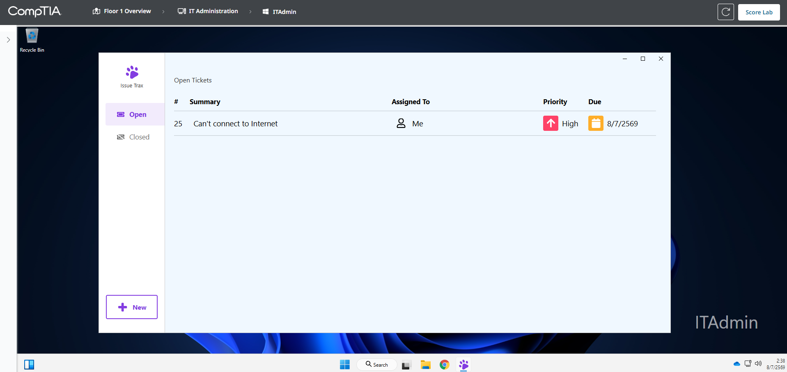
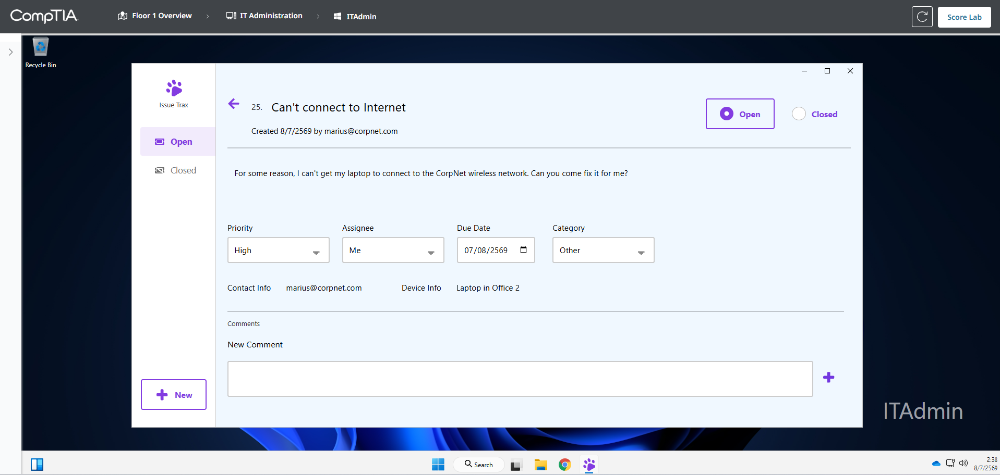
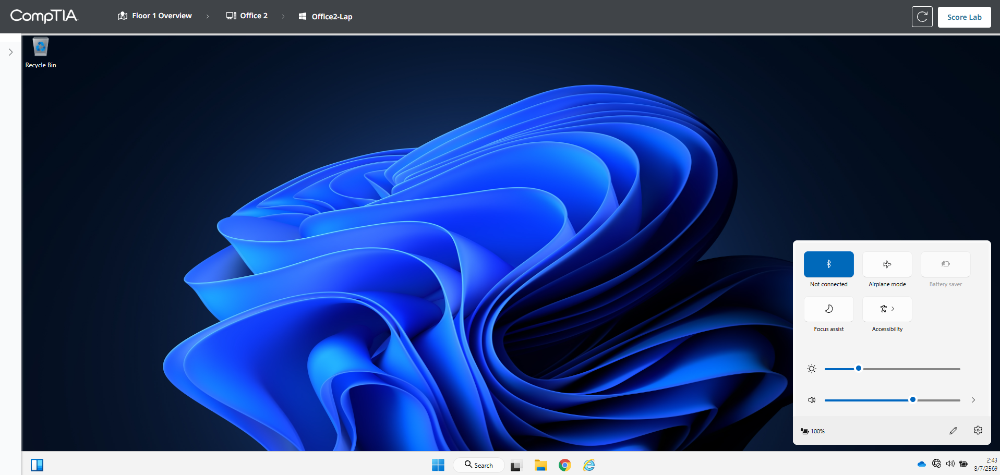
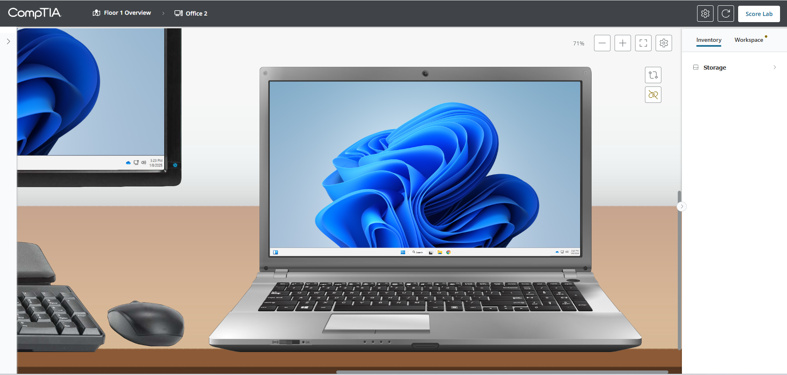
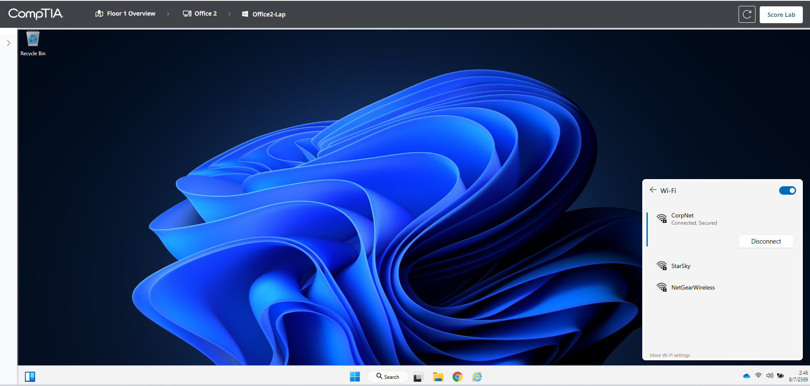
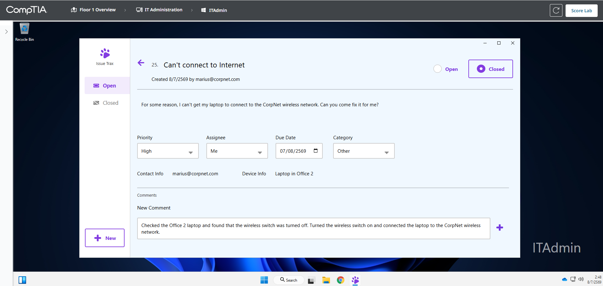
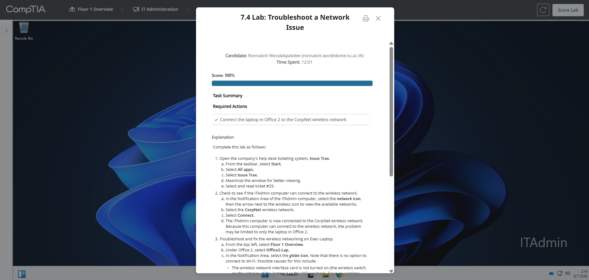

# 7.4 Lab: Troubleshoot a Network Issue

## ข้อมูลผู้ทำ Lab

- ชื่อ Lab: 7.4 Lab: Troubleshoot a Network Issue
- หัวข้อ: การแก้ไขปัญหา wireless network จาก help desk ticket
- ระบบที่ใช้งาน: Issue Trax
- เครื่องที่ใช้ตรวจ ticket: ITAdmin
- เครื่องที่มีปัญหา: Office2-Lap
- ผลลัพธ์สุดท้าย: ทำ Lab สำเร็จและได้คะแนน 100%

## ตอนนี้กำลังจะทำอะไร

ใน Lab นี้กำลังจะทำงานในบทบาทของ IT helpdesk โดยต้องเปิดระบบ ticket ชื่อ `Issue Trax` เพื่ออ่านปัญหาที่ผู้ใช้แจ้งเข้ามา จากนั้นต้องตรวจสอบและแก้ไขปัญหา network ของ laptop ใน `Office 2` ให้สามารถเชื่อมต่อ `CorpNet wireless network` ได้

หลังจากแก้ไขเสร็จ ต้องกลับไปที่ ticket เดิมเพื่อเขียน comment อธิบายสิ่งที่แก้ไข และเปลี่ยนสถานะ ticket เป็น `Closed`

เหตุผลที่ต้องทำแบบนี้ เพราะงาน helpdesk ไม่ได้จบแค่การแก้เครื่องให้ใช้งานได้ แต่ต้องมีการบันทึกหลักฐานการแก้ไขใน ticket และปิดงานให้ถูกต้องตาม workflow ขององค์กร

## วัตถุประสงค์

วัตถุประสงค์ของ Lab นี้คือการแก้ไขปัญหา laptop ใน `Office 2` ที่ไม่สามารถเชื่อมต่อ wireless network ของบริษัทได้

สิ่งที่ต้องทำมีดังนี้:

1. เปิดระบบ `Issue Trax`
2. อ่าน ticket `#25 Can't connect to Internet`
3. ตรวจสอบว่า `CorpNet` wireless network ใช้งานได้จากเครื่อง `ITAdmin`
4. ไปยังเครื่อง `Office2-Lap`
5. ตรวจสอบอาการที่ laptop ไม่เห็น Wi-Fi network
6. ตรวจสอบ hardware ของ laptop
7. เปิด wireless switch จาก `OFF` เป็น `ON`
8. เชื่อมต่อ laptop เข้ากับ `CorpNet`
9. เขียน comment ใน ticket
10. ปิด ticket เป็น `Closed`
11. ตรวจคะแนนด้วย `Score Lab`

## ข้อมูลจาก Ticket

จาก ticket ใน Issue Trax พบข้อมูลสำคัญดังนี้:

| รายการ | ข้อมูล |
| --- | --- |
| Ticket number | 25 |
| Summary | Can't connect to Internet |
| User | marius@corpnet.com |
| Priority | High |
| Device Info | Laptop in Office 2 |
| Problem | Laptop ไม่สามารถเชื่อมต่อ CorpNet wireless network ได้ |

เหตุผลที่ต้องอ่าน ticket ก่อน เพราะ ticket ระบุว่าเครื่องที่มีปัญหาคือ `Laptop in Office 2` ดังนั้นการแก้ปัญหาต้องไปที่เครื่อง `Office2-Lap` ไม่ใช่แก้ที่เครื่อง `ITAdmin`



ภาพนี้แสดงหน้า Open Tickets ใน Issue Trax โดยมี ticket `#25` เรื่อง `Can't connect to Internet` ถูก assign ให้ผู้ดูแลระบบ



ภาพนี้แสดงรายละเอียด ticket โดยระบุว่า user ไม่สามารถเชื่อมต่อ `CorpNet wireless network` ได้ และเครื่องที่เกี่ยวข้องคือ `Laptop in Office 2`

## วิธีวิเคราะห์ปัญหา

Lab นี้ไม่มีการคำนวณ IP address แบบ Lab ก่อนหน้า แต่ใช้การวิเคราะห์ปัญหาแบบค่อย ๆ ตัดสาเหตุที่เป็นไปได้ออก

### 1. ตรวจว่า CorpNet ยังใช้งานได้หรือไม่

ก่อนจะสรุปว่า laptop เสีย ต้องตรวจสอบก่อนว่า wireless network ของบริษัททำงานปกติหรือไม่ โดยทดสอบจากเครื่อง `ITAdmin`

ถ้า `ITAdmin` สามารถเชื่อมต่อ `CorpNet` ได้ แปลว่า:

```text
Wireless access point ทำงานอยู่
CorpNet SSID ยัง broadcast อยู่
ปัญหาไม่ได้เกิดกับ wireless network ทั้งระบบ
```

ดังนั้นปัญหาน่าจะจำกัดอยู่ที่ laptop ใน Office 2


ภาพนี้แสดงว่าเครื่อง `ITAdmin` สามารถเชื่อมต่อ `CorpNet` ได้สำเร็จ จึงช่วยยืนยันว่า wireless network ของบริษัทไม่ได้ล่ม

### 2. ตรวจอาการบน Office2-Lap

เมื่อไปที่เครื่อง `Office2-Lap` แล้วพบว่าแผง network ไม่มีตัวเลือก Wi-Fi ให้เชื่อมต่อ หรือยังแสดงสถานะ `Not connected` แสดงว่าเครื่อง laptop อาจยังไม่ได้เปิดใช้งาน wireless network interface

สาเหตุที่เป็นไปได้มีหลายอย่าง เช่น:

1. Wireless switch บนตัวเครื่องอยู่ตำแหน่ง `OFF`
2. Wireless adapter ถูก disabled
3. Access point ไม่ broadcast SSID
4. Access point ปิดอยู่

แต่จากการที่ `ITAdmin` เชื่อมต่อ `CorpNet` ได้แล้ว จึงตัดข้อ 3 และ 4 ออกได้ เหลือสาเหตุที่น่าสงสัยที่สุดคือ wireless ของ laptop ถูกปิดอยู่ที่ตัวเครื่อง



ภาพนี้แสดงว่า `Office2-Lap` ยังไม่ได้เชื่อมต่อ network และยังไม่สามารถเลือก wireless network ได้ตามปกติ จึงต้องตรวจสอบด้าน hardware ต่อ

## ขั้นตอนการทำ Lab

### ขั้นตอนที่ 1: เปิด Issue Trax บนเครื่อง ITAdmin

1. เข้าเครื่อง `ITAdmin`
2. กดปุ่ม `Start`
3. เลือก `All apps`
4. เปิดโปรแกรม `Issue Trax`
5. ขยายหน้าต่างให้ใหญ่ขึ้นเพื่อให้อ่านข้อมูลได้ชัดเจน
6. ที่หน้า `Open Tickets` เลือก ticket `#25`

เหตุผลที่ต้องเริ่มจาก `Issue Trax` เพราะโจทย์ต้องการให้แก้ปัญหาตาม ticket ที่ได้รับมอบหมาย ไม่ใช่แก้แบบเดาสุ่ม

### ขั้นตอนที่ 2: อ่านรายละเอียด Ticket

ใน ticket `#25` มีข้อความว่า:

```text
For some reason, I can't get my laptop to connect to the CorpNet wireless network.
```

และมีข้อมูลอุปกรณ์ว่า:

```text
Device Info: Laptop in Office 2
```

จากข้อมูลนี้สรุปได้ว่าเป้าหมายในการแก้ปัญหาคือ laptop ในห้อง `Office 2` หรือเครื่อง `Office2-Lap`

เหตุผลที่ต้องดู `Device Info` เพราะใน lab มีหลายห้องและหลายเครื่อง ถ้าไปแก้ผิดเครื่องจะไม่ผ่านคะแนน

### ขั้นตอนที่ 3: ทดสอบ CorpNet จากเครื่อง ITAdmin

1. ที่เครื่อง `ITAdmin` คลิกไอคอน network บริเวณ notification area
2. กดลูกศรข้างไอคอน wireless เพื่อดู available networks
3. เลือก wireless network ชื่อ:

```text
CorpNet
```

4. กด `Connect`
5. ตรวจสอบว่า `ITAdmin` เชื่อมต่อ `CorpNet` ได้สำเร็จ

เหตุผลที่ต้องทดสอบจาก `ITAdmin` ก่อน เพราะถ้าเครื่องนี้ต่อ `CorpNet` ได้ แสดงว่า wireless access point เปิดอยู่และ SSID ยัง broadcast อยู่ ปัญหาจึงไม่ได้เกิดจากระบบ wireless ทั้งบริษัท

### ขั้นตอนที่ 4: ไปยังเครื่อง Office2-Lap

1. กด breadcrumb ด้านบนไปที่ `Floor 1 Overview`
2. เลือกห้อง `Office 2`
3. เลือกเครื่อง `Office2-Lap`

เหตุผลที่ต้องไปเครื่องนี้ เพราะ ticket ระบุชัดว่าอุปกรณ์ที่มีปัญหาคือ laptop ใน Office 2

### ขั้นตอนที่ 5: ตรวจสอบอาการใน Windows

1. ที่เครื่อง `Office2-Lap` คลิกไอคอน network หรือ globe icon มุมขวาล่าง
2. ตรวจสอบว่าเครื่องมีตัวเลือก Wi-Fi หรือไม่
3. พบว่าเครื่องยังไม่สามารถเชื่อมต่อ wireless network ได้ตามปกติ

เหตุผลที่ต้องตรวจจาก Windows ก่อน เพราะเป็นการยืนยันอาการที่ผู้ใช้แจ้ง คือ laptop ยังไม่สามารถเชื่อมต่อ `CorpNet` ได้

### ขั้นตอนที่ 6: เปิด Hardware View ของ Office 2

1. กด breadcrumb กลับไปที่ `Office 2`
2. เข้าสู่มุมมอง hardware ของห้อง
3. มองที่ด้านหน้าของ laptop
4. ตรวจสอบ wireless switch บนตัวเครื่อง

พบว่า wireless switch อยู่ตำแหน่ง:

```text
OFF
```

เหตุผลที่ต้องตรวจ hardware เพราะบาง laptop มี physical switch สำหรับเปิด/ปิด wireless adapter ถ้าสวิตช์นี้เป็น `OFF` ระบบปฏิบัติการจะไม่สามารถใช้งาน Wi-Fi ได้ตามปกติ



ภาพนี้แสดงสวิตช์ wireless ด้านหน้าของ `Office2-Lap` ที่อยู่ตำแหน่ง `OFF` ซึ่งเป็น root cause ของปัญหาใน Lab นี้

### ขั้นตอนที่ 7: เปิด Wireless Switch เป็น ON

1. เลื่อน wireless switch บนตัว laptop จาก `OFF` เป็น `ON`
2. ตรวจสอบว่าสวิตช์เปลี่ยนตำแหน่งแล้ว
3. คลิกจอ laptop เพื่อกลับเข้า Windows

เหตุผลที่ต้องเปิด switch นี้ เพราะเป็นการเปิดใช้งาน wireless network interface card ในระดับ hardware เมื่อเปิดแล้ว Windows จึงสามารถมองเห็นและเชื่อมต่อ Wi-Fi ได้


ภาพนี้แสดงว่า wireless switch ถูกเลื่อนเป็น `ON` แล้ว ทำให้ laptop สามารถใช้งาน wireless adapter ได้

### ขั้นตอนที่ 8: เชื่อมต่อ Office2-Lap เข้ากับ CorpNet

1. กลับเข้า Windows ของ `Office2-Lap`
2. คลิกไอคอน wireless/network มุมขวาล่าง
3. เลือก wireless network:

```text
CorpNet
```

4. กด `Connect`
5. ตรวจสอบว่าสถานะเปลี่ยนเป็น `Connected`

ใน Lab นี้ไม่จำเป็นต้องใส่ security key ใหม่ เพราะ laptop เคยเชื่อมต่อ `CorpNet` มาก่อนแล้ว

เหตุผลที่ต้องเชื่อมต่อ `CorpNet` หลังเปิด switch เพราะแค่เปิด wireless adapter ยังไม่พอ ต้องเลือก wireless network ของบริษัทให้ laptop ใช้งานจริง



ภาพนี้แสดงว่า `Office2-Lap` เชื่อมต่อ `CorpNet` สำเร็จแล้ว โดยสถานะเป็น `Connected, Secured`

### ขั้นตอนที่ 9: กลับไปเขียน Comment ใน Ticket

1. กลับไปที่ `Floor 1 Overview`
2. เลือก `IT Administration`
3. เข้าเครื่อง `ITAdmin`
4. เปิด `Issue Trax`
5. เปิด ticket `#25`
6. ที่ช่อง `New Comment` เขียน comment อธิบายสิ่งที่แก้ไข

ตัวอย่าง comment:

```text
Checked the Office 2 laptop and found that the wireless switch was turned off. Turned the wireless switch on and connected the laptop to the CorpNet wireless network.
```

7. กดปุ่ม `+` เพื่อเพิ่ม comment

เหตุผลที่ต้องเขียน comment เพราะ ticket ต้องมีบันทึกว่า technician ตรวจพบอะไรและแก้ไขอย่างไร เพื่อให้ผู้ใช้งานหรือทีม IT คนอื่นตรวจสอบย้อนหลังได้

### ขั้นตอนที่ 10: ปิด Ticket

1. ที่ด้านบนของ ticket เปลี่ยนสถานะจาก `Open` เป็น `Closed`
2. ตรวจสอบว่า ticket แสดงสถานะ `Closed`

เหตุผลที่ต้องปิด ticket เพราะปัญหาได้รับการแก้ไขแล้ว และ workflow ของ helpdesk ต้องปิดงานหลังจากแก้ไขพร้อมบันทึก comment



ภาพนี้แสดง comment ที่บันทึกการแก้ไข และ ticket ถูกเปลี่ยนสถานะเป็น `Closed`

### ขั้นตอนที่ 11: ตรวจคะแนน Lab

1. กลับไปที่หน้า Lab
2. กด `Score Lab`
3. ตรวจสอบว่า required action ผ่านครบ

ผลลัพธ์ที่ถูกต้องคือ:

```text
Score: 100%
Connect the laptop in Office 2 to the CorpNet wireless network: Completed
```



ภาพนี้แสดงว่า Lab สำเร็จแล้ว โดยได้คะแนน `100%` และ required action ผ่านครบ

## สรุปผล

ใน Lab นี้ได้แก้ไขปัญหา laptop ใน `Office 2` ที่ไม่สามารถเชื่อมต่อ `CorpNet wireless network` ได้ โดยเริ่มจากการอ่าน ticket `#25` ใน `Issue Trax` เพื่อระบุเครื่องที่มีปัญหา

จากนั้นทดสอบ `CorpNet` ด้วยเครื่อง `ITAdmin` และพบว่า `ITAdmin` สามารถเชื่อมต่อ wireless network ได้ จึงสรุปได้ว่า access point และ SSID ของ `CorpNet` ทำงานปกติ

เมื่อไปตรวจเครื่อง `Office2-Lap` พบว่าไม่มีตัวเลือก Wi-Fi ให้เชื่อมต่อ จึงตรวจสอบด้าน hardware และพบว่า wireless switch บนตัว laptop อยู่ตำแหน่ง `OFF` จึงเลื่อน switch เป็น `ON` แล้วเชื่อมต่อ laptop เข้ากับ `CorpNet` ได้สำเร็จ

สุดท้ายได้กลับไปที่ `Issue Trax` เพื่อเขียน comment อธิบายการแก้ไข และเปลี่ยนสถานะ ticket เป็น `Closed` จากนั้นกด `Score Lab` และได้คะแนน `100%`
